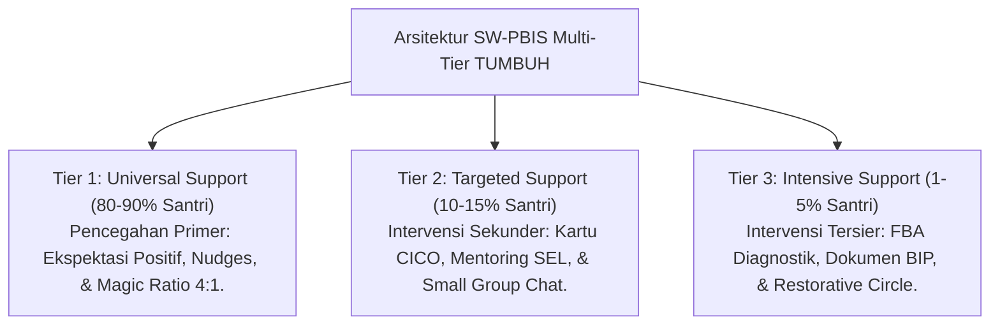
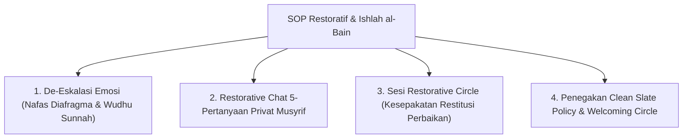

# MONOGRAF RISET AKADEMIK: ARSITEKTUR INTERVENSI PERILAKU MULTI-TIER PBIS DAN DISIPLIN RESTORATIF
## Evaluasi Sistemik: De-Eskalasi Ghadhab, Ishlah al-Bain, Protokol Anti-Manipulasi Restoratif, dan SOP Bimbingan BK Musyrif Daerah

**Dewan Riset & Keilmuan Ekosistem TUMBUH**  
*Dipublikasikan sebagai Naskah Monograf Riset Ilmiah (Jurnal Kebijakan & Intervensi Perilaku Pesantren)*  
*Dokumen Rujukan Induk: Domain 06 Intervention Framework & Book Series Volume 02-04*

---

## ABSTRAK

> **Latar Belakang**: Krisis insiden pelanggaran perilaku di lembaga pendidikan sering kali ditangani secara acak, emosional, atau mengandalkan sanksi fisik yang manipulatif. Tanpa arsitektur intervensi multi-tier berbasis data faktual dan protokol anti-manipulasi dialog restoratif, penanganan krisis rentan dipermainkan atau terkendala kelangkaan tenaga profesional BK di daerah.
>
> **Tujuan Penelitian**: Merumuskan dan memvalidasi arsitektur sistem intervensi perilaku berjenjang (**SW-PBIS Multi-Tier 1–3**), menetapkan Protokol Anti-Manipulasi Restorative Chat, dan merumuskan SOP Pelatihan Bimbingan BK Dasar bagi Musyrif Asrama Daerah.
>
> **Hasil Riset**: Terstruktur 3 Tingkat Intervensi PBIS Restoratif: (1) **Tier 1 (Universal - 80-90%)** - Iklim positif & Magic Ratio 4:1; (2) **Tier 2 (Targeted - 10-15%)** - Kartu CICO & Klinik Regulasi Emosi; (3) **Tier 3 (Intensive - 1-5%)** - FBA Diagnostik, BIP Individual, *Reintegration Circle*, & SOP Pelatihan Konseling BK Musyrif Daerah.
>
> **Kata Kunci**: *Intervention Framework, SW-PBIS Multi-Tier, Disiplin Restoratif, Ishlah al-Bain, Anti-Manipulation Protocol, BK Training.*

---

## 1. PENDAHULUAN & DIALEKTIKA INTERVENSI

Intervensi dalam ekosistem TUMBUH memandang pelanggaran perilaku sebagai **kebutuhan belajar adab yang belum tuntas (*Skill Deficit*)**, bukan sebagai kejahatan kriminal yang harus dibalas dengan rasa sakit.

---

## 2. KAJIAN INTEGRATIF INTERVENSI RESTORATIF & ISHLAH AL-BAIN

---

## 3. PROTOKOL PENCEGAHAN MANIPULASI RESTORATIVE CHAT

Untuk mencegah santri cerdik yang berpura-pura kooperatif dalam sesi dialog restoratif hanya untuk menghindari konsekuensi:

1. **Verifikasi Bukti Tindakan Restitusi Real**: Kesepakatan perbaikan (*Repair Plan*) tidak boleh berhenti pada janji lisan, melainkan wajib dibuktikan dengan aksi restitusi terukur selama 14 hari.
2. **Pemantauan Berkala Tim BK**: Pembina melakukan evaluasi *Follow-up Monitoring* pada hari ke-7 dan hari ke-14 pasca sesi dialog restoratif.

---

## 4. SOP PELATIHAN KONSELIING BK DASAR BAGI MUSYRIF DAERAH

Untuk mengatasi kelangkaan tenaga profesional BK di pesantren daerah, ditetapkan **Program Sertifikasi Bimbingan Konseling Dasar Musyrif**:
* Pelatihan teknik mendengarkan empatis (*Active Listening*).
* Pelatihan de-eskalasi emosi marah (*Ghadhab Control*).
* Tata cara pengisian Form FBA Diagnostik dasar & rujukan kasus berat (*Referral Protocol*).

---

## 5. DAFTAR PUSTAKA
* Sugai, G., & Horner, R. H. (2002). The evolution of discipline practices. *Child & Family Behavior Therapy*, 24(1-2), 23–50.
* Zehr, H. (2002). *The Little Book of Restorative Justice*. Good Books.
