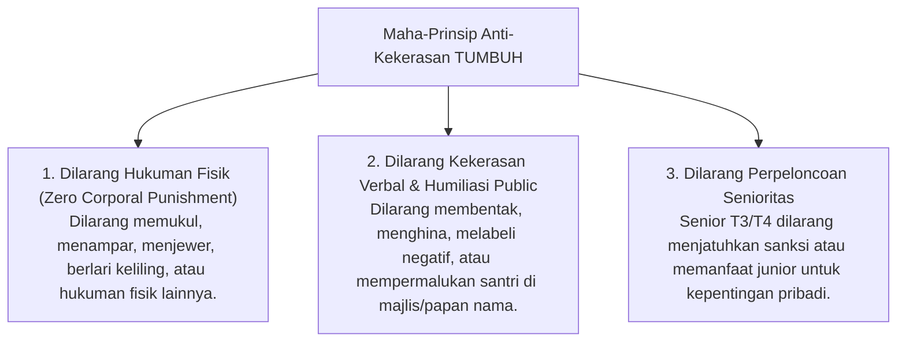
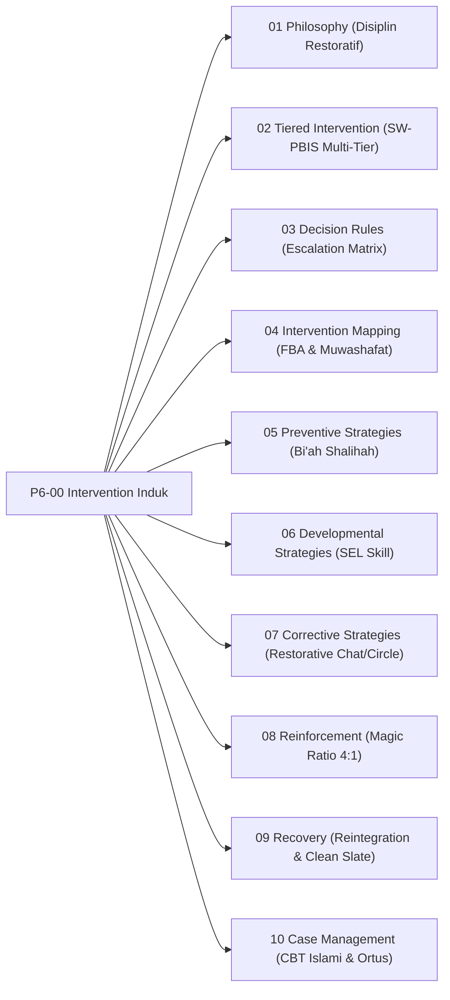

# P6-00: Intervention Framework Induk (Kerangka Intervensi & Disiplin Positif Restoratif Ekosistem TUMBUH)

## Status Dokumen
* **Status**: 🌟 **A+ (Tervalidasi & Induk Baku)**
* **Domain**: Project 6 — `06 Intervention Framework`
* **Penanggung Jawab Keilmuan**: Dewan Keilmuan TUMBUH (*Pakar Arsitektur PBIS Restoratif, Pakar Bimbingan Konseling, & Pakar Filosofi TUMBUH*)

---

## 1. Pendahuluan & Larangan Mutlak Kekerasan

Sesuai Dokumen Induk `AGENTS.md`, seluruh proses penanganan perilaku dan intervensi di pesantren ekosistem **TUMBUH** berlandaskan prinsip **Anti-Kekerasan, Anti-Intimidasi, dan Bebas Feodalisme Senioritas**.

---

## 2. Model Triad Pertumbuhan Simbiotik dalam Intervensi

- **Santri Tumbuh**: Dilindungi martabat jiwanya, dilatih keterampilan sosial-emosional pengganti (*Replacement Behavior*), dan dipulihkan melalui proses restoratif.
- **Musyrif & Guru Tumbuh**: Dibekali keterampilan *De-eskalasi Krisis*, *Restorative Chat*, dan *Cognitive Reframing* sehingga terhindar dari reaksi emosional kekerasan.
- **Sistem Lembaga Tumbuh**: Memiliki SOP eskalasi yang jelas, lingkungan fisik yang aman (*Bi'ah Shalihah*), dan akuntabilitas penanganan kasus.

---

## 3. Empat Pilar Intervensi Disiplin Positif Restoratif

1. **Pilar 1: Pencegahan Universal (Tier 1 PBIS - 80% Santri)**: Membangun bi'ah shalihah, memperjelas ekspektasi adab, dan mengutamakan penguatan positif (*Magic Ratio 4:1*).
2. **Pilar 2: Pembinaan Kelompok Terarah (Tier 2 PBIS - 15% Santri)**: Pendampingan kelompok kecil (CICO & Social Skills Group) bagi santri yang membutuhkan penguatan adab.
3. **Pilar 3: Intervensi Intensif Khusus (Tier 3 PBIS - 5% Santri)**: Penanganan individu mendalam berbasis FBA dan konseling CBT Islami tanpa kekerasan.
4. **Pilar 4: Pemulihan Restoratif (Restorative Justice - 3R)**: *Restitution* (memperbaiki kerusakan), *Resolution* (menyelesaikan akar masalah), dan *Reconciliation* (memulihkan ukhuwah / *Ishlah al-Bain*).

---

## 4. Peta Hubungan Sub-Domain Intervensi

---

## 5. Rujukan Keilmuan Multidisiplin

1. **Turats Islam**: Adab Al-Mu'asyarah & *Ishlah al-Bain* (QS. Al-Hujurat: 9–10), *Tazkiyatun Nafs* (Imam Al-Ghazali), *Fiqhu al-Inhadh* (Prinsip Kelembutan Membimbing).
2. **Sains Kontemporer**: *Restorative Justice in Schools* (Howard Zehr), *Positive Discipline* (Jane Nelsen), *School-Wide PBIS Interventions* (Sugai & Horner), *Functional Behavior Assessment* (O'Neill et al.).
