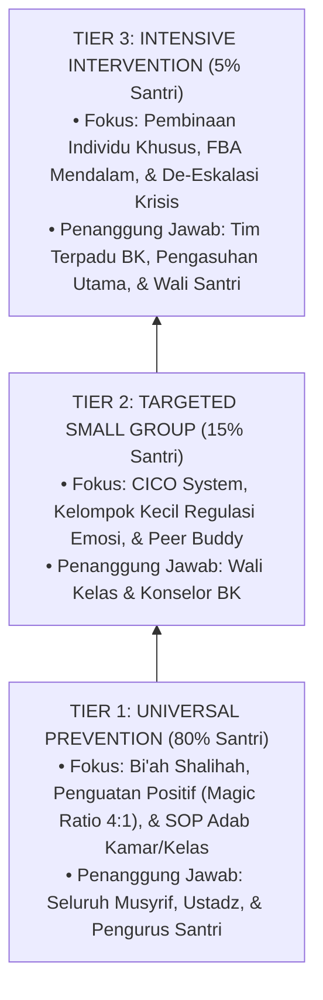

# Domain 06: Intervention Framework (Kerangka Intervensi & Disiplin Positif Restoratif Ekosistem TUMBUH)

Domain ini memuat arsitektur intervensi penanganan perilaku, disiplin positif restoratif, dan strategi pembinaan santri di ekosistem **TUMBUH**. Seluruh kerangka kerja dirancang **100% bebas dari kekerasan fisik, intimidasi verbal, dan feodalisme senioritas**, mengintegrasikan *School-Wide Positive Behavioral Interventions and Supports* (SW-PBIS Multi-Tier), *Functional Behavior Assessment* (FBA), *Restorative Justice* (Restitution, Resolution, Reconciliation), serta prinsip pengasuhan Islami (*Firm & Kind*).

---

## Indeks Dokumen Induk & Jurnal Riset Monograf Utuh

* 📄 **[Jurnal-Monograf-Riset-Intervensi-PBIS-Restoratif-TUMBUH.md](./Jurnal-Monograf-Riset-Intervensi-PBIS-Restoratif-TUMBUH.md)**: **Monograf Riset Ilmiah Utuh & Terkonsolidasi** (Mencakup Arsitektur SW-PBIS Multi-Tier 1-3, FBA Diagnostik, Restorative Circles, Protokol Anti-Manipulasi Restorative Chat, & SOP Pelatihan BK Musyrif Daerah).
* 📄 **[P6-00-Intervention-Framework-Induk.md](./P6-00-Intervention-Framework-Induk.md)**: Dokumen Maha-Induk Falsafah Intervensi Restoratif, Anti-Kekerasan, dan Standar Operasional PBIS.

---

## Arsitektur Intervensi Multi-Tiered PBIS (Tier 1–3)

---

## 10 Sub-Domain Modul Intervensi

1. 📂 **[01 Intervention Philosophy](./01%20Intervention%20Philosophy/)**: Filosofi Disiplin Positif Restoratif, *Firm & Kind*, & Deklarasi Zero Violence.
2. 📂 **[02 Tiered Intervention](./02%20Tiered%20Intervention/)**: Arsitektur Intervensi Multi-Tiered PBIS (Tier 1, 2, & 3).
3. 📂 **[03 Decision Rules](./03%20Decision%20Rules/)**: Aturan Keputusan, Matriks Eskalasi, & SOP Sidang Terpadu.
4. 📂 **[04 Intervention Mapping](./04%20Intervention%20Mapping/)**: Pemetaan Intervensi 10 Karakter Muwashafat.
5. 📂 **[05 Preventive Strategies](./05%20Preventive%20Strategies/)**: Pencegahan Primer, *Environmental Engineering*, & Hotspots Mitigation.
6. 📂 **[06 Developmental Strategies](./06%20Developmental%20Strategies/)**: Pelatihan *Replacement Behavior* & CASEL SEL.
7. 📂 **[07 Corrective Strategies](./07%20Corrective%20Strategies/)**: *Restorative Chat* 5-Pertanyaan & SOP *Restorative Circles*.
8. 📂 **[08 Reinforcement](./08%20Reinforcement/)**: Magic Ratio 4:1, Sistem Poin Apresiasi, & Behavioral Contract.
9. 📂 **[09 Recovery](./09%20Recovery/)**: Pemulihan Relasi Korban-Pelaku, *Welcoming Circle*, & Clean Slate Policy.
10. 📂 **[10 Case Management](./10%20Case%20Management/)**: Manajemen Kasus Khusus Tier 3, De-Eskalasi Krisis, & Sinergi Musyrif-BK-Orang Tua.
