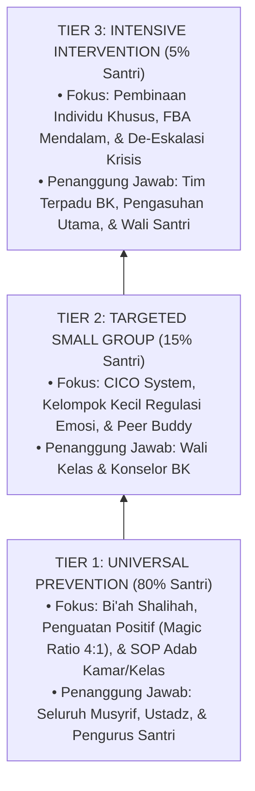

# 06 Intervention Framework (Kerangka Intervensi & Disiplin Positif Restoratif Ekosistem TUMBUH)

Domain ini memuat arsitektur intervensi penanganan perilaku, disiplin positif restoratif, dan strategi pembinaan santri di ekosistem **TUMBUH**. Seluruh kerangka kerja dirancang **100% bebas dari kekerasan fisik, intimidasi verbal, dan feodalisme senioritas**, mengintegrasikan *School-Wide Positive Behavioral Interventions and Supports* (SW-PBIS Multi-Tier), *Functional Behavior Assessment* (FBA), *Restorative Justice* (Restitution, Resolution, Reconciliation), serta prinsip pengasuhan Islami (*Firm & Kind*).

---

## Arsitektur Intervensi Multi-Tiered PBIS (Tier 1–3)

---

## Indeks Dokumen Induk & 10 Sub-Domain Modul

* 📄 **[P6-00-Intervention-Framework-Induk.md](./P6-00-Intervention-Framework-Induk.md)**: Dokumen Maha-Induk Falsafah Intervensi Restoratif, Anti-Kekerasan, dan Standar Operasional PBIS.

### Sub-Domain 01: Intervention Philosophy
* 📁 **[01 Intervention Philosophy](./01%20Intervention%20Philosophy/)**:
  * 📄 [P6-01-Filosofi-Disiplin-Positif-Restoratif.md](./01%20Intervention%20Philosophy/P6-01-Filosofi-Disiplin-Positif-Restoratif.md)
  * 📄 [P6-01-01-Prinsip-Disiplin-Positif-Firm-and-Kind.md](./01%20Intervention%20Philosophy/P6-01-01-Prinsip-Disiplin-Positif-Firm-and-Kind.md)
  * 📄 [P6-01-02-Metodologi-Restoratif-Restitution-Resolution-Reconciliation.md](./01%20Intervention%20Philosophy/P6-01-02-Metodologi-Restoratif-Restitution-Resolution-Reconciliation.md)
  * 📄 [P6-01-03-Deklarasi-Zero-Corporal-Punishment-dan-Anti-Feodalisme.md](./01%20Intervention%20Philosophy/P6-01-03-Deklarasi-Zero-Corporal-Punishment-dan-Anti-Feodalisme.md)

### Sub-Domain 02: Tiered Intervention
* 📁 **[02 Tiered Intervention](./02%20Tiered%20Intervention/)**:
  * 📄 [P6-02-Arsitektur-Intervensi-Multi-Tiered-PBIS.md](./02%20Tiered%20Intervention/P6-02-Arsitektur-Intervensi-Multi-Tiered-PBIS.md)
  * 📄 [P6-02-01-Tier-1-Universal-Preventive-Support-80-Persen.md](./02%20Tiered%20Intervention/P6-02-01-Tier-1-Universal-Preventive-Support-80-Persen.md)
  * 📄 [P6-02-02-Tier-2-Targeted-Group-Support-15-Persen.md](./02%20Tiered%20Intervention/P6-02-02-Tier-2-Targeted-Group-Support-15-Persen.md)
  * 📄 [P6-02-03-Tier-3-Intensive-Individual-Support-5-Persen.md](./02%20Tiered%20Intervention/P6-02-03-Tier-3-Intensive-Individual-Support-5-Persen.md)

### Sub-Domain 03: Decision Rules
* 📁 **[03 Decision Rules](./03%20Decision%20Rules/)**:
  * 📄 [P6-03-Aturan-Keputusan-dan-Escalation-Framework.md](./03%20Decision%20Rules/P6-03-Aturan-Keputusan-dan-Escalation-Framework.md)
  * 📄 [P6-03-01-Matriks-Eskalasi-Penanganan-Kasus-Perilaku.md](./03%20Decision%20Rules/P6-03-01-Matriks-Eskalasi-Penanganan-Kasus-Perilaku.md)
  * 📄 [P6-03-02-Aturan-Rujukan-Rule-3-Strikes-dan-Immediate-Tier3.md](./03%20Decision%20Rules/P6-03-02-Aturan-Rujukan-Rule-3-Strikes-dan-Immediate-Tier3.md)
  * 📄 [P6-03-03-SOP-Sidang-Terpadu-Kesiswaan-dan-Pengasuhan.md](./03%20Decision%20Rules/P6-03-03-SOP-Sidang-Terpadu-Kesiswaan-dan-Pengasuhan.md)

### Sub-Domain 04: Intervention Mapping
* 📁 **[04 Intervention Mapping](./04%20Intervention%20Mapping/)**:
  * 📄 [P6-04-Pemetaan-Intervensi-10-Karakter-Muwashafat.md](./04%20Intervention%20Mapping/P6-04-Pemetaan-Intervensi-10-Karakter-Muwashafat.md)
  * 📄 [P6-04-01-Pemetaan-Intervensi-Karakter-Spiritual-dan-Ibadah.md](./04%20Intervention%20Mapping/P6-04-01-Pemetaan-Intervensi-Karakter-Spiritual-dan-Ibadah.md)
  * 📄 [P6-04-02-Pemetaan-Intervensi-Karakter-Fisik-Intelektual-dan-Mujahadah.md](./04%20Intervention%20Mapping/P6-04-02-Pemetaan-Intervensi-Karakter-Fisik-Intelektual-dan-Mujahadah.md)
  * 📄 [P6-04-03-Pemetaan-Intervensi-Karakter-Waktu-Keteraturan-dan-Khidmah.md](./04%20Intervention%20Mapping/P6-04-03-Pemetaan-Intervensi-Karakter-Waktu-Keteraturan-dan-Khidmah.md)

### Sub-Domain 05: Preventive Strategies
* 📁 **[05 Preventive Strategies](./05%20Preventive%20Strategies/)**:
  * 📄 [P6-05-Strategi-Pencegahan-Primer-dan-Bi'ah-Shalihah.md](./05%20Preventive%20Strategies/P6-05-Strategi-Pencegahan-Primer-dan-Bi'ah-Shalihah.md)
  * 📄 [P6-05-01-Environmental-Engineering-dan-Tata-Ruang-Asrama.md](./05%20Preventive%20Strategies/P6-05-01-Environmental-Engineering-dan-Tata-Ruang-Asrama.md)
  * 📄 [P6-05-02-Protokol-Patroli-Titik-Rawan-Hotspots-Mitigation.md](./05%20Preventive%20Strategies/P6-05-02-Protokol-Patroli-Titik-Rawan-Hotspots-Mitigation.md)
  * 📄 [P6-05-03-Arsitektur-Nudges-Visual-dan-Budaya-Bi'ah-Shalihah.md](./05%20Preventive%20Strategies/P6-05-03-Arsitektur-Nudges-Visual-dan-Budaya-Bi'ah-Shalihah.md)

### Sub-Domain 06: Developmental Strategies
* 📁 **[06 Developmental Strategies](./06%20Developmental%20Strategies/)**:
  * 📄 [P6-06-Strategi-Pengembangan-Karakter-dan-SEL.md](./06%20Developmental%20Strategies/P6-06-Strategi-Pengembangan-Karakter-dan-SEL.md)
  * 📄 [P6-06-01-Teknik-Pelatihan-Replacement-Behavior-Adaptif.md](./06%20Developmental%20Strategies/P6-06-01-Teknik-Pelatihan-Replacement-Behavior-Adaptif.md)
  * 📄 [P6-06-02-Kurikulum-Pelatihan-CASEL-SEL-Kelompok-Kecil.md](./06%20Developmental%20Strategies/P6-06-02-Kurikulum-Pelatihan-CASEL-SEL-Kelompok-Kecil.md)
  * 📄 [P6-06-03-Modul-Pengembangan-Regulasi-Emosi-dan-Mujahadah.md](./06%20Developmental%20Strategies/P6-06-03-Modul-Pengembangan-Regulasi-Emosi-dan-Mujahadah.md)

### Sub-Domain 07: Corrective Strategies
* 📁 **[07 Corrective Strategies](./07%20Corrective%20Strategies/)**:
  * 📄 [P6-07-Strategi-Korektif-Restoratif-dan-Konsekuensi-Logis.md](./07%20Corrective%20Strategies/P6-07-Strategi-Korektif-Restoratif-dan-Konsekuensi-Logis.md)
  * 📄 [P6-07-01-Panduan-Praktis-Restorative-Chat-5-Pertanyaan.md](./07%20Corrective%20Strategies/P6-07-01-Panduan-Praktis-Restorative-Chat-5-Pertanyaan.md)
  * 📄 [P6-07-02-SOP-Penyelenggaraan-Restorative-Circles-Asrama.md](./07%20Corrective%20Strategies/P6-07-02-SOP-Penyelenggaraan-Restorative-Circles-Asrama.md)
  * 📄 [P6-07-03-Penerapan-Konsekuensi-Logis-dan-Ishlah-al-Bain.md](./07%20Corrective%20Strategies/P6-07-03-Penerapan-Konsekuensi-Logis-dan-Ishlah-al-Bain.md)

### Sub-Domain 08: Reinforcement
* 📁 **[08 Reinforcement](./08%20Reinforcement/)**:
  * 📄 [P6-08-Sistem-Penguatan-Positif-dan-Magic-Ratio-4-1.md](./08%20Reinforcement/P6-08-Sistem-Penguatan-Positif-dan-Magic-Ratio-4-1.md)
  * 📄 [P6-08-01-Operasionalisasi-Magic-Ratio-4-1-dalam-Pengasuhan.md](./08%20Reinforcement/P6-08-01-Operasionalisasi-Magic-Ratio-4-1-dalam-Pengasuhan.md)
  * 📄 [P6-08-02-Sistem-Poin-Apresiasi-dan-Portofolio-Karakter-PBIS.md](./08%20Reinforcement/P6-08-02-Sistem-Poin-Apresiasi-dan-Portofolio-Karakter-PBIS.md)
  * 📄 [P6-08-03-Penyusunan-dan-Monitoring-Behavioral-Contract.md](./08%20Reinforcement/P6-08-03-Penyusunan-dan-Monitoring-Behavioral-Contract.md)

### Sub-Domain 09: Recovery
* 📁 **[09 Recovery](./09%20Recovery/)**:
  * 📄 [P6-09-Protokol-Pemulihan-dan-Reintegrasi-Santri.md](./09%20Recovery/P6-09-Protokol-Pemulihan-dan-Reintegrasi-Santri.md)
  * 📄 [P6-09-01-Protokol-Pemulihan-Relasi-Korban-dan-Pelaku.md](./09%20Recovery/P6-09-01-Protokol-Pemulihan-Relasi-Korban-dan-Pelaku.md)
  * 📄 [P6-09-02-SOP-Welcoming-Circle-dan-Reintegration-Plan.md](./09%20Recovery/P6-09-02-SOP-Welcoming-Circle-dan-Reintegration-Plan.md)
  * 📄 [P6-09-03-Clean-Slate-Policy-dan-Eliminasi-Stigma-Permanen.md](./09%20Recovery/P6-09-03-Clean-Slate-Policy-dan-Eliminasi-Stigma-Permanen.md)

### Sub-Domain 10: Case Management
* 📁 **[10 Case Management](./10%20Case%20Management/)**:
  * 📄 [P6-10-Manajemen-Kasus-Khusus-dan-Sinergi-Pengasuhan.md](./10%20Case%20Management/P6-10-Manajemen-Kasus-Khusus-dan-Sinergi-Pengasuhan.md)
  * 📄 [P6-10-01-SOP-Manajemen-Kasus-Khusus-Tier-3.md](./10%20Case%20Management/P6-10-01-SOP-Manajemen-Kasus-Khusus-Tier-3.md)
  * 📄 [P6-10-02-Protokol-De-Eskalasi-Krisis-Emosional-Santri.md](./10%20Case%20Management/P6-10-02-Protokol-De-Eskalasi-Krisis-Emosional-Santri.md)
  * 📄 [P6-10-03-Sinergi-Segitiga-Pengasuhan-Musyrif-BK-Orang-Tua.md](./10%20Case%20Management/P6-10-03-Sinergi-Segitiga-Pengasuhan-Musyrif-BK-Orang-Tua.md)
