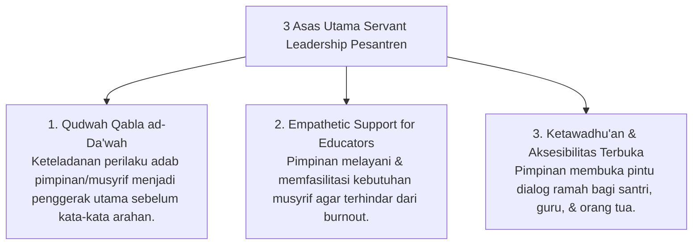

# P7-01-01: Prinsip Servant Leadership dan Qudwah Qabla ad-Da'wah

## Status Dokumen
* **Status**: 🌟 **A+ (Tervalidasi & Siap Diimplementasikan)**
* **Sub-Domain**: `07 Implementation Framework / 01 Governance`
* **Penanggung Jawab Keilmuan**: Dewan Keilmuan TUMBUH (*Pakar Tata Kelola Qudwah & Pakar Filosofi TUMBUH*)

---

## 1. Operasionalisasi Kepemimpinan Servant Leadership & Qudwah

Kepemimpinan di pesantren ekosistem **TUMBUH** memadukan konsep *Servant Leadership* (Greenleaf) dan ajaran Syar'i **Sayyidul Qaumi Khadimuhum** (Pemimpin kaum adalah pelayan mereka):

---

## 2. Penghapusan Gaya Kepemimpinan Otoriter

Pimpinan pesantren menolak gaya kepemimpinan feodal yang menuntut penghormatan buta, melainkan membangun kepercayaan (*Trust-Based Leadership*) melalui integritas amal nyata.
