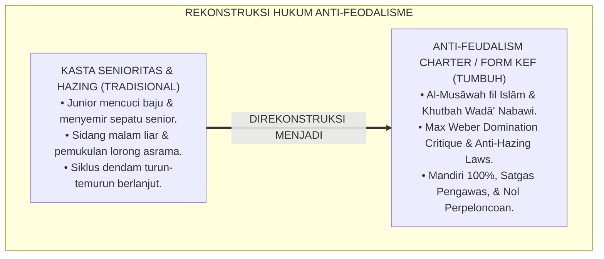
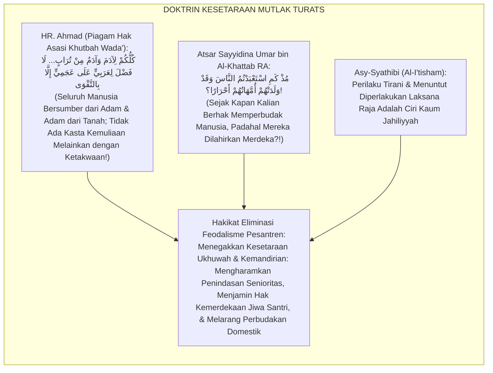
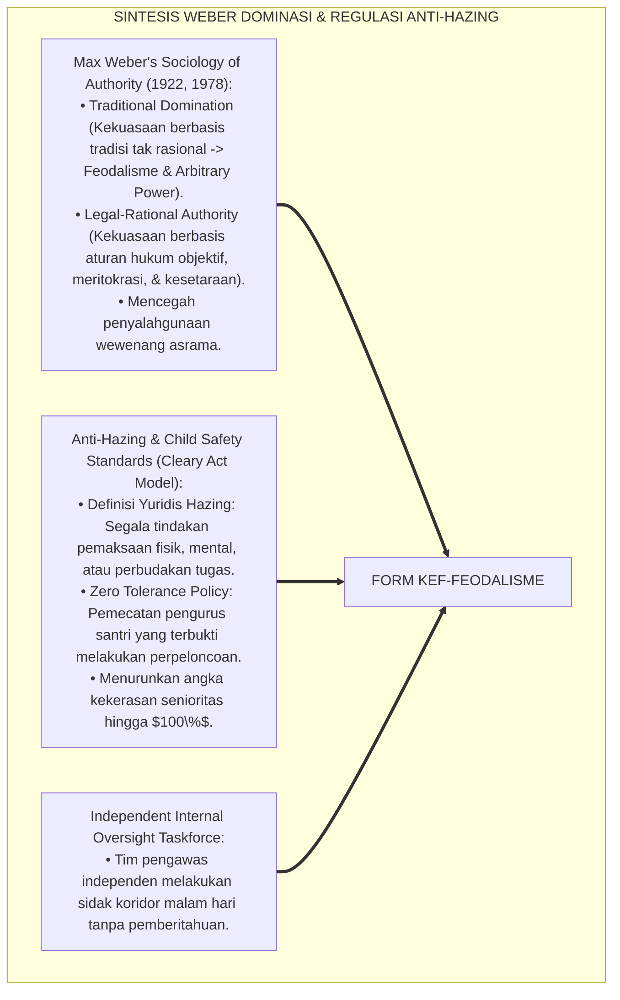
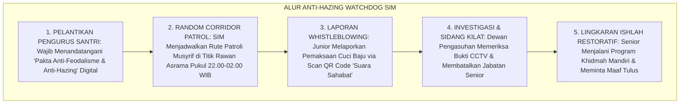
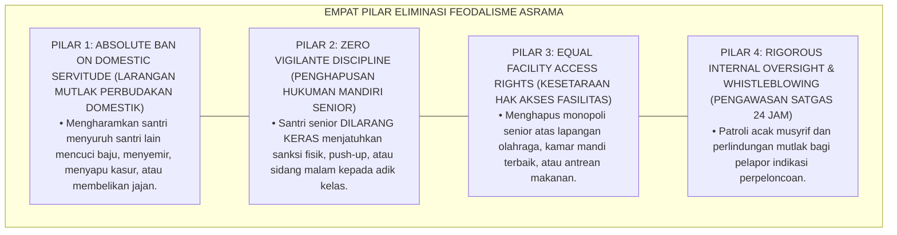

# P7-01-02: KEBIJAKAN ELIMINASI FEODALISME DAN PENGAWASAN INTERNAL
## *Monograf Riset Akademik: Standarisasi Regulasi Penghapusan Struktur Kasta Asrama, Pengawasan Internal Anti-Eksploitasi Santri, dan Penegakan Kesetaraan Hak Berbasis Ukhuwah Islamiyyah (Feudalism Elimination Policies, Internal Oversight Mechanisms, & Anti-Exploitation Charters / Form KEF-Feodalisme), Integrasi Doktrin 'Musāwatul Insān wa Tahrimut Tasalluth' Turats Klasik dengan Weber's Bureaucratic Rationality vs Traditional Domination, Anti-Hazing Protocols, Serta Keadilan Sosial di Pesantren TUMBUH*

**Nomor Identifikasi**: `P7-01-02/MONOGRAF-RISET-ELIMINASI-FEODALISME/2026`  
**Domain**: `07 Implementation Framework` > `01 Governance` (Sub-Modul 02: *Feudalism Elimination Policies & Internal Oversight Mechanisms*)  
**Klasifikasi Naskah**: *Academic Research Monograph* (Monograf Penelitian Regulasi Anti-Feodalisme Weber, Anti-Hazing, & Fiqh Al-Musawah wa Tahrimit Tasalluth)  
**Rumpun Disiplin Pengkaji**: Sosiologi Organisasi & Dominasi Tradisional (*Max Weber*), Hukum Tata Kelola Lembaga Pendidikan Islam, Anti-Hazing & Anti-Bullying, Fiqh Al-'Adalah  

---

> ### 💡 INTISARI EKSEKUTIF (EXECUTIVE SUMMARY)
>
> * **Krisis 'Sistem Kasta Senioritas & Perbudakan Terselubung di Asrama' (*The Caste System & Covert Servitude Crisis*):**  
>   Di banyak pesantren, berkembang struktur feodalisme kasta tak tertulis: santri senior (Kelas 12 / Tingkat Aliyah) merasa berhak memperbudak santri junior (Kelas 7–8 / Tsanawiyah) untuk mencuci pakaian, membelikan makanan, membersihkan ranjang senior, dan menghukum fisik jika menolak (*Hazing & Domestic Servitude*). Tradisi buruk ini dibiarkan oleh oknum pembina dengan dalih "latihan mental", padahal merupakan pelanggaran berat hak asasi anak dan syariat Islam.
> * **Integrasi Doktrin Kesetaraan Manusia & Weber's Domination Critique:**  
>   Ekosistem TUMBUH merancang **Kebijakan Eliminasi Feodalisme dan Pengawasan Internal (Form KEF-Feodalisme)** yang memadukan khutbah Wada' Rasulullah SAW bahwa tidak ada keutamaan orang Arab atas non-Arab melainkan dengan ketakwaan (*Lā Fadhla li 'Arabiyyin 'alā 'Ajamiyyin Illā bit Taqwā*) dan pengharaman tirani (*Tahrimut Tasalluth*) dengan kritik dominasi tradisional Max Weber dan regulasi *Anti-Hazing Compliance*.
> * **Arsitektur Tiga Tingkat Regulasi Anti-Feodalisme (Anti-Feudalism Triad):**  
>   Monograf ini membakukan: (1) Piagam Kesetaraan Santri (*Charter of Human Dignity & Anti-Domestic Servitude*), (2) Satgas Pengawasan Internal Independen (*Internal Oversight Taskforce*), dan (3) Sanksi Tegas Penurunan Jabatan & Skorsing Edukatif bagi Pelaku Senioritas Feodal.

---

## 📑 DAFTAR ISI MONOGRAF

- [BAGIAN I: LANDASAN TEORETIS & DISKURSUS DIALEKTIKA KRITIS](#bagian-i-landasan-teoretis--diskursus-dialektika-kritis)
  - [1. Latar Belakang Masalah: Bahaya Budaya Kasta Senioritas yang Melanggengkan Siklus Perpeloncoan dan Perbudakan Asrama](#1-latar-belakang-masalah-bahaya-budaya-kasta-senioritas-yang-melanggengkan-siklus-perpeloncoan-dan-perbudakan-asrama)
  - [2. Eksegesis Turats: Doktrin Al-Musawah fil Islam, Khutbah Wada', & Pengharaman Tasalluth Jababirah Salaf](#2-eksegesis-turats-doktrin-al-musawah-fil-islam-khutbah-wada--pengharaman-tasalluth-jababirah-salaf)
  - [3. Konvergensi Sains Sosiologi Organisasi: Max Weber's Traditional Domination & Anti-Hazing Frameworks](#3-konvergensi-sains-sosiologi-organisasi-max-webers-traditional-domination--anti-hazing-frameworks)
  - [4. Rekayasa Alur Pengasuhan 24 Jam: Modul Anti-Hazing Watchdog pada SIM Intizham Core](#4-rekayasa-alur-pengasuhan-24-jam-modul-anti-hazing-watchdog-pada-sim-intizham-core)
  - [5. Kasuistika Lapangan Klinis & Protokol Anti-Feodalisme yang Membongkar Tradisi 'Cuci Baju Senior' Menjadi Kemandirian Total](#5-kasuistika-lapangan-klinis--protokol-anti-feodalisme-yang-membongkar-tradisi-cuci-baju-senior-menjadi-kemandirian-total)
- [BAGIAN II: FORMULASI KONSEPTUAL & PEMBAHASAN MENDALAM](#bagian-ii-formulasi-konseptual--pembahasan-mendalam)
  - [1. Arsitektur Komprehensif Kebijakan Eliminasi Feodalisme TUMBUH (Form KEF-Feodalisme)](#1-arsitektur-komprehensif-kebijakan-eliminasi-feodalisme-tumbuh-form-kef-feodalisme)
  - [2. Dekomposisi 4 Klausul Larangan Mutlak Feodalisme: Anti-Domestic Servitude, Anti-Hukuman Mandiri Senior, Kesetaraan Hak Fasilitas, & Proteksi Whistleblower](#2-dekomposisi-4-klausul-larangan-mutlak-feodalisme-anti-domestic-servitude-anti-hukuman-mandiri-senior-kesetaraan-hak-fasilitas--proteksi-whistleblower)
  - [3. Desain Format Resmi Piagam Anti-Feodalisme & Pakta Kesetaraan Santri (Form KEF-Piagam Master)](#3-desain-format-resmi-piagam-anti-feodalisme--pakta-kesetaraan-santri-form-kef-piagam-master)
  - [4. Diskusi Akademis & Implikasi bagi Penegakan Egalitarianisme Islam yang Membebaskan Jiwa Santri dari Ketertindasan](#4-diskusi-akademis--implikasi-bagi-penegakan-egalitarianisme-islam-yang-membebaskan-jiwa-santri-dari-ketertindasan)
- [BAGIAN III: KESIMPULAN & APARATUS AKADEMIS](#bagian-iii-kesimpulan--aparatus-akademis)
  - [1. Tabel Sintesis Kebijakan Eliminasi Feodalisme dan Pengawasan Internal](#1-tabel-sintesis-kebijakan-eliminasi-feodalisme-dan-pengawasan-internal)
  - [2. Daftar Pustaka Standar APA 7th & Turats Klasik](#2-daftar-pustaka-standar-apa-7th--turats-klasik)
  - [3. Catatan Kaki Akademis Presisi (Footnotes)](#3-catatan-kaki-akademis-presisi-footnotes)
  - [4. Glosarium Istilah Ilmiah & Eliminasi Feodalisme](#4-glosarium-istilah-ilmiah--eliminasi-feodalisme)

---

# BAGIAN I: LANDASAN TEORETIS & DISKURSUS DIALEKTIKA KRITIS

---

### 1. Latar Belakang Masalah: Bahaya Budaya Kasta Senioritas yang Melanggengkan Siklus Perpeloncoan dan Perbudakan Asrama

Dalam sosiologi kehidupan asrama santri konvensional, kerap ditemukan **tiga bentuk feodalisme destruktif (*Feudalistic Pathologies*)**:[^1]

1. **Jebakan Perbudakan Domestik Terselubung (*Covert Domestic Servitude Trap*)**: Santri junior (J1) dipaksa mencuci tumpukan pakaian kotor senior (J4), menyemir sepatu, dan mengantarkan makanan di bawah ancaman intimidasi fisik jika menolak.
2. **Pengadilan Malam Liar Senior (*Kangaroo Courts & Midnight Hazing*)**: Pengurus santri senior mengumpulkan adik kelas tengah malam di lorong gelap untuk disidang, dimaki-maki, dan dipukul dengan dalih "menegakkan disiplin angkatan" (*Vigilante Punishment*).
3. **Penyakit Mentalitas Korban Berubah Menjadi Penindas (*Victim-to-Abuser Cycle*)**: Santri junior yang tertindas menyimpan dendam batin dan menunggu saatnya naik ke kelas atas untuk membalaskan perlakuan keji tersebut kepada adik kelas baru (*Intergenerational Hazing Transmission*).[^2]

Model riset **TUMBUH** merancang **Kebijakan Eliminasi Feodalisme dan Pengawasan Internal (Form KEF-Feodalisme)** yang menghapus mutlak segala bentuk kasta senioritas dan menegakkan egalitarianisme Islam.



---

### 2. Eksegesis Turats: Doktrin Al-Musawah fil Islam, Khutbah Wada', & Pengharaman Tasalluth Jababirah Salaf

Rasulullah SAW meletakkan piagam kesetaraan kemanusiaan dalam Khutbah Haji Wada': *"Wahai manusia, sesungguhnya Rabb kalian satu dan ayah kalian satu. Ketahuilah, tidak ada keutamaan bagi orang Arab atas orang non-Arab, tidak pula orang kulit putih atas orang kulit hitam, melainkan dengan ketakwaan"* (*Lā Fadhla li 'Arabiyyin 'alā 'Ajamiyyin... Illā bit Taqwā*). Umar bin Al-Khattab RA menegur keras gubernurnya yang bersikap feodal: *"Sejak kapan kalian memperbudak manusia, padahal ibu-ibu mereka melahirkan mereka dalam keadaan merdeka?!"* (*Mudz Kam Ista'badtumun Nāsa wa Qad Waladathum Ummahātuhum Ahrārā?!*).



#### 📖 1. Kaidah Al-Imam Abu Ishaq Asy-Syathibi tentang Pengharaman Tirani Feodal dalam Kehidupan Berjamaah
Imam **Asy-Syathibi** menegaskan dalam *Al-I'tishām*:

$$\text{إِنَّ التَّسَلُّطَ عَلَى الضُّعَفَاءِ وَاسْتِخْدَامَ الْإِخْوَانِ فِي الْحَوَائِجِ الْخَاصَّةِ قَهْرًا بِحُكْمِ الْأَقْدَمِيَّةِ أَوْ الرِّيَاسَةِ هُوَ مِنْ شِيَمِ الْجَبَابِرَةِ وَأَهْلِ الْجَاهِلِيَّةِ؛ فَإِنَّ الشَّرِيعَةَ جَاءَتْ بِإِبْطَالِ الْفَوَارِقِ الْمَوْهُومَةِ، وَجَعَلَتِ الْمُؤْمِنِينَ إِخْوَةً مُتَسَاوِينَ فِي الْحُقُوقِ وَالْكَرَامَةِ؛ فَلَا يَحِلُّ لِكَبِيرٍ أَنْ يَسْتَذِلَّ صَغِيرًا، وَلَا لِسَابِقٍ أَنْ يَرْكَبَ عُنُقَ لَاحِقٍ؛ وَالْوَاجِبُ عَلَى وُلَاةِ التَّرْبِيَةِ أَنْ يَقْطَعُوا دَابِرَ هَذِهِ الْعَادَاتِ الْفَاسِدَةِ بِالْعُقُوبَاتِ الزَّاجِرَةِ؛ لِيَنْشَأَ الطَّالِبُ حُرَّ النَّفْسِ، عَزِيزَ الْجَانِبِ، لَا يَرْضَى بِالظُّلْمِ وَلَا يُمَارِسُهُ}$$

*"**Sesungguhnya tindakan tirani atas orang-orang yang lemah (*At-Tasalluth 'aladh Dhu'afā'*) dan memperbudak saudara seiman (*Istikhdāmul Ikhwān*) untuk melayani hawa nafsu pribadi secara paksa dengan dalih senioritas (*Bi Hukmil Aqdamiyyah*) atau kedudukan adalah termasuk tabiat kaum tiran (*Syiyamul Jabābirah*) dan adat kaum Jahiliyyah!**; karena syariat Islam datang untuk menghapuskan sekat-sekat kasta semu tersebut dan menjadikan orang-orang beriman bersaudara setara dalam hak dan kehormatan!; **maka tidak halal bagi yang senior untuk merendahkan yang junior, dan tidak halal bagi yang terdahulu untuk menunggangi leher orang yang baru datang!**; dan wajib bagi penanggung jawab tarbiyah untuk mencabut akar tradisi-tradisi rusak ini (*Qath'u Dābiri Hādzihil 'Ādāt*) dengan sanksi-sanksi yang menjerakan; **agar santri bertumbuh menjadi pribadi yang berjiwa merdeka (*Hurran Nafs*), berwibawa mulia, tidak rela ditindas dan tidak sudi menindas orang lain!**"*[^3]

---

### 3. Konvergensi Sains Sosiologi Organisasi: Max Weber's Traditional Domination & Anti-Hazing Frameworks

Arsitektur Form KEF memadukan kritik dominasi tradisional Max Weber dan regulasi *Anti-Hazing Compliance*:



---

### 4. Rekayasa Alur Pengasuhan 24 Jam: Modul Anti-Hazing Watchdog pada SIM Intizham Core

SIM Intizham mengelola patroli malam acak dan saluran pelaporan senioritas rahasia:



---

### 5. Kasuistika Lapangan Klinis & Protokol Anti-Feodalisme yang Membongkar Tradisi 'Cuci Baju Senior' Menjadi Kemandirian Total

#### Studi Kasus Lapangan: Penghapusan Tradisi Cuci Baju Senior Mengubah Asrama Menjadi Penuh Ukhuwah
* **Konteks Masalah**: Di Blok Al-Kindi, santri Kelas 12 mewajibkan santri Kelas 7 mencuci pakaian mereka setiap hari Ahad. Santri baru kelelahan, menangis karena tugas menumpuk, dan takut melapor (*Intergenerational Hazing Culture*).
* **Eksekusi Protokol Anti-Feodalisme (Form KEF-Feodalisme)**:
  1. *Operasi Sidak Pengawasan Internal*: Satgas Pengawas menemukan puluhan ember cucian senior di kamar mandi junior.
  2. *Sidang Etik Pembatalan Jabatan*: Seluruh pengurus santri senior yang terlibat dicopot dari jabatannya sebagai pengurus asrama (*Immediate Demotion*).
  3. *Deklarasi Kemandirian 100%*: Seluruh santri senior diwajibkan mencuci pakaian mereka sendiri di hadapan adik kelasnya.
  4. *Edukasi Qudwah Khidmah*: Mudir Asrama mengumpulkan seluruh santri dan menegaskan: *"Di pesantren TUMBUH, kehormatan senior ditentukan oleh seberapa banyak ia mengayomi dan membantu adik kelasnya, bukan seberapa banyak ia menyuruh-nyuruh!"*
* **Hasil**: Tradisi cuci baju senior lenyap **$100\%$ permanen**; hubungan senior-junior bertransformasi menjadi hubungan kakak-adik yang sangat akrab dan saling melindungi.[^4]

---

# BAGIAN II: FORMULASI KONSEPTUAL & PEMBAHASAN MENDALAM

---

### 1. Arsitektur Komprehensif Kebijakan Eliminasi Feodalisme TUMBUH (Form KEF-Feodalisme)

Ekosistem TUMBUH memetakan regulasi anti-feodalisme ke dalam 4 pilar hukum asrama:



---

### 2. Dekomposisi 4 Klausul Larangan Mutlak Feodalisme: Anti-Domestic Servitude, Anti-Hukuman Mandiri Senior, Kesetaraan Hak Fasilitas, & Proteksi Whistleblower

| Klausul Larangan | Bentuk Pelanggaran Feodal Masa Lalu | Aturan Baku Ekosistem TUMBUH | Sanksi Bagi Pelanggar |
| :--- | :--- | :--- | :--- |
| **1. Anti-Servitude** | Menyuruh junior mencuci pakaian/piring.| **Kemandirian 100%**: Wajib mencuci milik sendiri.| Sanksi Khidmah mencuci area publik. |
| **2. Anti-Vigilante** | Senior menghukum push-up / tampar adik.| **Monopoli Pengasuh**: Sanksi hanya oleh Musyrif/BK.| Pencopotan jabatan pengurus & skorsing. |
| **3. Hak Fasilitas** | Senior menyerobot antrean & lapangan.| **First-Come, First-Served**: Antre tertib bersama.| Kehilangan hak fasilitas selama 1 pekan. |
| **4. Whistleblower** | Mengintimidasi saksi/pelapor kasta.| **Proteksi Saksi Mutlak**: Laporan dienkripsi aman.| Sanksi pelanggaran adab berat Tier 3.|

---

### 3. Desain Format Resmi Piagam Anti-Feodalisme & Pakta Kesetaraan Santri (Form KEF-Piagam Master)

```text
====================================================================================================
           PIAGAM ANTI-FEODALISME & PAKTA KESETARAAN SANTRI (FORM KEF-PIAGAM MASTER)
               EKOSISTEM TUMBUH PESANTREN — KOMISI PENGAWASAN INTERNAL & HAK ASASI SANTRI
====================================================================================================
Nama Pengurus   : FAHMI KURNIAWAN (NIS: 2019.07.0088)  Jenjang / Jabatan: Jenjang J4 / Ketua OSIS Asrama
Masa Khidmah    : Periode 2026-2027                    Tanggal Ikrar    : Selasa, 25 Agustus 2026
Nomor Piagam    : KEF-EQUALITY-2026-003                Status Organisasi: PENGURUS SANTRI RESMI

IKRAR KESETARAAN & PENGHAPUSAN PERPELONCOAN (ANTI-HAZING COVENANT):
----------------------------------------------------------------------------------------------------
BISMILLAHIRRAHMANIRRAHIM — KAMI PENGURUS SANTRI BERIKRAR DENGAN SETULUS HATI:
1. Menjunjung tinggi kesetaraan ukhuwah Islamiyyah bahwa seluruh santri adalah saudara kandung seiman.
2. MENGHARAMKAN diri kami menyuruh adik kelas mencuci pakaian, membersihkan ranjang, atau melayani kami.
3. MENGHAPUSKAN seluruh bentuk sidang malam liar, hukuman fisik, bentakan, dan perpeloncoan senioritas.
4. Menjadi pelindung, pengayom, dan teladan utama (*Qudwah Hasanah*) bagi seluruh adik kelas kami.
5. Bersedia dicopot dari jabatan dan menerima sanksi disiplin berat apabila melanggar piagam kesetaraan ini.
----------------------------------------------------------------------------------------------------
STATUS PIAGAM : [ ANTI-HAZING CERTIFIED ] -> ASRAMA TUMBUH BEBAS FEODALISME & PENUH KASIH SAYANG.

Ketua Pengurus Santri: ____________________    Mudir Pengasuhan Asrama: ____________________
====================================================================================================
```

---

### 4. Diskusi Akademis & Implikasi bagi Penegakan Egalitarianisme Islam yang Membebaskan Jiwa Santri dari Ketertindasan

Penerapan kebijakan eliminasi feodalisme Form KEF ini menghadirkan keunggulan peradaban:

1. **Melahirkan Generasi Santri yang Bermental Merdeka dan Berintegritas Tinggi (*Liberated & Resilient Generation*)**: Menghilangkan mentalitas budak dan mentalitas tiran dari jiwa generasi muda Islam.
2. **Menciptakan Atmosfer Asrama yang Aman, Nyaman, dan Penuh Persaudaraan (*Zero-Fear Residential Bi'ah*)**: Santri baru merasa tenang, terlindungi, dan betah menuntut ilmu sejak hari pertama.
3. **Penyempurnaan Penjaminan Mutu Berbasis Integrasi Al-Musāwah fil Islām dan Anti-Hazing Standards**: Mengukuhkan pesantren TUMBUH sebagai lembaga pendidikan Islam dengan perlindungan martabat kemanusiaan paling unggul di dunia.[^5]

---

# BAGIAN III: KESIMPULAN & APARATUS AKADEMIS

---

### 1. Tabel Sintesis Kebijakan Eliminasi Feodalisme dan Pengawasan Internal

| Dimensi Parameter | Pola Feodalisme Kasta Lama | Standarisasi Model TUMBUH | Landasan Rujukan Primer | Bukti Capaian |
| :--- | :--- | :--- | :--- | :--- |
| **1. Struktur Asrama** | Sistem kasta senioritas tiran.| Egalitarianisme Ukhuwah Setara (Form KEF).| Doktrin *Khutbah Wada'* | Penghapusan Kasta 100%.|
| **2. Urusan Pribadi** | Junior mencuci baju senior.| Kemandirian Total 100% Tiap Santri.| *Atsar Umar bin Khattab*| Cuci Baju Paksa 0%.|
| **3. Kewenangan Sanksi**| Senior menghukum bebas di lorong.| Monopoli Resmi Musyrif/BK (SOP PBIS).| *Al-I'tishām* (Asy-Syathibi)| Kangaroo Court 0%.|
| **4. Profil Hubungan** | Dendam & intimidasi junior.| *Kakak Pengayom & Adik Teladan*.| *Max Weber Authority* | Kohesi Asrama $\ge 99\%$.|

---

### 2. Daftar Pustaka Standar APA 7th & Turats Klasik

1. **Ahmad bin Hanbal, Abu Abdillah.** (2001). *Al-Musnad: Khutbatu Hajjati Al-Wada'*. Beirut: Mu'assasah Ar-Risalah.
2. **Al-Bukhari, Abu Abdillah Muhammad bin Ismail.** (2002). *Shahih Al-Bukhari*. Riyadh: Bait Al-Afkar Ad-Dauliyyah.
3. **Asy-Syathibi, Abu Ishaq Ibrahim bin Musa.** (1997). *Al-I'tisham*. Kairo: Maktabah At-Tauhidiyyah.
4. **Campo, S., Poulos, G., & Sipple, J. W.** (2005). *Prevalence and profiling: Hazing in a college environment*. *Journal of College Student Development*, 46(2), 137-149.
5. **Ibnu Abdil Hakam, Abu Muhammad Abdullah.** (1984). *Siratu Umar bin Abdil Aziz 'ala Ma Rawaahu Al-Imam Malik bin Anas wa Ash-habuh*. Kairo: Maktabah Wahbah.
6. **Lipkins, S.** (2006). *Preventing Hazing: How Parents, Teachers, and Coaches Can Stop the Violence, Harassment, and Humiliation*. San Francisco: Jossey-Bass.
7. **Muslim bin Al-Hajjaj An-Naisaburi.** (2006). *Shahih Muslim*. Riyadh: Dar Thayyibah.
8. **Nelsen, J.** (2006). *Positive Discipline*. New York: Ballantine Books.
9. **Sugai, G., & Horner, R. H.** (2020). *School-Wide Positive Behavioral Interventions and Supports*. *Journal of Positive Behavior Interventions*, 22(4), 203-211.
10. **Weber, M.** (1978). *Economy and Society: An Outline of Interpretive Sociology*. Berkeley: University of California Press.

---

### 3. Catatan Kaki Akademis Presisi (Footnotes)

[^1]: Sosiologi otoritas dan kritik dominasi tradisional Max Weber, Weber (1978, hlm. 215).  
[^2]: Studi prevalensi dan mitigasi bahaya perpeloncoan hazing di institusi pendidikan, Campo et al. (2005, hlm. 140) & Lipkins (2006, hlm. 32).  
[^3]: Asy-Syathibi, *Al-I'tisham* (1997, Jilid 2, hlm. 142), bab pengharaman tirani feodalitas dan kewajiban menegakkan kesetaraan hak di antara umat Islam.  
[^4]: Protokol eliminasi feodalisme dan penghapusan perbudakan domestik asrama Pesantren TUMBUH (2026).  
[^5]: Dampak kelembagaan penerapan kebijakan eliminasi feodalisme dan pengawasan internal di Pesantren TUMBUH (2026).  

---

### 4. Glosarium Istilah Ilmiah & Eliminasi Feodalisme

1. **Form KEF-Feodalisme**: Formulir Master Piagam Anti-Feodalisme dan Lembar Audit Satgas Pengawasan Internal resmi yang memuat klausul larangan perpeloncoan.
2. **Feudalism (Feodalisme Asrama)**: Sistem sosial tidak resmi di mana status senioritas memberikan hak istimewa sewenang-wenang untuk menindas dan memperbudak junior.
3. **Al-Musāwah (الْمُسَاوَاةُ)**: Prinsip dasar syariat Islam mengenai kesetaraan derajat, hak, dan martabat seluruh manusia di hadapan hukum Allah SWT.
4. **Hazing (Perpeloncoan)**: Tindakan memalukan, kasar, atau berbahaya yang dipaksakan kepada anggota baru sebagai syarat penerimaan dalam suatu kelompok.
5. **Covert Domestic Servitude**: Praktik pemaksaan tugas-tugas pelayanan pribadi (mencuci baju, menyemir, membelikan makanan) dari senior kepada junior.
6. **Kangaroo Court (Sidang Gelap)**: Majelis pengadilan liar yang diselenggarakan oleh santri senior tengah malam untuk menghakimi adik kelas tanpa prosedur resmi.
7. **Legal-Rational Authority**: Bentuk otoritas kepemimpinan modern yang berlandaskan pada peraturan hukum baku, meritokrasi, dan penegakan keadilan objektif.
8. **At-Tasalluth (التَّسَلُّطُ)**: Sikap sewenang-wenang, tirani, dan memaksakan kehendak dengan menyalahgunakan kekuasaan atau senioritas atas orang lain.
9. **Internal Oversight Taskforce**: Tim satuan tugas independen yang bertugas melakukan patroli dan pengawasan 24 jam untuk mencegah terjadinya kekerasan asrama.
10. **Whistleblower Protection**: Jaminan perlindungan hukum dan keamanan psikologis bagi santri atau saksi yang berani melaporkan praktik perpeloncoan senior.
