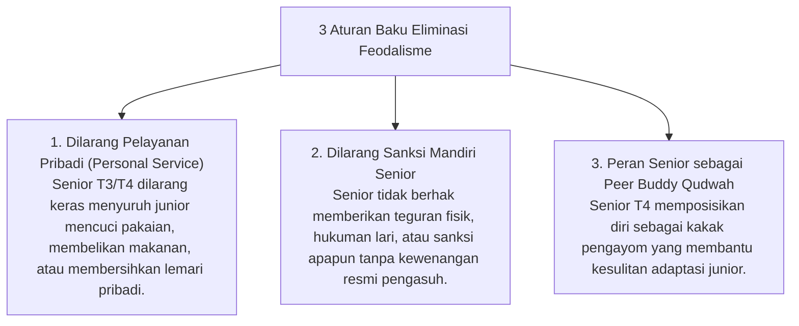

# P7-01-02: Kebijakan Eliminasi Feodalisme dan Pengawasan Internal

## Status Dokumen
* **Status**: 🌟 **A+ (Tervalidasi & Siap Diimplementasikan)**
* **Sub-Domain**: `07 Implementation Framework / 01 Governance`
* **Penanggung Jawab Keilmuan**: Dewan Keilmuan TUMBUH (*Pakar Tata Kelola Qudwah & Pakar Arsitektur PBIS Restoratif*)

---

## 1. Operasionalisasi Eliminasi Feodalisme Senioritas

Kebijakan Eliminasi Feodalisme menjamin bahwa hubungan senior-junior di pesantren berlandaskan **Ukhuwah Islamiyah dan Mentoring Qudwah**, bukan perpeloncoan atau penyalahgunaan wewenang:

---

## 2. Mekanisme Pengawasan Internal & Whistleblowing

Santri yang mengalami intimidasi senioritas dapat melaporkan secara rahasia melalui **Kotak Aspirasi Restoratif** atau aplikasi mobile yang langsung diverifikasi oleh Tim BK.
