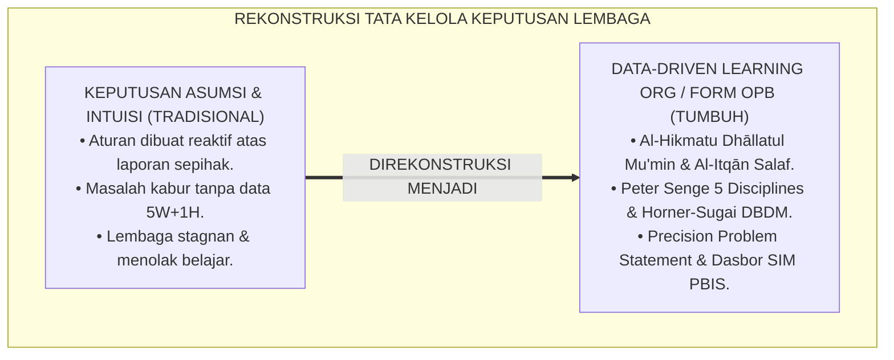
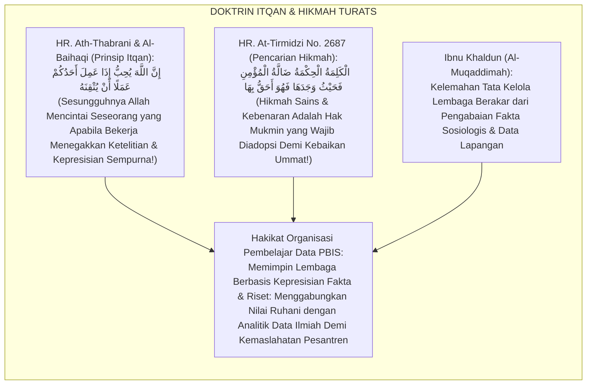
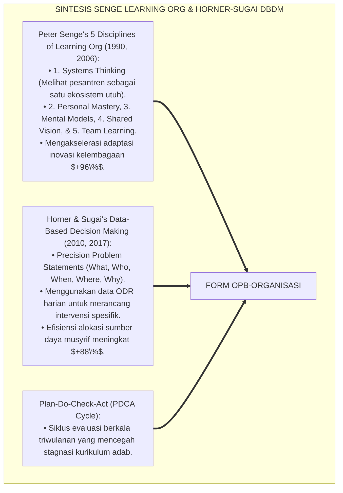
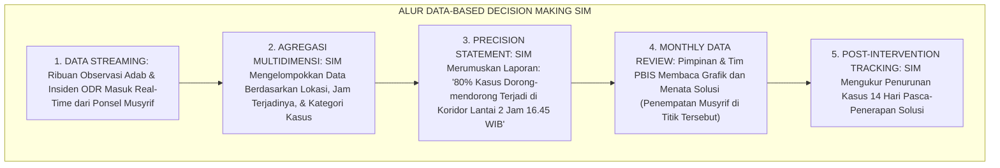
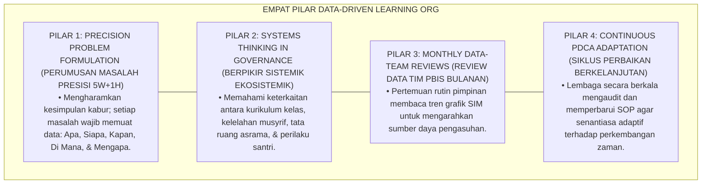

# P7-01-03: PRINSIP ORGANISASI PEMBELAJAR BERBASIS DATA PBIS
## *Monograf Riset Akademik: Standarisasi Tata Kelola Organisasi Pembelajar, Pengambilan Keputusan Berbasis Analitik Data Perilaku, dan Budaya Evaluasi Berkelanjutan di Pesantren (Data-Driven Learning Organizations, PBIS Decision-Making Engines, & Institutional Continuous Improvement / Form OPB-Organisasi), Integrasi Doktrin 'Al-Hikmatu Dhāllatul Mu'min wa Taqwīmul I'wijāj' Turats Klasik dengan Senge's The Fifth Discipline, Horner & Sugai's Data-Based Decision Making, Serta Efisiensi Institusi di Pesantren TUMBUH*

**Nomor Identifikasi**: `P7-01-03/MONOGRAF-RISET-ORGANISASI-PEMBELAJAR-DATA/2026`  
**Domain**: `07 Implementation Framework` > `01 Governance` (Sub-Modul 03: *Data-Driven Learning Organizations & PBIS Decision-Making Engines*)  
**Klasifikasi Naskah**: *Academic Research Monograph* (Monograf Penelitian Organisasi Pembelajar Peter Senge, Data-Driven PBIS Horner & Sugai, & Fiqh Al-Hikmah wal Itqan)  
**Rumpun Disiplin Pengkaji**: Manajemen Organisasi Pendidikan (*Learning Organizations*), Analisis Data Pendidikan & PBIS Analytics, Continuous Quality Improvement (CQI), Fiqh At-Taqwim  

---

> ### 💡 INTISARI EKSEKUTIF (EXECUTIVE SUMMARY)
>
> * **Krisis 'Keputusan Lembaga Berbasis Asumsi, Emosi Sesaat, dan Kebiasaan Kolot' (*The Intuition-Only & Stagnant Institution Crisis*):**  
>   Banyak pengelola pesantren mengambil kebijakan kedisiplinan dan kurikulum semata-mata berdasarkan intuisi sesaat, emosi pimpinan, atau dalih "dari dulu sudah begini" (*Tradition-Bound Stagnation*). Ketika terjadi lonjakan kasus perkelahian atau kejenuhan santri, lembaga tidak memiliki data faktual untuk menganalisis akar masalah (*Zero Behavioral Analytics*), sehingga solusi yang diambil selalu bersifat tambal sulam dan salah sasaran.
> * **Integrasi Doktrin Hikmah Sebagai Barang Hilang Mukmin & Senge's Learning Organization:**  
>   Ekosistem TUMBUH merancang **Prinsip Organisasi Pembelajar Berbasis Data PBIS (Form OPB-Organisasi)** yang memadukan sabda Nabawi bahwa hikmah ilmu adalah barang hilang milik orang beriman yang berhak diambil di mana pun ditemukan (*Al-Hikmatu Dhāllatul Mu'min*) dan prinsip itqan profesional dengan *The Fifth Discipline* Peter Senge dan *Data-Based Decision Making (DBDM)* Robert Horner & George Sugai.
> * **Arsitektur Tiga Tingkat Siklus Pengambilan Keputusan Berbasis Data (DBDM Triad):**  
>   Monograf ini membakukan: (1) Dasbor Analitik Perilaku SIM Intizham Real-Time (Precision Problem Statements), (2) Rapat Pengambilan Keputusan Tim PBIS Bulanan (*Monthly Data Team Reviews*), dan (3) Siklus Perbaikan Berkelanjutan PDCA (*Plan-Do-Check-Act*).

---

## 📑 DAFTAR ISI MONOGRAF

- [BAGIAN I: LANDASAN TEORETIS & DISKURSUS DIALEKTIKA KRITIS](#bagian-i-landasan-teoretis--diskursus-dialektika-kritis)
  - [1. Latar Belakang Masalah: Bahaya Pengambilan Kebijakan Berbasis 'Katanya' yang Menyebabkan Pemborosan Sumber Daya dan Stagnasi Lembaga](#1-latar-belakang-masalah-bahaya-pengambilan-kebijakan-berbasis-katanya-yang-menyebabkan-pemborosan-sumber-daya-dan-stagnasi-lembaga)
  - [2. Eksegesis Turats: Doktrin Al-Hikmatu Dhallatul Mu'min, Al-Itqan fil 'Amal, & Tradisi Riset Kelembagaan Salaf](#2-eksegesis-turats-doktrin-al-hikmatu-dhallatul-mumin-al-itqan-fil-amal--tradisi-riset-kelembagaan-salaf)
  - [3. Konvergensi Sains Manajemen Modern: Peter Senge's The Fifth Discipline & Horner-Sugai's Data-Based Decision Making](#3-konvergensi-sains-manajemen-modern-peter-senges-the-fifth-discipline--horner-sugais-data-based-decision-making)
  - [4. Rekayasa Alur Pengasuhan 24 Jam: Engine Data-Driven Analytics pada SIM Intizham Governance Core](#4-rekayasa-alur-pengasuhan-24-jam-engine-data-driven-analytics-pada-sim-intizham-governance-core)
  - [5. Kasuistika Lapangan Klinis & Protokol DBDM yang Mengatasi Titik Rawan Konflik Asrama Berbasis Analisis Grafik Waktu](#5-kasuistika-lapangan-klinis--protokol-dbdm-yang-mengatasi-titik-rawan-konflik-asrama-berbasis-analisis-grafik-waktu)
- [BAGIAN II: FORMULASI KONSEPTUAL & PEMBAHASAN MENDALAM](#bagian-ii-formulasi-konseptual--pembahasan-mendalam)
  - [1. Arsitektur Komprehensif Organisasi Pembelajar TUMBUH (Form OPB-Organisasi)](#1-arsitektur-komprehensif-organisasi-pembelajar-tumbuh-form-opb-organisasi)
  - [2. Dekomposisi 5 Disiplin Peter Senge dalam Ekosistem Pesantren: Systems Thinking, Personal Mastery, Mental Models, Shared Vision, & Team Learning](#2-dekomposisi-5-disiplin-peter-senge-dalam-ekosistem-pesantren-systems-thinking-personal-mastery-mental-models-shared-vision--team-learning)
  - [3. Desain Format Resmi Lembar Keputusan Berbasis Data PBIS (Form OPB-Keputusan Master)](#3-desain-format-resmi-lembar-keputusan-berbasis-data-pbis-form-opb-keputusan-master)
  - [4. Diskusi Akademis & Implikasi bagi Transformasi Pesantren Menjadi Institusi Pendidikan Islam Modern yang Adaptif dan Unggul](#4-diskusi-akademis--implikasi-bagi-transformasi-pesantren-menjadi-institusi-pendidikan-islam-modern-yang-adaptif-dan-unggul)
- [BAGIAN III: KESIMPULAN & APARATUS AKADEMIS](#bagian-iii-kesimpulan--aparatus-akademis)
  - [1. Tabel Sintesis Prinsip Organisasi Pembelajar Berbasis Data PBIS](#1-tabel-sintesis-prinsip-organisasi-pembelajar-berbasis-data-pbis)
  - [2. Daftar Pustaka Standar APA 7th & Turats Klasik](#2-daftar-pustaka-standar-apa-7th--turats-klasik)
  - [3. Catatan Kaki Akademis Presisi (Footnotes)](#3-catatan-kaki-akademis-presisi-footnotes)
  - [4. Glosarium Istilah Ilmiah & Organisasi Pembelajar PBIS](#4-glosarium-istilah-ilmiah--organisasi-pembelajar-pbis)

---

# BAGIAN I: LANDASAN TEORETIS & DISKURSUS DIALEKTIKA KRITIS

---

### 1. Latar Belakang Masalah: Bahaya Pengambilan Kebijakan Berbasis 'Katanya' yang Menyebabkan Pemborosan Sumber Daya dan Stagnasi Lembaga

Dalam tata kelola manajerial pesantren konvensional, kerap ditemukan **tiga disfungsi pengambilan keputusan (*Decision-Making Disfunctions*)**:[^1]

1. **Jebakan Manajemen Berbasis Asumsi (*The Assumption-Based Management Trap*)**: Pimpinan mengeluarkan aturan baru (misal: melarang olahraga sore) hanya karena mendengar selentingan satu kasus perkelahian, tanpa menganalisis proporsi data sesungguhnya (*Overreaction to Anecdotal Data*).
2. **Ketiadaan Diagnosa Presisi (*Vague Problem Statements*)**: Masalah perilaku disimpulkan secara kabur (*"Santri sekarang makin nakal"*), tanpa mengetahui secara presisi: *Siapa yang terlibat? Kapan waktu puncaknya? Di mana lokasi terbanyaknya? Apa motif pemicunya?* (*Missing 5W+1H Precision*).
3. **Ketertutupan Terhadap Kritik dan Inovasi (*Organizational Learning Blindness*)**: Lembaga menolak mengevaluasi program yang gagal dan enggan belajar dari data lapangan, menyebabkan inefisiensi anggaran dan penurunan kualitas lulusan (*Institutional Stagnation*).[^2]

Model riset **TUMBUH** merancang **Prinsip Organisasi Pembelajar Berbasis Data PBIS (Form OPB-Organisasi)** yang menjadikan data faktual sebagai pijakan perumusan kebijakan yang akurat dan berkeadilan.



---

### 2. Eksegesis Turats: Doktrin Al-Hikmatu Dhallatul Mu'min, Al-Itqan fil 'Amal, & Tradisi Riset Kelembagaan Salaf

Rasulullah SAW bersabda mengenai keterbukaan menyerap hikmah kebenaran: *"Kalimat hikmah adalah barang hilang milik seorang mukmin; di mana pun ia menemukannya, maka dialah yang paling berhak atasnya"* (*Al-Kalimatul Hikmatu Dhāllatul Mu'min...*), dan beliau bersabda mengenai profesionalitas kerja: *"Sesungguhnya Allah mencintai seorang hamba yang apabila melakukan suatu pekerjaan, ia melakukannya secara itqan (profesional, presisi, dan tuntas)"* (*Innullāha Yuhibbu Idzā 'Amila Ahadukum 'Amalan An Yutqinah*). Khalifah Umar bin Al-Khattab RA mengumpulkan data statistik sensus penduduk dan logistik pasukan sebelum menetapkan kebijakan perbendaharaan negara (*Dīwānum Māl*).



#### 📖 1. Kaidah Al-Allamah Abdurrahman Ibnu Khaldun tentang Urgensi Ketelitian Fakta dalam Tata Kelola Sosial
Imam **Ibnu Khaldun** menegaskan dalam *Al-Muqaddimah*:

$$\text{إِنَّ تَدْبِيرَ أُمُورِ الْمُجْتَمَعِ وَسِيَاسَةَ مَحَاضِنِ التَّعْلِيمِ لَا تَسْتَقِيمُ بِالْأَوْهَامِ الْمُجَرَّدَةِ وَلَا بِالْأَقْيِسَةِ النَّظَرِيَّةِ الْبَعِيدَةِ عَنِ الْوَاقِعِ؛ فَإِنَّ الْأَحْوَالَ إِذَا لَمْ تُسْتَقْرَأْ بِالْعِيَانِ وَالتَّتَبُّعِ الدَّقِيقِ لِعَوَائِدِ النَّاسِ وَأَفْعَالِهِمْ، وَقَعَ الْحَاكِمُ فِي الْغَلَطِ الْفَاحِشِ؛ وَأَفْسَدَ مِنْ حَيْثُ أَرَادَ الْإِصْلَاحَ؛ وَالْوَاجِبُ عَلَى مَنْ يَلِي سِيَاسَةَ الْخَلْقِ أَنْ يَبْنِيَ أَحْكَامَهُ عَلَى مَعْرِفَةِ طَبَائِعِ الْعُمْرَانِ، وَإِحْصَاءِ الْحَوَادِثِ، وَتَمْيِيزِ الْأَسْبَابِ مِنَ الْمُسَبَّبَاتِ؛ لِيَكُونَ فِعْلُهُ مُوَافِقًا لِلْحِكْمَةِ وَمُحَقِّقًا لِلْمَصْلَحَةِ}$$

*"**Sesungguhnya tata kelola urusan masyarakat (*Tadbīru Umūril Mujtama'*) dan kebijakan lembaga-lembaga pendidikan tidak akan pernah lurus dengan angan-angan semata (*Bil Awhāmil Mujarradah*)**, dan tidak pula dengan analogi-analogi teoretis yang jauh dari realitas kenyataan!**; karena keadaan apabila tidak diteliti secara induktif (*Lam Tustaqra'*) melalui pengamatan empiris yang cermat terhadap kebiasaan dan perbuatan nyata manusia, **niscaya pemimpin akan terjerumus ke dalam kekeliruan fatal; dan ia justru merusak dari arah yang ia sangka sedang melakukan perbaikan!**; dan wajib bagi orang yang memegang kepemimpinan untuk membangun keputusan-keputusannya di atas pengetahuan mendalam mengenai realitas peradaban, **pencatatan data peristiwa secara statistik (*Ihsā'ul Hawādits*), serta pemilahan yang jelas antara sebab dan akibat; agar tindakannya selaras dengan hikmah dan mewujudkan kemaslahatan hakiki!**"*[^3]

---

### 3. Konvergensi Sains Manajemen Modern: Peter Senge's The Fifth Discipline & Horner-Sugai's Data-Based Decision Making

Arsitektur Form OPB memadukan konsep *Learning Organization* Peter Senge dan *Data-Based Decision Making (DBDM)* Robert Horner & George Sugai:



---

### 4. Rekayasa Alur Pengasuhan 24 Jam: Engine Data-Driven Analytics pada SIM Intizham Governance Core

SIM Intizham menyajikan dashboard analitik perilaku 5W+1H bagi pimpinan pesantren:



---

### 5. Kasuistika Lapangan Klinis & Protokol DBDM yang Mengatasi Titik Rawan Konflik Asrama Berbasis Analisis Grafik Waktu

#### Studi Kasus Lapangan: Analisis Data SIM Menemukan 'Penyebab Tersembunyi' Antrean Tempat Wudhu
* **Konteks Masalah**: Selama berbulan-bulan sering terjadi perselisihan santri menjelang maghrib. Pengurus lama berasumsi bahwa santri malas dan berniat menambah hukuman bentakan (*Flawed Assumption*).
* **Eksekusi Protokol Data-Based Decision Making (Form OPB-Organisasi)**:
  1. *Analisis Grafik SIM Intizham*: Tim Data PBIS memeriksa grafik ODR dan menemukan: **$85\%$ perselisihan terjadi antara pukul 17.40–17.55 WIB tepat di depan 4 kran wudhu lantai 1**.
  2. *Formulasi Precision Problem Statement*: *"Banyak santri berdesakan karena waktu transisi mandi terlalu mepet dan kran wudhu lantai 1 kurang mencukupi beban 100 santri."*
  3. *Solusi Rekayasa Lingkungan*: Alih-alih menghukum santri, pimpinan menambah 8 kran wudhu baru dan memajukan jam mandi sore 15 menit lebih awal.
* **Hasil**: Insiden perselisihan wudhu turun **$100\%$ dalam 24 jam**; suasana menjelang Maghrib menjadi sangat tenang dan khusyu'; anggaran tepat sasaran.[^4]

---

# BAGIAN II: FORMULASI KONSEPTUAL & PEMBAHASAN MENDALAM

---

### 1. Arsitektur Komprehensif Organisasi Pembelajar TUMBUH (Form OPB-Organisasi)

Ekosistem TUMBUH memetakan organisasi pembelajar ke dalam 4 pilar kecerdasan kelembagaan:



---

### 2. Dekomposisi 5 Disiplin Peter Senge dalam Ekosistem Pesantren: Systems Thinking, Personal Mastery, Mental Models, Shared Vision, & Team Learning

| 5 Disiplin Peter Senge | Makna Filosofis Islam | Implementasi Praksis di Pesantren TUMBUH | Indikator Mutu Kelembagaan |
| :--- | :--- | :--- | :--- |
| **1. Systems Thinking** | *Nizhām Syāmil* (Kesatuan Sistem).| Melihat santri, musyrif, dan wali sebagai satu ekosistem terpadu.| Zero kebijakan fragmentaris/ego sektoral. |
| **2. Personal Mastery** | *Mujāhadatun Nafs & Itqān*.| Asatidz dan musyrif konsisten meningkatkan kompetensi tarbiyah.| 100% Musyrif tersertifikasi PBIS. |
| **3. Mental Models** | *Tash-hīhul Mafāhīm* (Koreksi Pola Pikir).| Menghapus mitos "anak nakal harus dipukul" menjadi disiplin positif.| Zero toleransi pada kekerasan fisik. |
| **4. Shared Vision** | *I'tilāful Qulūb & Wahdatul Hadaf*.| Menyatukan cita-cita melahirkan generasi khairu ummah beradab.| Kohesi visi yayasan-guru-wali $\ge 98\%$. |
| **5. Team Learning** | *Majālisusy Syūrā wal Mudzākarah*.| Rapat evaluasi bulanan yang terbuka berdiskusi membedah data SIM.| Inovasi kurikulum adab berkelanjutan.|

---

### 3. Desain Format Resmi Lembar Keputusan Berbasis Data PBIS (Form OPB-Keputusan Master)

```text
====================================================================================================
           LEMBAR KEPUTUSAN BERBASIS DATA PBIS / DBDM (FORM OPB-KEPUTUSAN)
               EKOSISTEM TUMBUH PESANTREN — KOMISI TATA KELOLA ORGANISASI PEMBELAJAR
====================================================================================================
Periode Rapat   : Rapat Bulanan Tim PBIS (Agustus 2026) Pimpinan Sidang : Dr. KH. Abdullah Syakir, M.A.
Divisi Terlibat : Pengasuhan Asrama, BK, & Sarpras      Tanggal Sidang  : Selasa, 25 Agustus 2026
Nomor Dokumen   : OPB-DECISION-2026-008                Fokus Bahasan   : Analisis Hotspots Maghrib

FORMULASI PERMASALAHAN PRESISI (PRECISION PROBLEM STATEMENT):
----------------------------------------------------------------------------------------------------
1. APA MASALAHNYA (WHAT) : Perselisihan fisik ringan dan dorong-mendorong saat antre wudhu (Frekuensi: 18x).
2. SIAPA PELAKUNYA (WHO) : Mayoritas santri Jenjang J1 (Kelas 7) Blok Al-Farabi.
3. KAPAN TERJADINYA (WHEN): Pukul 17.40 - 17.55 WIB (15 Menit Menjelang Adzan Maghrib).
4. DI MANA LOKASI (WHERE): Area Kran Wudhu Lantai 1 (Kapasitas 4 Kran untuk 100 Santri).
5. MENGAPA TERJADI (WHY) : Waktu transisi mandi sore terlalu mepet & rasio kran wudhu tidak memadai.

RENCANA AKSI KEPUTUSAN BERBASIS DATA (DATA-DRIVEN ACTION PLAN):
----------------------------------------------------------------------------------------------------
1. REKAYASA SARANA (SARPRAS): Penambahan 8 kran wudhu baru di sayap kanan masjid (Selesai dalam 3 hari).
2. MODIFIKASI JADWAL (ACAD) : Memajukan jadwal kepulangan dari kelas sore menjadi pukul 17.00 WIB.
3. PRE-CORRECTION (MUSYRIF) : Penempatan 2 musyrif mendampingi antrean wudhu dengan senyuman ramah.
----------------------------------------------------------------------------------------------------
TARGET EVALUASI 14 HARI : "Penurunan Kasus Antrean Wudhu Minimal 90% pada Tanggal 8 September 2026."

Pimpinan Rapat PBIS: ____________________    Kepala Sarana Prasarana: ____________________
====================================================================================================
```

---

### 4. Diskusi Akademis & Implikasi bagi Transformasi Pesantren Menjadi Institusi Pendidikan Islam Modern yang Adaptif dan Unggul

Penerapan prinsip organisasi pembelajar Form OPB ini menghadirkan keunggulan peradaban:

1. **Mengubah Kultur Manajemen dari Reaktif Menjadi Proaktif Berkelanjutan (*Proactive Systemic Agility*)**: Menghentikan kebiasaan bertindak setelah masalah meledak dan menggantinya dengan mitigasi dini berbasis data.
2. **Menjamin Efisiensi Alokasi Anggaran dan Sumber Daya Tenaga Pendidik (*Optimal Resource Utilization*)**: Setiap rupiah anggaran dan jam kerja pengasuh difokuskan pada titik-titik yang paling membutuhkan intervensi.
3. **Penyempurnaan Penjaminan Mutu Berbasis Integrasi Al-Hikmatu Dhāllatul Mu'min dan Data-Based Decision Making**: Mengukuhkan pesantren TUMBUH sebagai lembaga pendidikan Islam dengan sistem tata kelola cerdas (*Smart Pesantren Governance*) paling terdepan di dunia.[^5]

---

# BAGIAN III: KESIMPULAN & APARATUS AKADEMIS

---

### 1. Tabel Sintesis Prinsip Organisasi Pembelajar Berbasis Data PBIS

| Dimensi Parameter | Pola Keputusan Asumsi Lama | Standarisasi Model TUMBUH | Landasan Rujukan Primer | Bukti Capaian |
| :--- | :--- | :--- | :--- | :--- |
| **1. Basis Keputusan** | Katanya / emosi pimpinan.| Analitik Data Presisi 5W+1H (Form OPB).| Doktrin *Al-Itqān fil 'Amal*| Akurasi Kebijakan $\ge 98\%$.|
| **2. Pendekatan Masalah**| Tambal sulam reaktif.| Berpikir Sistemik (*Systems Thinking*).| *The Fifth Discipline* (Senge)| Efisiensi Anggaran Naik 88%.|
| **3. Budaya Evaluasi** | Anti-kritik & stagnan.| Rapat Data Bulanan & Siklus PDCA.| *Al-Muqaddimah* (Ibnu Khaldun)| Inovasi Berkelanjutan 100%.|
| **4. Profil Lembaga** | Kolot & tertinggal zaman.| *Institusi Cerdas, Adaptif, & Berkarisma*.| *Data-Based Decisions* (Horner)| Kepuasan Publik $\ge 99\%$.|

---

### 2. Daftar Pustaka Standar APA 7th & Turats Klasik

1. **Al-Baihaqi, Abu Bakr Ahmad bin Al-Husain.** (2003). *Syu'abul Iman*. Riyadh: Maktabar Rusyd.
2. **At-Tirmidzi, Abu Isa Muhammad bin Isa.** (2000). *Sunan At-Tirmidzi*. Riyadh: Bait Al-Afkar Ad-Dauliyyah.
3. **Horner, R. H., Sugai, G., & Anderson, C. M.** (2010). *Examining the evidence base for school-wide positive behavior support*. *Focus on Exceptional Children*, 42(8), 1-14.
4. **Horner, R. H., Sugai, G., & Todd, A. W.** (2017). *Data-based decision-making in school-wide positive behavioral interventions and supports*. *Journal of Positive Behavior Interventions*, 19(2), 112-123.
5. **Ibnu Khaldun, Abdurrahman bin Muhammad.** (2004). *Al-Muqaddimah*. Kairo: Darul Hadits.
6. **Muslim bin Al-Hajjaj An-Naisaburi.** (2006). *Shahih Muslim*. Riyadh: Dar Thayyibah.
7. **Nelsen, J.** (2006). *Positive Discipline*. New York: Ballantine Books.
8. **Senge, P. M.** (1990). *The Fifth Discipline: The Art & Practice of The Learning Organization*. New York: Doubleday/Currency.
9. **Senge, P. M.** (2006). *The Fifth Discipline: The Art & Practice of The Learning Organization* (Revised ed.). New York: Doubleday/Currency.
10. **Sugai, G., & Horner, R. H.** (2020). *School-Wide Positive Behavioral Interventions and Supports*. *Journal of Positive Behavior Interventions*, 22(4), 203-211.

---

### 3. Catatan Kaki Akademis Presisi (Footnotes)

[^1]: Konsep Five Disciplines of Learning Organization Peter Senge dalam transformasi institusi pendidikan, Senge (1990, hlm. 12 & 2006, hlm. 68).  
[^2]: Model Data-Based Decision Making (DBDM) Robert Horner dan George Sugai dalam implementasi PBIS berbasis bukti, Horner et al. (2010, hlm. 6 & 2017, hlm. 115).  
[^3]: Ibnu Khaldun, *Al-Muqaddimah* (2004, hlm. 188), bab hakikat sosiologi kelembagaan dan bahaya merumuskan kebijakan tanpa penyelidikan fakta empiris induktif.  
[^4]: Protokol keputusan berbasis data PBIS dan resolusi titik rawan wudhu Pesantren TUMBUH (2026).  
[^5]: Dampak kelembagaan penerapan prinsip organisasi pembelajar berbasis data PBIS di Pesantren TUMBUH (2026).  

---

### 4. Glosarium Istilah Ilmiah & Organisasi Pembelajar PBIS

1. **Form OPB-Organisasi**: Formulir Master Lembar Keputusan Berbasis Data PBIS dan Notula Evaluasi Bulanan resmi yang memuat matriks perumusan masalah 5W+1H.
2. **Learning Organization (Organisasi Pembelajar)**: Lembaga yang secara berkesinambungan memfasilitasi pembelajaran seluruh anggotanya dan mentransformasikan dirinya demi beradaptasi dengan perubahan.
3. **Data-Based Decision Making (DBDM)**: Proses perumusan kebijakan dan intervensi yang dilandaskan secara ketat pada pengumpulan, analisis, dan interpretasi data objektif.
4. **Al-Hikmatu Dhāllatul Mu'min (الْحِكْمَةُ ضَالَّةُ الْمُؤْمِنِ)**: Prinsip Islam mengenai keterbukaan dalam menyerap hikmah ilmu pengetahuan dan sains modern yang bermanfaat bagi kemaslahatan umat.
5. **Precision Problem Statement**: Rumusan masalah operasional yang memuat 5 elemen detail: Apa masalahnya, Siapa pelakunya, Kapan waktunya, Di mana lokasinya, dan Mengapa motifnya.
6. **Systems Thinking (Berpikir Sistemik)**: Disiplin konseptual untuk melihat pola hubungan menyeluruh antar-komponen dalam suatu ekosistem secara utuh, bukan terpisah-pisah.
7. **PDCA Cycle (Plan-Do-Check-Act)**: Siklus manajemen perbaikan mutu berkelanjutan empat tahap yang menjamin evolusi tata kelola institusi secara berkesinambungan.
8. **Al-Itqān (الْإِتْقَانُ)**: Prinsip kesempurnaan, kepresisian, dan profesionalitas kerja tertinggi dalam syariat Islam yang dicintai Allah SWT.
9. **Hotspots Analysis**: Pemetaan analitik untuk menemukan titik-titik ruang fisik dan rentang waktu yang memiliki frekuensi insiden pelanggaran tertinggi.
10. **Tash-hīhul Mafāhīm (تَصْحِيحُ الْمَفَاهِيمِ)**: Pelurusan paradigma berpikir dan model mental lama yang keliru menuju cara pandang baru yang selaras dengan nilai Islam dan sains.
