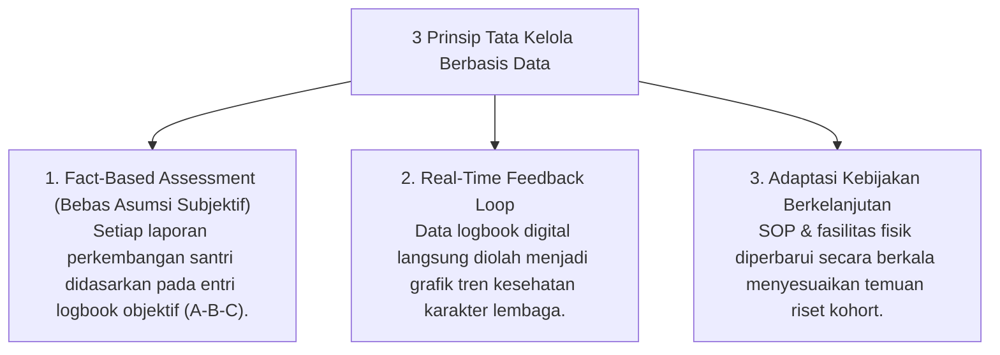

# P7-01-03: Prinsip Organisasi Pembelajar Berbasis Data PBIS

## Status Dokumen
* **Status**: 🌟 **A+ (Tervalidasi & Siap Diimplementasikan)**
* **Sub-Domain**: `07 Implementation Framework / 01 Governance`
* **Penanggung Jawab Keilmuan**: Dewan Keilmuan TUMBUH (*Pakar Metodologi Riset & Pakar Arsitektur Digital Pesantren*)

---

## 1. Operasionalisasi Data-Driven Learning Organization

Pesantren ekosistem **TUMBUH** beroperasi sebagai **Organisasi Pembelajar (*Learning Organization*)** di mana setiap keputusan manajemen pengasuhan diambil berdasarkan data faktual (*Data-Driven Decision Making*):

---

## 2. Penghapusan Pengambilan Keputusan Emosional

Pimpinan dan Musyrif dilarang mengambil keputusan pembinaan mendadak dalam kondisi emosional tinggi tanpa meninjau rekam data logbook dan rekomendasi Tim Terpadu BK.
