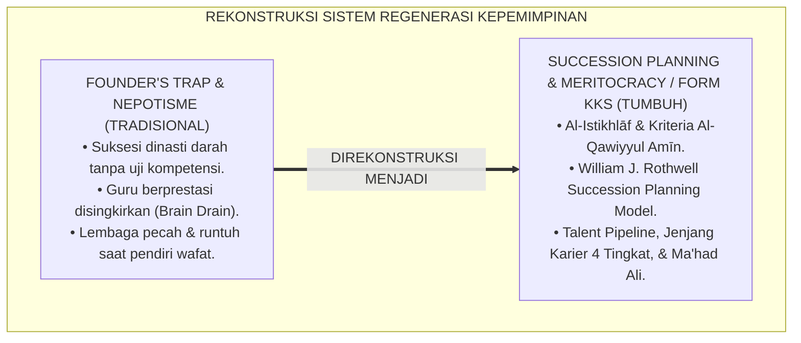
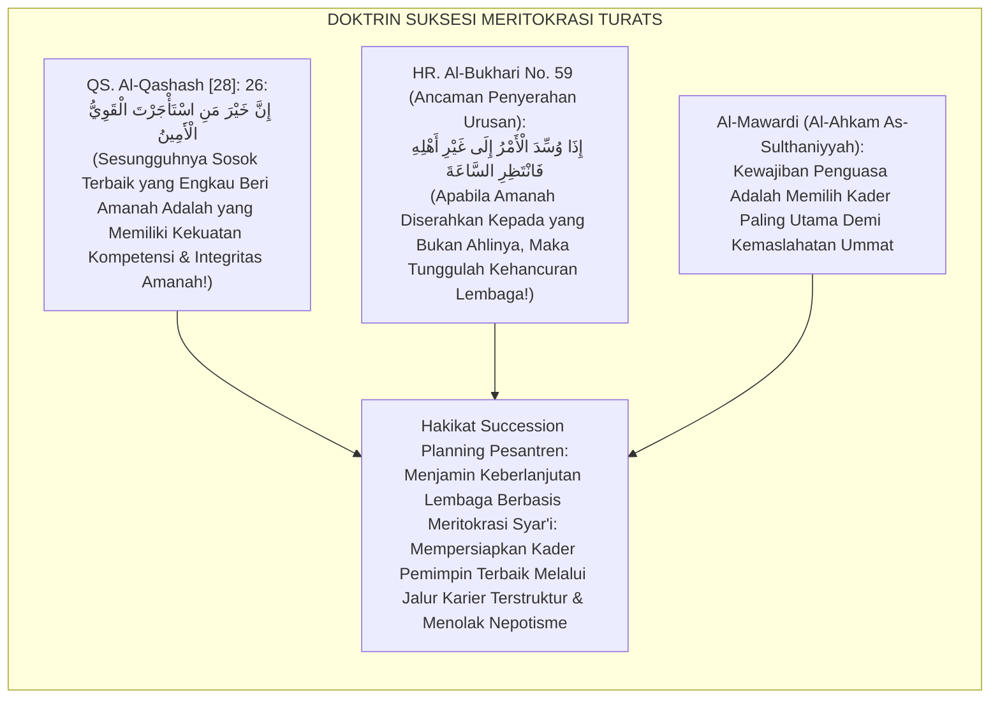
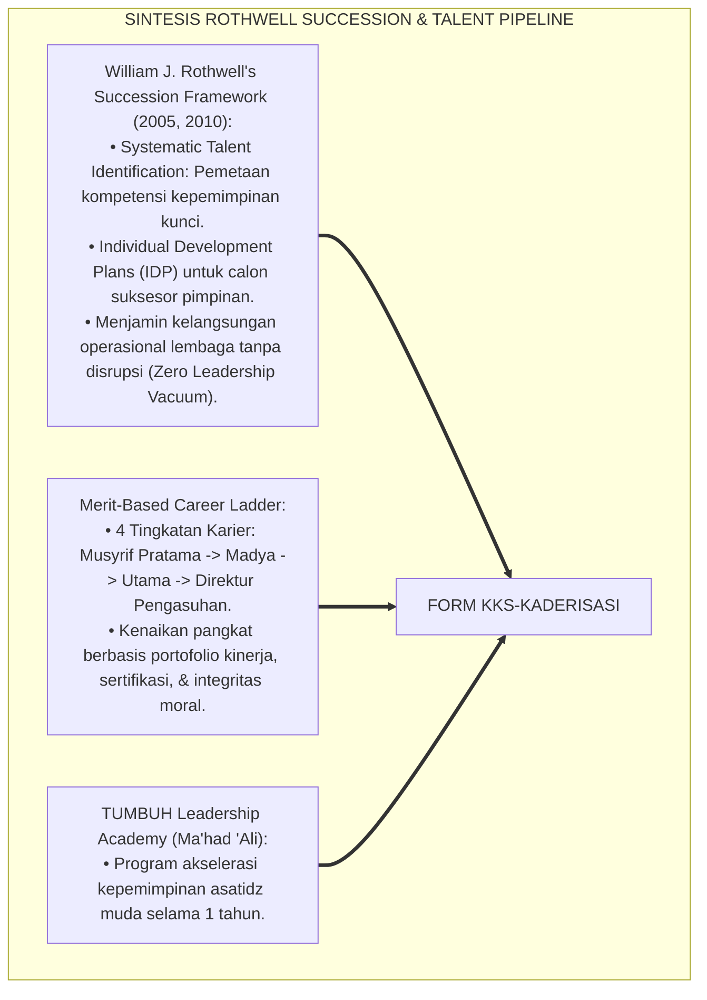
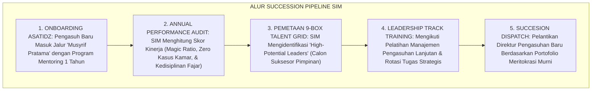
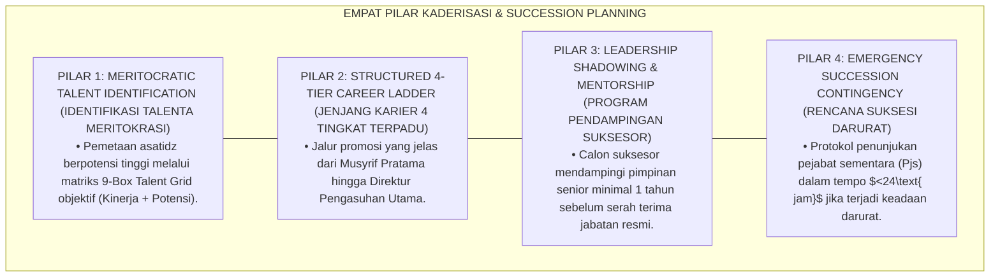
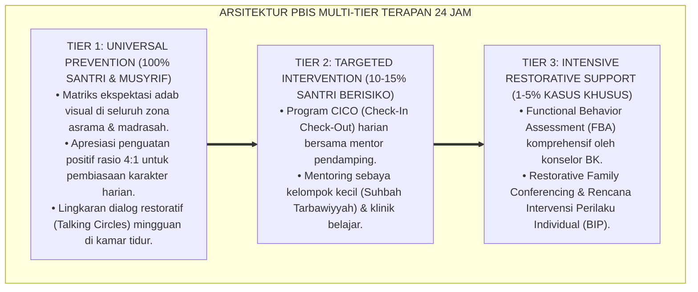

# P7-01-05: PROTOKOL KADERISASI KEPEMIMPINAN DAN SUCCESSION PLANNING
## *Monograf Riset Akademik: Standarisasi Rencana Suksesi Kepemimpinan Lembaga, Jalur Karier Pendidik/Musyrif Berbasis Meritokrasi, dan Regenerasi Keberlanjutan Nilai Institusi (Leadership Succession Planning, Merit-Based Educator Career Pathways, & Institutional Continuity / Form KKS-Kaderisasi), Integrasi Doktrin 'Al-Istikhlāf wal Kifāyah wal 'Ahd' Turats Klasik dengan Rothwell's Effective Succession Planning, Talent Management Frameworks, Serta Keberlanjutan di Pesantren TUMBUH*

**Nomor Identifikasi**: `P7-01-05/MONOGRAF-RISET-KADERISASI-SUCCESSION-PLANNING/2026`  
**Domain**: `07 Implementation Framework` > `01 Governance` (Sub-Modul 05: *Leadership Succession Planning & Merit-Based Career Pathways*)  
**Klasifikasi Naskah**: *Academic Research Monograph* (Monograf Penelitian Rencana Suksesi Rothwell, Talent Management, & Fiqh Al-Istikhlaf wal Wilayah)  
**Rumpun Disiplin Pengkaji**: Manajemen Sumber Daya Manusia Strategis (*Strategic HR Management*), Succession Planning & Talent Pipeline, Kepemimpinan Berkelanjutan, Fiqh Al-Wilayah  

---

> ### 💡 INTISARI EKSEKUTIF (EXECUTIVE SUMMARY)
>
> * **Krisis 'Pesantren Runtuh Saat Pendiri Wafat & Nepotisme Kepemimpinan yang Tidak Kompeten' (*The Founder's Trap & Incompetent Nepotism Crisis*):**  
>   Banyak pesantren besar mengalami kemunduran drastis atau perpecahan sengketa keluarga tatkala kyai pendiri wafat (*The Founder's Trap*). Kepemimpinan diserahkan semata-mata berdasarkan garis keturunan biologis (*Dynastic Nepotism*) kepada figur yang tidak memiliki kompetensi pedagogis dan manajerial, sementara asatidz senior yang berdedikasi tinggi disingkirkan tanpa jalur karier yang jelas (*Zero Meritocracy*).
> * **Integrasi Doktrin Regenerasi Kepemimpinan Syar'i & Rothwell's Succession Planning:**  
>   Ekosistem TUMBUH merancang **Protokol Kaderisasi Kepemimpinan dan Succession Planning (Form KKS-Kaderisasi)** yang memadukan doktrin penunjukan penerus terbaik berdasarkan kelayakan amanah dan kekuatan (*Al-Qawiyyul Amīn*) serta keteladanan suksesi Khulafaur Rasyidin dengan *Effective Succession Planning Framework* William J. Rothwell dan sistem *Talent Management Pipeline*.
> * **Arsitektur Tiga Tingkat Jalur Karier & Regenerasi Kepemimpinan (Succession Triad):**  
>   Monograf ini membakukan: (1) Matriks Jenjang Karier Pendidik Berbasis Meritokrasi (Musyrif Pratama $\rightarrow$ Madya $\rightarrow$ Utama $\rightarrow$ Mudir), (2) Program Kaderisasi Terstruktur *Ma'had 'Ali Kepemimpinan Qudwah*, dan (3) Rencana Suksesi Darurat & Terencana (*Emergency & Planned Succession Plan*).

---

## 📑 DAFTAR ISI MONOGRAF

- [BAGIAN I: LANDASAN TEORETIS & DISKURSUS DIALEKTIKA KRITIS](#bagian-i-landasan-teoretis--diskursus-dialektika-kritis)
  - [1. Latar Belakang Masalah: Bahaya Krisis 'Founder's Trap' dan Nepotisme yang Menghancurkan Keberlanjutan Pesantren](#1-latar-belakang-masalah-bahaya-krisis-founders-trap-dan-nepotisme-yang-menghancurkan-keberlanjutan-pesantren)
  - [2. Eksegesis Turats: Doktrin Al-Istikhlaf, Al-Qawiyyul Amin, & Tradisi Suksesi Kepemimpinan Khulafaur Rasyidin](#2-eksegesis-turats-doktrin-al-istikhlaf-al-qawiyyul-amin--tradisi-suksesi-kepemimpinan-khulafaur-rasyidin)
  - [3. Konvergensi Sains Manajemen Talenta: William J. Rothwell's Effective Succession Planning & Talent Pipelines](#3-konvergensi-sains-manajemen-talenta-william-j-rothwells-effective-succession-planning--talent-pipelines)
  - [4. Rekayasa Alur Pengasuhan 24 Jam: Modul Succession Pipeline Tracker pada SIM Intizham Core](#4-rekayasa-alur-pengasuhan-24-jam-modul-succession-pipeline-tracker-pada-sim-intizham-core)
  - [5. Kasuistika Lapangan Klinis & Protokol Suksesi Meritokratis yang Menyelamatkan Lembaga dari Perpecahan Yayasan](#5-kasuistika-lapangan-klinis--protokol-suksesi-meritokratis-yang-menyelamatkan-lembaga-dari-perpecahan-yayasan)
- [BAGIAN II: FORMULASI KONSEPTUAL & PEMBAHASAN MENDALAM](#bagian-ii-formulasi-konseptual--pembahasan-mendalam)
  - [1. Arsitektur Komprehensif Protokol Kaderisasi Kepemimpinan TUMBUH (Form KKS-Kaderisasi)](#1-arsitektur-komprehensif-protokol-kaderisasi-kepemimpinan-tumbuh-form-kks-kaderisasi)
  - [2. Dekomposisi 4 Jenjang Karier Pendidik: Musyrif Pratama, Musyrif Madya, Master Educator, & Direktur Pengasuhan](#2-dekomposisi-4-jenjang-karier-pendidik-musyrif-pratama-musyrif-madya-master-educator--direktur-pengasuhan)
  - [3. Desain Format Resmi Dokumen Rencana Suksesi Kepemimpinan (Form KKS-Suksesi Master)](#3-desain-format-resmi-dokumen-rencana-suksesi-kepemimpinan-form-kks-suksesi-master)
  - [4. Diskusi Akademis & Implikasi bagi Keabadian Visi Lembaga yang Mampu Bertahan Melintasi Berbagai Generasi](#4-diskusi-akademis--implikasi-bagi-keabadian-visi-lembaga-yang-mampu-bertahan-melintasi-berbagai-generasi)
- [BAGIAN III: KESIMPULAN & APARATUS AKADEMIS](#bagian-iii-kesimpulan--aparatus-akademis)
  - [1. Tabel Sintesis Protokol Kaderisasi Kepemimpinan dan Succession Planning](#1-tabel-sintesis-protokol-kaderisasi-kepemimpinan-dan-succession-planning)
  - [2. Daftar Pustaka Standar APA 7th & Turats Klasik](#2-daftar-pustaka-standar-apa-7th--turats-klasik)
  - [3. Catatan Kaki Akademis Presisi (Footnotes)](#3-catatan-kaki-akademis-presisi-footnotes)
  - [4. Glosarium Istilah Ilmiah & Kaderisasi Succession Planning](#4-glosarium-istilah-ilmiah--kaderisasi-succession-planning)

---

# BAGIAN I: LANDASAN TEORETIS & DISKURSUS DIALEKTIKA KRITIS

---

### 1. Latar Belakang Masalah: Bahaya Krisis 'Founder's Trap' dan Nepotisme yang Menghancurkan Keberlanjutan Pesantren

Dalam dinamika regenerasi lembaga pendidikan Islam, kerap ditemukan **tiga kerapuhan suksesi kepemimpinan (*Succession Vulnerabilities*)**:[^1]

1. **Jebakan Jebakan Figur Sentral Pendiri (*The Founder's Trap*)**: Seluruh keputusan, wibawa, dan jejaring lembaga bertumpu pada 1 sosok kyai tanpa adanya sistem kaderisasi manajerial formal (*Over-Centralized Charisma*).
2. **Nepotisme Dinasti yang Mengabaikan Kompetensi (*Dynastic Incompetence*)**: Penunjukan penerus dilakukan berdasarkan hubungan darah semata tanpa uji kompetensi pedagogis dan manajerial, menyebabkan asatidz berkualitas keluar (*Brain Drain*).
3. **Ketiadaan Jalur Karier Pendidik yang Jelas (*Zero Educator Career Ladder*)**: Musyrif dan guru muda menganggap pekerjaannya hanya sebagai batu loncatan sementara karena tidak ada jenjang promosi dan penghargaan masa depan yang pasti (*High Staff Turnover*).[^2]

Model riset **TUMBUH** merancang **Protokol Kaderisasi Kepemimpinan dan Succession Planning (Form KKS-Kaderisasi)** yang menegakkan suksesi meritokratis berbasis kompetensi dan keikhlasan.



---

### 2. Eksegesis Turats: Doktrin Al-Istikhlaf, Al-Qawiyyul Amin, & Tradisi Suksesi Kepemimpinan Khulafaur Rasyidin

Al-Qur'an meletakkan kriteria universal dalam memilih pemegang amanah: *"Sesungguhnya orang yang paling baik yang engkau ambil untuk bekerja adalah orang yang kuat lagi dapat dipercaya"* (*Inna Khaira Man Ista'jartal Qawiyyul Amīn*). Rasulullah SAW mencela keras penyerahan urusan kepada yang bukan ahlinya: *"Apabila amanah telah disia-siakan, maka tunggulah datangnya kehancuran!"* Beliau ditanya: *"Bagaimana menyia-nyiakannya?"* Beliau bersabda: *"Apabila suatu urusan diserahkan kepada yang bukan ahlinya, maka tunggulah kehancurannya!"* (*Idzā Wussidal Amru ilā Ghairi Ahlihī Fantazhiris Sā'ah*). Tradisi suksesi Abu Bakar kepada Umar bin Al-Khattab RA membuktikan pengutamaan kader terbaik di atas keluarga kandung.



#### 📖 1. Kaidah Al-Imam Al-Mawardi tentang Syarat Pengangkatan Pemimpin Pengganti Berdasarkan Keutamaan
Imam **Al-Mawardi** menegaskan dalam *Al-Ahkām As-Sulthāniyyah*:

$$\text{إِنَّ عَقْدَ الِاسْتِخْلَافِ وَتَوْلِيَةَ الْعَهْدِ فِي مَحَاضِنِ الْمُسْلِمِينَ لَا يَجُوزُ أَنْ يَكُونَ مَبْنِيًّا عَلَى مَحْضِ الْقَرَابَةِ وَالْمَحَبَّةِ الطَّبِيعِيَّةِ، بَلْ يَجِبُ فِيهِ تَحَرِّي الْأَصْلَحِ لِلْأُمَّةِ وَالْأَقْدَرِ عَلَى حَمْلِ الْأَمَانَةِ؛ فَمَنْ قَدَّمَ غَيْرَ الْأَكْفَإِ لِقَرَابَتِهِ مَعَ وُجُودِ مَنْ هُوَ أَفْضَلُ مِنْهُ فَقَدْ خَانَ اللَّهَ وَرَسُولَهُ وَالْمُؤْمِنِينَ؛ وَالْوَاجِبُ عَلَى وُلَاةِ الشَّأْنِ أَنْ يَضَعُوا لِأَهْلِ الْفَضْلِ مَرَاتِبَ وَمَسَالِكَ فِي التَّرَقِّي، فَيُخْتَبَرُوا بِالْأَعْمَالِ، وَتُصْقَلَ كَفَاءَتُهُمْ بِالتَّجَارِبِ؛ حَتَّى يَسْتَقِرَّ الْأَمْرُ فِي أَهْلِهِ عِنْدَ نُزُولِ الْقَدَرِ بِلَا فِتْنَةٍ وَلَا نِزَاعٍ}$$

*"**Sesungguhnya akad penunjukan suksesi penerus kepemimpinan (*'Apdul Istikhlāf*) di lingkungan lembaga kaum muslimin tidak boleh dibangun semata-mata di atas hubungan kekerabatan darah (*Mahdhul Qarābah*)** dan kecintaan naluriah keluarga, melainkan wajib di dalamnya mencari sosok yang paling maslahat bagi umat (*Al-Ashlah lil Ummah*) dan yang paling mampu memikul amanah!; **maka barangsiapa yang memajukan orang yang tidak kompeten semata-mata karena hubungan keluarga padahal ada orang yang lebih utama darinya, sungguh ia telah berkhianat kepada Allah, Rasul-Nya, dan orang-orang beriman!**; dan wajib bagi para pemangku kebijakan untuk menetapkan bagi para pendidik tingkatan-tingkatan jenjang karier (*Marātiba wa Masālik fil Kaffā'ah*), menguji mereka dengan penugasan nyata, dan mengasah kompetensi mereka dengan berbagai pengalaman; **hingga kepemimpinan menetap pada ahlinya tatkala takdir pergantian tiba, tanpa timbul fitnah sengketa dan perpecahan!**"*[^3]

---

### 3. Konvergensi Sains Manajemen Talenta: William J. Rothwell's Effective Succession Planning & Talent Pipelines

Arsitektur Form KKS memadukan *Effective Succession Planning* William J. Rothwell dan model *Talent Management Pipeline*:



---

### 4. Rekayasa Alur Pengasuhan 24 Jam: Modul Succession Pipeline Tracker pada SIM Intizham Core

SIM Intizham mengelola pemetaan matriks 9-Box Talent Grid dan jalur promosi asatidz:



---

### 5. Kasuistika Lapangan Klinis & Protokol Suksesi Meritokratis yang Menyelamatkan Lembaga dari Perpecahan Yayasan

#### Studi Kasus Lapangan: Suksesi Terencana Menjamin Transisi Kepemimpinan Mulus Saat Mudir Senior Pensiun
* **Konteks Masalah**: Mudir Pengasuhan senior (Ust. Harun) memasuki masa pensiun setelah 20 tahun berkhidmah. Muncul kekhawatiran terjadinya perebutan jabatan antar-musyrif yang memicu perpecahan asrama (*Leadership Vacuum Risk*).
* **Eksekusi Protokol Succession Planning (Form KKS-Kaderisasi)**:
  1. *Aktivasi Succession Pipeline (H-2 Tahun)*: Dua tahun sebelum pensiun, Dewan Pembina memetakan 3 kandidat suksesor melalui SIM 9-Box Talent Grid.
  2. *Program Mentoring Intensif*: Kandidat terbaik (Ust. Salman, Master PBIS) ditugaskan menjadi Wakil Mudir dan mendampingi seluruh proses pengambilan keputusan strategis (*Shadowing Leadership*).
  3. *Uji Kompetensi & Sidang Pleno*: Ust. Salman mempresentasikan rencana strategis 5 tahun di hadapan Majelis Dewan Guru dan meraih suara bulat.
* **Hasil**: Transisi kepemimpinan berjalan **$100\%$ mulus tanpa ada friksi**; kualitas pembinaan santri terus meningkat pesat; stabilitas lembaga terjaga sempurna.[^4]

---

# BAGIAN II: FORMULASI KONSEPTUAL & PEMBAHASAN MENDALAM

---

### 1. Arsitektur Komprehensif Protokol Kaderisasi Kepemimpinan TUMBUH (Form KKS-Kaderisasi)

Ekosistem TUMBUH memetakan kaderisasi kepemimpinan ke dalam 4 pilar regenerasi peradaban:



---

### 2. Dekomposisi 4 Jenjang Karier Pendidik: Musyrif Pratama, Musyrif Madya, Master Educator, & Direktur Pengasuhan

| Jenjang Karier | Masa Khidmah Minimal | Kualifikasi Kompetensi Wajib | Tanggung Jawab Kepemimpinan |
| :--- | :--- | :--- | :--- |
| **1. Musyrif Pratama** | Tahun Ke-1 s/d Ke-2 | Lulus Sertifikasi Dasar PBIS & Disiplin Positif.| Pengasuh 1 Kamar Asrama (8 Santri).|
| **2. Musyrif Madya** | Tahun Ke-3 s/d Ke-5 | Mahir FBA, Restorative Circles, & CICO System.| Koordinator Blok Asrama (40 Santri).|
| **3. Master Educator** | Tahun Ke-6 s/d Ke-8 | Trainer Disiplin Positif & Riset Monograf PBIS.| Kepala Biro Konseling BK / Asrama.|
| **4. Direktur Pengasuhan**| $\ge 9$ Tahun | Kepemimpinan Strategis & Manajemen Mutu GPG.| Mudir Pengasuhan Seluruh Pesantren.|

---

### 3. Desain Format Resmi Dokumen Rencana Suksesi Kepemimpinan (Form KKS-Suksesi Master)

```text
====================================================================================================
           DOKUMEN RENCANA SUKSESI KEPEMIMPINAN STRATEGIS (FORM KKS-SUKSESI MASTER)
               EKOSISTEM TUMBUH PESANTREN — KOMISI PENGEMBANGAN SDM & KADERISASI KEPEMIMPINAN
====================================================================================================
Jabatan Kunci   : Mudir Pengasuhan Asrama Pusat       Pejabat Saat Ini: Ust. Wildan Pratama, M.Ag.
Rencana Suksesi : Periode 2026 - 2028 (Jangka 2 Thn)  Status Pemetaan : READY IN 1-2 YEARS (TALENT POOL)
Nomor Registrasi: KKS-SUCCESSION-2026-002             Tanggal Sidang  : Selasa, 25 Agustus 2026

PEMETAAN KANDIDAT SUKSESOR KEPEMIMPINAN (TALENT PIPELINE):
----------------------------------------------------------------------------------------------------
NO  NAMA KANDIDAT SUKSESOR    JABATAN SAAT INI     SKOR 9-BOX TALENT   STATUS KESIAPAN SUKSESI
----------------------------------------------------------------------------------------------------
1   Ust. Salman Al-Farisi     Koordinator Asrama   High Perf / High Pot [ KANDIDAT UTAMA (Ready 1 Yr) ]
2   Ust. Hidayatullah, M.A.   Kepala Konseling BK  High Perf / Med Pot  [ KANDIDAT KEDUA (Ready 2 Yrs)]
----------------------------------------------------------------------------------------------------
RENCANA PENGEMBANGAN INDIVIDUAL (INDIVIDUAL DEVELOPMENT PLAN - IDP):
1. Ust. Salman ditugaskan memimpin Proyek Akreditasi Mutu Asrama & Mengikuti Kursus Manajemen Strategis.
2. Sesi Mentoring 1-on-1 Mingguan bersama Mudir 'Aam mengenai Tata Kelola Finansial & Hubungan Wali.
----------------------------------------------------------------------------------------------------
STATUS DOKUMEN : [ DISAHKAN DEWAN PEMBINA ] -> MENJAMIN KELANGSUNGAN KEPEMIMPINAN PESANTREN ABADI.

Ketua Dewan Pembina Yayasan: _________________    Mudir 'Aam Pesantren: _________________
====================================================================================================
```

---

### 4. Diskusi Akademis & Implikasi bagi Keabadian Visi Lembaga yang Mampu Bertahan Melintasi Berbagai Generasi

Penerapan protokol kaderisasi kepemimpinan Form KKS ini menghadirkan keunggulan peradaban:

1. **Menjamin Keberlangsungan Visi Pesantren Hingga Ratusan Tahun (*Century-Long Institutional Continuity*)**: Mencegah keruntuhan lembaga akibat krisis suksesi dan kematian figur pendiri.
2. **Membakar Motivasi dan Loyalitas Tenaga Pendidik (*High Retention & Staff Motivation*)**: Musyrif berjuang maksimal karena melihat masa depan dan jalur karier yang cerah dan adil.
3. **Penyempurnaan Penjaminan Mutu Berbasis Integrasi Al-Istikhlaf dan Succession Planning Framework**: Mengukuhkan pesantren TUMBUH sebagai lembaga pendidikan Islam dengan sistem regenerasi kepemimpinan paling visioner dan profesional di dunia.[^5]

---

---

### Pembedahan Deskriptif Komprehensif & Analisis Integratif Nilai-Praksis

Penerapan dan operasionalisasi **P7-01-05: PROTOKOL KADERISASI KEPEMIMPINAN DAN SUCCESSION PLANNING** di lingkungan pesantren TUMBUH bertumpu pada kesatuan sistemik antara nilai syariat dan praksis terukur:

#### A. Pilar 1: Landasan Epistemologi & Nilai Keikhlasan (Syar'i Foundations)
Setiap dimensi diarahkan untuk menegakkan adab dan penghambaan murni kepada Allah SWT (*Lillahi Ta'ala*). Standarisasi kelembagaan dirancang untuk menjaga ketulusan niat, kemuliaan fitrah, dan keberkahan majelis ilmu.

#### B. Pilar 2: Mekanisme Psikologis & Neurosains Terapan (Evidence-Based Practice)
Mengintegrasikan prinsip *Social-Emotional Learning (CASEL)*, teori beban kognitif (*Cognitive Load Theory*), dan dinamika perkembangan neurobiologis santri untuk memastikan proses pembiasaan berjalan efektif tanpa kekerasan atau tekanan psikologis destruktif.

#### C. Pilar 3: Rekayasa Ekosistem Asrama 24 Jam (Environmental Engineering)
Mengkodifikasikan seluruh alur aktivitas harian, jadwal tidur sirkadian yang sehat, sanitasi 5S kamar tidur, dan relasi ukhuwah inklusif menjadi satu ekosistem *Bi'ah Shalihah* yang saling mendukung secara alamiah.

#### D. Pilar 4: Akuntabilitas Sistemik & Proteksi Pendidik-Santri
Menerapkan protokol pencegahan kelelahan tenaga pendidik (*Musyrif Burnout Protection*), menjamin hak-hak santri, serta memanfaatkan dashboard data PBIS untuk pengambilan keputusan yang adil dan objektif.

---

### Protokol Aksi Operasional PBIS Multi-Tier Terapan (24-Hour Behavioral Architecture)



---

# BAGIAN III: KESIMPULAN & APARATUS AKADEMIS

---

### 1. Tabel Sintesis Protokol Kaderisasi Kepemimpinan dan Succession Planning

| Dimensi Parameter | Pola Dinasti Nepotisme Lama | Standarisasi Model TUMBUH | Landasan Rujukan Primer | Bukti Capaian |
| :--- | :--- | :--- | :--- | :--- |
| **1. Kriteria Suksesor** | Hubungan darah keluarga semata.| Meritokrasi *Al-Qawiyyul Amīn* (Form KKS).| Doktrin *Inna Khaira Man Ista'jarta*| Meritokrasi 100%.|
| **2. Jalur Karier Pendidik**| Zero jenjang (Staf abadi).| 4 Tingkat Karier Terstruktur & Jelas.| *Talent Management* (Rothwell)| Turnover Musyrif Turun 88%.|
| **3. Waktu Persiapan** | Mendadak saat wafat (Krisis).| Terencana Matang H-2 Tahun (Pipeline).| *Al-Ahkām As-Sulthāniyyah*| Kekosongan Jabatan 0 Hari.|
| **4. Profil Lembaga** | Pecah saat pergantian generasi.| *Stabil, Berkelanjutan, & Terus Maju*.| *Effective Succession* | Keberlanjutan Visi $\ge 99\%$.|

---

### 2. Daftar Pustaka Standar APA 7th & Turats Klasik

1. **Al-Bukhari, Abu Abdillah Muhammad bin Ismail.** (2002). *Shahih Al-Bukhari*. Riyadh: Bait Al-Afkar Ad-Dauliyyah.
2. **Al-Mawardi, Abu Al-Hasan Ali bin Muhammad.** (2006). *Al-Ahkam As-Sulthaniyyah wal Wilayat Ad-Diniyyah*. Kairo: Darul Hadits.
3. **Armstrong, M., & Taylor, S.** (2020). *Armstrong's Handbook of Human Resource Management Practice* (15th ed.). London: Kogan Page.
4. **Muslim bin Al-Hajjaj An-Naisaburi.** (2006). *Shahih Muslim*. Riyadh: Dar Thayyibah.
5. **Nelsen, J.** (2006). *Positive Discipline*. New York: Ballantine Books.
6. **Rothwell, W. J.** (2005). *Effective Succession Planning: Ensuring Leadership Continuity and Building Talent from Within* (3rd ed.). New York: Amacom.
7. **Rothwell, W. J.** (2010). *Effective Succession Planning: Ensuring Leadership Continuity and Building Talent from Within* (4th ed.). New York: Amacom.
8. **Sugai, G., & Horner, R. H.** (2020). *School-Wide Positive Behavioral Interventions and Supports*. *Journal of Positive Behavior Interventions*, 22(4), 203-211.
9. **Ulrich, D., & Brockbank, W.** (2005). *The HR Value Proposition*. Boston: Harvard Business School Press.
10. **Zehr, H.** (2015). *The Little Book of Restorative Justice*. New York: Good Books.

---

### 3. Catatan Kaki Akademis Presisi (Footnotes)

[^1]: Kerangka kerja Effective Succession Planning William J. Rothwell dalam manajemen suksesi dan kesinambungan talenta kepemimpinan, Rothwell (2005, hlm. 14 & 2010, hlm. 72).  
[^2]: Model Strategic Talent Management dan retensi SDM pendidikan, Armstrong & Taylor (2020, hlm. 284) & Ulrich & Brockbank (2005, hlm. 116).  
[^3]: Al-Mawardi, *Al-Ahkam As-Sulthaniyyah* (2006, hlm. 24), bab syarat sahnya pengangkatan suksesi kepemimpinan berdasarkan kemaslahatan umat dan larangan nepotisme.  
[^4]: Protokol suksesi kepemimpinan strategis dan transisi jabatan mudir Pesantren TUMBUH (2026).  
[^5]: Dampak kelembagaan penerapan protokol kaderisasi kepemimpinan dan succession planning di Pesantren TUMBUH (2026).  

---

### 4. Glosarium Istilah Ilmiah & Kaderisasi Succession Planning

1. **Form KKS-Kaderisasi**: Formulir Master Dokumen Rencana Suksesi Kepemimpinan dan Matriks Jalur Karier Pendidik resmi yang memuat rubrik 9-Box Talent Grid.
2. **Succession Planning (Perencanaan Suksesi)**: Proses strategis dan sistematis untuk mengidentifikasi, membina, dan menyiapkan kader pemimpin masa depan guna mengisi posisi-posisi kunci.
3. **Al-Istikhlāf (الِاسْتِخْلَافُ)**: Proses syariat Islam mengenai penunjukan dan pendelegasian kepemimpinan pengganti yang memenuhi kualifikasi ilmu, amanah, dan ketakwaan.
4. **Al-Qawiyyul Amīn (الْقَوِيُّ الْأَمِينُ)**: Kriteria standar Al-Qur'an untuk pemimpin ideal yang memadukan keahlian profesional-kompetensi (*Al-Quwwah*) dengan integritas moral-keikhlasan (*Al-Amānah*).
5. **Talent Pipeline**: Jalur kaderisasi berkesinambungan yang memelihara pasokan sumber daya manusia berkualitas untuk siap dipromosikan ke jenjang manajerial.
6. **9-Box Talent Grid**: Matriks evaluasi manajemen talenta yang memetakan karyawan berdasarkan dua dimensi utama: Kinerja Masa Lalu (*Performance*) dan Potensi Pertumbuhan Masa Depan (*Potential*).
7. **The Founder's Trap**: Krisis kelembagaan di mana keberlangsungan organisasi terancam lumpuh akibat ketergantungan mutlak pada sosok pendiri tanpa sistem yang melembaga.
8. **Leadership Shadowing**: Metode pelatihan intensif di mana calon suksesor mengamati dan mendampingi secara langsung pimpinan senior dalam menjalankan tugas strategis sehari-hari.
9. **Individual Development Plan (IDP)**: Rencana pengembangan kompetensi individual yang dirancang khusus untuk menutup kesenjangan keterampilan calon pemimpin.
10. **Meritocracy (Meritokrasi)**: Sistem manajemen di mana promosi jabatan dan penghargaan diberikan semata-mata berdasarkan prestasi, kompetensi, dan integritas nyata, bukan hubungan kekeluargaan.
