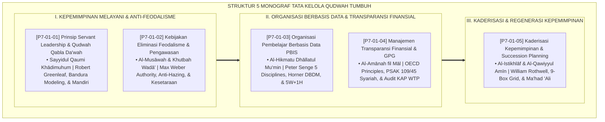

# P7-01: DOKUMEN INDUK TATA KELOLA LEMBAGA DAN KEPEMIMPINAN QUDWAH
## *Arsitektur dan Rekayasa Tata Kelola Lembaga Terpadu, Kepemimpinan Melayani (Servant Leadership), Regulasi Eliminasi Feodalisme Asrama, Organisasi Pembelajar Berbasis Data PBIS, Transparansi Finansial GPG, Serta Perencanaan Suksesi Kaderisasi (Servant Leader Form PSL, Anti-Feudalism Form KEF, Learning Org Form OPB, Financial Governance Form MTF, Serta Succession Planning Form KKS) di Ekosistem TUMBUH Pesantren*

**Nomor Identifikasi**: `P7-01/DOKUMEN-INDUK-TATA-KELOLA-QUDWAH/2026`  
**Domain**: `07 Implementation Framework` > `01 Governance` (Gugus Sub-Domain 01: *Comprehensive Institutional Governance, Servant Leadership, & Anti-Feudalism Framework*)  
**Klasifikasi Naskah**: *Master Architecture & Navigation Monograph* (Dokumen Induk Peta Jalan Riset & Navigasi 5 Monograf Ilmiah Tata Kelola Lembaga dan Kepemimpinan Qudwah)  
**Rumpun Disiplin Pengkaji**: Tata Kelola Lembaga Pendidikan Islam (*Islamic Educational Governance*), Kepemimpinan Melayani (*Servant Leadership*), Good Pesantren Governance (GPG), Fiqh Al-Imamah wal Hisbah  

---

> ### 💡 INTISARI EKSEKUTIF (EXECUTIVE SUMMARY)
>
> * **Kedudukan Strategis Gugus Tata Kelola Lembaga dan Kepemimpinan Qudwah:**  
>   Gugus *Governance (Tata Kelola Lembaga dan Kepemimpinan Qudwah)* merupakan fondasi kedaulatan moral, integritas manajerial, dan keadilan sistemik (*The Institutional Sovereignty & Moral Governance Foundation*) dalam Domain 07 (`07 Implementation Framework`). Gugus ini merombak total struktur kekuasaan feodal dan otoriter menjadi sistem kepemimpinan yang melayani, meritokratis, berbasis data analitik, dan bersih dari korupsi: **Servant Leadership & Qudwah (Form PSL)**, **Kebijakan Eliminasi Feodalisme (Form KEF)**, **Organisasi Pembelajar Data PBIS (Form OPB)**, **Transparansi Finansial GPG (Form MTF)**, dan **Kaderisasi & Succession Planning (Form KKS)**.
> * **Integrasi Holistik Turats & Konsensus Sains Tata Kelola Modern:**  
>   Gugus riset ini memadukan khazanah agung Islam tentang pemimpin pelayan kaum (*Sayyidul Qaumi Khādimuhum*), kesetaraan derajat manusia (*Al-Musāwah fil Islām*), pencarian hikmah kebenaran (*Al-Hikmatu Dhāllatul Mu'min*), amanah harta umat (*Al-Amānah fil Māl*), dan suksesi meritokrasi (*Al-Qawiyyul Amīn*) dengan konsensus sains dunia (*Greenleaf Servant Leadership, Bandura Behavioral Modeling, Weber Authority Sociology, Senge Learning Organization, Horner-Sugai DBDM, OECD Corporate Governance, PSAK 109/45, dan Rothwell Succession Planning*).
> * **Struktur Lengkap 5 Berkas Monograf Riset Ilmiah:**  
>   Dokumen induk ini memetakan dan menghubungkan 5 berkas monograf penelitian akademik komprehensif (~150 KB total riset) yang menyajikan pakta kepemimpinan shaf terdepan fajar, regulasi nol perpeloncoan cuci baju, dasbor analitik presisi 5W+1H, laporan keuangan publik WTP, dan matriks 9-box talent grid kaderisasi asatidz.

---

## 📑 PETA NAVIGASI LIMA MONOGRAF RISET TATA KELOLA LEMBAGA

Berikut adalah daftar lengkap 5 monograf riset akademik dalam gugus **`01 Governance`**:

---

## 📚 DESKRIPSI RINGKAS 5 BERKAS MONOGRAF

1. **[P7-01-01: Prinsip Servant Leadership dan Qudwah Qabla ad-Da'wah](file:///c:/xampp/htdocs/tumbuh/07%20Implementation%20Framework/01%20Governance/P7-01-01-Prinsip-Servant-Leadership-dan-Qudwah-Qabla-ad-Dawah.md)**  
   *Membahas kepemimpinan yang melayani dan keteladanan amal mendahului perintah lisan, doktrin Sayyidul Qaumi Khadimuhum & Qudwah Qabla Da'wah, Robert K. Greenleaf, Albert Bandura, dan form Form PSL-ServantLeader.*
2. **[P7-01-02: Kebijakan Eliminasi Feodalisme dan Pengawasan Internal](file:///c:/xampp/htdocs/tumbuh/07%20Implementation%20Framework/01%20Governance/P7-01-02-Kebijakan-Eliminasi-Feodalisme-dan-Pengawasan-Internal.md)**  
   *Membahas penghapusan sistem kasta senioritas dan perbudakan domestik di asrama, doktrin Al-Musawah & Khutbah Wada', Max Weber Traditional Domination, Anti-Hazing Laws, dan form Form KEF-Feodalisme.*
3. **[P7-01-03: Prinsip Organisasi Pembelajar Berbasis Data PBIS](file:///c:/xampp/htdocs/tumbuh/07%20Implementation%20Framework/01%20Governance/P7-01-03-Prinsip-Organisasi-Pembelajar-Berbasis-Data-PBIS.md)**  
   *Membahas pengambilan keputusan institusional berbasis analitik data perilaku 5W+1H, doktrin Al-Hikmatu Dhallatul Mu'min & Al-Itqan, Peter Senge The Fifth Discipline, Horner & Sugai DBDM, dan form Form OPB-Organisasi.*
4. **[P7-01-04: Manajemen Transparansi Finansial dan Good Pesantren Governance](file:///c:/xampp/htdocs/tumbuh/07%20Implementation%20Framework/01%20Governance/P7-01-04-Manajemen-Transparansi-Finansial-dan-Good-Pesantren-Governance.md)**  
   *Membahas tata kelola keuangan akuntabel, pemisahan rekening yayasan, dan audit eksternal, doktrin Al-Amanah fil Mal & Kaidah Baitul Mal, OECD Corporate Governance, PSAK 109/45, dan form Form MTF-Governance.*
5. **[P7-01-05: Protokol Kaderisasi Kepemimpinan dan Succession Planning](file:///c:/xampp/htdocs/tumbuh/07%20Implementation%20Framework/01%20Governance/P7-01-05-Protokol-Kaderisasi-Kepemimpinan-dan-Succession-Planning.md)**  
   *Membahas rencana suksesi kepemimpinan terencana dan jalur karier pendidik meritokratis, doktrin Al-Istikhlaf & Al-Qawiyyul Amin, William J. Rothwell Succession Planning, 9-Box Talent Grid, dan form Form KKS-Kaderisasi.*

---

## 🎯 STANDAR PENJAMINAN MUTU TATA KELOLA LEMBAGA

Penerapan gugus **Tata Kelola Lembaga dan Kepemimpinan Qudwah (Governance)** menjamin bahwa:
1. **Kepemimpinan Berakar pada Keteladanan Nyata dan Pelayanan Penuh Kasih Sayang (*Authentic Servant Governance*)**: Menghapus arogansi kekuasaan dan menghadirkan pemimpin yang dicintai seluruh warga pesantren.
2. **Kasta Senioritas dan Budaya Perpeloncoan Dihapuskan Secara Mutlak (*Total Feudalism Eradication*)**: Seluruh santri menikmati hak kemerdekaan jiwa, kesetaraan perlakuan, dan rasa aman 24 jam.
3. **Lembaga Beroperasi dengan Efisiensi Data, Transparansi Keuangan WTP, dan Keabadian Visi Melintasi Generasi (*Sustainable World-Class Institution*)**: Menjamin ekosistem pesantren berbasis TUMBUH menjadi model percontohan tata kelola pendidikan Islam modern terbaik di dunia.
