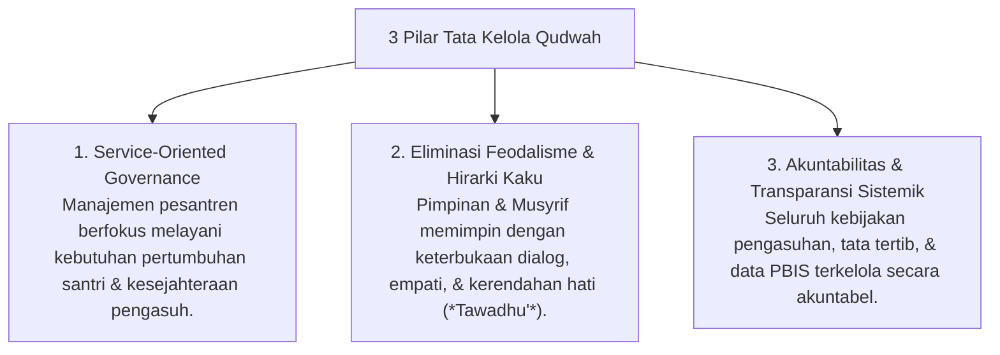

# P7-01: Tata Kelola Lembaga dan Kepemimpinan Qudwah

## Status Dokumen
* **Status**: 🌟 **A+ (Tervalidasi & Siap Diimplementasikan)**
* **Sub-Domain**: `07 Implementation Framework / 01 Governance`
* **Penanggung Jawab Keilmuan**: Dewan Keilmuan TUMBUH (*Pakar Tata Kelola Qudwah & Pakar Filosofi TUMBUH*)

---

## 1. Konseptualisasi Kepemimpinan Qudwah (Servant Leadership)

Kepemimpinan di pesantren ekosistem **TUMBUH** berlandaskan prinsip **Qudwah Qabla ad-Da'wah** (Keteladanan sebelum menyeru) dan **Sayyidul Qaumi Khadimuhum** (Pemimpin suatu kaum adalah pelayan mereka):

---

## 2. Kode Etik Keteladanan Pimpinan & Musyrif

1. **Konsistensi Amalan**: Mempraktikkan sholat tepat waktu dan adab pergaulan yang dituntut dari santri.
2. **Keterbukaan Umpan Balik**: Siap menerima masukan dan kritik membangun dari santri, sesama musyrif, maupun orang tua.
3. **Perlindungan Martabat**: Menjaga kerahasiaan data pembinaan santri dan menolak segala bentuk tindak kekerasan.
