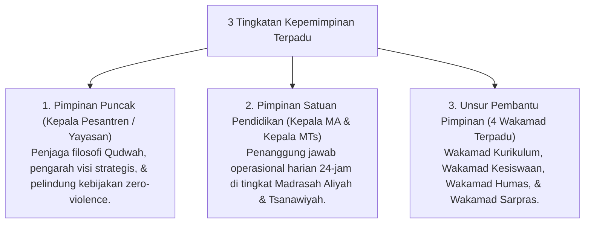

# P7-02-01: Struktur Hierarki Terpadu Kepala Pesantren MA dan MTs

## Status Dokumen
* **Status**: 🌟 **A+ (Tervalidasi & Siap Diimplementasikan)**
* **Sub-Domain**: `07 Implementation Framework / 02 Organizational Structure`
* **Penanggung Jawab Keilmuan**: Dewan Keilmuan TUMBUH (*Pakar Tata Kelola Qudwah & Pakar Pedagogi Master Guru*)

---

## 1. Operasionalisasi Hierarki Kepemimpinan Terpadu

Sistem tata kelola **TUMBUH** menghapuskan dikotomi struktural antara pengasuhan asrama dan madrasah formal melalui satu garis komando terpadu:

---

## 2. Keunggulan Sistem Terpadu 24-Jam

Dengan struktur terpadu, tidak ada lagi gesekan wewenang atau perdebatan "tugas asrama vs tugas madrasah", karena seluruh ustadz dan musyrif bekerja dalam satu sistem koordinasi yang padu.
