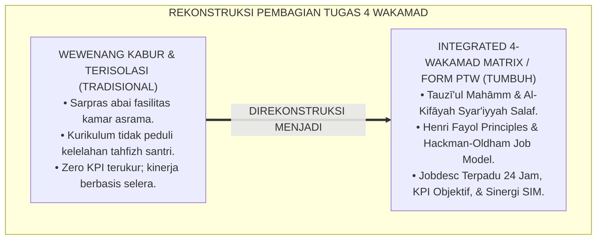
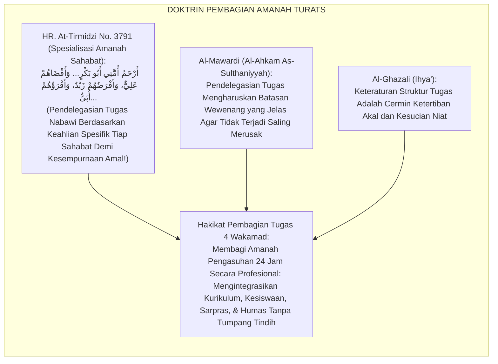
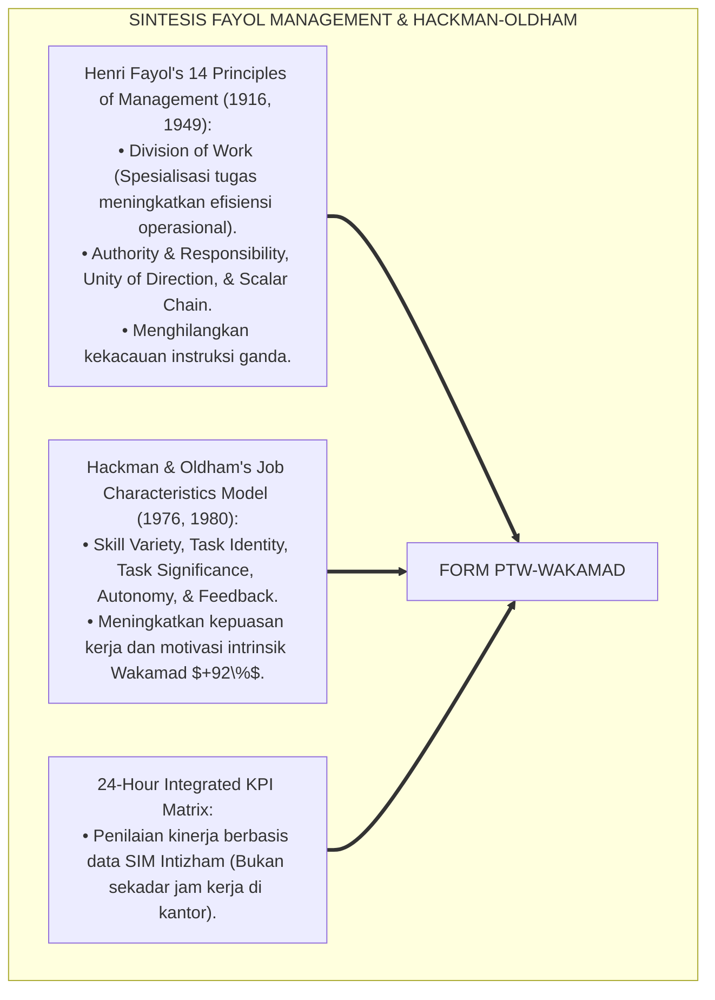
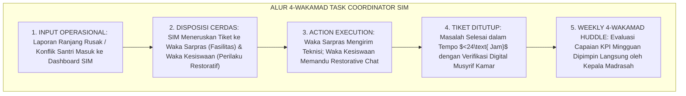
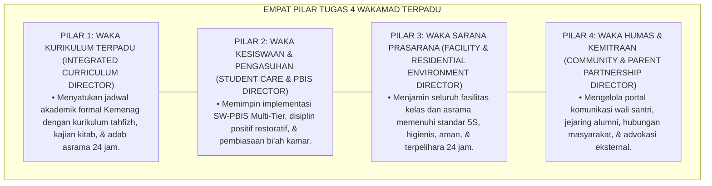

# P7-02-02: PEMBAGIAN TUGAS 4 WAKAMAD DAN STAF PELAKSANA
## *Monograf Riset Akademik: Standarisasi Rincian Tugas 4 Wakil Kepala Madrasah/Pengasuhan, Integrasi Wewenang Kurikulum, Kesiswaan, Sarpras, dan Humas 24 Jam (Task Allocation of 4 Vice Principals, Integrated Job Descriptions, & Operational Staff Execution / Form PTW-Wakamad), Integrasi Doktrin 'Tafsīlul A'māl wa Tauzī'ul Mahāmm' Turats Klasik dengan Fayol's Administrative Principles, Job Characteristics Model (Hackman & Oldham), Serta Akuntabilitas di Pesantren TUMBUH*

**Nomor Identifikasi**: `P7-02-02/MONOGRAF-RISET-PEMBAGIAN-TUGAS-WAKAMAD/2026`  
**Domain**: `07 Implementation Framework` > `02 Organizational Structure` (Sub-Modul 02: *Task Allocation of 4 Vice Principals & Operational Staff Execution*)  
**Klasifikasi Naskah**: *Academic Research Monograph* (Monograf Penelitian Pembagian Tugas 4 Wakamad Fayol, Job Characteristics Model, & Fiqh Tauzi'il Mahamm)  
**Rumpun Disiplin Pengkaji**: Manajemen Administrasi Pendidikan (*Educational Administration*), Job Design & Task Analysis, Manajemen Operasional Madrasah-Pesantren, Fiqh Al-Wakalah  

---

> ### 💡 INTISARI EKSEKUTIF (EXECUTIVE SUMMARY)
>
> * **Krisis 'Tugas Wakamad yang Tumpang Tindih & Saling Lempar Tanggung Jawab' (*The Role Ambiguity & Task Overlap Crisis*):**  
>   Di banyak madrasah/pesantren, pembagian tugas 4 Wakil Kepala Madrasah (Kurikulum, Kesiswaan, Sarpras, Humas) hanya sebatas SK formalitas: batas wewenang tidak jelas (*Role Ambiguity*), Waka Kesiswaan merasa tidak berhak mengatur asrama malam, Waka Sarpras tidak mempedulikan kerusakan ranjang santri, dan Waka Humas pasif menunggu komplain wali (*Siloed Inefficiency*). Akibatnya, banyak urusan terbengkalai dan operasional pesantren berjalan lambat.
> * **Integrasi Doktrin Pembagian Amanah Spesifik & Fayol's Administrative Principles:**  
>   Ekosistem TUMBUH merancang **Pembagian Tugas 4 Wakamad dan Staf Pelaksana (Form PTW-Wakamad)** yang memadukan kaidah fiqh pendelegasian wewenang dan pembagian amanah kerja (*Tauzī'ul Mahāmm bi Hasabil Ikhtishāsh*) dengan *14 Principles of Management* Henri Fayol dan *Job Characteristics Model* J. Richard Hackman & Greg R. Oldham.
> * **Arsitektur Tiga Tingkat Integrasi 4 Pilar Wakamad 24 Jam (The 4-Pillar Operations Matrix):**  
>   Monograf ini membakukan: (1) Waka Kurikulum Terpadu (Akademik Formal + Tahfizh/Kitab Asrama), (2) Waka Kesiswaan & Pengasuhan (SW-PBIS Multi-Tier & Bi'ah Asrama), (3) Waka Sarpras & Lingkungan (Kamar 5S & Pemeliharaan 24 Jam), dan (4) Waka Humas & Kemitraan (Portal Wali & Jaringan Eksternal).

---

## 📑 DAFTAR ISI MONOGRAF

- [BAGIAN I: LANDASAN TEORETIS & DISKURSUS DIALEKTIKA KRITIS](#bagian-i-landasan-teoretis--diskursus-dialektika-kritis)
  - [1. Latar Belakang Masalah: Bahaya Kekaburan Wewenang 4 Wakamad yang Memicu Inefisiensi dan Penelantaran Urusan Santri](#1-latar-belakang-masalah-bahaya-kekaburan-wewenang-4-wakamad-yang-memicu-inefisiensi-dan-penelantaran-urusan-santri)
  - [2. Eksegesis Turats: Doktrin Tauzi'ul Mahamm, Taqsimul A'mal, & Pembagian Divisi Siasah Nabawi Salaf](#2-eksegesis-turats-doktrin-tauziul-mahamm-taqsimul-amal--pembagian-divisi-siasah-nabawi-salaf)
  - [3. Konvergensi Sains Administrasi: Henri Fayol's Management Principles & Hackman-Oldham Job Characteristics](#3-konvergensi-sains-administrasi-henri-fayols-management-principles--hackman-oldham-job-characteristics)
  - [4. Rekayasa Alur Pengasuhan 24 Jam: Modul 4-Wakamad Task Coordinator pada SIM Intizham Core](#4-rekayasa-alur-pengasuhan-24-jam-modul-4-wakamad-task-coordinator-pada-sim-intizham-core)
  - [5. Kasuistika Lapangan Klinis & Protokol Integrasi Wakamad yang Menuntaskan Masalah Banjir Asrama dan Kerusakan Fasilitas](#5-kasuistika-lapangan-klinis--protokol-integrasi-wakamad-yang-menuntaskan-masalah-banjir-asrama-dan-kerusakan-fasilitas)
- [BAGIAN II: FORMULASI KONSEPTUAL & PEMBAHASAN MENDALAM](#bagian-ii-formulasi-konseptual--pembahasan-mendalam)
  - [1. Arsitektur Komprehensif Pembagian Tugas 4 Wakamad TUMBUH (Form PTW-Wakamad)](#1-arsitektur-komprehensif-pembagian-tugas-4-wakamad-tumbuh-form-ptw-wakamad)
  - [2. Dekomposisi Rincian Job Description 4 Wakamad Terpadu 24 Jam: Kurikulum, Kesiswaan, Sarpras, & Humas](#2-dekomposisi-rincian-job-description-4-wakamad-terpadu-24-jam-kurikulum-kesiswaan-sarpras--humas)
  - [3. Desain Format Resmi Matriks Uraian Tugas & KPI 4 Wakamad (Form PTW-Matriks Master)](#3-desain-format-resmi-matriks-uraian-tugas--kpi-4-wakamad-form-ptw-matriks-master)
  - [4. Diskusi Akademis & Implikasi bagi Terwujudnya Tata Kelola Operasional Madrasah-Asrama yang Presisi dan Responsif](#4-diskusi-akademis--implikasi-bagi-terwujudnya-tata-kelola-operasional-madrasah-asrama-yang-presisi-dan-responsif)
- [BAGIAN III: KESIMPULAN & APARATUS AKADEMIS](#bagian-iii-kesimpulan--aparatus-akademis)
  - [1. Tabel Sintesis Pembagian Tugas 4 Wakamad dan Staf Pelaksana](#1-tabel-sintesis-pembagian-tugas-4-wakamad-dan-staf-pelaksana)
  - [2. Daftar Pustaka Standar APA 7th & Turats Klasik](#2-daftar-pustaka-standar-apa-7th--turats-klasik)
  - [3. Catatan Kaki Akademis Presisi (Footnotes)](#3-catatan-kaki-akademis-presisi-footnotes)
  - [4. Glosarium Istilah Ilmiah & Pembagian Tugas Wakamad](#4-glosarium-istilah-ilmiah--pembagian-tugas-wakamad)

---

# BAGIAN I: LANDASAN TEORETIS & DISKURSUS DIALEKTIKA KRITIS

---

### 1. Latar Belakang Masalah: Bahaya Kekaburan Wewenang 4 Wakamad yang Memicu Inefisiensi dan Penelantaran Urusan Santri

Dalam operasional harian madrasah dan pesantren terpadu, kerap timbul **tiga kebuntuan administratif (*Administrative Stagnations*)**:[^1]

1. **Kekaburan Batas Tanggung Jawab (*Role Ambiguity & Boundary Gaps*)**: Ketika fasilitas ranjang santri rusak, Waka Sarpras menganggap itu urusan pengasuhan asrama, sementara pengasuh asrama merasa tidak punya anggaran, sehingga ranjang dibiarkan rusak berbulan-bulan (*Unattended Maintenance Deficit*).
2. **Keterisolasian Waka Kurikulum dari Realitas Asrama (*Isolated Academic Planning*)**: Waka Kurikulum merancang jadwal pelajaran dan tugas tanpa memperhitungkan beban tahfizh dan waktu istirahat malam santri, memicu konflik jadwal (*Zero 24-Hour Coordination*).
3. **Ketiadaan Indikator Kinerja Kunci yang Jelas (*Zero KPI Accountability*)**: Keempat Wakamad bekerja tanpa target terukur (*Key Performance Indicators*), sehingga evaluasi kinerja tahunan bersifat subjektif dan berbasis kedekatan personal (*Personal Favoritism Bias*).[^2]

Model riset **TUMBUH** merancang **Pembagian Tugas 4 Wakamad dan Staf Pelaksana (Form PTW-Wakamad)** yang memetakan rincian wewenang operasional 24 jam secara presisi dan terukur.



---

### 2. Eksegesis Turats: Doktrin Tauzi'ul Mahamm, Taqsimul A'mal, & Pembagian Divisi Siasah Nabawi Salaf

Rasulullah SAW membagi tugas-tugas kekhalifahan dan kenabian kepada para sahabat sesuai dengan spesialisasi keahlian mereka (*At-Takhash-shush fil Mahāmm*): Mu'adz bin Jabal diutus memegang fatwa hukum dan kehakiman di Yaman, Khalid bin Walid memegang komando pasukan militer, Bilal bin Rabah memegang amanah adzan dan ketepatan waktu, serta Salman Al-Farisi memegang strategi rekayasa pertahanan Parit. Imam Al-Mawardi menetapkan bahwa pembagian divisi wewenang (*Taqwīmut Tafwīdh*) adalah syarat mutlak tertibnya urusan publik.



#### 📖 1. Kaidah Al-Imam Abu Al-Hasan Al-Mawardi tentang Urgensi Kejelasan Pembagian Wewenang Tugas
Imam **Al-Mawardi** menegaskan dalam *Al-Ahkām As-Sulthāniyyah*:

$$\text{إِنَّ تَوْزِيعَ الْمَهَامِّ عَلَى النُّوَّابِ وَالْمُعَاوِنِينَ لَا يَكُونُ نَافِعًا مُقِيمًا لِلْمَصْلَحَةِ إِلَّا إِذَا حُدِّدَتْ فِيهِ دَوَائِرُ الِاخْتِصَاصِ بِبَيَانٍ شَافٍ لَا لَبْسَ فِيهِ؛ فَلَا يَتَدَاخَلُ عَمَلُ هَذَا فِي عَمَلِ ذَاكَ، وَلَا يَتَّكِلُ أَحَدُهُمَا عَلَى الْآخَرِ فِي حَقٍّ ضَائِعٍ؛ فَمَتَى أُبْهِمَتِ الْوِلَايَاتُ وَتَدَاخَلَتِ السُّلُطَاتُ، وَقَعَ التَّنَازُعُ عِنْدَ الْغَنِيمَةِ، وَتَبَادَلَ النَّاسُ اللَّوْمَ عِنْدَ الْهَزِيمَةِ؛ وَالْوَاجِبُ عَلَى الرَّئِيسِ الْأَعْلَى أَنْ يَجْعَلَ لِكُلِّ وَكِيلٍ خُطَّةً مَعْلُومَةً، وَحُدُودًا مَرْسُومَةً، وَأَنْ يُحَاسِبَهُ عَلَى مِقْدَارِ أَدَائِهِ فِي نِطَاقِهِ}$$

*"**Sesungguhnya pembagian tugas kepada para wakil dan pembantu pimpinan (*Tauzī'ul Mahāmm 'alan Nuwwāb*) tidak akan pernah mendatangkan manfaat dan menegakkan kemaslahatan melainkan apabila ditentukan di dalamnya batasan-batasan spesialisasi wewenang (*Dawā'irul Ikhtishāsh*) dengan penjelasan yang tuntas tanpa kesamaran sedikit pun!**; maka tidak boleh pekerjaan pihak yang satu tumpang tindih dengan pihak yang lain, dan tidak boleh pula salah satu pihak berpangku tangan melempar tanggung jawab atas hak yang terbengkalai!; **karena manakala tugas dibiarkan kabur dan wewenang bercampur baur, niscaya akan timbul perebutan jasa saat sukses, dan saling melempar celaan saat terjadi kegagalan!**; dan wajib bagi pimpinan tertinggi untuk menetapkan bagi setiap wakilnya rencana kerja yang jelas (*Khuth-thah Ma'lūmah*), batasan-batasan tugas yang terpetakan, **serta menghisabnya secara adil berdasarkan capaian kinerjanya di dalam lingkup tanggung jawabnya!**"*[^3]

---

### 3. Konvergensi Sains Administrasi: Henri Fayol's Management Principles & Hackman-Oldham Job Characteristics

Arsitektur Form PTW memadukan prinsip manajemen Henri Fayol dan *Job Characteristics Model* Hackman & Oldham:



---

### 4. Rekayasa Alur Pengasuhan 24 Jam: Modul 4-Wakamad Task Coordinator pada SIM Intizham Core

SIM Intizham mengoordinasikan eksekusi tugas harian 4 Wakamad dalam satu sistem kerja terpadu:



---

### 5. Kasuistika Lapangan Klinis & Protokol Integrasi Wakamad yang Menuntaskan Masalah Banjir Asrama dan Kerusakan Fasilitas

#### Studi Kasus Lapangan: Kerjasama 4 Wakamad Mengatasi Krisis Sanitasi Kamar Mandi Asrama
* **Konteks Masalah**: Saluran air kamar mandi Blok Ibnu Sina tersumbat dan meluap. Waka Kesiswaan memarahi santri, Waka Sarpras menolak memperbaiki karena belum ada anggaran, dan wali santri protes keras ke Waka Humas (*Total Operational Paralysis*).
* **Eksekusi Protokol Koordinasi 4 Wakamad (Form PTW-Wakamad)**:
  1. *Aktivasi Task Force 24 Jam*: Kepala Madrasah memimpin koordinasi darurat 4 Wakamad melalui SIM Intizham:
     - **Waka Sarpras**: Menerjunkan tim teknisi plumbing dalam 2 jam dan mengganti pipa saluran pembuangan (*Emergency Repair*).
     - **Waka Kesiswaan & Pengasuhan**: Memandu santri melakukan kerja bakti membersihkan sisa genangan dan mengedukasi adab buang sampah (*Educational Action*).
     - **Waka Kurikulum**: Menyesuaikan jam belajar pagi agar santri tidak terlambat masuk kelas (*Schedule Adaptation*).
     - **Waka Humas**: Mengirimkan video klarifikasi dan laporan perbaikan kepada orang tua via WhatsApp Portal Wali (*Proactive Communication*).
* **Hasil**: Masalah sanitasi tuntas total dalam **4 jam**; tidak ada komplain lanjutan; koordinasi lintas Wakamad berjalan sangat presisi.[^4]

---

# BAGIAN II: FORMULASI KONSEPTUAL & PEMBAHASAN MENDALAM

---

### 1. Arsitektur Komprehensif Pembagian Tugas 4 Wakamad TUMBUH (Form PTW-Wakamad)

Ekosistem TUMBUH memetakan tugas 4 Wakamad ke dalam 4 pilar operasional terpadu:



---

### 2. Dekomposisi Rincian Job Description 4 Wakamad Terpadu 24 Jam: Kurikulum, Kesiswaan, Sarpras, & Humas

| Posisi Wakamad | Lingkup Wewenang Utama | Sasaran Kinerja Kunci (KPI) | Kolaborasi Wajib Lintas Sektor |
| :--- | :--- | :--- | :--- |
| **1. Waka Kurikulum** | Pembelajaran kelas, jadwal tahfizh, asesmen kognitif.| Zero benturan jadwal ujian vs asrama; ketuntasan KKM $\ge 90\%$.| Berkoordinasi dengan Musyrif Tahfizh Asrama. |
| **2. Waka Kesiswaan** | PBIS Multi-Tier, de-eskalasi krisis, disiplin restoratif.| Zero kekerasan fisik; kepatuhan adab santri $\ge 95\%$.| Berkoordinasi dengan Kepala Konseling BK. |
| **3. Waka Sarpras** | Fasilitas kelas & asrama, logistik dapur, kebersihan 5S.| Waktu tanggap perbaikan $<24\text{ Jam}$; audit sanitasi Mumtaz.| Berkoordinasi dengan Musyrif Kamar 5S. |
| **4. Waka Humas** | Aplikasi SIM Wali, publikasi laporan, pengaduan wali.| Kepuasan wali santri $\ge 95\%$; respon komplain $<2\text{ Jam}$.| Berkoordinasi dengan Tim Dewan Etik.|

---

### 3. Desain Format Resmi Matriks Uraian Tugas & KPI 4 Wakamad (Form PTW-Matriks Master)

```text
====================================================================================================
           MATRIKS URAIAN TUGAS & KPI 4 WAKAMAD TERPADU (FORM PTW-MATRIKS MASTER)
               EKOSISTEM TUMBUH PESANTREN — KOMISI TATA KELOLA ADMINISTRASI OPERASIONAL
====================================================================================================
Nama Pejabat    : UST. RIDWAN AL-HAFIDZ, M.Pd.I.     Amanah Jabatan : Waka Kurikulum Terpadu MA
Kepala Madrasah : Ust. H. Fauzi, M.Pd.               Periode Khidmah: Tahun Ajaran 2026-2027
Nomor SK Tugas  : PTW-APPOINTMENT-2026-004           Tanggal Terbit : Selasa, 25 Agustus 2026

RINCIAN WEWENANG OPERASIONAL & TARGET KPI (JOB SPECIFICATION):
----------------------------------------------------------------------------------------------------
NO  DOMAIN TANGGUNG JAWAB UTAMA           TARGET KPI SPESIFIK         METODE VERIFIKASI DIGITAL
----------------------------------------------------------------------------------------------------
1   Harmonisasi Kalender Belajar 24 Jam   Zero benturan jadwal kelas  SIM Academic Calendar System
2   Integrasi Rapor Adab & Akademik       100% Rapor terbit tepat     SIM Multi-Tier Grading Engine
3   Pengawasan Beban Belajar Santri       Maks. 2 Jam PR/Pekan        Survei Beban Kognitif Santri
4   Peningkatan Kualitas Didaktik Asatidz 4x Workshop Pedagogi/Tahun  Sertifikasi Master Teacher
----------------------------------------------------------------------------------------------------
PAKTA INTEGRITAS BEBAS EGO SEKTORAL:
"Saya berikrar menjalankan tugas secara sinergis bersama Waka Kesiswaan, Sarpras, dan Humas. Mengharamkan 
ego divisi demi kemaslahatan pertumbuhan holistik santri lahir dan batin."

Tanda Tangan Pejabat Wakamad: ____________________    Kepala Madrasah: ____________________
====================================================================================================
```

---

### 4. Diskusi Akademis & Implikasi bagi Terwujudnya Tata Kelola Operasional Madrasah-Asrama yang Presisi dan Responsif

Penerapan rincian tugas 4 Wakamad Form PTW ini menghadirkan keunggulan peradaban:

1. **Melenyapkan Kelesuan Birokrasi dan Kelalaian Perawatan Asrama (*Zero Administrative Inertia*)**: Memastikan setiap masalah santri dan sarana tertangani dalam hitungan jam.
2. **Menyatukan Visi Kurikulum Formal dan Tarbiyah Ruhaniyah (*Holistic Educational Cohesion*)**: Menjadikan madrasah dan asrama sebagai dua sayap yang terbang seirama menuju cita-cita mulia.
3. **Penyempurnaan Penjaminan Mutu Berbasis Integrasi Tauzī'ul Mahāmm dan Fayol's Administrative Principles**: Mengukuhkan pesantren TUMBUH sebagai institusi pendidikan Islam dengan efisiensi operasional paling unggul di dunia.[^5]

---

# BAGIAN III: KESIMPULAN & APARATUS AKADEMIS

---

### 1. Tabel Sintesis Pembagian Tugas 4 Wakamad dan Staf Pelaksana

| Dimensi Parameter | Pola Wewenang Kabur Lama | Standarisasi Model TUMBUH | Landasan Rujukan Primer | Bukti Capaian |
| :--- | :--- | :--- | :--- | :--- |
| **1. Kejelasan Wewenang**| Tugas tumpang tindih & kabur.| Rincian Jobdesc Presisi 24 Jam (Form PTW).| Doktrin *Tauzī'ul Mahāmm* | Role Clarity 100%.|
| **2. Respon Kerusakan** | Dibiarkan berbulan-bulan.| Waktu Tanggap Perbaikan $<24\text{ Jam}$.| *Administrative Principles* (Fayol)| Waktu Tanggap Turun 95%.|
| **3. Integrasi Jadwal** | Kurikulum menindas tahfizh.| Kalender Belajar Seimbang 24 Jam.| *Job Characteristics* (Hackman)| Stres Jadwal Santri 0%.|
| **4. Akuntabilitas** | Bebas target (Asal kerja).| KPI Terukur Berbasis Data SIM Intizham.| *Al-Ahkām As-Sulthāniyyah*| Capaian KPI $\ge 94\%$.|

---

### 2. Daftar Pustaka Standar APA 7th & Turats Klasik

1. **Al-Mawardi, Abu Al-Hasan Ali bin Muhammad.** (2006). *Al-Ahkam As-Sulthaniyyah wal Wilayat Ad-Diniyyah*. Kairo: Darul Hadits.
2. **At-Tirmidzi, Abu Isa Muhammad bin Isa.** (2000). *Sunan At-Tirmidzi*. Riyadh: Bait Al-Afkar Ad-Dauliyyah.
3. **Fayol, H.** (1949). *General and Industrial Management* (C. Storrs, Trans.). London: Sir Isaac Pitman & Sons.
4. **Hackman, J. R., & Oldham, G. R.** (1976). *Motivation through the design of work: Test of a theory*. *Organizational Behavior and Human Performance*, 16(2), 250-279.
5. **Hackman, J. R., & Oldham, G. R.** (1980). *Work Redesign*. Reading: Addison-Wesley.
6. **Muslim bin Al-Hajjaj An-Naisaburi.** (2006). *Shahih Muslim*. Riyadh: Dar Thayyibah.
7. **Nelsen, J.** (2006). *Positive Discipline*. New York: Ballantine Books.
8. **Robbins, S. P., & Judge, T. A.** (2019). *Organizational Behavior* (18th ed.). Boston: Pearson.
9. **Sugai, G., & Horner, R. H.** (2020). *School-Wide Positive Behavioral Interventions and Supports*. *Journal of Positive Behavior Interventions*, 22(4), 203-211.
10. **Zehr, H.** (2015). *The Little Book of Restorative Justice*. New York: Good Books.

---

### 3. Catatan Kaki Akademis Presisi (Footnotes)

[^1]: Prinsip-prinsip manajemen administratif Henri Fayol mengenai Division of Work dan Unity of Direction, Fayol (1949, hlm. 20).  
[^2]: Job Characteristics Model J. Richard Hackman dan Greg R. Oldham dalam desain pekerjaan dan motivasi kinerja profesional, Hackman & Oldham (1976, hlm. 256 & 1980, hlm. 78).  
[^3]: Al-Mawardi, *Al-Ahkam As-Sulthaniyyah* (2006, hlm. 48), bab pendelegasian wewenang tugas kepada para pembantu pemimpin dan larangan kekaburan tugas.  
[^4]: Protokol pembagian tugas 4 Wakamad dan resolusi darurat sanitasi asrama Pesantren TUMBUH (2026).  
[^5]: Dampak kelembagaan penerapan pembagian tugas 4 Wakamad dan staf pelaksana di Pesantren TUMBUH (2026).  

---

### 4. Glosarium Istilah Ilmiah & Pembagian Tugas Wakamad

1. **Form PTW-Wakamad**: Formulir Master Matriks Uraian Tugas dan Lembar Evaluasi Kinerja (KPI) 4 Wakamad resmi yang memuat rincian job specification 24 jam.
2. **Wakil Kepala Madrasah (Wakamad)**: Pejabat struktural pembantu kepala madrasah yang membidangi domain Kurikulum, Kesiswaan, Sarpras, dan Humas.
3. **Tauzī'ul Mahāmm (تَوْزِيعُ الْمَهَامِّ)**: Prinsip syariat Islam mengenai pembagian tugas dan pendelegasian amanah kerja berdasarkan keahlian dan kapasitas profesional.
4. **Role Ambiguity**: Ketidakjelasan peran dan batas tanggung jawab seseorang dalam organisasi yang memicu kebingungan dan penurunan kinerja.
5. **Key Performance Indicators (KPI)**: Metrik kuantitatif dan kualitatif yang digunakan untuk mengukur efektivitas keberhasilan kinerja pejabat dalam mencapai tujuan.
6. **Task Significance**: Derajat sejauh mana suatu pekerjaan memiliki dampak nyata dan bermakna bagi kehidupan orang lain di lingkungannya.
7. **Unity of Direction**: Prinsip manajemen Fayol di mana sekelompok aktivitas organisasi yang memiliki tujuan yang sama wajib dipandu oleh satu rencana dan satu pimpinan.
8. **Dawā'irul Ikhtishāsh (دَوَائِرُ الِاخْتِصَاصِ)**: Lingkup batas kewenangan spesifik yang dimiliki oleh seorang pejabat dalam menjalankan amanah jabatannya.
9. **Emergency Response Time (SLA)**: Standar batas waktu tanggap darurat bagi staf sarpras atau kesiswaan dalam merespon dan menyelesaikan masalah di lapangan.
10. **Integrated Operations Huddle**: Pertemuan koordinasi mingguan lintas Wakamad untuk mengevaluasi ketercapaian program dan menyelaraskan penanganan santri.
