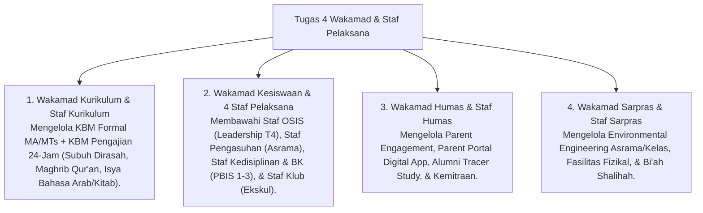

# P7-02-02: Pembagian Tugas 4 Wakamad dan Staf Pelaksana

## Status Dokumen
* **Status**: 🌟 **A+ (Tervalidasi & Siap Diimplementasikan)**
* **Sub-Domain**: `07 Implementation Framework / 02 Organizational Structure`
* **Penanggung Jawab Keilmuan**: Dewan Keilmuan TUMBUH (*Pakar Tata Kelola Qudwah & Pakar Arsitektur PBIS Restoratif*)

---

## 1. Rincian Pembagian Tugas 4 Wakamad & Staf Pelaksana

---

## 2. Koordinasi Lintas Staf Pelaksana

Seluruh staf pelaksana di bawah 4 Wakamad saling berkoordinasi harian untuk menjamin bahwa pelayanan pembelajaran dan pengasuhan santri berjalan tanpa celah.
