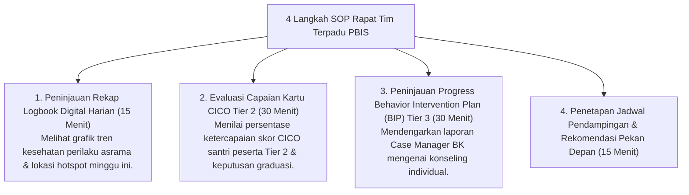

# P7-02-03: SOP Koordinasi Tim Terpadu PBIS dan Kesiswaan

## Status Dokumen
* **Status**: 🌟 **A+ (Tervalidasi & Siap Diimplementasikan)**
* **Sub-Domain**: `07 Implementation Framework / 02 Organizational Structure`
* **Penanggung Jawab Keilmuan**: Dewan Keilmuan TUMBUH (*Pakar Arsitektur PBIS Restoratif & Pakar Bimbingan Konseling*)

---

## 1. SOP Rapat Koordinasi Tim Terpadu PBIS

Tim Terpadu PBIS (SW-PBIS Leadership Team) menyelenggarakan rapat koordinasi mingguan setiap Sabtu pagi (09.00 - 10.30):

---

## 2. Hasil Rapat & Transparansi Data

Hasil keputusan rapat Tim Terpadu dicatat dalam **Notulensi Terintegrasi Digital** dan menjadi acuan kerja bagi seluruh Musyrif Kamar dan Wali Kelas.
