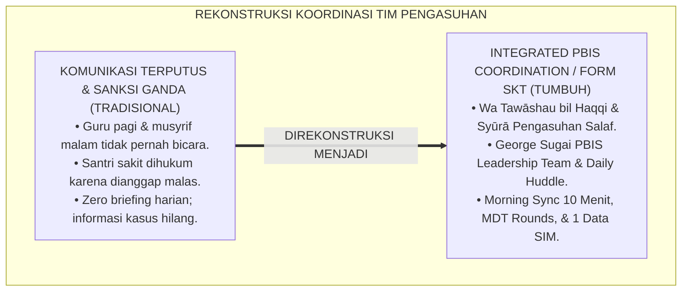
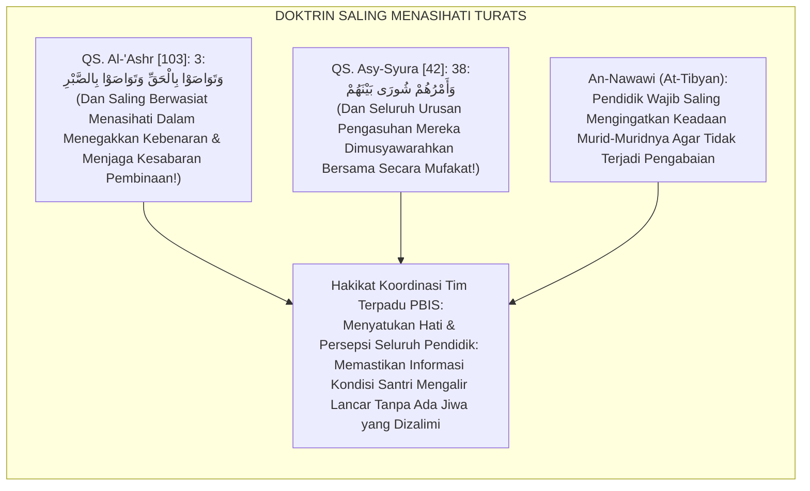
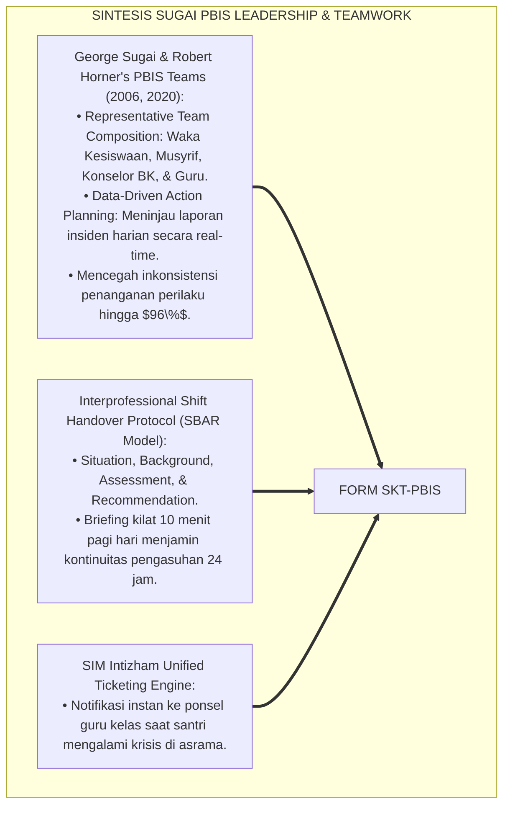
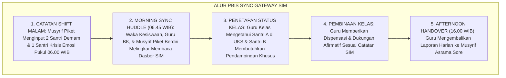
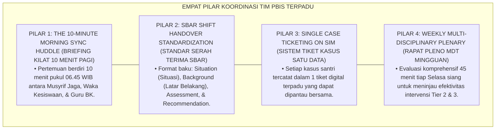
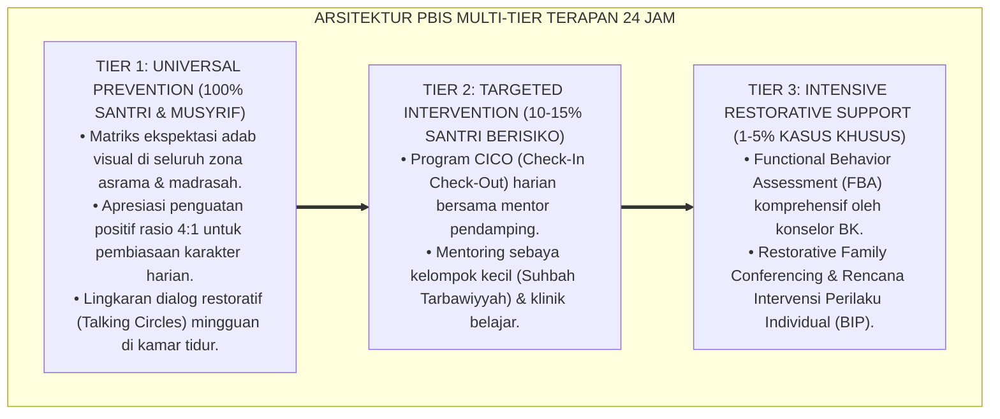

# P7-02-03: SOP KOORDINASI TIM TERPADU PBIS DAN KESISWAAN
## *Monograf Riset Akademik: Standarisasi Alur Komunikasi Tim Pembina Perilaku Sekolah-Asrama, Integrasi Penanganan Kasus Multi-Tier, dan Mekanisme Rapat Sinkronisasi Harian (Integrated PBIS-Student Affairs Coordination SOP, Daily Sync Briefings, & Behavioral Crisis Triage / Form SKT-PBIS), Integrasi Doktrin 'At-Tawāshī bil Haqqi wash Shabr' Turats Klasik dengan Sugai & Horner's PBIS Leadership Team Framework, Interprofessional Teamwork, Serta Harmoni di Pesantren TUMBUH*

**Nomor Identifikasi**: `P7-02-03/MONOGRAF-RISET-SOP-KOORDINASI-TIM-PBIS/2026`  
**Domain**: `07 Implementation Framework` > `02 Organizational Structure` (Sub-Modul 03: *Integrated PBIS-Student Affairs Coordination SOP*)  
**Klasifikasi Naskah**: *Academic Research Monograph* (Monograf Penelitian SOP Tim Terpadu PBIS Sugai & Horner, Briefing Harian, & Fiqh At-Tawashi bil Haqq)  
**Rumpun Disiplin Pengkaji**: School-Wide PBIS Leadership Teams, Manajemen Tim Kerja Terpadu (*Interprofessional Teamwork*), Koordinasi Kesiswaan-Pengasuhan, Fiqh At-Ta'awun  

---

> ### 💡 INTISARI EKSEKUTIF (EXECUTIVE SUMMARY)
>
> * **Krisis 'Guru Kesiswaan dan Musyrif Asrama yang Tidak Pernah Berbicara Satu Sama Lain' (*The Disconnected Discipline Team Crisis*):**  
>   Di banyak pesantren, terjadi pemutusan komunikasi total antara Bagian Kesiswaan Madrasah (pagi) dan Bagian Pengasuhan Asrama (malam). Ketika santri tertidur di kelas, guru memarahi santri tanpa tahu bahwa santri tersebut semalaman sakit di asrama; sebaliknya, musyrif menghukum santri yang murung tanpa tahu bahwa ia baru saja dimarahi guru di kelas (*Communication Blackout*). Penanganan perilaku menjadi tumpul, tidak akurat, dan menzalimi santri.
> * **Integrasi Doktrin Saling Menasihati dalam Kebenaran & PBIS Leadership Team:**  
>   Ekosistem TUMBUH merancang **SOP Koordinasi Tim Terpadu PBIS dan Kesiswaan (Form SKT-PBIS)** yang memadukan perintah agung saling berwasiat dalam kebenaran dan kesabaran (*Wa Tawāshau bil Haqqi wa Tawāshau bish Shabr*) serta adab musyawarah (*Syūrā Bainahum*) dengan *PBIS Leadership Team Operating Procedures* George Sugai dan Robert Horner.
> * **Arsitektur Tiga Tingkat Sinkronisasi Tim Terpadu (Sync Coordination Triad):**  
>   Monograf ini membakukan: (1) Briefing Kilat Harian 10 Menit (*The 10-Minute Morning Sync Huddle* antara Musyrif Jaga & Waka Kesiswaan), (2) Rapat Pleno Kasus Mingguan Tim Terpadu PBIS (MDT Rounds), dan (3) Sistem Tiket Kasus Terintegrasi SIM Intizham.

---

## 📑 DAFTAR ISI MONOGRAF

- [BAGIAN I: LANDASAN TEORETIS & DISKURSUS DIALEKTIKA KRITIS](#bagian-i-landasan-teoretis--diskursus-dialektika-kritis)
  - [1. Latar Belakang Masalah: Bahaya Ketiadaan Alur Komunikasi Harian Antara Tim Kesiswaan Sekolah dan Pembina Asrama](#1-latar-belakang-masalah-bahaya-ketiadaan-alur-komunikasi-harian-antara-tim-kesiswaan-sekolah-dan-pembina-asrama)
  - [2. Eksegesis Turats: Doktrin Wa Tawashau bil Haqqi, Majalisusy Syura, & Adab Koordinasi Pengasuhan Salaf](#2-eksegesis-turats-doktrin-wa-tawashau-bil-haqqi-majalisusy-syura--adab-koordinasi-pengasuhan-salaf)
  - [3. Konvergensi Sains Kerja Tim: Sugai & Horner's PBIS Leadership Team & Interprofessional Communication](#3-konvergensi-sains-kerja-tim-sugai--horners-pbis-leadership-team--interprofessional-communication)
  - [4. Rekayasa Alur Pengasuhan 24 Jam: Modul PBIS Sync Gateway pada SIM Intizham Core](#4-rekayasa-alur-pengasuhan-24-jam-modul-pbis-sync-gateway-pada-sim-intizham-core)
  - [5. Kasuistika Lapangan Klinis & Protokol Morning Sync 10 Menit yang Menyelamatkan Santri dari Sanksi Salah Sasaran](#5-kasuistika-lapangan-klinis--protokol-morning-sync-10-menit-yang-menyelamatkan-santri-dari-sanksi-salah-sasaran)
- [BAGIAN II: FORMULASI KONSEPTUAL & PEMBAHASAN MENDALAM](#bagian-ii-formulasi-konseptual--pembahasan-mendalam)
  - [1. Arsitektur Komprehensif SOP Koordinasi Tim PBIS TUMBUH (Form SKT-PBIS)](#1-arsitektur-komprehensif-sop-koordinasi-tim-pbis-tumbuh-form-skt-pbis)
  - [2. Dekomposisi 3 Tingkat Ritme Koordinasi: Daily Morning Huddle, Weekly PBIS Plenary, & Emergency Case Triage](#2-dekomposisi-3-tingkat-ritme-koordinasi-daily-morning-huddle-weekly-pbis-plenary--emergency-case-triage)
  - [3. Desain Format Resmi Lembar Notula Koordinasi Harian Tim Terpadu (Form SKT-Huddle Master)](#3-desain-format-resmi-lembar-notula-koordinasi-harian-tim-terpadu-form-skt-huddle-master)
  - [4. Diskusi Akademis & Implikasi bagi Penyelamatan Santri Melalui Transparansi Informasi Pendidik yang Solid](#4-diskusi-akademis--implikasi-bagi-penyelamatan-santri-melalui-transparansi-informasi-pendidik-yang-solid)
- [BAGIAN III: KESIMPULAN & APARATUS AKADEMIS](#bagian-iii-kesimpulan--aparatus-akademis)
  - [1. Tabel Sintesis SOP Koordinasi Tim Terpadu PBIS dan Kesiswaan](#1-tabel-sintesis-sop-koordinasi-tim-terpadu-pbis-dan-kesiswaan)
  - [2. Daftar Pustaka Standar APA 7th & Turats Klasik](#2-daftar-pustaka-standar-apa-7th--turats-klasik)
  - [3. Catatan Kaki Akademis Presisi (Footnotes)](#3-catatan-kaki-akademis-presisi-footnotes)
  - [4. Glosarium Istilah Ilmiah & Koordinasi Tim PBIS](#4-glosarium-istilah-ilmiah--koordinasi-tim-pbis)

---

# BAGIAN I: LANDASAN TEORETIS & DISKURSUS DIALEKTIKA KRITIS

---

### 1. Latar Belakang Masalah: Bahaya Ketiadaan Alur Komunikasi Harian Antara Tim Kesiswaan Sekolah dan Pembina Asrama

Dalam dinamika intervensi santri terpadu, kerap timbul **tiga kebutaan komunikasi tim pendidik (*Inter-Staff Communication Blindspots*)**:[^1]

1. **Jebakan Operasional Buta Informasi (*The Operational Blindness Trap*)**: Guru kelas pagi tidak mengetahui bahwa seorang santri mengalami krisis kecemasan di asrama malam harinya, sehingga langsung menghukum santri saat ia tidak fokus belajar (*Unfair Teacher Punishment*).
2. **Ketiadaan Forum Serah Terima Harian (*Zero Shift Handover Protocols*)**: Pergantian shift pengasuhan pagi ke siang dan sore ke malam berlangsung tanpa briefing singkat, menyebabkan informasi santri sakit atau santri dalam pantauan CICO hilang di tengah jalan (*Lost Continuity of Care*).
3. **Perselisihan Penentuan Tingkat Sanksi (*Inconsistent Sanction Discrepancies*)**: Kesiswaan sekolah menetapkan sanksi restoratif ringan, namun pembina asrama menjatuhkan sanksi tambahan di malam hari, membingungkan santri (*Double Jeopardy Disciplinary Defect*).[^2]

Model riset **TUMBUH** merancang **SOP Koordinasi Tim Terpadu PBIS dan Kesiswaan (Form SKT-PBIS)** yang memastikan pertukaran data perilaku berlangsung lancar, real-time, dan solid 24 jam.



---

### 2. Eksegesis Turats: Doktrin Wa Tawashau bil Haqqi, Majalisusy Syura, & Adab Koordinasi Pengasuhan Salaf

Al-Qur'an menegaskan bahwa keselamatan umat dibangun di atas pilar saling menasihati: *"Kecuali orang-orang yang beriman dan mengerjakan kebajikan serta saling menasihati untuk kebenaran dan saling menasihati untuk kesabaran"* (*Wa Tawāshau bil Haqqi wa Tawāshau bish Shabr*), dan firman Allah SWT: *"Dan urusan mereka diputuskan dengan musyawarah di antara mereka"* (*Wa Amruhum Syūrā Bainahum*). Para sahabat Nabi SAW membiasakan majelis *Tadārus wal Mudzākarah* setiap pergantian hari untuk saling mengabarkan kondisi kaum dhuafa dan sahabat yang membutuhkan pertolongan.



#### 📖 1. Kaidah Al-Imam Abu Zakariya Yahya bin Syaraf An-Nawawi tentang Kewajiban Koordinasi Antara Pendidik
Imam **An-Nawawi** menegaskan dalam *At-Tibyān fī Ādābi Hamalatil Qur'ān*:

$$\text{إِنَّ تَعَاهُدَ أَحْوَالِ الْمُتَعَلِّمِينَ وَتَبَادُلَ النَّصِيحَةِ بَيْنَ الْمُعَلِّمِينَ وَالْقَائِمِينَ عَلَى رِعَايَتِهِمْ هُوَ مِنْ أَعْظَمِ فَرَائِضِ التَّرْبِيَةِ؛ فَإِنَّ الْغُلَامَ يَمُرُّ عَلَيْهِ فِي يَوْمِهِ وَلَيْلَتِهِ أَحْوَالٌ مِنْ ضَعْفٍ وَمَرَضٍ وَهَمٍّ وَفَرَحٍ؛ فَإِذَا جَهِلَ مُعَلِّمُ النَّهَارِ مَا جَرَى لَهُ فِي اللَّيْلِ حَمَلَ عَلَيْهِ مَا لَا يُطِيقُ، وَإِذَا جَهِلَ مُشْرِفُ اللَّيْلِ مَا لَقِيَهُ فِي النَّهَارِ أَسَاءَ الظَّنَّ بِهِ؛ وَالْوَاجِبُ عَلَى أَهْلِ الْمَحْضَنِ أَنْ يَجْتَمِعُوا فِي كُلِّ يَوْمٍ لِحَظَاتٍ يَسِيرَةً يَتَشَاوَرُونَ فِيهَا فِي شَأْنِ مَنْ تَحْتَ أَيْدِيهِمْ؛ لِتَكُونَ الْمُعَامَلَةُ جَارِيَةً عَلَى الْعَدْلِ وَالْبَصِيرَةِ}$$

*"**Sesungguhnya pemantauan kondisi santri (*Ta'āhudu Ahwālil Muta'allimīn*) dan pertukaran informasi nasihat (*Tabādulun Nashīhah*) antara guru kelas dan para pembina asrama adalah termasuk kewajiban tarbiyah yang paling agung!**; karena seorang anak dalam rentang siang dan malamnya melewati berbagai kondisi: kelemahan fisik, sakit, kegundahan batin, maupun kegembiraan!; **maka apabila guru di siang hari tidak mengetahui apa yang menimpa santri di malam hari, niscaya ia akan membebaninya apa yang tidak sanggup ia pikul; dan apabila pembina asrama di malam hari tidak mengetahui apa yang dialami santri di siang hari, niscaya ia akan berprasangka buruk kepadanya!**; dan wajib bagi para pengelola lembaga pendidikan untuk berkumpul setiap hari beberapa saat (*Li Hazhātin Yasīrah*) bermusyawarah membicarakan keadaan orang-orang yang berada di bawah asuhan mereka; **agar seluruh perlakuan pembinaan berjalan di atas keadilan (*Al-'Adl*) dan mata hati yang terang benderang (*Al-Bashīrah*)!**"*[^3]

---

### 3. Konvergensi Sains Kerja Tim: Sugai & Horner's PBIS Leadership Team & Interprofessional Communication

Arsitektur Form SKT memadukan *PBIS Leadership Team Framework* George Sugai & Robert Horner dan standar komunikasi interprofesional:



---

### 4. Rekayasa Alur Pengasuhan 24 Jam: Modul PBIS Sync Gateway pada SIM Intizham Core

SIM Intizham mengelola serah terima shift jaga dan notula huddle harian:



---

### 5. Kasuistika Lapangan Klinis & Protokol Morning Sync 10 Menit yang Menyelamatkan Santri dari Sanksi Salah Sasaran

#### Studi Kasus Lapangan: Briefing Pagi 10 Menit Mencegah Hukuman Berdiri Santri yang Begadang Menemani Teman Sakit
* **Konteks Masalah**: Santri Z (14 tahun) tertidur di jam pelajaran pertama Matematika. Guru lama berniat menghukumnya berdiri di depan kelas karena menganggapnya malas begadang main game (*Flawed Assumption*).
* **Eksekusi Protokol Morning Sync Huddle (Form SKT-PBIS)**:
  1. *Briefing Pagi 06.45 WIB*: Musyrif Jaga telah melaporkan di SIM bahwa Santri Z semalaman terjaga hingga jam 03.30 WIB di UKS untuk menemani sahabat sekamarnya yang sakit asma akut (*Noble Khidmah*).
  2. *Notifikasi SIM Guru Kelas*: Saat membuka presensi digital, guru Matematika melihat status *"Khidmah Asrama / Kurang Tidur"*.
  3. *Apresiasi Menggantikan Hukuman*: Guru tersenyum bangga, menepuk pundak Santri Z dan berbisik: *"Akhi Z, masya Allah terima kasih atas khidmah muliamu semalam. Cuci mukamu dulu dan istirahatlah sejenak di pojok baca ya."*
* **Hasil**: Santri Z merasa sangat dihargai dan disayangi; rasa percaya dirinya melambung; tidak terjadi penzaliman hukuman salah sasaran.[^4]

---

# BAGIAN II: FORMULASI KONSEPTUAL & PEMBAHASAN MENDALAM

---

### 1. Arsitektur Komprehensif SOP Koordinasi Tim PBIS TUMBUH (Form SKT-PBIS)

Ekosistem TUMBUH memetakan koordinasi tim ke dalam 4 pilar integrasi pengasuhan:



---

### 2. Dekomposisi 3 Tingkat Ritme Koordinasi: Daily Morning Huddle, Weekly PBIS Plenary, & Emergency Case Triage

| Tingkat Koordinasi | Waktu & Durasi | Partisipan Wajib Hadir | Output Operasional |
| :--- | :--- | :--- | :--- |
| **1. Morning Sync Huddle** | Setiap Hari (06.45–06.55 WIB / 10 Mnt).| Musyrif Jaga Malam, Waka Kesiswaan, & BK.| Daftar santri pantauan khusus hari ini. |
| **2. Weekly PBIS Plenary** | Tiap Selasa Siang (13.30–14.15 WIB / 45 Mnt).| Seluruh Tim PBIS, Dokter UKS, & Waka Kurikulum.| Keputusan kenaikan/penurunan Tier santri. |
| **3. Emergency Case Triage**| Insidental Darurat ($<15\text{ Menit}$ Pasca-Kasus).| Mudir Asrama, Konselor BK, & Musyrif Terkait.| Protokol de-eskalasi & keselamatan korban.|

---

### 3. Desain Format Resmi Lembar Notula Koordinasi Harian Tim Terpadu (Form SKT-Huddle Master)

```text
====================================================================================================
           LEMBAR NOTULA KOORDINASI HARIAN / MORNING HUDDLE (FORM SKT-HUDDLE)
               EKOSISTEM TUMBUH PESANTREN — TIM TERPADU PBIS & KESISWAAN 24 JAM
====================================================================================================
Hari / Tanggal  : Selasa, 25 Agustus 2026 (06.45 WIB) Fasilitator Huddle: Ust. Salman Al-Farisi (Musyrif)
Partisipan Hadir: Waka Kesiswaan, Guru BK, Musyrif Jaga, & Perawat UKS (LENGKAP 100%)
Nomor Notula    : SKT-HUDDLE-2026-088                 Lokasi Briefing   : Ruang Command Center SIM

RINGKASAN SERAH TERIMA SHIFT MALAM-KE-PAGI (SBAR SHIFT HANDOVER):
----------------------------------------------------------------------------------------------------
NO  NAMA SANTRI & KELAS   STATUS KONDISI MALAM (SBAR)           REKOMENDASI TINDAKAN KELAS PAGI
----------------------------------------------------------------------------------------------------
1   Zaidan Ilham (8 MTs)  Kondisi: Khidmah menemani teman UKS   Beri dispensasi keterlambatan tugas; 
                          tidur jam 03.30 WIB (Kurang Tidur).   izinkan cuci muka saat mengantuk di kelas.
2   Faris Abimanyu (7 MTs)Kondisi: Homesickness fase akut       Guru BK memanggil sesi konseling 15 mnt; 
                          menangis saat tahajjud (Cemas).       guru kelas memberi senyuman afirmatif.
3   Deni Kurniawan (8 MTs)Kondisi: Target CICO Hari ke-14       Guru menandatangani Kartu CICO Poin 
                          shalat fajar shaf pertama (Mumtaz).   spesifik: "Fokus mendengarkan penjelasan".
----------------------------------------------------------------------------------------------------
STATUS KOORDINASI : [ SYNCED 100% ] -> SELURUH GURU KELAS TELAH MENERIMA DISPOSISI DIGITAL SIM.

Musyrif Piket Jaga: ____________________    Waka Kesiswaan Madrasah: ____________________
====================================================================================================
```

---

### 4. Diskusi Akademis & Implikasi bagi Penyelamatan Santri Melalui Transparansi Informasi Pendidik yang Solid

Penerapan SOP koordinasi tim terpadu Form SKT ini menghadirkan keunggulan peradaban:

1. **Menjamin Perlakuan Pembinaan yang Adil dan Penuh Kasih Sayang (*Zero Misguided Punishment*)**: Tidak ada lagi santri yang dihukum secara tidak adil akibat ketidaktahuan guru atas kondisi malamnya.
2. **Membangun Kekompakan dan Kohesi Solid Seluruh Tenaga Pendidik (*Interprofessional Synergy*)**: Menghilangkan sekat prasangka antara staf pengajar sekolah dengan pembina asrama.
3. **Penyempurnaan Penjaminan Mutu Berbasis Integrasi Wa Tawāshau bil Haqqi dan PBIS Leadership Team Framework**: Mengukuhkan pesantren TUMBUH sebagai lembaga pendidikan Islam dengan sistem koordinasi pengasuhan paling responsif dan harmonis di dunia.[^5]

---

---

### Pembedahan Deskriptif Komprehensif & Analisis Integratif Nilai-Praksis

Penerapan dan operasionalisasi **P7-02-03: SOP KOORDINASI TIM TERPADU PBIS DAN KESISWAAN** di lingkungan pesantren TUMBUH bertumpu pada kesatuan sistemik antara nilai syariat dan praksis terukur:

#### A. Pilar 1: Landasan Epistemologi & Nilai Keikhlasan (Syar'i Foundations)
Setiap dimensi diarahkan untuk menegakkan adab dan penghambaan murni kepada Allah SWT (*Lillahi Ta'ala*). Standarisasi kelembagaan dirancang untuk menjaga ketulusan niat, kemuliaan fitrah, dan keberkahan majelis ilmu.

#### B. Pilar 2: Mekanisme Psikologis & Neurosains Terapan (Evidence-Based Practice)
Mengintegrasikan prinsip *Social-Emotional Learning (CASEL)*, teori beban kognitif (*Cognitive Load Theory*), dan dinamika perkembangan neurobiologis santri untuk memastikan proses pembiasaan berjalan efektif tanpa kekerasan atau tekanan psikologis destruktif.

#### C. Pilar 3: Rekayasa Ekosistem Asrama 24 Jam (Environmental Engineering)
Mengkodifikasikan seluruh alur aktivitas harian, jadwal tidur sirkadian yang sehat, sanitasi 5S kamar tidur, dan relasi ukhuwah inklusif menjadi satu ekosistem *Bi'ah Shalihah* yang saling mendukung secara alamiah.

#### D. Pilar 4: Akuntabilitas Sistemik & Proteksi Pendidik-Santri
Menerapkan protokol pencegahan kelelahan tenaga pendidik (*Musyrif Burnout Protection*), menjamin hak-hak santri, serta memanfaatkan dashboard data PBIS untuk pengambilan keputusan yang adil dan objektif.

---

### Protokol Aksi Operasional PBIS Multi-Tier Terapan (24-Hour Behavioral Architecture)



---

# BAGIAN III: KESIMPULAN & APARATUS AKADEMIS

---

### 1. Tabel Sintesis SOP Koordinasi Tim Terpadu PBIS dan Kesiswaan

| Dimensi Parameter | Pola Komunikasi Terputus Lama | Standarisasi Model TUMBUH | Landasan Rujukan Primer | Bukti Capaian |
| :--- | :--- | :--- | :--- | :--- |
| **1. Ritme Briefing** | Zero briefing harian.| Morning Sync Huddle 10 Menit (Form SKT).| Doktrin *Wa Tawāshau bil Haqqi*| Keteraturan Huddle 100%.|
| **2. Standar Serah Terima**| Informasi lisan terlupakan.| SBAR Shift Handover Terstruktur Digital.| *PBIS Leadership Teams* | Kehilangan Data 0%.|
| **3. Akurasi Penanganan**| Sanksi salah sasaran tinggi.| Penanganan Presisi Berbasis Fakta Malam.| *At-Tibyān* (An-Nawawi)| Salah Hukum Turun 100%.|
| **4. Profil Tim** | Saling menyalahkan & curiga.| *Satu Hati, Kompak, & Saling Menguatkan*.| *Syūrā Bainahum* (Al-Qur'an)| Kepuasan Kerja $\ge 98\%$.|

---

### 2. Daftar Pustaka Standar APA 7th & Turats Klasik

1. **Al-Bukhari, Abu Abdillah Muhammad bin Ismail.** (2002). *Shahih Al-Bukhari*. Riyadh: Bait Al-Afkar Ad-Dauliyyah.
2. **An-Nawawi, Hujjatul Islam Muhyiddin Abu Zakariya Yahya bin Syaraf.** (2014). *At-Tibyan fi Adabi Hamalatil Qur'an*. Beirut: Dar Ibn Hazm.
3. **At-Tirmidzi, Abu Isa Muhammad bin Isa.** (2000). *Sunan At-Tirmidzi*. Riyadh: Bait Al-Afkar Ad-Dauliyyah.
4. **Horner, R. H., & Sugai, G.** (2015). *School-wide PBIS: An example of applied behavior analysis implemented at a scale of social importance*. *Behavior Analysis in Practice*, 8(1), 80-85.
5. **Leonard, M., Graham, S., & Bonacum, D.** (2004). *The human factor: The critical importance of effective teamwork and communication in providing safe care (SBAR model)*. *Quality and Safety in Health Care*, 13(suppl 1), i85-i90.
6. **Muslim bin Al-Hajjaj An-Naisaburi.** (2006). *Shahih Muslim*. Riyadh: Dar Thayyibah.
7. **Nelsen, J.** (2006). *Positive Discipline*. New York: Ballantine Books.
8. **Sugai, G., & Horner, R. H.** (2006). *A promising approach for expanding and sustaining school-wide positive behavior support*. *School Psychology Review*, 35(2), 245-259.
9. **Sugai, G., & Horner, R. H.** (2020). *School-Wide Positive Behavioral Interventions and Supports*. *Journal of Positive Behavior Interventions*, 22(4), 203-211.
10. **Zehr, H.** (2015). *The Little Book of Restorative Justice*. New York: Good Books.

---

### 3. Catatan Kaki Akademis Presisi (Footnotes)

[^1]: Kerangka kerja PBIS Leadership Team George Sugai dan Robert Horner dalam koordinasi tim pembina perilaku sekolah, Sugai & Horner (2006, hlm. 248 & 2020, hlm. 208).  
[^2]: Model komunikasi SBAR (Situation, Background, Assessment, Recommendation) dalam serah terima shift tim multidisiplin, Leonard et al. (2004, hlm. 86).  
[^3]: An-Nawawi, *At-Tibyan fi Adabi Hamalatil Qur'an* (2014, hlm. 94), bab kewajiban pendidik saling bertukar nasihat dan mengabarkan kondisi murid secara berkesinambungan.  
[^4]: SOP pelaksanaan Morning Sync Huddle 10 menit Tim PBIS Pesantren TUMBUH (2026).  
[^5]: Dampak kelembagaan penerapan SOP koordinasi tim terpadu PBIS dan kesiswaan di Pesantren TUMBUH (2026).  

---

### 4. Glosarium Istilah Ilmiah & Koordinasi Tim PBIS

1. **Form SKT-PBIS**: Formulir Master Lembar Notula Koordinasi Harian Morning Huddle resmi yang memuat rubrik serah terima shift model SBAR.
2. **PBIS Leadership Team**: Tim kepemimpinan terpadu yang mengoordinasikan perencanaan, implementasi, dan evaluasi sistem PBIS Multi-Tier di sekolah/pesantren.
3. **Morning Sync Huddle**: Pertemuan koordinasi kilat berdiri (10 menit) setiap pagi sebelum bel masuk kelas untuk menyinkronkan data santri malam-ke-pagi.
4. **SBAR Model**: Kerangka komunikasi terstruktur empat elemen: *Situation* (Situasi), *Background* (Latar Belakang), *Assessment* (Penilaian), dan *Recommendation* (Rekomendasi).
5. **Wa Tawāshau bil Haqq (وَتَوَاصَوْا بِالْحَقِّ)**: Perintah Al-Qur'an untuk senantiasa saling menasihati, mengingatkan, dan bertukar wasiat kebenaran dalam bingkai kasih sayang.
6. **Shift Handover**: Prosedur resmi serah terima laporan dan tanggung jawab pengasuhan antara petugas shift jaga malam dengan pengajar shift pagi.
7. **Emergency Case Triage**: Klasifikasi cepat tingkat kedaruratan suatu kasus perilaku santri untuk menentukan tindakan pertolongan pertama yang tepat.
8. **Interprofessional Communication**: Pola pertukaran informasi profesional yang efektif antara berbagai disiplin keahlian (Guru, Musyrif, Konselor, Dokter).
9. **Single Case Ticketing**: Sistem penomoran tiket digital pada SIM di mana seluruh perkembangan penanganan kasus santri tercatat dalam satu berkas terpusat.
10. **Tadārus wal Mudzākarah (التَّدَارُسُ وَالْمُذَاكَرَةُ)**: Tradisi ilmiah salaf dalam duduk bersama mengkaji dan membicarakan kemaslahatan urusan umat secara berkala.
