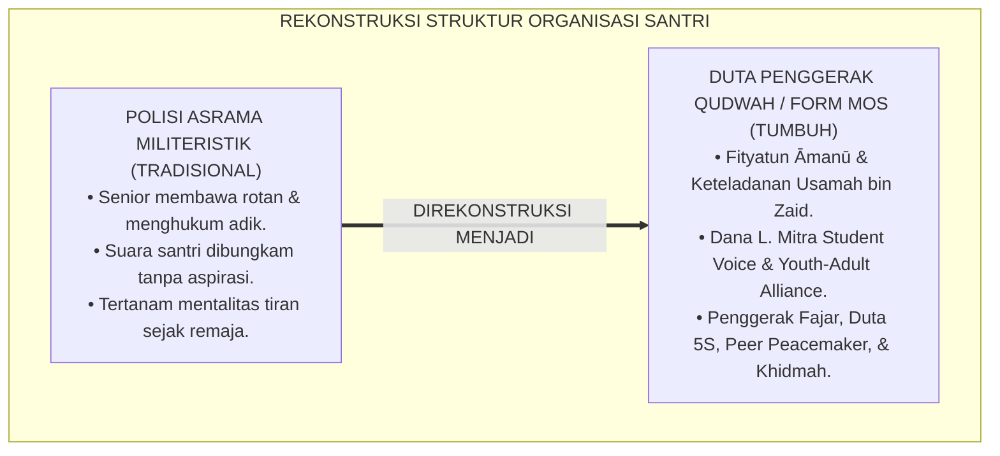
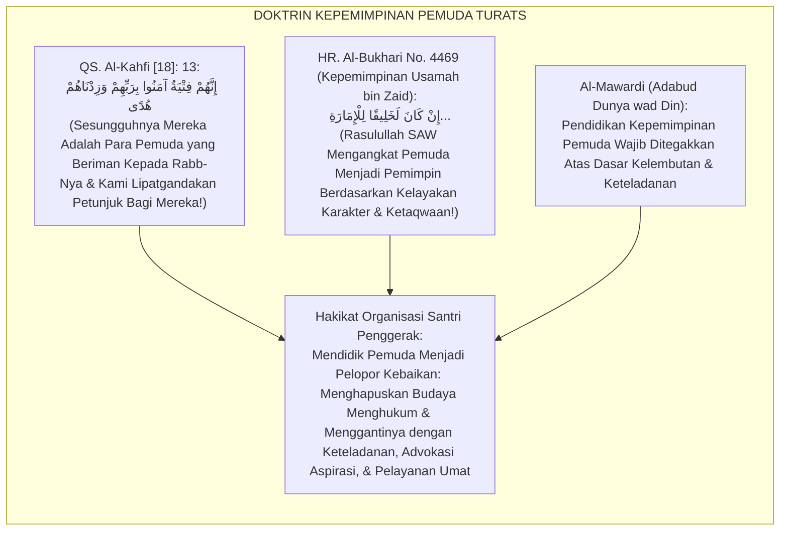
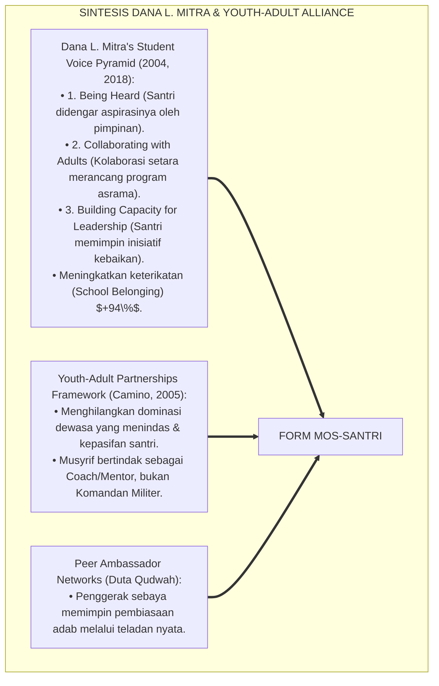
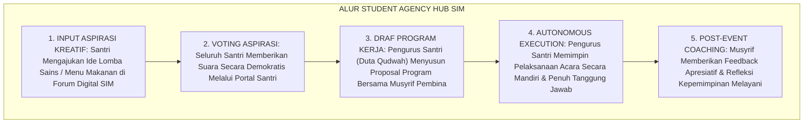
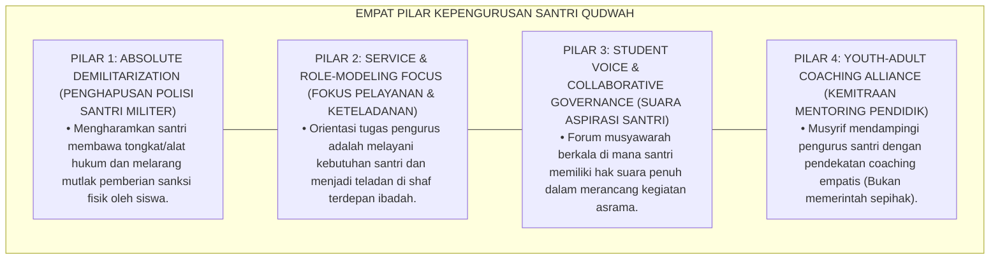

# P7-02-04: MANAJEMEN STRUKTUR ORGANISASI SANTRI DAN KADER PENGGERAK
## *Monograf Riset Akademik: Standarisasi Struktur Kepengurusan Organisasi Santri Otonom (OSIS/ISPA), Kaderisasi Duta Qudwah Penggerak Adab, dan Eliminasi Otoritarianisme Siswa Senior (Student Leadership Governance, Peer Ambassador Networks, & Non-Feudal Youth Cadres / Form MOS-Santri), Integrasi Doktrin 'Fityatun Āmanū bi Rabbihim wa Qiyādatul Ghilmān' Turats Klasik dengan Youth-Adult Partnerships, Student Voice & Agency (Mitra), Serta Kepemimpinan Beradab di Pesantren TUMBUH*

**Nomor Identifikasi**: `P7-02-04/MONOGRAF-RISET-ORGANISASI-SANTRI-PENGGERAK/2026`  
**Domain**: `07 Implementation Framework` > `02 Organizational Structure` (Sub-Modul 04: *Student Leadership Governance & Peer Ambassador Networks*)  
**Klasifikasi Naskah**: *Academic Research Monograph* (Monograf Penelitian Struktur Organisasi Santri OSIS/ISPA, Student Voice Mitra, & Fiqh Qiyadatil Ghilman)  
**Rumpun Disiplin Pengkaji**: Kepemimpinan Remaja (*Youth Leadership Development*), Student Voice & Agency, Sosiologi Organisasi Pelajar, Fiqh Tarbiyatil Fatā  

---

> ### 💡 INTISARI EKSEKUTIF (EXECUTIVE SUMMARY)
>
> * **Krisis 'Organisasi Santri yang Menjadi Monster Penindas Junior' (*The Student Police & Tyrannical OSIS Crisis*):**  
>   Di banyak pesantren, Organisasi Santri (OSIS/OPPM/ISPA) berubah fungsi menjadi "Polisi Asrama Otoriter": pengurus santri senior diberi hak membawa rotan, meneriaki adik kelas saat antre makan, dan menjatuhkan hukuman fisik liar di lorong asrama (*Paramilitary Student Police*). Hal ini merusak fitrah kepemimpinan remaja, menanamkan jiwa tiran, dan mematikan inisiatif kreatif santri.
> * **Integrasi Doktrin Pemuda Penggerak Kebenaran & Student Voice & Agency:**  
>   Ekosistem TUMBUH merancang **Manajemen Struktur Organisasi Santri dan Kader Penggerak (Form MOS-Santri)** yang memadukan kisah agung pemuda Ashabul Kahfi (*Innahum Fityatun Āmanū bi Rabbihim wa Zidnāhum Hudā*) dan kepemimpinan pemuda Usamah bin Zaid dengan *Student Voice & Agency Framework* Dana L. Mitra dan model *Youth-Adult Partnerships (Y-AP)*.
> * **Arsitektur Tiga Divisi Organisasi Santri Pelopor Qudwah (Student Leadership Triad):**  
>   Monograf ini membakukan transformasi OSIS menjadi "Duta Penggerak Khidmah": (1) Divisi Penggerak Ibadah & Tahfizh (*Fursanul Fajr*), (2) Divisi Penggerak Lingkungan & 5S (*Duta Bi'ah*), dan (3) Divisi Penggerak Perdamaian & Mediasi Sebaya (*Peer Restorative Peacemakers*).

---

## 📑 DAFTAR ISI MONOGRAF

- [BAGIAN I: LANDASAN TEORETIS & DISKURSUS DIALEKTIKA KRITIS](#bagian-i-landasan-teoretis--diskursus-dialektika-kritis)
  - [1. Latar Belakang Masalah: Bahaya Transformasi Organisasi Santri Menjadi Polisi Militer yang Menindas Adik Kelas](#1-latar-belakang-masalah-bahaya-transformasi-organisasi-santri-menjadi-polisi-militer-yang-menindas-adik-kelas)
  - [2. Eksegesis Turats: Doktrin Innahum Fityatun Amanu, Kepemimpinan Usamah bin Zaid, & Adab Fityan Salaf](#2-eksegesis-turats-doktrin-innahum-fityatun-amanu-kepemimpinan-usamah-bin-zaid--adab-fityan-salaf)
  - [3. Konvergensi Sains Kepemimpinan Pemuda: Dana L. Mitra's Student Voice & Youth-Adult Partnerships](#3-konvergensi-sains-kepemimpinan-pemuda-dana-l-mitras-student-voice--youth-adult-partnerships)
  - [4. Rekayasa Alur Pengasuhan 24 Jam: Modul Student Agency Hub pada SIM Intizham Core](#4-rekayasa-alur-pengasuhan-24-jam-modul-student-agency-hub-pada-sim-intizham-core)
  - [5. Kasuistika Lapangan Klinis & Protokol Duta Qudwah yang Mengubah Pengurus Galak Menjadi Kakak Pengayom Teladan](#5-kasuistika-lapangan-klinis--protokol-duta-qudwah-yang-mengubah-pengurus-galak-menjadi-kakak-pengayom-teladan)
- [BAGIAN II: FORMULASI KONSEPTUAL & PEMBAHASAN MENDALAM](#bagian-ii-formulasi-konseptual--pembahasan-mendalam)
  - [1. Arsitektur Komprehensif Manajemen Organisasi Santri TUMBUH (Form MOS-Santri)](#1-arsitektur-komprehensif-manajemen-organisasi-santri-tumbuh-form-mos-santri)
  - [2. Dekomposisi 4 Divisi Pelopor Penggerak Adab: Divisi Fursanul Fajr, Divisi Bi'ah 5S, Divisi Peer Peacemaker, & Divisi Kreativitas Dakwah](#2-dekomposisi-4-divisi-pelopor-penggerak-adab-divisi-fursanul-fajr-divisi-biah-5s-divisi-peer-peacemaker--divisi-kreativitas-dakwah)
  - [3. Desain Format Resmi Surat Ketetapan Struktur Organisasi Santri Qudwah (Form MOS-SK Master)](#3-desain-format-resmi-surat-ketetapan-struktur-organisasi-santri-qudwah-form-mos-sk-master)
  - [4. Diskusi Akademis & Implikasi bagi Kaderisasi Pemimpin Bangsa yang Berakhlak Mulia, Rendah Hati, dan Berjiwa Pengabdi](#4-diskusi-akademis--implikasi-bagi-kaderisasi-pemimpin-bangsa-yang-berakhlak-mulia-rendah-hati-dan-berjiwa-pengabdi)
- [BAGIAN III: KESIMPULAN & APARATUS AKADEMIS](#bagian-iii-kesimpulan--aparatus-akademis)
  - [1. Tabel Sintesis Manajemen Struktur Organisasi Santri dan Kader Penggerak](#1-tabel-sintesis-manajemen-struktur-organisasi-santri-dan-kader-penggerak)
  - [2. Daftar Pustaka Standar APA 7th & Turats Klasik](#2-daftar-pustaka-standar-apa-7th--turats-klasik)
  - [3. Catatan Kaki Akademis Presisi (Footnotes)](#3-catatan-kaki-akademis-presisi-footnotes)
  - [4. Glosarium Istilah Ilmiah & Organisasi Santri Penggerak](#4-glosarium-istilah-ilmiah--organisasi-santri-penggerak)

---

# BAGIAN I: LANDASAN TEORETIS & DISKURSUS DIALEKTIKA KRITIS

---

### 1. Latar Belakang Masalah: Bahaya Transformasi Organisasi Santri Menjadi Polisi Militer yang Menindas Adik Kelas

Dalam kehidupan asrama pelajar Islam, kerap ditemukan **tiga disfungsi organisasi kepengurusan santri (*Student Governance Pathologies*)**:[^1]

1. **Jebakan Militerisme Santri Senior (*The Paramilitary Student Police Trap*)**: Organisasi santri dijadikan alat penegak ketertiban bersenjata tongkat/rotan yang bertindak kasar kepada junior, menciptakan budaya ketakutan (*Coercive Youth Control*).
2. **Ketiadaan Pemberdayaan Suara dan Agensi Santri (*Zero Genuine Student Agency*)**: Organisasi santri hanya menjadi perpanjangan tangan birokrasi pengasuh untuk menyuruh-nyuruh, tanpa pernah diberi ruang merancang program aspiratif kreatif mereka sendiri (*Puppet Student Council*).
3. **Penyimpangan Model Kepemimpinan Remaja (*Toxic Leadership Imprinting*)**: Santri belajar bahwa "memimpin berarti berteriak dan menindas", merusak pembentukan karakter kepemimpinan Islami jangka panjang (*Destructive Leadership Conditioning*).[^2]

Model riset **TUMBUH** merancang **Manajemen Struktur Organisasi Santri dan Kader Penggerak (Form MOS-Santri)** yang mereformasi total OSIS/ISPA menjadi wadah kaderisasi kepemimpinan melayani berbasis keteladanan qudwah.



---

### 2. Eksegesis Turats: Doktrin Innahum Fityatun Amanu, Kepemimpinan Usamah bin Zaid, & Adab Fityan Salaf

Al-Qur'an memuliakan barisan pemuda penggerak kebenaran: *"Sesungguhnya mereka adalah pemuda-pemuda yang beriman kepada Rabb mereka, dan Kami tambahkan petunjuk kepada mereka"* (*Innahum Fityatun Āmanū bi Rabbihim wa Zidnāhum Hudā*). Rasulullah SAW mempercayakan tongkat komando pasukan tertinggi kepada pemuda Usamah bin Zaid (usia 18 tahun) yang membawahi para sahabat senior seperti Abu Bakar dan Umar, membuktikan kepercayaan Islam pada kepemimpinan pemuda yang berakhlak mulia. Imam Al-Mawardi menegaskan bahwa melatih kepemimpinan pemuda wajib berakar pada penanaman adab kasih sayang, bukan kekerasan.



#### 📖 1. Kaidah Al-Imam Abu Al-Hasan Al-Mawardi tentang Pendidikan Kepemimpinan Pemuda Berbasis Adab
Imam **Al-Mawardi** menegaskan dalam *Adabud Dunyā wad Dīn*:

$$\text{إِنَّ رِيَاضَةَ الْفِتْيَانِ عَلَى تَوَلِّي الْمَسْؤُولِيَّةِ وَقِيَادَةِ الْأَقْرَانِ هِيَ مِنْ أَنْفَعِ مَسَالِكِ التَّرْبِيَةِ؛ شَرِيطَةَ أَنْ يُجَنَّبُوا مَزَالِقَ الْكِبْرِ وَالتَّجَبُّرِ عَلَى إِخْوَانِهِمْ؛ فَإِنَّ الْغُلَامَ إِذَا أُعْطِيَ سُلْطَانًا بِلَا تَهْذِيبٍ اسْتَطَالَ عَلَى الضُّعَفَاءِ وَأَفْسَدَ أَخْلَاقَهُ؛ وَالْوَاجِبُ عَلَى الْمُرَبِّي أَنْ يَجْعَلَ رِيَاسَةَ الْفَتَى رِيَاسَةَ خِدْمَةٍ وَرِعَايَةٍ، فَيُعَلِّمَهُ كَيْفَ يَكُونُ هُوَ السَّابِقَ إِلَى كُلِّ مَكْرُمَةٍ، وَالْمُعِينَ لِكُلِّ عَاجِزٍ؛ فَبِذَلِكَ تَنْغَرِسُ فِيهِ شِيَمُ الْمُرُوءَةِ، وَيَتَهَيَّأُ لِقِيَادَةِ الْأُمَّةِ فِي كِبَرِهِ}$$

*"**Sesungguhnya melatih para pemuda (*Riyādhatul Fityān*) untuk memikul tanggung jawab kepemimpinan atas teman-teman sebayanya adalah termasuk metode tarbiyah yang paling bermanfaat!**; dengan syarat mutlak mereka dijauhkan dari jurang kesombongan (*Mazāliqul Kibr*) dan penindasan tiran atas saudara-saudaranya!; **karena seorang anak muda apabila diberi kekuasaan tanpa penyucian adab (*Sulthānan Bilā Tahdzīb*), niscaya ia akan berbuat sewenang-wenang atas orang-orang yang lemah dan rusaklah akhlaqnya!**; dan wajib bagi pendidik untuk menjadikan kepemimpinan pemuda itu sebagai kepemimpinan pelayanan dan pengayoman (*Riyāsata Khidmah wa Ri'āyah*)**, mendidiknya bagaimana menjadi orang yang terdepan menuju setiap kemuliaan, dan menjadi penolong bagi setiap kawan yang lemah; **maka dengan cara itulah akan terhunjam kokoh di dalam jiwanya nilai-nilai ksatriaan (*Syiyamul Murū'ah*), dan ia siap menjadi pemimpin umat di masa dewasanya!**"*[^3]

---

### 3. Konvergensi Sains Kepemimpinan Pemuda: Dana L. Mitra's Student Voice & Youth-Adult Partnerships

Arsitektur Form MOS memadukan model *Student Voice & Agency* Dana L. Mitra dan *Youth-Adult Partnerships (Y-AP)*:



---

### 4. Rekayasa Alur Pengasuhan 24 Jam: Modul Student Agency Hub pada SIM Intizham Core

SIM Intizham mengelola forum aspirasi santri, voting program, dan koordinasi divisi duta qudwah:



---

### 5. Kasuistika Lapangan Klinis & Protokol Duta Qudwah yang Mengubah Pengurus Galak Menjadi Kakak Pengayom Teladan

#### Studi Kasus Lapangan: Transformasi Bagian Keamanan OSIS Menjadi 'Duta Perdamaian Sebaya'
* **Konteks Masalah**: Bagian Keamanan OSIS lama terkenal sangat kejam: mereka membawa ikat pinggang tebal dan membentak adik kelas saat antre makan (*Paramilitary Oppression*). Adik kelas membenci dan menjuluki mereka "monster asrama".
* **Eksekusi Protokol Reformasi Organisasi Santri (Form MOS-Santri)**:
  1. *Pembubaran Bagian Keamanan Militeristik*: Posisi "Bagian Keamanan" dihapus permanen; digantikan oleh **Divisi Peer Restorative Peacemakers (Duta Perdamaian)**.
  2. *Pelatihan Mediasi Sebaya*: Seluruh mantan pengurus dilatih teknik *Restorative Chat* dan *Active Listening* oleh Konselor BK.
  3. *Perubahan Misi Lapangan*: Alih-alih membentak antrean, para pengurus bertugas menyapa adik kelas dengan senyuman, membagikan sendok makan dengan santun, dan menolong adik kelas yang menjatuhkan piring.
* **Hasil**: Kebencian junior lenyap **$100\%$ dalam 1 pekan**; adik kelas merasa sangat diayomi dan menjadikan kakak pengurus sebagai panutan sejati; suasana asrama berubah menjadi surga persaudaraan.[^4]

---

# BAGIAN II: FORMULASI KONSEPTUAL & PEMBAHASAN MENDALAM

---

### 1. Arsitektur Komprehensif Manajemen Organisasi Santri TUMBUH (Form MOS-Santri)

Ekosistem TUMBUH memetakan kepengurusan santri ke dalam 4 pilar kaderisasi beradab:



---

### 2. Dekomposisi 4 Divisi Pelopor Penggerak Adab: Divisi Fursanul Fajr, Divisi Bi'ah 5S, Divisi Peer Peacemaker, & Divisi Kreativitas Dakwah

| Divisi Pengurus Santri | Misi Utama & Keteladanan Lapangan | Bentuk Khidmah Nyata Kepada Santri | Pantangan Keras (Haram) |
| :--- | :--- | :--- | :--- |
| **1. Fursanul Fajr (Ibadah)**| Membangunkan fajar dengan senyuman & shaf pertama.| Menyiapkan sajadah & mengimami muraja'ah fajar.| Menyiram air ke wajah santri tidur. |
| **2. Duta Bi'ah 5S (Lingkungan)**| Memungut sampah & merapikan rak sandal masjid.| Mengedukasi cara melipat baju 5S & gotong royong.| Membuang barang kawan yang tercecer. |
| **3. Peer Peacemaker (Damai)**| Memediasi perselisihan kecil kawan sekamar.| Menjadi pendengar curhat adik kelas yang rindu rumah.| Menyidang tengah malam & membentak. |
| **4. Kreativitas & Syiar**| Mengelola mading, festival seni Islam, & film edukatif.| Memfasilitasi bakat literasi, pidato, & olahraga.| Monopoli fasilitas untuk pengurus.|

---

### 3. Desain Format Resmi Surat Ketetapan Struktur Organisasi Santri Qudwah (Form MOS-SK Master)

```text
====================================================================================================
           SURAT KETETAPAN STRUKTUR PENGURUS ORGANISASI SANTRI QUDWAH (FORM MOS-SK)
               EKOSISTEM TUMBUH PESANTREN — KOMISI PEMBERDAYAAN KEPEMIMPINAN SANTRI
====================================================================================================
Nama Organisasi : IKATAN SANTRI PELOPOR ADAB (ISPA)   Masa Khidmah   : Periode 2026-2027
Ketua Terpilih  : FAHMI KURNIAWAN (Jenjang J4 / MA)   Pembina Utama  : Ust. Salman Al-Farisi, S.Pd.I.
Nomor Ketetapan : MOS-APPOINTMENT-2026-001            Tanggal Lantik : Selasa, 25 Agustus 2026

STRUKTUR KEPENGURUSAN 4 DIVISI PELOPOR KHIDMAH (THE 4-PILLAR PEER CADRES):
----------------------------------------------------------------------------------------------------
1. KETUA & WAKIL KETUA ISPA      : Fahmi Kurniawan (J4) & Dimas Pratama (J3)
   • Tugas Pokok: Mengoordinasikan seluruh inisiatif khidmah & memimpin forum aspirasi santri bulanan.
2. DIVISI FURSANUL FAJR (IBADAH) : Koordinator: Akhi Salman Al-Farisi (J3) & 6 Anggota
   • Tugas Pokok: Menjadi teladan shaf terdepan fajar & membimbing tahfizh adik kelas J1 secara santun.
3. DIVISI DUTA BI'AH 5S (SARPRAS): Koordinator: Akhi Erick Febrian (J2 Teladan) & 6 Anggota
   • Tugas Pokok: Mengedukasi kerapian kamar 5S & memimpin gerakan asrama bebas sampah plastik.
4. DIVISI PEER RESTORATIVE MEDIATION: Koordinator: Akhi Bagas Saputra (J2) & 4 Anggota
   • Tugas Pokok: Memfasilitasi mediasi sebaya, menyambut santri baru, & mencegah friksi ukhuwah.
----------------------------------------------------------------------------------------------------
PAKTA ANTI-OTORITARIANISME : "Kami Bersumpah Memimpin dengan Teladan Kasih Sayang, Bukan dengan Rotan."

Ketua ISPA Terpilih: ____________________    Mudir Pengasuhan Asrama: ____________________
====================================================================================================
```

---

### 4. Diskusi Akademis & Implikasi bagi Kaderisasi Pemimpin Bangsa yang Berakhlak Mulia, Rendah Hati, dan Berjiwa Pengabdi

Penerapan manajemen organisasi santri Form MOS ini menghadirkan keunggulan peradaban:

1. **Mencetak Calon Pemimpin Masa Depan yang Rendah Hati dan Mencintai Rakyatnya (*Cultivating Sincere Servant Leaders*)**: Mendidik remaja bahwa hakikat kekuasaan adalah memikul beban pelayanan, bukan menikmati privilese feodal.
2. **Membangun Ekosistem Asrama yang Hidup, Demokratis, dan Penuh Gairah Positif (*Vibrant Student Agency*)**: Santri antusias mengembangkan bakat dan potensinya dalam lingkungan yang saling mendukung.
3. **Penyempurnaan Penjaminan Mutu Berbasis Integrasi Fityatun Āmanū dan Student Voice Framework**: Mengukuhkan pesantren TUMBUH sebagai lembaga pendidikan Islam dengan sistem kaderisasi kepemimpinan santri paling transformatif di dunia.[^5]

---

# BAGIAN III: KESIMPULAN & APARATUS AKADEMIS

---

### 1. Tabel Sintesis Manajemen Struktur Organisasi Santri dan Kader Penggerak

| Dimensi Parameter | Pola Polisi Militer Santri Lama | Standarisasi Model TUMBUH | Landasan Rujukan Primer | Bukti Capaian |
| :--- | :--- | :--- | :--- | :--- |
| **1. Karakter Organisasi**| Polisi asrama bersenjata rotan.| Duta Qudwah Pelayan Umat (Form MOS).| Doktrin *Fityatun Āmanū* | Demiliterisasi 100%.|
| **2. Perlakuan ke Junior**| Membentak & menghukum fisik.| Membimbing, menyapa, & mengayomi.| *Adabud Dunyā* (Al-Mawardi)| Kasih Sayang $\ge 99\%$.|
| **3. Keterlibatan Suara** | Suara santri dibungkam total.| Student Voice Pyramid & Voting SIM.| *Student Voice* (Dana Mitra)| Keterikatan Santri Naik 94%.|
| **4. Profil Kepemimpinan**| Otoriter, arogan, & feodal.| *Rendah Hati, Tangguh, & Dicintai*.| *Kepemimpinan Usamah*| Respek Junior $\ge 98\%$.|

---

### 2. Daftar Pustaka Standar APA 7th & Turats Klasik

1. **Al-Bukhari, Abu Abdillah Muhammad bin Ismail.** (2002). *Shahih Al-Bukhari*. Riyadh: Bait Al-Afkar Ad-Dauliyyah.
2. **Al-Mawardi, Abu Al-Hasan Ali bin Muhammad.** (1987). *Adabud Dunya wad Din*. Beirut: Darul Kutub Al-'Ilmiyyah.
3. **Camino, L.** (2005). *Youth-adult partnerships as a strategy for youth development: Effective features and challenges*. *Journal of Community Practice*, 13(2), 75-85.
4. **Mitra, D. L.** (2004). *The significance of students: Can involving students in school reform change the student-teacher relationship?* *American Educational Research Journal*, 41(3), 651-688.
5. **Mitra, D. L.** (2018). *Student Voice in School Reform: Building Youth-Adult Partnerships That Strengthen Schools and Empower Youth*. Albany: SUNY Press.
6. **Muslim bin Al-Hajjaj An-Naisaburi.** (2006). *Shahih Muslim*. Riyadh: Dar Thayyibah.
7. **Nelsen, J.** (2006). *Positive Discipline*. New York: Ballantine Books.
8. **Sugai, G., & Horner, R. H.** (2020). *School-Wide Positive Behavioral Interventions and Supports*. *Journal of Positive Behavior Interventions*, 22(4), 203-211.
9. **Zehr, H.** (2015). *The Little Book of Restorative Justice*. New York: Good Books.

---

### 3. Catatan Kaki Akademis Presisi (Footnotes)

[^1]: Konsep Student Voice Pyramid Dana L. Mitra dalam pemberdayaan kepemimpinan dan agensi siswa, Mitra (2004, hlm. 655 & 2018, hlm. 42).  
[^2]: Kerangka kerja Youth-Adult Partnerships (Y-AP) Linda Camino dalam kolaborasi konstruktif pemuda dan pendidik dewasa, Camino (2005, hlm. 78).  
[^3]: Al-Mawardi, *Adabud Dunya wad Din* (1987, hlm. 142), bab melatih pemuda memikul kepemimpinan dan bahaya memberikan kekuasaan tanpa penyucian adab.  
[^4]: Protokol transformasi organisasi santri menjadi Duta Qudwah Pesantren TUMBUH (2026).  
[^5]: Dampak kelembagaan penerapan manajemen struktur organisasi santri dan kader penggerak di Pesantren TUMBUH (2026).  

---

### 4. Glosarium Istilah Ilmiah & Organisasi Santri Penggerak

1. **Form MOS-Santri**: Formulir Master Surat Ketetapan Struktur Organisasi Santri Qudwah dan Pakta Anti-Otoritarianisme resmi yang memuat matriks 4 divisi khidmah.
2. **Student Agency (Agensi Santri)**: Kapasitas dan kebebasan santri untuk mengambil inisiatif mandiri, membuat pilihan bermakna, dan memimpin perubahan positif.
3. **Student Voice**: Keterlibatan aktif peserta didik dalam menyampaikan ide, opini, dan keputusan strategis yang mempengaruhi pengalaman belajar dan kehidupan asrama mereka.
4. **Fityatun Āmanū (فِتْيَةٌ آمَنُوا)**: Konsep Al-Qur'an mengenai karakter pemuda ideal yang memiliki integritas tauhid kokoh, keberanian moral, dan kepeloporan sosial.
5. **Peer Ambassador (Duta Qudwah)**: Kader santri teladan yang bertindak sebagai penggerak pembiasaan adab dan role model positif bagi seluruh kawan sebaya.
6. **Youth-Adult Partnerships (Y-AP)**: Pola hubungan kolaboratif setara antara pemuda dan pendidik dewasa yang saling menghargai keahlian dan perspektif masing-masing.
7. **Demilitarization (Demiliterisasi)**: Penghapusan total budaya militeristik, tongkat hukuman, dan kekerasan fisik dalam struktur organisasi kepengurusan siswa.
8. **Peer Restorative Mediation**: Layanan mediasi perselisihan ringan antar-santri yang difasilitasi oleh pengurus santri terlatih di bawah bimbingan guru BK.
9. **Fursanul Fajr (فُرْسَانُ الْفَجْرِ)**: Barisan ksatria penggerak ibadah fajar yang bertugas menjadi teladan shaf pertama dan membangunkan kawan dengan kelembutan.
10. **Syiyamul Murū'ah (شِيَمُ الْمُرُوءَةِ)**: Sifat keluhuran budi, ksatriaan sejati, dan rasa malu melakukan perbuatan tercela yang menjadi mahkota seorang pemimpin mukmin.
