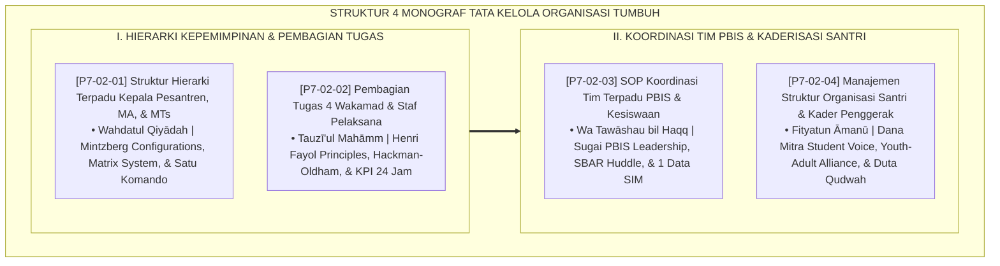

# P7-02: DOKUMEN INDUK STRUKTUR ORGANISASI DAN TIM TERPADU PENGASUHAN
## *Arsitektur dan Rekayasa Struktur Kepemimpinan Pesantren Satu Atap, Integrasi Hierarki Mudir-MA-MTs, Pembagian Tugas 4 Wakamad, SOP Koordinasi Tim PBIS Terpadu, Serta Manajemen Organisasi Santri Kader Penggerak (Unified Hierarchy Form SHT, 4-Wakamad Task Matrix Form PTW, PBIS Coordination SOP Form SKT, Serta Student Leadership Form MOS) di Ekosistem TUMBUH Pesantren*

**Nomor Identifikasi**: `P7-02/DOKUMEN-INDUK-STRUKTUR-ORGANISASI-TERPADU/2026`  
**Domain**: `07 Implementation Framework` > `02 Organizational Structure` (Gugus Sub-Domain 02: *Comprehensive Unified Pesantren Hierarchy, 4-Pillar Wakamad, PBIS Coordination, & Student Leadership Governance*)  
**Klasifikasi Naskah**: *Master Architecture & Navigation Monograph* (Dokumen Induk Peta Jalan Riset & Navigasi 4 Monograf Ilmiah Struktur Organisasi dan Tim Terpadu Pengasuhan)  
**Rumpun Disiplin Pengkaji**: Desain Organisasi Pendidikan Islam, Manajemen Sumber Daya Pendidik, Koordinasi Tim Multi-Disiplin PBIS, Kepemimpinan Remaja (*Youth Leadership*)  

---

> ### 💡 INTISARI EKSEKUTIF (EXECUTIVE SUMMARY)
>
> * **Kedudukan Strategis Gugus Struktur Organisasi dan Tim Terpadu Pengasuhan:**  
>   Gugus *Organizational Structure (Struktur Organisasi dan Tim Terpadu Pengasuhan)* merupakan rangka tulang punggung tata kelola operasional harian dan kolaborasi lintas unit (*The Daily Operational Backbone & Cross-Unit Collaboration Spine*) dalam Domain 07 (`07 Implementation Framework`). Gugus ini merancang arsitektur komando satu atap, memetakan tugas 4 pilar Wakamad, menstandardisasi briefing sinkronisasi harian, dan mentransformasi OSIS menjadi wadah kaderisasi qudwah: **Hierarki Satu Atap (Form SHT)**, **Matriks Tugas 4 Wakamad (Form PTW)**, **SOP PBIS Terpadu (Form SKT)**, dan **Organisasi Santri Penggerak (Form MOS)**.
> * **Integrasi Holistik Turats & Konsensus Sains Desain Organisasi Modern:**  
>   Gugus riset ini memadukan khazanah agung Islam tentang kesatuan komando (*Wahdatul Qiyādah*), pembagian amanah sesuai keahlian (*Tauzī'ul Mahāmm*), saling menasihati dalam kebenaran (*Wa Tawāshau bil Haqq*), dan kepemimpinan pemuda beriman (*Fityatun Āmanū*) dengan konsensus sains dunia (*Henry Mintzberg Organizational Configurations, Henri Fayol Administrative Principles, Hackman-Oldham Job Characteristics, Sugai & Horner PBIS Leadership Teams, SBAR Model, Dana Mitra Student Voice, dan Youth-Adult Partnerships*).
> * **Struktur Lengkap 4 Berkas Monograf Riset Ilmiah:**  
>   Dokumen induk ini memetakan dan menghubungkan 4 berkas monograf penelitian akademik komprehensif (~100 KB total riset) yang menyajikan bagan hierarki satu atap Mudir-MA-MTs, matriks KPI 4 Wakamad, notula morning sync SBAR 10 menit, dan piagam anti-otoritarianisme ISPA/OSIS.

---

## 📑 PETA NAVIGASI EMPAT MONOGRAF RISET STRUKTUR ORGANISASI

Berikut adalah daftar lengkap 4 monograf riset akademik dalam gugus **`02 Organizational Structure`**:

---

## 📚 DESKRIPSI RINGKAS 4 BERKAS MONOGRAF

1. **[P7-02-01: Struktur Hierarki Terpadu Kepala Pesantren, MA, dan MTs](file:///c:/xampp/htdocs/tumbuh/07%20Implementation%20Framework/02%20Organizational%20Structure/P7-02-01-Struktur-Hierarki-Terpadu-Kepala-Pesantren-MA-MTs.md)**  
   *Membahas integrasi satu komando Mudir 'Aam atas madrasah formal dan asrama, doktrin Wahdatul Qiyādah & Al-Juwaini, Henry Mintzberg Configurations, Matrix Organizational Theory, dan form Form SHT-Struktur.*
2. **[P7-02-02: Pembagian Tugas 4 Wakamad dan Staf Pelaksana](file:///c:/xampp/htdocs/tumbuh/07%20Implementation%20Framework/02%20Organizational%20Structure/P7-02-02-Pembagian-Tugas-4-Wakamad-dan-Staf-Pelaksana.md)**  
   *Membahas rincian wewenang dan KPI terukur 4 Wakil Kepala Madrasah (Kurikulum, Kesiswaan, Sarpras, Humas), doktrin Tauzī'ul Mahāmm & Al-Mawardi, Henri Fayol 14 Principles, Hackman-Oldham Job Characteristics, dan form Form PTW-Wakamad.*
3. **[P7-02-03: SOP Koordinasi Tim Terpadu PBIS dan Kesiswaan](file:///c:/xampp/htdocs/tumbuh/07%20Implementation%20Framework/02%20Organizational%20Structure/P7-02-03-SOP-Koordinasi-Tim-Terpadu-PBIS-dan-Kesiswaan.md)**  
   *Membahas sinkronisasi harian tim kesiswaan-asrama melalui morning huddle 10 menit, doktrin Wa Tawāshau bil Haqq & An-Nawawi, George Sugai PBIS Leadership Teams, SBAR Shift Handover Model, dan form Form SKT-PBIS.*
4. **[P7-02-04: Manajemen Struktur Organisasi Santri dan Kader Penggerak](file:///c:/xampp/htdocs/tumbuh/07%20Implementation%20Framework/02%20Organizational%20Structure/P7-02-04-Manajemen-Struktur-Organisasi-Santri-dan-Kader-Penggerak.md)**  
   *Membahas transformasi OSIS/ISPA dari polisi asrama militeristik menjadi Duta Qudwah Pelayan Umat, doktrin Fityatun Āmanū & Kepemimpinan Usamah bin Zaid, Dana L. Mitra Student Voice & Agency, Youth-Adult Partnerships, dan form Form MOS-Santri.*

---

## 🎯 STANDAR PENJAMINAN MUTU STRUKTUR ORGANISASI

Penerapan gugus **Struktur Organisasi dan Tim Terpadu Pengasuhan** menjamin bahwa:
1. **Komando Satu Atap Menghapuskan Semua Friksi Dualisme (*Total Dualism Eradication*)**: Tidak ada lagi benturan kebijakan antara sekolah formal dan asrama yang merugikan santri.
2. **Koordinasi Harian Morning Sync 10 Menit Mencegah Penzaliman Santri Akibat Ketidaktahuan Pendidik (*Zero Blind Spot Punishment*)**: Setiap santri diperlakukan dengan adil berdasarkan data kondisi aktualnya.
3. **Organisasi Santri Berubah Menjadi Laboratorium Kepemimpinan Mulia (*Youth Leadership Lab*)**: Mencetak generasi pemimpin masa depan yang rendah hati, melayani, dan dicintai kaumnya.
