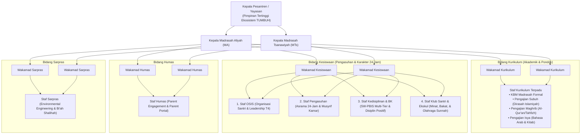

# P7-02: Struktur Organisasi dan Tim Terpadu Pengasuhan Pesantren

## Status Dokumen
* **Status**: 🌟 **A+ (Tervalidasi & Sesuai Rujukan Sistem Baru)**
* **Sub-Domain**: `07 Implementation Framework / 02 Organizational Structure`
* **Penanggung Jawab Keilmuan**: Dewan Keilmuan TUMBUH (*Pakar Tata Kelola Qudwah & Pakar Arsitektur PBIS Restoratif*)

---

## 1. Falsafah Integrasi Utuh (Tanpa Dikotomi Asrama-Madrasah)

Sesuai rujukan resmi `source/Sistem-Baru-Pembinaan-Santri.md`, ekosistem **TUMBUH** menerapkan **Integrasi Utuh 24-Jam**. Tidak ada pemisahan struktural atau dikotomi kaku antara "Pihak Asrama" dan "Pihak Madrasah". Seluruh aktivitas santri—mulai dari KBM kelas formal, pengajian diniyyah Subuh/Maghrib/Isya, hingga pembiasaan adab kamar asrama—berada dalam satu komando tata kelola madrasah terpadu.

---

## 2. Bagan Struktur Organisasi Terpadu Pesantren

---

## 3. Rincian Unit Pelaksana Terpadu

### A. Bidang Kurikulum (Madrasah & Pengajian Pondok)
- **Staf Kurikulum**: Bertanggung jawab penuh menyusun dan mengelola jadwal KBM Formal **dan** Pengajian Pondok 24-Jam:
  1. *Subuh*: Dirasah Islamiyah (Aqidah, Fiqih, Hadits, Akhlak, Muhadharah, Kajian Kitab).
  2. *Maghrib*: Al-Qur'an & Tahfizh Mutqin.
  3. *Isya*: Bahasa Arab (Mufradat, Hiwar, & Durusul Lughah).
  4. Pengelolaan absensi ustadz/santri, jadwal ujian/evaluasi, & pengarsipan laporan akademik-diniyyah.

### B. Bidang Kesiswaan (Pengasuhan, Kedisiplinan, & Karakter 24-Jam)
- **Staf OSIS**: Mengelola kepengurusan santri, kaderisasi *Servant Leadership*, & kepemimpinan Qudwah T4.
- **Staf Pengasuhan**: Mengelola pembiasaan adab kamar asrama 24 jam, pengawasan musyrif kamar, & *Warm Presence*.
- **Staf Kedisiplinan & BK**: Mengelola sistem SW-PBIS Multi-Tier (Tier 1-3), *Restorative Chat/Circles*, FBA Diagnostik, CICO System, & Konseling CBT.
- **Staf Klub Santri**: Mengelola kegiatan ekstrakurikuler, pengembangan minat/bakat, & olahraga sunnah (Pemanah, Berkuda, Berenang, Silat).

### C. Bidang Humas
- **Staf Humas**: Mengelola komunikasi orang tua (*Parent Engagement*), Parent Portal Digital, & kemitraan alumni.

### D. Bidang Sarana Prasarana (Sarpras)
- **Staf Sarpras**: Mengelola fasilitas fisik madrasah/asrama (*Environmental Engineering*), kecukupan cahaya, & kenyamanan iklim *Bi'ah Shalihah*.

---

## 4. Tim Terpadu PBIS & Kesiswaan (SW-PBIS Leadership Team)

Tim Terpadu PBIS dibentuk sebagai gabungan lintas pelaksana untuk rapat koordinasi mingguan:
- **Anggota**: Wakamad Kesiswaan, Staf Kedisiplinan & BK, Staf Pengasuhan (Senior Musyrif), Staf Kurikulum, & Wali Kelas.
- **Tugas Utama**: Meninjau data logbook digital PBIS, mengevaluasi tren EWS (Early Warning System), dan merumuskan intervensi Tier 2 (CICO) dan Tier 3 (BIP Khusus).
