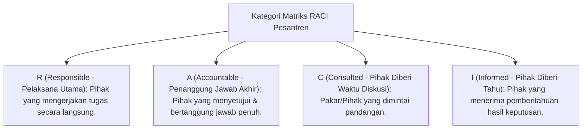

# P7-03-01: Matriks RACI Peran Pimpinan, Wakamad, dan Staf

## Status Dokumen
* **Status**: 🌟 **A+ (Tervalidasi & Siap Diimplementasikan)**
* **Sub-Domain**: `07 Implementation Framework / 03 Roles and Responsibilities`
* **Penanggung Jawab Keilmuan**: Dewan Keilmuan TUMBUH (*Pakar Tata Kelola Qudwah & Pakar Pedagogi Master Guru*)

---

## 1. Operasionalisasi Matriks RACI

Matriks RACI memperjelas tingkat keterlibatan setiap elemen kepemimpinan dan staf dalam keputusan pengasuhan:

---

## 2. Tabel RACI Keputusan Pengasuhan & Karakter

| Aktivitas / Keputusan | Kepala Pesantren | Kepala MA/MTs | 4 Wakamad | Staf Pelaksana / Musyrif |
| :--- | :---: | :---: | :---: | :---: |
| **Penetapan Policy Zero-Violence** | **A** | R | C | I |
| **Penyusunan Jadwal KBM & Pengajian 24-Jam**| I | **A** | R (WKur) | R (Staf Kur) |
| **Penanganan Pelanggaran Minor (Tier 1)** | I | I | C (WKes) | **A / R** (Musyrif) |
| **Penanganan Pelanggaran Sedang (Tier 2 CICO)**| I | I | **A** (WKes) | R (Musyrif & BK) |
| **Penanganan Pelanggaran Berat (Tier 3 BIP)** | **A** | R | R (WKes/BK) | R (Musyrif & BK) |
