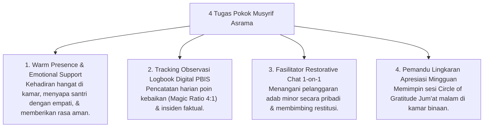

# P7-03-02: Deskripsi Peran Musyrif Asrama dan Rasio 1:15-20

## Status Dokumen
* **Status**: 🌟 **A+ (Tervalidasi & Siap Diimplementasikan)**
* **Sub-Domain**: `07 Implementation Framework / 03 Roles and Responsibilities`
* **Penanggung Jawab Keilmuan**: Dewan Keilmuan TUMBUH (*Pakar Pengasuhan Asrama & Pakar Bimbingan Konseling*)

---

## 1. Spesifikasi Peran Musyrif Asrama (In Loco Parentis)

Musyrif Asrama bertindak sebagai **Pengasuh Utama Pengganti Orang Tua (*In Loco Parentis*)** yang mendampingi kehidupan santri 24 jam di asrama:

---

## 2. Standar Rasio Berkeadilan (1 Musyrif : 15–20 Santri)

- **Pencegahan Burnout**: Setiap Musyrif hanya membina maksimal **15 hingga 20 santri (1-2 kamar)**.
- **Keterikatan Emosional**: Rasio kecil memungkinkan Musyrif mengenali dinamika kepribadian dan keunikan fitrah setiap santri binaannya secara mendalam.
