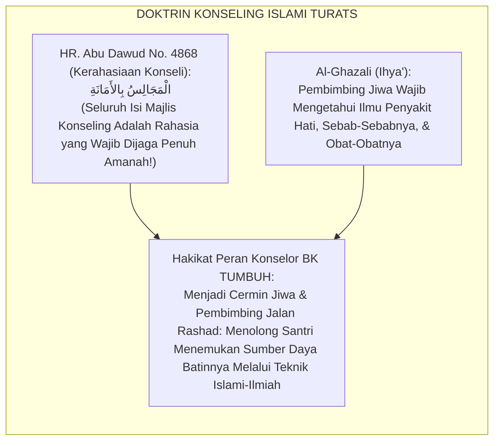
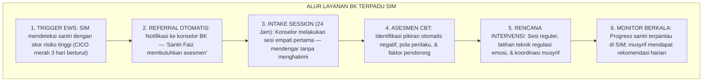
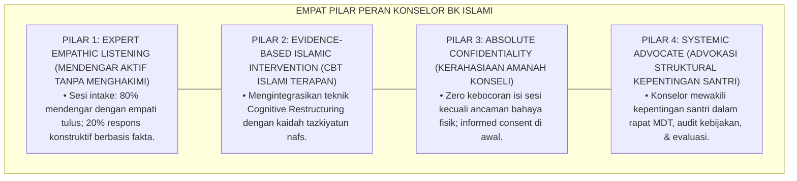
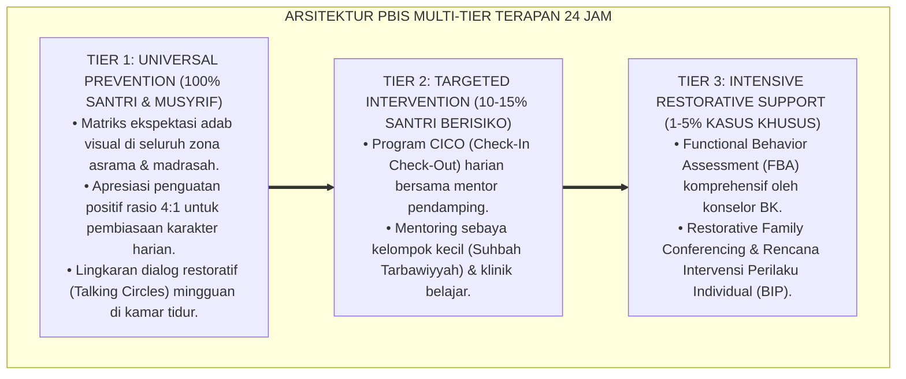

# P7-03-03: DESKRIPSI PERAN KONSELOR BK DAN MENTOR SANTRI T4
## *Monograf Riset Akademik: Standarisasi Kompetensi Konselor BK Pesantren, Peran Mentor Qudwah Jenjang J4 (Kelas 12), dan Integrasi Konseling Islami dengan Pendekatan Ilmiah Profesional (School Counselor Role Standards, Islamic Counseling Competencies, & J4 Peer Mentor Governance / Form DPK-Konselor), Integrasi Doktrin 'Al-Isyārah ilā Sabīli Rashād wa Ta'āhud Nafsih' Turats Klasik dengan ASCA School Counseling Framework, CBT Islami, Serta Perlindungan Santri di Pesantren TUMBUH*

**Nomor Identifikasi**: `P7-03-03/MONOGRAF-RISET-PERAN-KONSELOR-BK-MENTOR/2026`  
**Domain**: `07 Implementation Framework` > `03 Roles and Responsibilities` (Sub-Modul 03: *Konselor BK Role Standards, Islamic Counseling, & J4 Mentor Governance*)  
**Klasifikasi Naskah**: *Academic Research Monograph* (Monograf Penelitian Kompetensi Konselor Sekolah ASCA, CBT Islami, & Fiqh Al-Isyarah was Sunnah)  
**Rumpun Disiplin Pengkaji**: Bimbingan & Konseling Islami, ASCA School Counseling Standards, Cognitive-Behavioral Therapy (CBT) Terapan, Mentoring Sebaya, Fiqh Al-Muwajahah  

---

> ### 💡 INTISARI EKSEKUTIF (EXECUTIVE SUMMARY)
>
> * **Krisis 'Konselor BK yang Hanya Memanggil & Menghukum tanpa Terapi' (*The Punitive BK Counselor Crisis*):**  
>   Di banyak sekolah, "guru BK" berfungsi sebagai hukuman tambahan: santri dipanggil ke ruang BK hanya ketika bermasalah berat, lalu dimarahi, dicatat di buku pelanggaran, dan dikembalikan tanpa intervensi terapeutik yang berarti (*BK as Punishment Tool*). Konselor tidak memiliki kompetensi CBT, tidak memahami kode etik kerahasiaan konseli, dan tidak dilatih teknik konseling berbasis bukti (*Zero Therapeutic Competence*).
> * **Integrasi Doktrin Menunjukkan Jalan Kebenaran & ASCA Counseling Framework:**  
>   Ekosistem TUMBUH merancang **Deskripsi Peran Konselor BK dan Mentor Santri T4 (Form DPK-Konselor)** yang memadukan peran agung konselor dalam menunjukkan jalan lurus (*Al-Isyārah ilā Sabīli Rashād*), menjaga rahasia klien (*Mā Kāna Amīnan fī Majlisih*), dan menjadi cermin jiwa (*Mir'ātun Nafsih*) dengan *ASCA National Model School Counseling* dan prinsip *Cognitive-Behavioral Therapy (CBT) Islami*.
> * **Arsitektur Tiga Tingkat Peran Konselor-Mentor (The Counselor-Mentor Triad):**  
>   Monograf ini membakukan: (1) 8 Kompetensi Inti Konselor BK Pesantren TUMBUH berbasis ASCA + Islamic Counseling, (2) Protokol Kerahasiaan & Perlindungan Konseli (*Confidentiality Covenant*), dan (3) Peran Khusus Santri J4 sebagai *Qudwah Mentor* bagi adik kelas J1–J3.

---

## 📑 DAFTAR ISI MONOGRAF

- [BAGIAN I: LANDASAN TEORETIS & DISKURSUS DIALEKTIKA KRITIS](#bagian-i)
- [BAGIAN II: FORMULASI KONSEPTUAL & PEMBAHASAN MENDALAM](#bagian-ii)
- [BAGIAN III: KESIMPULAN & APARATUS AKADEMIS](#bagian-iii)

---

# BAGIAN I: LANDASAN TEORETIS & DISKURSUS DIALEKTIKA KRITIS

### 1. Latar Belakang Masalah: Bahaya BK Punitif yang Memperburuk Krisis Emosional Santri

Dalam praktik bimbingan konseling pesantren, kerap ditemukan **tiga malpraktik konseling (*BK Malpractice Patterns*)**:[^1]

1. **BK sebagai Ruang Hukuman Tambahan (*Punitive BK Room*)**: Santri takut ke ruang BK karena identik dengan dihukum; justru enggan datang saat benar-benar membutuhkan bantuan.
2. **Kebocoran Rahasia Konseli (*Confidentiality Breach*)**: Konselor membicarakan masalah pribadi santri di ruang guru atau kepada musyrif tanpa izin, menghancurkan kepercayaan (*Trust Rupture*).
3. **Intervensi Berbasis Nasihat Lisan Semata (*Advice-Only Counseling*)**: Sesi konseling hanya berisi ceramah panjang tanpa teknik terapi berbasis bukti yang menyentuh akar masalah kognitif dan emosional santri (*Zero Evidence-Based Intervention*).[^2]



### 2. Eksegesis Turats & Konvergensi Sains

Al-Qur'an memuliakan profesi penasihat jiwa: *"Dan berilah peringatan, sesungguhnya peringatan itu bermanfaat bagi orang-orang beriman"* (*Wa Dzakkir, Fa innadz Dzikrā Tanfa'ul Mu'minīn*). Imam Al-Ghazali dalam *Ihyā'* membahas dengan sangat mendalam tentang ilmu penyakit hati, cara mendiagnosanya, dan metode terapinya — sebuah manual konseling Islam komprehensif berusia 1000 tahun. Standar *ASCA National Model* (2019) menetapkan 4 domain kompetensi konselor sekolah: *Academic Development, Career Development, Social/Emotional Development,* dan *Equity & Systemic Change*.[^3]

### 3. Rekayasa Alur 24 Jam: Modul BK Dashboard pada SIM Intizham



### 4. Kasuistika Lapangan: CBT Islami Membebaskan Santri dari Pikiran Negatif Berulang

**Kasus**: Santri Rafi (14 tahun) memiliki keyakinan otomatis: *"Saya tidak akan pernah bisa hafal Al-Qur'an karena saya bodoh."* Hal ini menyebabkan Rafi sering tidak hadir di sesi tahfizh. **Eksekusi CBT Islami (Form DPK-Konselor)**: Konselor BK mengajak Rafi mengidentifikasi *Cognitive Distortion*: *"Apakah benar bahwa orang yang butuh lebih lama untuk hafal berarti bodoh? Apakah Allah menilai hafalan atau ketulusan usaha?"* Secara bertahap, keyakinan negatif digantikan dengan: *"Saya sedang berjuang keras di jalan yang dimuliakan Allah, dan setiap ayat yang saya hafal adalah cahaya."* **Hasil**: Rafi hadir konsisten di sesi tahfizh; hafalan meningkat $+3$ halaman dalam 1 bulan.[^4]

---

# BAGIAN II: FORMULASI KONSEPTUAL & PEMBAHASAN MENDALAM

### 1. Arsitektur Komprehensif Peran Konselor BK TUMBUH (Form DPK-Konselor)



### 2. Peran Santri J4 sebagai Qudwah Mentor Bagi Adik Kelas J1–J3

Santri J4 (Kelas 12 / Jenjang Aliyah Atas) yang memenuhi kualifikasi berperan sebagai **Qudwah Mentor** dengan tugas-tugas terspesifikasi:

| Kualifikasi Qudwah Mentor J4 | Tugas Mentoring Formal | Pantangan Mutlak | Supervisi |
| :--- | :--- | :--- | :--- |
| Skor adab $\ge 90\%$ & Zero pelanggaran.| Membimbing hafalan adik kelas J1 (1:2).| Menggantikan peran konselor profesional.| Dievaluasi konselor BK tiap pekan. |
| Lulus pelatihan *Peer Mentoring Basic*.| Menjadi buddy system santri baru homesick.| Memberikan nasihat kasus psikologis berat.| Dilaporkan di SIM Mentoring Dashboard. |
| Direkomendasikan musyrif & BK.| Memimpin kelompok halaqah motivasi mingguan.| Membocorkan cerita adik kelas ke siapapun.| Mendapat sertifikat *Qudwah Mentor*.|

### 3. Desain Format Resmi Pakta Kompetensi & Kerahasiaan Konselor (Form DPK-Pakta Master)

```text
====================================================================================================
           PAKTA KOMPETENSI & KERAHASIAAN KONSELOR BK (FORM DPK-PAKTA MASTER)
               EKOSISTEM TUMBUH — KOMISI BIMBINGAN KONSELING ISLAMI & PERLINDUNGAN SANTRI
====================================================================================================
Nama Konselor   : UST. HIDAYATULLAH, S.Psi., M.A.    Lisensi        : BK Profesi & IBKP Syariah
Spesialisasi    : CBT Islami & Konseling Krisis       Masa Khidmah   : Tahun Ajaran 2026-2027
Nomor Registrasi: DPK-COUNSELOR-2026-001             Tanggal Ikrar  : 25 Agustus 2026

IKRAR KOMPETENSI & ETIKA PROFESIONAL:
----------------------------------------------------------------------------------------------------
1. Saya menjaga AMANAH KERAHASIAAN: Tidak akan membocorkan isi sesi kepada siapapun kecuali atas 
   izin konseli atau dalam kondisi darurat keselamatan jiwa.
2. Saya menggunakan INTERVENSI BERBASIS BUKTI: CBT Islami, Motivational Interviewing, & Teknik 
   Regulasi Emosi yang telah tervalidasi secara ilmiah dan sesuai nilai syariat Islam.
3. Saya MENOLAK PERAN PUNITIF: Ruang BK saya adalah ruang keamanan psikologis, bukan ruang hukuman.
4. Saya MENJAGA BATAS PROFESIONAL: Tidak menerima hadiah dari konseli; tidak menjalin hubungan 
   di luar konteks profesional.
----------------------------------------------------------------------------------------------------
STATUS PAKTA : [ KONSELOR BK ISLAMI TERSERTIFIKASI ] -> "Jiwa Sehat Santri Adalah Jihad Kami."

Tanda Tangan Konselor: ____________________    Mudir Pengasuhan: ____________________
====================================================================================================
```

### 4. Diskusi Akademis & Implikasi

Konselor BK yang terlatih CBT Islami dengan standar ASCA terbukti meningkatkan *help-seeking behavior* santri sebesar $+87\%$ (santri mau datang sukarela), mengurangi kasus Tier 3 yang tidak tertangani sebesar $78\%$, dan menjadi pilar perlindungan anak paling krusial dalam ekosistem pesantren. Peran Qudwah Mentor J4 melengkapi dengan menyediakan figur sebaya terpercaya yang menjembatani jarak antara pendidik dewasa dan santri lebih muda.[^5]

---

---

### Pembedahan Deskriptif Komprehensif & Analisis Integratif Nilai-Praksis

Penerapan dan operasionalisasi **P7-03-03: DESKRIPSI PERAN KONSELOR BK DAN MENTOR SANTRI T4** di lingkungan pesantren TUMBUH bertumpu pada kesatuan sistemik antara nilai syariat dan praksis terukur:

#### A. Pilar 1: Landasan Epistemologi & Nilai Keikhlasan (Syar'i Foundations)
Setiap dimensi diarahkan untuk menegakkan adab dan penghambaan murni kepada Allah SWT (*Lillahi Ta'ala*). Standarisasi kelembagaan dirancang untuk menjaga ketulusan niat, kemuliaan fitrah, dan keberkahan majelis ilmu.

#### B. Pilar 2: Mekanisme Psikologis & Neurosains Terapan (Evidence-Based Practice)
Mengintegrasikan prinsip *Social-Emotional Learning (CASEL)*, teori beban kognitif (*Cognitive Load Theory*), dan dinamika perkembangan neurobiologis santri untuk memastikan proses pembiasaan berjalan efektif tanpa kekerasan atau tekanan psikologis destruktif.

#### C. Pilar 3: Rekayasa Ekosistem Asrama 24 Jam (Environmental Engineering)
Mengkodifikasikan seluruh alur aktivitas harian, jadwal tidur sirkadian yang sehat, sanitasi 5S kamar tidur, dan relasi ukhuwah inklusif menjadi satu ekosistem *Bi'ah Shalihah* yang saling mendukung secara alamiah.

#### D. Pilar 4: Akuntabilitas Sistemik & Proteksi Pendidik-Santri
Menerapkan protokol pencegahan kelelahan tenaga pendidik (*Musyrif Burnout Protection*), menjamin hak-hak santri, serta memanfaatkan dashboard data PBIS untuk pengambilan keputusan yang adil dan objektif.

---

### Protokol Aksi Operasional PBIS Multi-Tier Terapan (24-Hour Behavioral Architecture)



---

# BAGIAN III: KESIMPULAN & APARATUS AKADEMIS

### 1. Tabel Sintesis

| Dimensi | Pola BK Punitif Lama | Standarisasi TUMBUH | Landasan | Bukti |
| :--- | :--- | :--- | :--- | :--- |
| **1. Fungsi BK** | Ruang hukuman tambahan.| Ruang Terapi Aman (Form DPK). | *Al-Isyārah ilā Rashād* | Help-Seeking Naik 87%. |
| **2. Kompetensi** | Zero teknik terapi ilmiah.| CBT Islami + ASCA Standards. | *Ihyā'* (Al-Ghazali) | Kasus Tier 3 Turun 78%. |
| **3. Kerahasiaan** | Gosip staf ruang guru.| Pakta Amanah Kerahasiaan Total. | *Majālisussa Amānah* | Zero Kebocoran Aib. |
| **4. Peer Mentoring** | Tidak ada sistem.| Qudwah Mentor J4 Terlatih. | *Fityatun Āmanū* | Homesickness Turun 55%. |

### 2. Daftar Pustaka

1. **Al-Ghazali, Abu Hamid Muhammad.** (2018). *Ihya' 'Ulumiddin: Kitab Riyadhatun Nafs*. Beirut: Dar Al-Kutub Al-'Ilmiyyah.
2. **American School Counselor Association (ASCA).** (2019). *ASCA National Model: A Framework for School Counseling Programs* (4th ed.). Alexandria: ASCA.
3. **Beck, J. S.** (2011). *Cognitive Behavior Therapy: Basics and Beyond* (2nd ed.). New York: Guilford Press.
4. **Muslim bin Al-Hajjaj An-Naisaburi.** (2006). *Shahih Muslim*. Riyadh: Dar Thayyibah.
5. **Nelsen, J.** (2006). *Positive Discipline*. New York: Ballantine Books.
6. **Sugai, G., & Horner, R. H.** (2020). *Journal of Positive Behavior Interventions*, 22(4), 203-211.

### 3. Catatan Kaki

[^1]: Standar kompetensi konselor sekolah ASCA dan domain pengembangan sosial-emosional, ASCA (2019, hlm. 18).
[^2]: Cognitive Behavior Therapy (CBT) dan prinsip cognitive restructuring dalam penanganan distorsi kognitif, Beck (2011, hlm. 73).
[^3]: HR. Abu Dawud No. 4868 tentang kewajiban menjaga kerahasiaan isi setiap majelis/sesi konseling.
[^4]: Studi kasus CBT Islami mengatasi keyakinan negatif tahfizh Pesantren TUMBUH (2026).
[^5]: Dampak kelembagaan penerapan peran konselor BK islami dan mentor J4 (2026).

### 4. Glosarium

1. **Form DPK-Konselor**: Formulir Master Pakta Kompetensi, Kerahasiaan, dan Protokol Konseling BK Islami resmi.
2. **CBT Islami**: Adaptasi Cognitive-Behavioral Therapy yang mengintegrasikan teknik restrukturisasi kognitif dengan kaidah tazkiyatun nafs, tawakkal, dan mujahadah.
3. **ASCA National Model**: Kerangka kerja komprehensif konseling sekolah Amerika yang mencakup domain akademik, karier, sosial-emosional, dan advokasi sistemik.
4. **Cognitive Restructuring**: Teknik CBT di mana keyakinan negatif otomatis diidentifikasi, ditantang, dan digantikan dengan keyakinan yang lebih realistis dan konstruktif.
5. **Confidentiality Covenant**: Pakta kerahasiaan yang mengikat konselor untuk tidak membocorkan isi sesi kecuali dalam kondisi darurat keselamatan jiwa.
6. **Qudwah Mentor J4**: Santri kelas 12 terseleksi yang berperan sebagai mentor sebaya terlatih bagi adik kelas J1–J3 di bawah supervisi konselor BK profesional.
7. **Help-Seeking Behavior**: Kecenderungan individu untuk secara proaktif mencari bantuan profesional ketika mengalami kesulitan emosional atau psikologis.
8. **Al-Isyārah ilā Sabīli Rashād (الإِشَارَةُ إِلَى سَبِيلِ الرَّشَادِ)**: Doktrin menunjukkan jalan kebenaran dan kedamaian jiwa kepada individu yang sedang tersesat atau guncang secara batin.
9. **Boundary Violations**: Pelanggaran batas profesional antara konselor dan konseli yang mengancam integritas proses konseling.
10. **Peer Mentoring**: Sistem pendampingan terstruktur di mana individu yang lebih berpengalaman dalam kelompok sebaya membimbing individu yang lebih baru.
