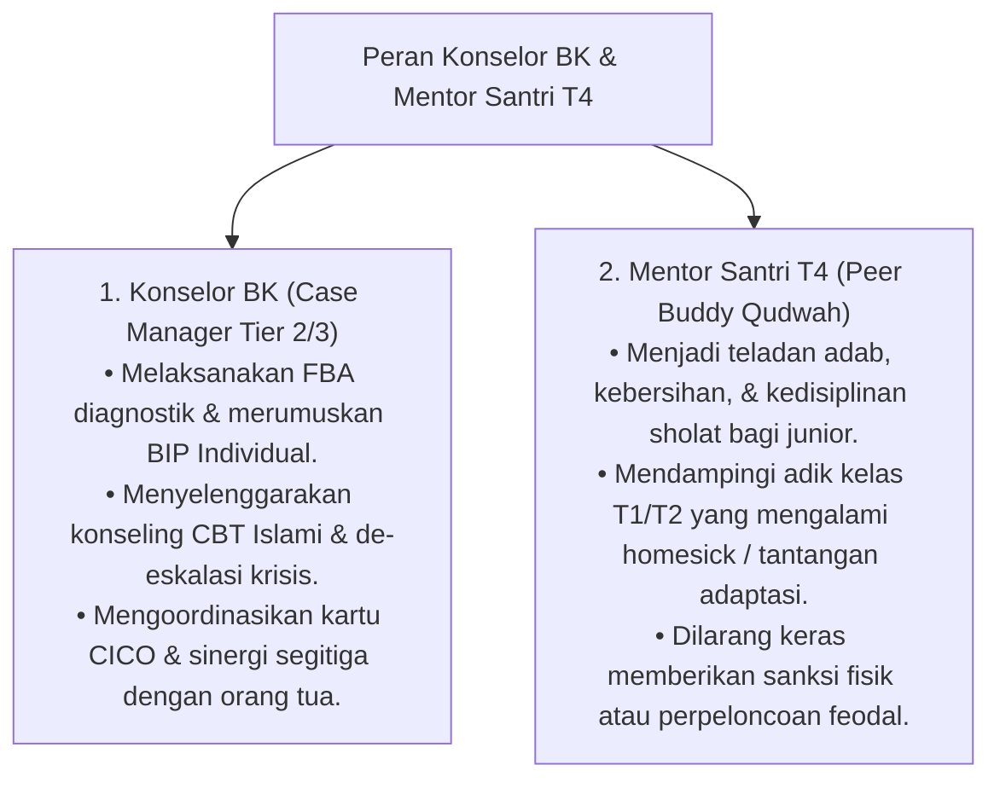

# P7-03-03: Deskripsi Peran Konselor BK dan Mentor Santri T4

## Status Dokumen
* **Status**: 🌟 **A+ (Tervalidasi & Siap Diimplementasikan)**
* **Sub-Domain**: `07 Implementation Framework / 03 Roles and Responsibilities`
* **Penanggung Jawab Keilmuan**: Dewan Keilmuan TUMBUH (*Pakar Bimbingan Konseling & Pakar Tata Kelola Qudwah*)

---

## 1. Spesifikasi Peran Konselor BK & Mentor Santri T4

---

## 2. Batas Wewenang Mentor Santri T4

Mentor Santri T4 berfungsi sebagai **Kakak Pembimbing (*Peer Buddy*)**, bukan penegak hukum atau penjatuh hukuman di asrama.
