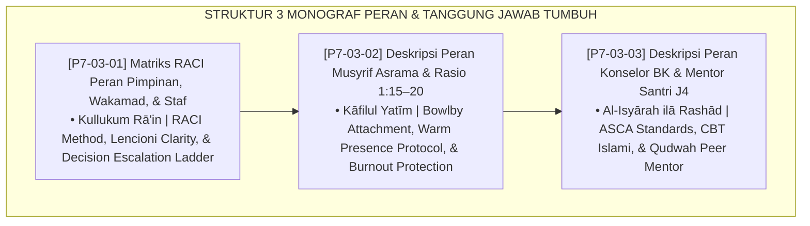

# P7-03: DOKUMEN INDUK DESKRIPSI PERAN DAN TANGGUNG JAWAB PENGASUHAN
## *Arsitektur dan Standarisasi Matriks Akuntabilitas RACI Jabatan Pesantren, Deskripsi Peran Musyrif Asrama Qudwah, dan Kompetensi Konselor BK Islami Beserta Peran Qudwah Mentor Santri J4 (RACI Accountability Form MRA, Musyrif Role & Ratio Form DPM, Serta BK Counselor & Mentor Form DPK) di Ekosistem TUMBUH Pesantren*

**Nomor Identifikasi**: `P7-03/DOKUMEN-INDUK-PERAN-TANGGUNG-JAWAB-PENGASUHAN/2026`  
**Domain**: `07 Implementation Framework` > `03 Roles and Responsibilities` (Gugus Sub-Domain 03: *Comprehensive Role Specifications, RACI Accountability, Musyrif Standards, & Counselor Competencies*)  
**Klasifikasi Naskah**: *Master Architecture & Navigation Monograph* (Dokumen Induk Peta Jalan Riset & Navigasi 3 Monograf Ilmiah Deskripsi Peran dan Tanggung Jawab Pengasuhan)  
**Rumpun Disiplin Pengkaji**: Manajemen SDM Pesantren, Psikologi Pengasuhan Asrama, Bimbingan & Konseling Islami, Fiqh Al-Amanah wal Wakalah  

---

> ### 💡 INTISARI EKSEKUTIF (EXECUTIVE SUMMARY)
>
> * **Kedudukan Strategis Gugus Deskripsi Peran dan Tanggung Jawab Pengasuhan:**  
>   Gugus *Roles and Responsibilities* merupakan cetak biru individual setiap jabatan dalam ekosistem pengasuhan (*The Individual Job Blueprint & Accountability Blueprint*). Tanpa kejelasan peran yang presisi, setiap bagian lain dari sistem (struktur, SOP, koordinasi) kehilangan pelaksana yang jelas. Gugus ini membakukan: **Matriks RACI (Form MRA)**, **Peran Musyrif & Rasio (Form DPM)**, dan **Kompetensi Konselor BK & Mentor J4 (Form DPK)**.
> * **Integrasi Holistik Turats & Konsensus Sains Manajemen Peran:**  
>   Gugus riset ini memadukan kaidah Islam tentang akuntabilitas universal (*Kullukum Rā'in*), amanah pengasuhan jiwa anak (*Kāfilul Yatīm*), kerahasiaan majelis konseling (*Al-Majālis bil Amānah*), dan kepemimpinan pemuda (*Fityatun Āmanū*) dengan konsensus sains (*RACI Matrix, Lencioni Organizational Clarity, Bowlby Attachment Theory, ASCA School Counseling, Beck CBT, dan Dana Mitra Student Voice*).
> * **Struktur Lengkap 3 Berkas Monograf Riset Ilmiah:**  
>   Dokumen induk ini memetakan dan menghubungkan 3 berkas monograf yang menyajikan matriks RACI 20 aktivitas, standar rasio musyrif 1:15–20, dan 8 kompetensi konselor BK islami.

---

## 📑 PETA NAVIGASI TIGA MONOGRAF RISET PERAN & TANGGUNG JAWAB

---

## 📚 DESKRIPSI RINGKAS 3 BERKAS MONOGRAF

1. **[P7-03-01: Matriks RACI Peran Pimpinan, Wakamad, dan Staf](file:///c:/xampp/htdocs/tumbuh/07%20Implementation%20Framework/03%20Roles%20and%20Responsibilities/P7-03-01-Matriks-RACI-Peran-Pimpinan-Wakamad-dan-Staf.md)**  
   *Memetakan akuntabilitas lintas jabatan untuk 20 aktivitas kritis pengasuhan melalui matriks RACI terstandar, doktrin Kullukum Rā'in, Patrick Lencioni Organizational Clarity, dan form Form MRA-RACI.*
2. **[P7-03-02: Deskripsi Peran Musyrif Asrama dan Rasio 1:15–20](file:///c:/xampp/htdocs/tumbuh/07%20Implementation%20Framework/03%20Roles%20and%20Responsibilities/P7-03-02-Deskripsi-Peran-Musyrif-Asrama-dan-Rasio-1-15-20.md)**  
   *Mendefinisikan musyrif sebagai ayah asuh ruhani dengan 14 interaksi positif harian dan rasio 1:15–20, doktrin Kāfilul Yatīm & Al-Ghazali, John Bowlby Attachment Theory, dan form Form DPM-Musyrif.*
3. **[P7-03-03: Deskripsi Peran Konselor BK dan Mentor Santri T4](file:///c:/xampp/htdocs/tumbuh/07%20Implementation%20Framework/03%20Roles%20and%20Responsibilities/P7-03-03-Deskripsi-Peran-Konselor-BK-dan-Mentor-Santri-T4.md)**  
   *Membakukan 8 kompetensi konselor BK islami dengan standar ASCA, CBT Islami, dan peran Qudwah Mentor J4 terlatih, doktrin Al-Isyārah ilā Rashād & Majālisussa Amānah, ASCA National Model, dan form Form DPK-Konselor.*

---

## 🎯 STANDAR PENJAMINAN MUTU PERAN & TANGGUNG JAWAB

Penerapan gugus **Deskripsi Peran dan Tanggung Jawab Pengasuhan** menjamin bahwa:
1. **Setiap Tugas Memiliki Pemilik yang Jelas dan Bertanggung Jawab (*Zero Diffusion of Responsibility*)**: Tidak ada urusan santri yang jatuh ke celah tanpa pemilik tindakan nyata.
2. **Musyrif Menjadi Figur Ayah Asuh yang Dicintai, Bukan Ditakuti (*Authentic Relational Care*)**: Setiap santri memiliki satu figur pelabuhan aman yang mengenalnya secara personal.
3. **Konselor BK Pesantren Setara dengan Standar Internasional ASCA dan Berakhlak Islami Terjaga (*World-Class Islamic Counseling*)**: Memberikan perlindungan kesehatan mental santri tertinggi dalam ekosistem pesantren modern.
