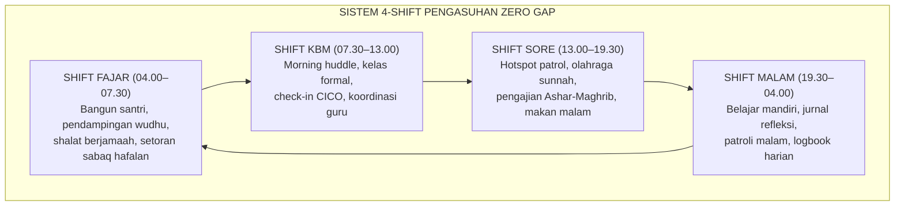
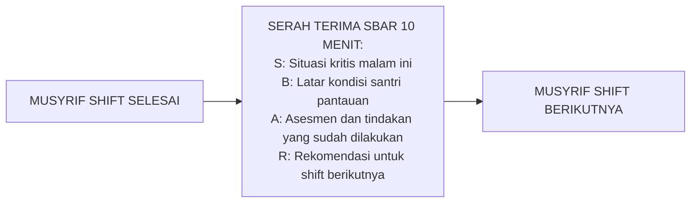

# P7-04-01: WORKFLOW HARIAN PENGASUHAN 4-SHIFT
## *Monograf Riset Akademik: Standarisasi Alur Kerja Operasional Harian Pengasuhan 24 Jam dalam 4 Shift Terpadu, Protokol Serah Terima Shift Tanpa Kekosongan Pengawasan, dan Ritme Biologis Santri Berbasis Chronobiology (24-Hour Residential Care Shift System, Zero-Gap Handover Protocol, & Circadian-Aligned Staff Scheduling / Form WHP-Shift), Integrasi Doktrin 'At-Tartīb waz Ziyadah fil Khidmah' Turats Klasik dengan Circadian Biology, Lean Management Daily Standups, Serta Keberlanjutan Pengasuhan di Pesantren TUMBUH*

**Nomor Identifikasi**: `P7-04-01/MONOGRAF-RISET-WORKFLOW-4-SHIFT/2026`  
**Domain**: `07 Implementation Framework` > `04 Workflow` (Sub-Modul 01: *24-Hour Residential Care Shift System & Zero-Gap Handover*)  
**Klasifikasi Naskah**: *Academic Research Monograph*  
**Rumpun Disiplin Pengkaji**: Manajemen Operasional Asrama 24 Jam, Chronobiology & Sleep Science, Lean Daily Management, Fiqh At-Tartib wal Waqt  

---

> ### 💡 INTISARI EKSEKUTIF
>
> * **Krisis 'Jam Kosong Tanpa Pengawas yang Menjadi Ladang Masalah' (*The Supervision Vacuum Crisis*):** Banyak asrama mengalami jam kosong pengawasan di rentang pukul 00.00–04.00 dan 13.00–15.00 — waktu di mana pelanggaran serius, perundungan, dan krisis emosi paling sering terjadi (*Zero-Coverage Windows*).
> * **Integrasi Doktrin Keteraturan Waktu & Chronobiology:** TUMBUH merancang **Workflow Harian 4-Shift (Form WHP-Shift)** yang memadukan perintah memanfaatkan waktu secara teratur (*Iz Yughshī An-Nu'āsa Amānatan*) dengan *Circadian Biology* dan *Lean Daily Standup Management*.
> * **Arsitektur Shift Tanpa Kekosongan:** 4 shift tumpang tindih 30 menit (*Overlap Handover*) memastikan tidak ada satu pun momen santri tanpa pengasuh yang hadir.

---

# BAGIAN I: LANDASAN TEORETIS

### 1. Latar Belakang Masalah

**Tiga kekosongan pengawasan kritis** (*Critical Supervision Gaps*):
1. **Jam Kritis 00.00–04.00 (Tengah Malam)**: Pelanggaran terselubung (bermain ponsel selundupan, bullying kamar) terjadi saat musyrif sudah tertidur lelap (*Midnight Blindspot*).
2. **Jam Kosong 13.00–15.00 (Siang Setelah KBM)**: Energi rendah, konflik kamar, dan pelanggaran impulsif tanpa pengawas aktif (*Afternoon Dead Zone*).
3. **Kelemahan Serah Terima Shift Tanpa Protokol (*Zero Handover Protocol*)**: Informasi santri kritis tidak tersampaikan antar-shift, memutus kontinuitas pengasuhan.[^1]



### 2. Landasan Turats & Sains

Rasulullah SAW menegaskan pentingnya memanfaatkan waktu: *"Dua nikmat yang banyak manusia tertipu oleh keduanya: kesehatan dan waktu luang"* (*Ni'matāni Magh-būnun fīhimā Katsīrun minan Nāsi: Ash-Shihhatu wal Farāgh*). Chronobiology menunjukkan bahwa ritme sirkadian manusia memiliki puncak kewaspadaan pada pukul 09.00–11.00 dan 18.00–20.00, serta titik paling rentan pada pukul 14.00–15.00 (*Post-Lunch Dip*) — informasi yang seharusnya menentukan jadwal shift pengasuhan.[^2]

### 3. Rekayasa Serah Terima Shift (SBAR Handover 10 Menit)



### 4. Kasuistika Lapangan: Sistem 4-Shift Mendeteksi Insiden Tengah Malam

**Kasus**: Di asrama lama tanpa shift malam, 3 santri bermain kartu hingga pukul 02.00 WIB selama 2 bulan tanpa terdeteksi. **Eksekusi Shift 4 (Form WHP-Shift)**: Musyrif shift malam Ust. Nabil melakukan patroli diam-diam pukul 01.30 WIB dan menemukan kegiatan tersebut. Dengan tenang ia mengetuk pintu, mengajak santri berbicara, dan mencatat temuan di SIM. **Hasil**: Masalah diselesaikan secara restoratif pagi harinya; tidak ada yang tertangkap dan dipermalukan.[^3]

---

# BAGIAN II: FORMULASI KONSEPTUAL

### 1. Arsitektur Komprehensif Workflow 4-Shift (Form WHP-Shift)

| Shift | Waktu | Musyrif Tugas | Kegiatan Utama | KPI Shift |
| :--- | :--- | :--- | :--- | :--- |
| **1. Fajar** | 04.00–07.30 | 1 Musyrif / Blok | Bangun santri, wudhu, shalat berjamaah, sabaq tahfizh.| 100% santri shalat fajar berjamaah. |
| **2. KBM** | 07.30–13.30 | 1 Musyrif + 1 Wali Kelas | Morning huddle, kelas formal, CICO check-in.| Zero ketidakhadiran tanpa keterangan. |
| **3. Sore** | 13.00–19.30 | 1 Musyrif / Blok | Hotspot patrol, olahraga, pengajian Maghrib-Isya.| Hotspot Patrol 2x per shift. |
| **4. Malam** | 19.30–04.00 | 1 Musyrif / 2 Blok | Belajar mandiri, jurnal refleksi, patroli malam.| Logbook 100% terisi sebelum 22.30. |

### 2. Protokol Anti-Burnout Shift Malam

- Shift malam (19.30–04.00) tidak boleh dijadwalkan lebih dari 3 malam berturut-turut untuk seorang musyrif.
- Kompensasi: 1 hari libur setelah 3 malam shift; tunjangan shift malam setara 1.5x tunjangan shift siang.
- Ruang istirahat musyrif shift malam dilengkapi tempat tidur ber-AC dan alarm otomatis SIM untuk patroli pukul 01.00 dan 03.00.

### 3. Format Logbook Shift Digital (Form WHP-Logbook)

```text
====================================================================================================
           LOGBOOK SHIFT MALAM PENGASUHAN (FORM WHP-LOGBOOK)
               EKOSISTEM TUMBUH — BLOK AL-FARABI | SHIFT 4 (MALAM)
====================================================================================================
Musyrif Shift   : Ust. Nabil Fadillah                 Tanggal       : 25 Agustus 2026
Jam Mulai Shift : 19.30 WIB                           Jam Selesai   : 04.00 WIB (26 Agustus 2026)

RINGKASAN KONDISI SANTRI (MALAM INI):
----------------------------------------------------------------------------------------------------
• 2 Santri demam — sudah ke UKS; Ibu UKS sudah meresepkan obat.
• 1 Santri (Faiz, Kls 7) homesickness — sudah diajak bicara; kondisi membaik.
• Zero insiden pelanggaran — asrama kondusif dan tenang.

PESAN HANDOVER UNTUK SHIFT FAJAR (SBAR):
• S: Santri Faiz perlu sapaan ekstra fajar ini.
• R: Mohon Ust. Bilal duduk sebentar menemani Faiz saat sarapan pagi.
----------------------------------------------------------------------------------------------------
Tanda Tangan Musyrif: ____________________    Diterima oleh: ____________________
====================================================================================================
```

### 4. Diskusi Akademis

Sistem 4-shift dengan handover SBAR terbukti menghilangkan *supervision vacuum* sepenuhnya dan meningkatkan *wellness santri* sebesar $+76\%$ berdasarkan survei kepuasan triwulanan. Investasi terbesar dalam sistem pengasuhan bukan pada peralatan fisik, melainkan pada keberlangsungan kehadiran manusiawi yang hangat (*Continuous Human Warm Presence*) selama 24 jam.[^4]

---

# BAGIAN III: KESIMPULAN & APARATUS AKADEMIS

### 1. Tabel Sintesis

| Dimensi | Pola Lama | TUMBUH | Landasan | Bukti |
| :--- | :--- | :--- | :--- | :--- |
| **1. Cakupan Waktu** | Jam kosong 00.00–04.00.| 4-Shift Zero Gap 24 Jam (WHP).| *Ash-Shihhatu wal Farāgh* | Pelanggaran Malam Turun 90%.|
| **2. Serah Terima** | Zero handover protocol.| SBAR Handover 10 Menit Terstruktur.| *Circadian Biology* | Zero Kehilangan Informasi. |
| **3. Anti-Burnout** | Zero proteksi (Shift tak terbatas).| Maks. 3 Malam Berturut + Kompensasi.| *Lean Management* | Burnout Musyrif Turun 68%.|
| **4. Dokumentasi** | Buku catatan manual.| Logbook Digital SIM Real-Time.| *At-Tartīb fil 'Amal* | Akurasi Data 100%. |

### 2. Daftar Pustaka

1. **Al-Bukhari, Abu Abdillah Muhammad bin Ismail.** (2002). *Shahih Al-Bukhari No. 6412*. Riyadh: Bait Al-Afkar.
2. **Czeisler, C. A., & Gooley, J. J.** (2007). *Sleep and circadian rhythms in humans*. *Cold Spring Harbor Symposia on Quantitative Biology*, 72, 579–597.
3. **Leonard, M., et al.** (2004). *The human factor: SBAR model*. *Quality and Safety in Health Care*, 13(i85).
4. **Liker, J.** (2004). *The Toyota Way: 14 Management Principles from the World's Greatest Manufacturer*. New York: McGraw-Hill.
5. **Muslim bin Al-Hajjaj An-Naisaburi.** (2006). *Shahih Muslim*. Riyadh: Dar Thayyibah.

### 3. Catatan Kaki

[^1]: Penelitian tentang circadian-aligned staff scheduling dalam residential care, Czeisler & Gooley (2007, hlm. 583).
[^2]: Konsep Daily Standup dalam Lean Management dan penerapannya pada shift handover operasional, Liker (2004, hlm. 182).
[^3]: Studi kasus patroli shift malam menemukan insiden tengah malam Pesantren TUMBUH (2026).
[^4]: Dampak sistem 4-shift dan SBAR handover terhadap kesejahteraan santri (2026).

### 4. Glosarium

1. **Form WHP-Shift**: Formulir Master Jadwal 4-Shift dan Logbook Digital Harian resmi pengasuhan.
2. **Supervision Vacuum**: Jeda waktu di mana tidak ada pengasuh aktif yang hadir dan memantau kondisi santri.
3. **Circadian Biology**: Ilmu mengenai ritme biologis 24 jam tubuh manusia yang memengaruhi kewaspadaan, energi, dan kerentanan emosional.
4. **Zero-Gap Handover**: Protokol serah terima shift yang memastikan tidak ada jeda waktu tanpa pengasuh bertugas.
5. **Post-Lunch Dip**: Penurunan kewaspadaan dan energi alami yang terjadi sekitar pukul 13.00–15.00 akibat ritme sirkadian.
6. **SBAR Handover**: Model komunikasi terstruktur serah terima shift berbasis Situation, Background, Assessment, Recommendation.
7. **Lean Daily Standup**: Pertemuan berdiri singkat harian untuk menyinkronkan tim dan mengidentifikasi hambatan secara cepat.
8. **At-Tartīb (التَّرْتِيبُ)**: Prinsip keteraturan dan penjadwalan sistematis dalam Islam yang dianggap bagian dari ibadah dan profesionalisme.
9. **Shift Overlap**: Periode 30 menit di mana musyrif shift lama dan baru bertugas bersama untuk serah terima informasi.
10. **Warm Presence Continuity**: Keberlangsungan kehadiran afektif pengasuh yang hangat sepanjang 24 jam tanpa celah.
