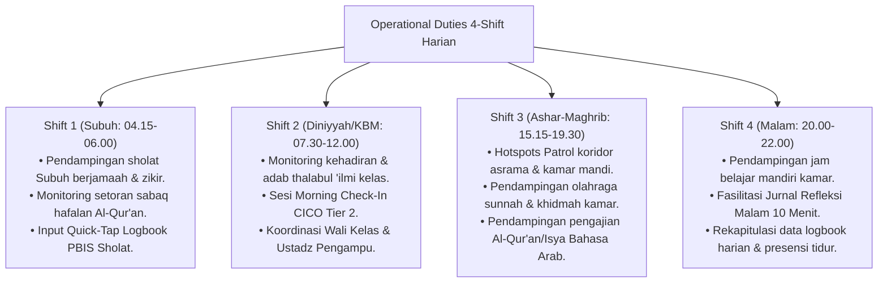

# P7-04-01: Workflow Harian Pengasuhan 4-Shift

## Status Dokumen
* **Status**: 🌟 **A+ (Tervalidasi & Siap Diimplementasikan)**
* **Sub-Domain**: `07 Implementation Framework / 04 Workflow`
* **Penanggung Jawab Keilmuan**: Dewan Keilmuan TUMBUH (*Pakar Pengasuhan Asrama & Pakar Arsitektur PBIS Restoratif*)

---

## 1. Operasionalisasi Workflow 4-Shift Musyrif & Ustadz

Alur kerja harian pengasuh dirancang dalam 4 shift koordinasi 24-jam tanpa kekosongan pengawasan:

---

## 2. Serah Terima Shift (Handover Protocol)

Setiap pergantian shift, Musyrif piket melakukan *Briefing Handover* selama 10 menit untuk menyampaikan santri yang membutuhkan perhatian emosional ekstra.
