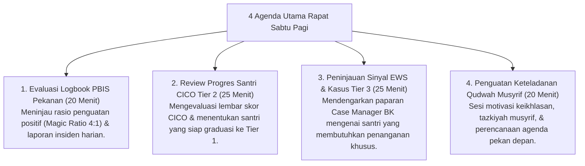

# P7-04-02: SOP Rapat Evaluasi Pengasuhan Sabtu Pagi

## Status Dokumen
* **Status**: 🌟 **A+ (Tervalidasi & Siap Diimplementasikan)**
* **Sub-Domain**: `07 Implementation Framework / 04 Workflow`
* **Penanggung Jawab Keilmuan**: Dewan Keilmuan TUMBUH (*Pakar Tata Kelola Qudwah & Pakar Bimbingan Konseling*)

---

## 1. SOP Rapat Evaluasi Mingguan (Sabtu Pagi)

Rapat Evaluasi Pengasuhan Sabtu Pagi (09.00 - 10.30) adalah forum koordinasi wajib mingguan yang dihadiri oleh Kepala Pengasuhan, Musyrif, Wali Kelas, dan Konselor BK:

---

## 2. Tindak Lanjut Hasil Rapat

Notulensi digital rapat disebarkan secara tertutup kepada seluruh musyrif untuk dijadikan panduan pembinaan pekan berikutnya.
