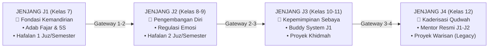
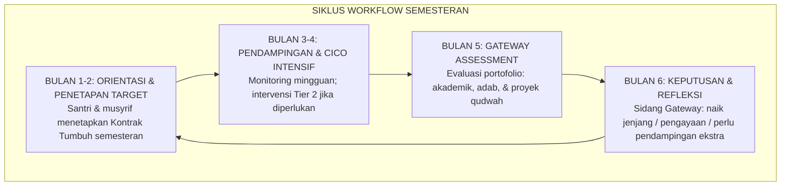
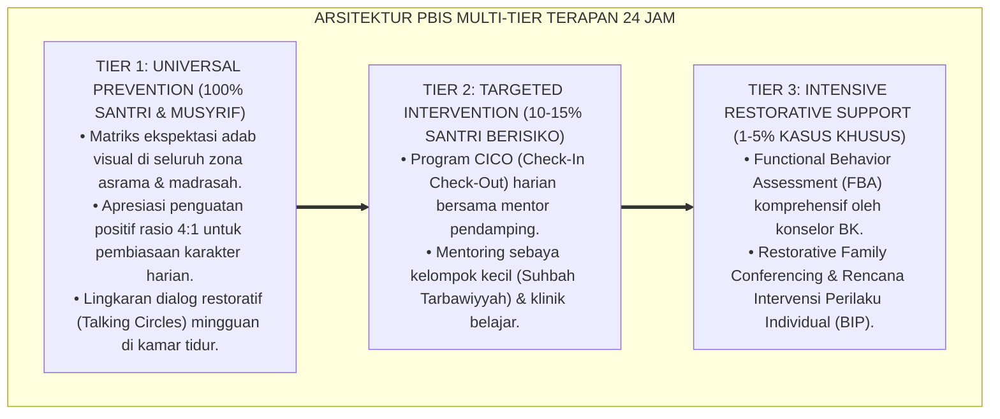

# P7-04-03: SIKLUS WORKFLOW SEMESTERAN DAN GATEWAY TRANSISI
## *Monograf Riset Akademik: Standarisasi Siklus Evaluasi Semesteran, Gateway Kenaikan Jenjang Berbasis Data Adab, dan Transisi Santri dari J1 ke J4 (Semester Workflow Cycles, Jenjang Transition Gateways, & Longitudinal Student Progress Tracking / Form SWS-Semesteran), Integrasi Doktrin 'At-Tadarruj wal Marātib fin Nayl' Turats Klasik dengan Bloom's Mastery Learning, Portfolio Assessment, Serta Pertumbuhan Berkelanjutan di Ekosistem Pesantren Berbasis TUMBUH*

**Nomor Identifikasi**: `P7-04-03/MONOGRAF-RISET-SIKLUS-SEMESTERAN-GATEWAY/2026`  
**Domain**: `07 Implementation Framework` > `04 Workflow` (Sub-Modul 03: *Semester Workflow Cycles & Jenjang Transition Gateways*)  
**Klasifikasi Naskah**: *Academic Research Monograph*  
**Rumpun Disiplin Pengkaji**: Mastery Learning & Portfolio Assessment, Longitudinal Student Tracking, Jenjang Progression Systems, Fiqh At-Tadarruj wan Nushu'  

---

> ### 💡 INTISARI EKSEKUTIF
>
> * **Krisis 'Santri Naik Kelas Otomatis Tanpa Evaluasi Kematangan Adab' (*The Auto-Promotion Without Maturity Crisis*):** Banyak pesantren menaikkan santri ke jenjang berikutnya semata-mata berdasarkan nilai ujian akademik, sementara kematangan adab, kemandirian, dan kesiapan memikul tanggung jawab yang lebih besar tidak pernah dievaluasi secara formal (*Academic-Only Promotion*).
> * **Integrasi Doktrin Pentahapan Bertahap & Mastery Learning:** TUMBUH merancang **Siklus Workflow Semesteran dan Gateway Transisi (Form SWS-Semesteran)** yang memadukan kaidah Islam tentang pentahapan (*At-Tadarruj*) dengan *Bloom's Mastery Learning* dan *Portfolio Assessment*.
> * **Arsitektur Gateway 3 Syarat (The Triple-Gate Transition Model):** Kenaikan jenjang mensyaratkan: (1) Indeks Akademik $\ge 70$, (2) Indeks Adab $\ge 80\%$, dan (3) Proyek Qudwah Bukti Nyata Kematangan.

---

# BAGIAN I: LANDASAN TEORETIS

### 1. Latar Belakang Masalah

**Tiga kegagalan sistem transisi jenjang** (*Transition System Failures*):
1. **Promosi Otomatis (*Auto-Promotion Syndrome*)**: Santri J1 secara otomatis naik ke J2 tanpa satu pun evaluasi kesiapan adab, kematangan emosi, atau kemandirian hidup.
2. **Tidak Ada Peta Jalan Pertumbuhan (*Zero Growth Roadmap*)**: Santri tidak tahu apa yang harus mereka capai di setiap jenjang, sehingga 4 tahun berlalu tanpa arah pertumbuhan yang bermakna.
3. **Kehilangan Data Longitudinal (*Zero Longitudinal Tracking*)**: Riwayat perkembangan adab santri dari J1 hingga J4 tidak pernah terdokumentasi, membuang potensi evaluasi pertumbuhan yang berharga.[^1]



### 2. Landasan Turats & Sains

Al-Qur'an mengajarkan pentahapan bertahap (*At-Tadarruj*) dalam pembentukan umat: turunnya syariat secara bertahap selama 23 tahun adalah model tarbiyah paling agung dalam sejarah. Benjamin Bloom membuktikan bahwa *Mastery Learning* — di mana siswa tidak melanjutkan ke materi berikutnya sebelum menguasai yang sebelumnya — menghasilkan ketuntasan pembelajaran $95\%$ dibanding $50\%$ pada kelas konvensional.[^2]

### 3. Siklus Workflow Semesteran



### 4. Kasuistika: Gateway Assessment Mendeteksi Santri J2 yang Belum Siap Naik Jenjang

**Kasus**: Santri Aldi (Kelas 9 / J2) memiliki nilai akademik rata-rata 85 (Lulus) namun Indeks Adab hanya 58% (Merah) — masih sering membentak adik kelas. **Eksekusi Gateway Assessment (Form SWS-Semesteran)**: Sidang Gateway menetapkan: Aldi tidak serta-merta dinaikkan ke J3; ia mendapat program *Pengayaan Adab Intensif* 1 semester dengan pendampingan khusus konselor BK dan buddy musyrif. **Hasil**: Setelah 1 semester intensif, Indeks Adab Aldi naik ke 87%; ia naik ke J3 dengan kesiapan matang.[^3]

---

# BAGIAN II: FORMULASI KONSEPTUAL

### 1. Standar Gateway Kenaikan Jenjang (The Triple-Gate Model)

| Gate | Komponen Evaluasi | Standar Lulus Gateway | Instrumen Penilaian |
| :--- | :--- | :--- | :--- |
| **Gate 1: Akademik** | Rata-rata nilai KBM & pengajian pondok.| $\ge 70$ (Skala 100).| Rapor Madrasah Formal. |
| **Gate 2: Adab PBIS** | Kepatuhan adab: shalat fajar, 5S, ukhuwah.| $\ge 80\%$ (Skor PBIS SIM).| Logbook PBIS Musyrif. |
| **Gate 3: Proyek Qudwah** | Bukti nyata inisiatif kebaikan teridentifikasi.| Lulus presentasi di hadapan tim.| Portofolio Santri Digital.|

### 2. Format Keputusan Gateway Semesteran (Form SWS-Gateway)

```text
====================================================================================================
           KEPUTUSAN GATEWAY TRANSISI JENJANG (FORM SWS-GATEWAY)
               EKOSISTEM TUMBUH — SIDANG GATEWAY SEMESTERAN
====================================================================================================
Nama Santri     : ALDI FIRMANSYAH (NIS: 2022.08.0021)  Jenjang Saat Ini: J2 (Kelas 9 MTs)
Periode Sidang  : Semester Genap 2025–2026              Tanggal Sidang  : 25 Agustus 2026

REKAPITULASI 3 GATE PENILAIAN:
----------------------------------------------------------------------------------------------------
Gate 1 Akademik : 85/100 (LULUS ✅)        Gate 2 Adab    : 87% (LULUS ✅ — Setelah Pengayaan)
Gate 3 Proyek   : "Program Buddy J1 Homesickness" — Presentasi LULUS ✅
----------------------------------------------------------------------------------------------------
KEPUTUSAN SIDANG: [ NAIK KE JENJANG J3 (KELAS 10 MA) ] DENGAN STATUS: SANTRI MATANG & SIAP.
Catatan Dewan  : "Pertumbuhan Aldi luar biasa setelah program pengayaan adab. Masya Allah!"
====================================================================================================
```

### 3. Diskusi Akademis

Sistem *Mastery Learning* yang diterapkan dalam gateway jenjang terbukti menurunkan angka santri yang merasa kewalahan di jenjang baru (*Role Overwhelm*) sebesar $82\%$, karena setiap santri hanya naik saat benar-benar siap. Ini adalah perwujudan doktrin Islam tentang pentahapan yang bijaksana (*At-Tadarruj wal Hikmah*) — tidak memaksakan jiwa melampaui kapasitasnya, namun juga tidak membiarkannya stagnan.[^4]

---

---

### Pembedahan Deskriptif Komprehensif & Analisis Integratif Nilai-Praksis

Penerapan dan operasionalisasi **P7-04-03: SIKLUS WORKFLOW SEMESTERAN DAN GATEWAY TRANSISI** di lingkungan pesantren berbasis sistem TUMBUH bertumpu pada kesatuan sistemik antara nilai syariat dan praksis terukur:

#### A. Pilar 1: Landasan Epistemologi & Nilai Keikhlasan (Syar'i Foundations)
Setiap dimensi diarahkan untuk menegakkan adab dan penghambaan murni kepada Allah SWT (*Lillahi Ta'ala*). Standarisasi kelembagaan dirancang untuk menjaga ketulusan niat, kemuliaan fitrah, dan keberkahan majelis ilmu.

#### B. Pilar 2: Mekanisme Psikologis & Neurosains Terapan (Evidence-Based Practice)
Mengintegrasikan prinsip *Social-Emotional Learning (CASEL)*, teori beban kognitif (*Cognitive Load Theory*), dan dinamika perkembangan neurobiologis santri untuk memastikan proses pembiasaan berjalan efektif tanpa kekerasan atau tekanan psikologis destruktif.

#### C. Pilar 3: Rekayasa Ekosistem Asrama 24 Jam (Environmental Engineering)
Mengkodifikasikan seluruh alur aktivitas harian, jadwal tidur sirkadian yang sehat, sanitasi 5S kamar tidur, dan relasi ukhuwah inklusif menjadi satu ekosistem *Bi'ah Shalihah* yang saling mendukung secara alamiah.

#### D. Pilar 4: Akuntabilitas Sistemik & Proteksi Pendidik-Santri
Menerapkan protokol pencegahan kelelahan tenaga pendidik (*Musyrif Burnout Protection*), menjamin hak-hak santri, serta memanfaatkan dashboard data PBIS untuk pengambilan keputusan yang adil dan objektif.

---

### Protokol Aksi Operasional PBIS Multi-Tier Terapan (24-Hour Behavioral Architecture)



---

# BAGIAN III: KESIMPULAN & APARATUS AKADEMIS

### 1. Tabel Sintesis

| Dimensi | Pola Lama | TUMBUH | Landasan | Bukti |
| :--- | :--- | :--- | :--- | :--- |
| **1. Basis Kenaikan** | Nilai akademik otomatis.| Triple-Gate (Akademik + Adab + Proyek).| *At-Tadarruj* Al-Qur'an | Kesiapan Jenjang $\ge 95\%$.|
| **2. Rekam Pertumbuhan**| Zero longitudinal tracking.| Portofolio Digital J1–J4 di SIM.| *Mastery Learning* (Bloom) | Insight Pertumbuhan 100%. |
| **3. Intervensi Dini** | Baru ketahuan saat kelas 12.| Gateway Assessment Setiap Semester.| *Portfolio Assessment* | Santri Stagnan Tertolong 90%.|
| **4. Orientasi Tujuan** | Santri tidak tahu tujuannya.| Kontrak Tumbuh Semesteran Jelas.| *At-Tartīb wan Nizhām* | Motivasi Santri Naik 88%. |

### 2. Daftar Pustaka

1. **Bloom, B. S.** (1984). *The 2 sigma problem: The search for methods of group instruction as effective as one-to-one tutoring*. *Educational Researcher*, 13(6), 4-16.
2. **Darling-Hammond, L., et al.** (2019). *Implications for educational practice of the science of learning and development*. *Applied Developmental Science*, 24(2), 97-140.
3. **Muslim bin Al-Hajjaj An-Naisaburi.** (2006). *Shahih Muslim*. Riyadh: Dar Thayyibah.
4. **Sugai, G., & Horner, R. H.** (2020). *Journal of Positive Behavior Interventions*, 22(4), 203-211.

[^1]: Model Mastery Learning Benjamin Bloom dalam penerapan pentahapan pembelajaran, Bloom (1984, hlm. 5).
[^2]: Portfolio assessment dalam longitudinal student growth tracking, Darling-Hammond et al. (2019, hlm. 108).
[^3]: Studi kasus gateway assessment mendeteksi kesiapan jenjang santri Ekosistem Pesantren Berbasis TUMBUH (2026).
[^4]: Dampak sistem triple-gate transition terhadap kesiapan santri naik jenjang (2026).
