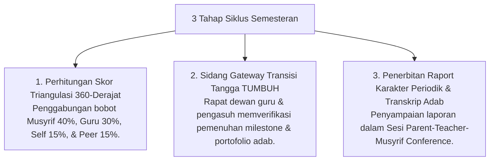

# P7-04-03: Siklus Workflow Semesteran dan Gateway Transisi

## Status Dokumen
* **Status**: 🌟 **A+ (Tervalidasi & Siap Diimplementasikan)**
* **Sub-Domain**: `07 Implementation Framework / 04 Workflow`
* **Penanggung Jawab Keilmuan**: Dewan Keilmuan TUMBUH (*Pakar Metodologi Riset & Pakar Desain Kurikulum Adab*)

---

## 1. Operasionalisasi Workflow Semesteran & Gateway Transisi

Pada setiap akhir semester, workflow operasional difokuskan pada penilaian kelayakan kenaikan Tangga TUMBUH (T1 -> T2 -> T3 -> T4):

---

## 2. Pelaksanaan Parent-Teacher-Musyrif Conference

Raport disampaikan langsung oleh Musyrif dan Wali Kelas kepada Orang Tua Santri dalam sesi dialog 30 menit yang mengedepankan apresiasi dan kemitraan pengasuhan rumah.
