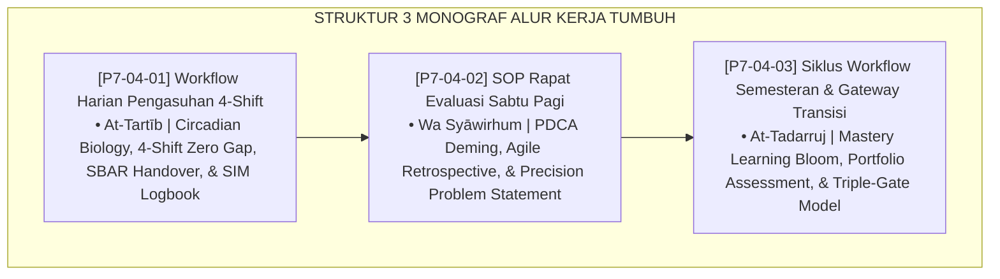

# P7-04: DOKUMEN INDUK ALUR KERJA OPERASIONAL PENGASUHAN DAN PEMBINAAN
## *Arsitektur dan Standarisasi Workflow Harian 4-Shift Tanpa Kekosongan Pengawasan, SOP Rapat Evaluasi Data PBIS Mingguan, dan Siklus Gateway Transisi Semesteran J1–J4 (24-Hour 4-Shift System Form WHP, Weekly PDCA Evaluation Form REP, Serta Semester Transition Gateway Form SWS) di Ekosistem TUMBUH Pesantren*

**Nomor Identifikasi**: `P7-04/DOKUMEN-INDUK-ALUR-KERJA-OPERASIONAL/2026`  
**Domain**: `07 Implementation Framework` > `04 Workflow` (Gugus Sub-Domain 04: *Comprehensive Operational Workflow, Weekly Data Review, & Semester Transition Cycles*)  
**Klasifikasi Naskah**: *Master Architecture & Navigation Monograph*  
**Rumpun Disiplin Pengkaji**: Manajemen Operasional Asrama, Lean Daily Management, Mastery Learning, Fiqh At-Tartib waz Ziyadah  

---

> ### 💡 INTISARI EKSEKUTIF
>
> * **Kedudukan Strategis Gugus Alur Kerja Operasional:** Gugus *Workflow* adalah mesin penggerak harian ekosistem TUMBUH — memastikan setiap jam dalam 24 jam, setiap minggu dalam semester, dan setiap semester dalam 4 tahun pembelajaran berlangsung dengan keteraturan yang bermakna, bukan sekadar rutinitas mekanis.
> * **Integrasi Holistik:** Memadukan *At-Tartīb waz Ziyadah* dalam Islam dengan *Circadian Biology*, *PDCA Deming*, *Agile Retrospectives*, dan *Mastery Learning Bloom*.
> * **3 Monograf Komprehensif:** Workflow 4-Shift Zero-Gap (Form WHP), Rapat PDCA Sabtu (Form REP), dan Gateway Triple-Gate Semesteran (Form SWS).

---

## 📑 PETA NAVIGASI TIGA MONOGRAF

---

## 📚 DESKRIPSI RINGKAS 3 BERKAS MONOGRAF

1. **[P7-04-01: Workflow Harian Pengasuhan 4-Shift](file:///c:/xampp/htdocs/tumbuh/07%20Implementation%20Framework/04%20Workflow/P7-04-01-Workflow-Harian-Pengasuhan-4-Shift.md)**  
   *Standarisasi 4-shift tanpa kekosongan pengawasan 24 jam dengan SBAR Handover 10 menit, doktrin At-Tartīb, Circadian Biology Czeisler, dan Form WHP-Shift & WHP-Logbook.*
2. **[P7-04-02: SOP Rapat Evaluasi Pengasuhan Sabtu Pagi](file:///c:/xampp/htdocs/tumbuh/07%20Implementation%20Framework/04%20Workflow/P7-04-02-SOP-Rapat-Evaluasi-Pengasuhan-Sabtu-Pagi.md)**  
   *SOP rapat evaluasi 60 menit berbasis siklus PDCA, doktrin Wa Syāwirhum, Deming PDCA, Agile Retrospectives Derby, dan Form REP-Notula.*
3. **[P7-04-03: Siklus Workflow Semesteran dan Gateway Transisi](file:///c:/xampp/htdocs/tumbuh/07%20Implementation%20Framework/04%20Workflow/P7-04-03-Siklus-Workflow-Semesteran-dan-Gateway-Transisi.md)**  
   *Triple-Gate kenaikan jenjang berbasis Akademik + Adab + Proyek Qudwah, doktrin At-Tadarruj, Bloom Mastery Learning, Portfolio Assessment, dan Form SWS-Gateway.*

---

## 🎯 STANDAR PENJAMINAN MUTU ALUR KERJA

Penerapan gugus **Alur Kerja Operasional Pengasuhan dan Pembinaan** menjamin bahwa:
1. **Tidak Ada Satu Jam pun yang Terbuang Tanpa Pengasuh Aktif di Sisi Santri (*Zero Supervision Vacuum*)**: 4-Shift dengan SBAR Handover memastikan kontinuitas kehadiran manusiawi penuh kasih.
2. **Setiap Masalah Diselesaikan Berdasarkan Data, Bukan Asumsi (*Evidence-Driven Weekly Solutions*)**: PDCA Sabtu Pagi mengubah rapat dari seremonial menjadi mesin keputusan yang produktif.
3. **Setiap Santri Naik Jenjang Karena Kesiapan Nyata, Bukan Sekadar Waktu Berlalu (*Maturity-Based Promotion*)**: Gateway Triple-Gate memastikan pertumbuhan adab setara dengan pertumbuhan akademik.
