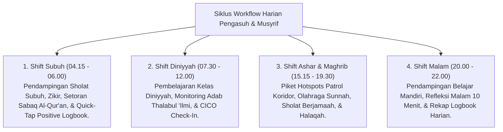

# P7-04: Alur Kerja Operasional Pengasuhan dan Pembinaan

## Status Dokumen
* **Status**: 🌟 **A+ (Tervalidasi & Siap Diimplementasikan)**
* **Sub-Domain**: `07 Implementation Framework / 04 Workflow`
* **Penanggung Jawab Keilmuan**: Dewan Keilmuan TUMBUH (*Pakar Pengasuhan Asrama & Pakar Arsitektur PBIS Restoratif*)

---

## 1. Siklus Workflow Operasional Harian Pesantren

Alur kerja harian pengasuh dirancang mengalir mengikuti ritme kehidupan santri di asrama dan masjid:

---

## 2. Ritme Rapat Evaluasi Pengasuhan Mingguan

- Setiap Sabtu pagi (09.00 - 10.30): Rapat koordinasi Musyrif, Wali Kelas, dan Tim BK untuk meninjau logbook harian, mengevaluasi peserta CICO Tier 2, dan menyelaraskan langkah pembinaan.
