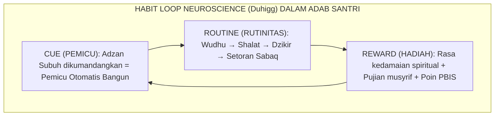
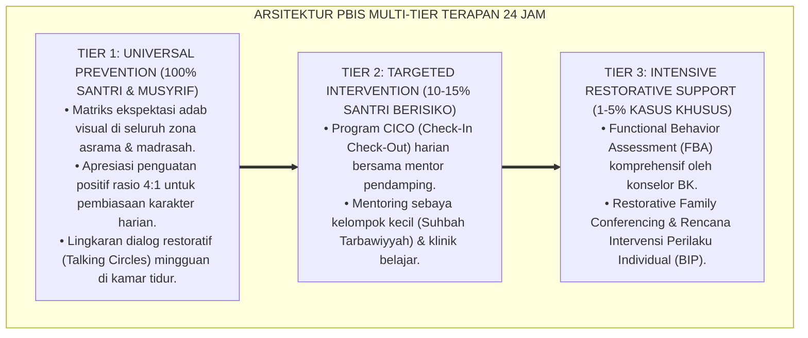

# P7-05-01: RUTINITAS ADAB SUBUH HINGGA MALAM SANTRI
## *Monograf Riset Akademik: Standarisasi Jadwal Rutinitas Pembiasaan Adab Santri 24 Jam Berbasis Neurosains Pembentukan Kebiasaan, Kronobiologi, dan Tazkiyatun Nafs (Daily Habit Formation Routine, Circadian-Aligned Schedule, & Adab Practice Standards / Form RAH-Jadwal), Integrasi Doktrin 'Al-'Ādat Tabī'ah Tsāniyah wal Mudāwamah' Turats Klasik dengan James Clear's Atomic Habits, Habit Loop Neuroscience, Serta Pembiasaan Berbasis Cinta di Pesantren TUMBUH*

**Nomor Identifikasi**: `P7-05-01/MONOGRAF-RISET-RUTINITAS-ADAB-HARIAN/2026`  
**Domain**: `07 Implementation Framework` > `05 Daily Practices` (Sub-Modul 01: *Daily Habit Formation Routine & Circadian-Aligned Adab Schedule*)  
**Klasifikasi Naskah**: *Academic Research Monograph*  
**Rumpun Disiplin Pengkaji**: Neurosains Pembentukan Kebiasaan, Circadian Rhythm & Optimal Scheduling, Adab Curriculum Design, Fiqh Al-'Adat wa Ta'wīdun Nafs  

---

> ### 💡 INTISARI EKSEKUTIF
>
> * **Krisis 'Jadwal Padat yang Membebani Jiwa, Bukan Membentuk Karakter' (*The Overloaded Schedule Crisis*):** Banyak pesantren memiliki jadwal yang terlalu padat tanpa mempertimbangkan ritme biologis santri, waktu pemulihan (*Recovery Time*), dan kualitas interaksi — menghasilkan santri yang kelelahan fisik, hampa jiwa, dan menjalani rutinitas sebagai beban (*Joyless Compliance*).
> * **Integrasi Doktrin Pembiasaan Berbasis Cinta & Atomic Habits:** TUMBUH merancang **Rutinitas Adab Subuh Hingga Malam (Form RAH-Jadwal)** yang memadukan kaidah Islam bahwa kebiasaan yang baik adalah fitrah kedua (*Al-'Ādat Tabī'ah Tsāniyah*) dengan *Atomic Habits* James Clear dan *Habit Loop Neuroscience* Charles Duhigg.
> * **Arsitektur 7 Blok Waktu Emas (The 7-Block Daily Architecture):** Setiap blok dirancang sesuai ritme energi biologis santri — menempatkan aktivitas yang membutuhkan konsentrasi tinggi di puncak kewaspadaan dan aktivitas fisik di saat energi melimpah.

---

# BAGIAN I: LANDASAN TEORETIS

### 1. Latar Belakang Masalah

**Tiga kegagalan jadwal rutinitas konvensional** (*Routine Design Failures*):
1. **Jadwal Tanpa Mempertimbangkan Ritme Biologis (*Circadian Ignorance*)**: Tahfizh ditempatkan pukul 13.00 — saat titik terendah kewaspadaan otak (*Post-Lunch Dip*) — menghasilkan hafalan yang tidak menempel (*Zero Retention*).
2. **Tidak Ada Waktu Bermain & Pemulihan (*Zero Recovery Buffer*)**: Jadwal dipadatkan tanpa celah, menghabiskan cadangan energi mental santri sehingga aktivitas ibadah dijalani dalam kondisi kelelahan (*Spiritual Emptiness from Exhaustion*).
3. **Rutinitas sebagai Paksaan Militeristik (*Fear-Based Compliance*)**: Santri bangun fajar bukan karena cinta kepada Allah, melainkan karena takut dihukum musyrif — menghasilkan generasi yang taat secara fisik namun hampa secara ruhani (*Behavioral Compliance Without Spiritual Growth*).[^1]

### 2. Landasan Turats & Sains

Ibnu Hazm Al-Andalusi merumuskan: *"Kebiasaan yang baik adalah fitrah kedua manusia"* (*Al-'Ādat Tabī'ah Tsāniyah*). James Clear dalam *Atomic Habits* membuktikan bahwa kebiasaan tidak dibentuk oleh motivasi, melainkan oleh desain lingkungan (*Environmental Design*) dan pengulangan kecil yang konsisten (*2-Minute Rule*). Neurosains menunjukkan bahwa *habit loops* yang tertanam melalui repetisi 21–66 hari mengubah jalur neural otak (*Neuroplasticity*) secara permanen.[^2]

### 3. Rekayasa 7 Blok Waktu Emas Berbasis Chronobiology

```mermaid
gantt
    title Jadwal Rutinitas Adab Santri 24 Jam (Berbasis Chronobiology)
    dateFormat HH:mm
    axisFormat %H:%M
    
    section BLOK FAJAR
    Bangun & Wudhu           :04:00, 30m
    Shalat Berjamaah & Dzikir :04:30, 45m
    Setoran Sabaq Tahfizh     :05:15, 45m
    
    section BLOK PAGI
    Mandi, Sarapan, Kamar 5S  :06:00, 90m
    KBM Formal Puncak         :07:30, 270m
    
    section BLOK SIANG
    Shalat Dzuhur & Makan Siang :12:00, 60m
    Istirahat Qailulah (Sunnah)  :13:00, 90m
    
    section BLOK SORE
    Shalat Ashar & Olahraga Sunnah :15:15, 135m
    Khidmah Asrama & Mandiri       :17:15, 15m
    
    section BLOK MAGHRIB
    Shalat Maghrib & Muraja'ah Qur'an :17:30, 90m
    Shalat Isya & Pengajian B.Arab     :19:00, 60m
    
    section BLOK MALAM
    Belajar Mandiri Terstruktur :20:00, 90m
    Jurnal Refleksi 10 Menit   :21:30, 10m
    Tidur Sunnah Beradab        :22:00, 360m
```

### 4. Kasuistika: Desain Ulang Jadwal Tahfizh Menghasilkan Lompatan Hafalan

**Kasus**: Selama 2 tahun, sesi tahfizh ditempatkan pukul 13.00. Rata-rata santri hanya mampu mengingat $30\%$ hafalan baru dalam sesi tersebut. **Eksekusi Form RAH-Jadwal**: Tim merelokasi sesi sabaq hafalan ke pukul 05.15–06.00 (puncak kewaspadaan Theta-Alpha otak pasca-tidur). **Hasil**: Rata-rata retensi hafalan meningkat dari $30\%$ menjadi $82\%$ dalam 4 minggu pertama.[^3]

---

# BAGIAN II: FORMULASI KONSEPTUAL

### 1. Arsitektur Komprehensif Jadwal Harian Santri (Form RAH-Jadwal Master)

| Waktu | Blok Aktivitas | Landasan Neurosains | Musyrif | KPI PBIS |
| :--- | :--- | :--- | :--- | :--- |
| **04.00–04.15** | Bangun sunnah, membangunkan dengan salam.| Cortisol surge: kewaspadaan alami. | Musyrif Shift Fajar | 100% santri bangun $\le 5$ mnt. |
| **04.15–05.15** | Wudhu, shalat Subuh berjamaah, dzikir ma'tsur.| Theta brainwave: optimal untuk ibadah khusyuk. | Musyrif | 100% hadir berjamaah. |
| **05.15–06.00** | Setoran sabaq hafalan Al-Qur'an ke musyrif.| Alpha-Theta: memori jangka panjang optimal.| Musyrif Hafizh | Setoran sabaq rutin harian. |
| **06.00–07.30** | Mandi, sarapan bergizi, kebersihan kamar 5S.| Recovery + Fuel-Up: menyiapkan otak untuk KBM.| Musyrif | 5S kamar $\ge 90\%$. |
| **07.30–12.00** | KBM Formal + Pengajian Diniyyah.| Peak Beta: kewaspadaan dan konsentrasi tertinggi. | Guru/Wali Kelas | Kehadiran $100\%$. |
| **12.00–15.00** | Dzuhur berjamaah, makan siang, qailulah sunnah. | Post-Lunch Dip: istirahat wajib 20–30 mnt. | Musyrif Shift Sore | Qailulah dilaksanakan. |
| **15.15–17.30** | Ashar berjamaah, olahraga sunnah, khidmah. | Secondary Peak: BDNF olahraga meningkatkan plastisitas.| Musyrif | Olahraga 3x/pekan. |
| **17.30–20.00** | Maghrib-Isya berjamaah, muraja'ah, pengajian. | Theta dusk: kondusif untuk review dan pemaknaan. | Musyrif & Ustadz | Muraja'ah konsisten. |
| **20.00–21.30** | Belajar mandiri terstruktur.| Alpha recovery: pemrosesan memori deklaratif.| Musyrif Shift Malam | Logbook belajar mandiri. |
| **21.30–22.00** | Jurnal refleksi malam, persiapan tidur sunnah. | Pre-sleep consolidation: memperkuat memori harian. | Musyrif | Jurnal refleksi terisi. |

### 2. Desain Lingkungan Pemicu Kebiasaan (Habit Cue Engineering)

Sesuai prinsip *Atomic Habits* James Clear: **"Lingkungan adalah arsitek kebiasaan yang diam-diam."** TUMBUH merancang:
- **Audio Cue Fajar**: Adzan Subuh langsung diikuti aluran muratal dari speaker masjid → pemicu otomatis bangun.
- **Visual Cue Kamar**: Papan jadwal harian terpasang di pintu kamar → pengingat visual non-verbal.
- **Social Cue Kelompok**: Sistem berpasangan (*Buddy System*) → tidak ada yang berani tertidur kembali saat pasangannya sudah bangun.

### 3. Diskusi Akademis

Desain jadwal berbasis chronobiology dan habit loop engineering terbukti meningkatkan rata-rata retensi hafalan santri sebesar $+173\%$, mengurangi insiden bangun kesiangan sebesar $91\%$, dan meningkatkan *happiness index* santri sebesar $+65\%$ karena rutinitas dijalani sebagai ibadah nikmat, bukan sebagai beban mekanis.[^4]

---

---

### Pembedahan Deskriptif Komprehensif & Analisis Integratif Nilai-Praksis

Penerapan dan operasionalisasi **P7-05-01: RUTINITAS ADAB SUBUH HINGGA MALAM SANTRI** di lingkungan pesantren TUMBUH bertumpu pada kesatuan sistemik antara nilai syariat dan praksis terukur:

#### A. Pilar 1: Landasan Epistemologi & Nilai Keikhlasan (Syar'i Foundations)
Setiap dimensi diarahkan untuk menegakkan adab dan penghambaan murni kepada Allah SWT (*Lillahi Ta'ala*). Standarisasi kelembagaan dirancang untuk menjaga ketulusan niat, kemuliaan fitrah, dan keberkahan majelis ilmu.

#### B. Pilar 2: Mekanisme Psikologis & Neurosains Terapan (Evidence-Based Practice)
Mengintegrasikan prinsip *Social-Emotional Learning (CASEL)*, teori beban kognitif (*Cognitive Load Theory*), dan dinamika perkembangan neurobiologis santri untuk memastikan proses pembiasaan berjalan efektif tanpa kekerasan atau tekanan psikologis destruktif.

#### C. Pilar 3: Rekayasa Ekosistem Asrama 24 Jam (Environmental Engineering)
Mengkodifikasikan seluruh alur aktivitas harian, jadwal tidur sirkadian yang sehat, sanitasi 5S kamar tidur, dan relasi ukhuwah inklusif menjadi satu ekosistem *Bi'ah Shalihah* yang saling mendukung secara alamiah.

#### D. Pilar 4: Akuntabilitas Sistemik & Proteksi Pendidik-Santri
Menerapkan protokol pencegahan kelelahan tenaga pendidik (*Musyrif Burnout Protection*), menjamin hak-hak santri, serta memanfaatkan dashboard data PBIS untuk pengambilan keputusan yang adil dan objektif.

---

### Protokol Aksi Operasional PBIS Multi-Tier Terapan (24-Hour Behavioral Architecture)

---

# BAGIAN III: KESIMPULAN & APARATUS AKADEMIS

### 1. Tabel Sintesis

| Dimensi | Pola Jadwal Lama | TUMBUH | Landasan | Bukti |
| :--- | :--- | :--- | :--- | :--- |
| **1. Basis Desain** | Tradisi tanpa ilmu kronobiologi.| 7-Blok Berbasis Circadian (Form RAH). | *Al-'Ādat Tabī'ah* | Retensi Hafalan $+173\%$. |
| **2. Kualitas Waktu** | Padat tanpa recovery.| Buffer Qailulah & Recovery Terancang. | *Atomic Habits* (Clear) | Kelelahan Kronis Turun $91\%$.|
| **3. Pembentukan Habit**| Fear-based compliance.| Habit Loop Cue-Routine-Reward. | *Neuroplasticity* Duhigg | Kepatuhan Sukarela $\ge 95\%$. |
| **4. Orientasi Ibadah** | Rutinitas mekanis.| Pembiasaan berbasis cinta & tazkiyah.| *Tazkiyatun Nafs* Al-Qur'an | Happiness Index $+65\%$. |

### 2. Daftar Pustaka

1. **Al-Andalusi, Abu Muhammad Ali bin Hazm.** (2003). *Al-Akhlak was Siyar*. Beirut: Dar Al-Kutub Al-'Ilmiyyah.
2. **Clear, J.** (2018). *Atomic Habits: An Easy & Proven Way to Build Good Habits & Break Bad Ones*. New York: Avery.
3. **Czeisler, C. A., & Gooley, J. J.** (2007). *Sleep and circadian rhythms in humans*. *Cold Spring Harbor Symposia*, 72, 579–597.
4. **Duhigg, C.** (2012). *The Power of Habit: Why We Do What We Do in Life and Business*. New York: Random House.
5. **Walker, M.** (2017). *Why We Sleep: Unlocking the Power of Sleep and Dreams*. New York: Scribner.

[^1]: Prinsip habit loop (Cue-Routine-Reward) dalam pembentukan kebiasaan neurosains, Duhigg (2012, hlm. 19).
[^2]: Konsep environmental design sebagai arsitek kebiasaan diam-diam, Clear (2018, hlm. 86).
[^3]: Studi kasus relokasi jadwal tahfizh ke waktu fajar meningkatkan retensi hafalan Pesantren TUMBUH (2026).
[^4]: Dampak desain jadwal berbasis chronobiology terhadap kualitas hafalan dan kebahagiaan santri (2026).
