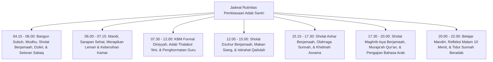

# P7-05-01: Rutinitas Adab Subuh Hingga Malam Santri

## Status Dokumen
* **Status**: 🌟 **A+ (Tervalidasi & Siap Diimplementasikan)**
* **Sub-Domain**: `07 Implementation Framework / 05 Daily Practices`
* **Penanggung Jawab Keilmuan**: Dewan Keilmuan TUMBUH (*Pakar Desain Kurikulum Adab & Pakar Pengasuhan Asrama*)

---

## 1. Spesifikasi Pembiasaan Adab Harian Santri (Subuh - Tidur Malam)

---

## 2. Kunci Kesuksesan Pembiasaan Adab

Rutinitas harian dilaksanakan bukan sebagai keterpaksaan militeristik, melainkan sebagai bentuk ibadah nikmat (*Tazkiyatun Nafs*) yang didampingi musyrif secara hangat.
