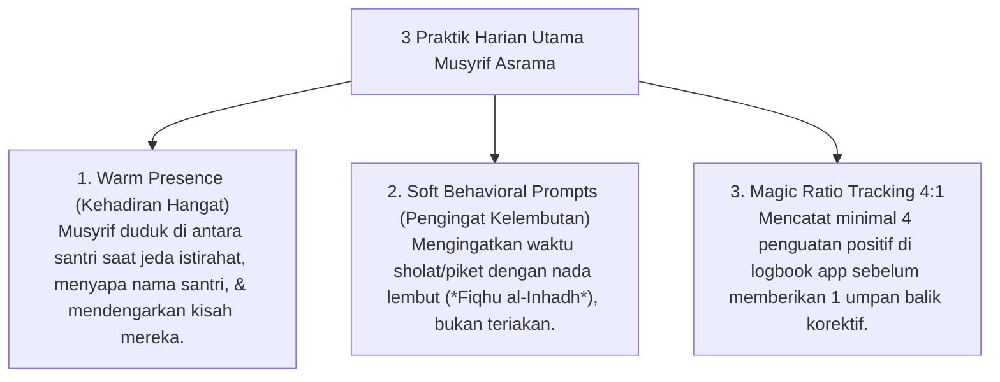

# P7-05-02: Praktik Harian Musyrif Warm Presence dan Prompts

## Status Dokumen
* **Status**: 🌟 **A+ (Tervalidasi & Siap Diimplementasikan)**
* **Sub-Domain**: `07 Implementation Framework / 05 Daily Practices`
* **Penanggung Jawab Keilmuan**: Dewan Keilmuan TUMBUH (*Pakar Pengasuhan Asrama & Pakar Bimbingan Konseling*)

---

## 1. Operasionalisasi Warm Presence & Positive Prompts

Praktik harian Musyrif Asrama difokuskan pada pengondisian emosional positif di kamar melalui 3 teknik utama:

---

## 2. Dampak Pada Rasa Aman Santri (*Psychological Safety*)

Kehadiran hangat musyrif menghilangkan kecemasan sosial santri (*homesick*) dan membangun ikatan relasi edukatif yang kokoh.
