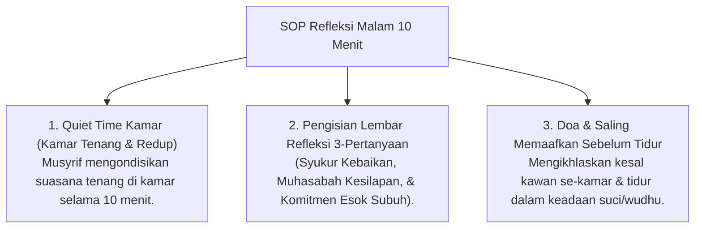

# P7-05-03: Protokol Jurnal Refleksi Malam dan Muhasabah

## Status Dokumen
* **Status**: 🌟 **A+ (Tervalidasi & Siap Diimplementasikan)**
* **Sub-Domain**: `07 Implementation Framework / 05 Daily Practices`
* **Penanggung Jawab Keilmuan**: Dewan Keilmuan TUMBUH (*Pakar Epistemologi Turats & Pakar Bimbingan Konseling*)

---

## 1. Operasionalisasi Refleksi Malam Santri (21.40 - 21.50)

Jurnal Refleksi Malam adalah praktik harian santri sebelum tidur untuk melatih muhasabah an-nafs dan metakognisi diri:

---

## 2. Penghormatan Atas Ruang Privasi Santri

Isi jurnal refleksi malam bersifat pribadi (*Privacy Space*) dan tidak diperiksa musyrif sebagai alat pengawas, melainkan menjadi bahan perenungan mandiri santri.
