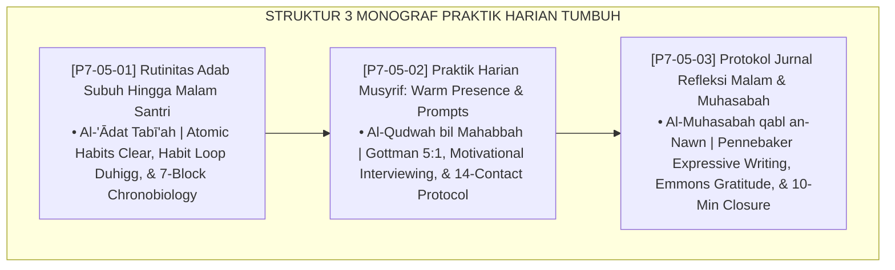

# P7-05: DOKUMEN INDUK PEMBIASAAN PRAKTIK HARIAN DAN RUTINITAS ADAB
## *Arsitektur dan Standarisasi Jadwal Rutinitas Adab Santri 24 Jam Berbasis Chronobiology, Protokol Warm Presence 14 Kontak Positif Harian Musyrif, dan Sistem Jurnal Refleksi Malam Muhasabah Terstruktur (Circadian-Aligned Daily Routine Form RAH, Warm Presence 14-Contact Form PWM, Serta Evening Journal Muhasabah Form JRM) di Ekosistem TUMBUH Pesantren*

**Nomor Identifikasi**: `P7-05/DOKUMEN-INDUK-PEMBIASAAN-PRAKTIK-HARIAN/2026`  
**Domain**: `07 Implementation Framework` > `05 Daily Practices` (Gugus Sub-Domain 05: *Daily Adab Routine, Warm Presence Protocol, & Evening Muhasabah Journal*)  
**Klasifikasi Naskah**: *Master Architecture & Navigation Monograph*  
**Rumpun Disiplin Pengkaji**: Neurosains Pembentukan Kebiasaan, Chronobiology, Psikologi Relasi Guru-Murid, Muhasabah Islamiyah  

---

> ### 💡 INTISARI EKSEKUTIF
>
> * **Kedudukan Strategis Gugus Pembiasaan Praktik Harian:** Gugus ini adalah ruang di mana seluruh teori, nilai, dan sistem bertemu dengan tubuh, jiwa, dan hari-hari nyata santri (*Where Theory Meets Reality*). Tanpa pembiasaan harian yang dirancang cerdas, setiap blueprint sistem lainnya akan tetap menjadi dokumen di atas kertas.
> * **Triad Pembiasaan Emas TUMBUH:** (1) **Rutinitas Adab 24 Jam** yang selaras dengan ritme biologis, (2) **Warm Presence 14 Kontak** yang mengisi tangki kasih sayang santri, dan (3) **Jurnal Refleksi Malam 10 Menit** yang mengonsolidasi pembelajaran dan mensucikan jiwa sebelum tidur.
> * **3 Monograf Komprehensif:** Form RAH-Jadwal, Form PWM-Musyrif, dan Form JRM-Jurnal.

---

## 📑 PETA NAVIGASI TIGA MONOGRAF

---

## 📚 DESKRIPSI RINGKAS 3 BERKAS MONOGRAF

1. **[P7-05-01: Rutinitas Adab Subuh Hingga Malam Santri](file:///c:/xampp/htdocs/tumbuh/07%20Implementation%20Framework/05%20Daily%20Practices/P7-05-01-Rutinitas-Adab-Subuh-Hingga-Malam-Santri.md)**  
   *Standarisasi 7 blok waktu harian selaras chronobiology, habit loop engineering, doktrin Al-'Ādat Tabī'ah Tsāniyah, James Clear Atomic Habits, dan Form RAH-Jadwal Master.*
2. **[P7-05-02: Praktik Harian Musyrif: Warm Presence dan Prompts](file:///c:/xampp/htdocs/tumbuh/07%20Implementation%20Framework/05%20Daily%20Practices/P7-05-02-Praktik-Harian-Musyrif-Warm-Presence-dan-Prompts.md)**  
   *Protokol 14 kontak positif harian musyrif dan library developmental prompts, doktrin Al-Qudwah bil Mahabbah, Gottman Magic Ratio 5:1, Motivational Interviewing, dan Form PWM-Musyrif.*
3. **[P7-05-03: Protokol Jurnal Refleksi Malam dan Muhasabah](file:///c:/xampp/htdocs/tumbuh/07%20Implementation%20Framework/05%20Daily%20Practices/P7-05-03-Protokol-Jurnal-Refleksi-Malam-dan-Muhasabah.md)**  
   *Arsitektur jurnal muhasabah 10 menit (3 syukur + 1 pelajaran + 1 perasaan + 1 niat), doktrin Al-Muhasabah qabl an-Nawn, Pennebaker Expressive Writing, Emmons Gratitude Science, dan Form JRM-Jurnal.*

---

## 🎯 STANDAR PENJAMINAN MUTU PRAKTIK HARIAN

Penerapan gugus **Pembiasaan Praktik Harian dan Rutinitas Adab** menjamin bahwa:
1. **Setiap Jam dalam Sehari Menghasilkan Pertumbuhan Bermakna, Bukan Sekadar Berlalu (*Meaningful Time Architecture*)**: Jadwal 7-Blok yang selaras circadian memaksimalkan kapasitas belajar, ibadah, dan pemulihan santri.
2. **Setiap Santri Mendapatkan Setidaknya 14 Sentuhan Kasih Harinya (*Universal Warm Presence Guarantee*)**: Tidak ada satupun santri yang melewati hari tanpa satu pun kata hangat dari musyrif yang peduli.
3. **Setiap Malam Berakhir dengan Jiwa yang Bersih dan Siap Tumbuh Esok Hari (*Metacognitive Closure Guarantee*)**: Jurnal 10 menit memastikan emosi terproses, syukur dipraktikkan, dan niat dipancangkan.
