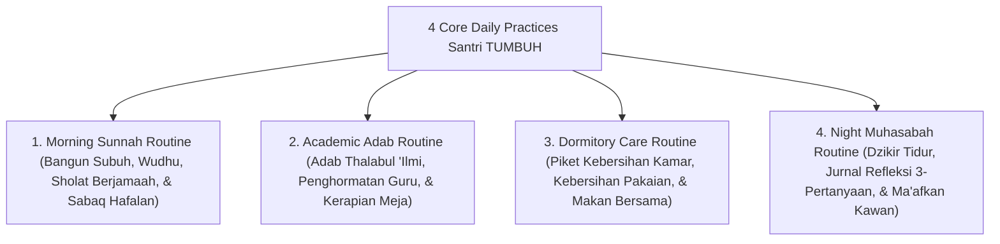

# P7-05: Pembiasaan Praktik Harian dan Rutinitas Adab

## Status Dokumen
* **Status**: 🌟 **A+ (Tervalidasi & Siap Diimplementasikan)**
* **Sub-Domain**: `07 Implementation Framework / 05 Daily Practices`
* **Penanggung Jawab Keilmuan**: Dewan Keilmuan TUMBUH (*Pakar Desain Kurikulum Adab & Pakar Pengasuhan Asrama*)

---

## 1. Operasionalisasi Daily Practices (Rutinitas Adab 24-Jam)

Praktik harian pembiasaan adab dirancang terstruktur namun penuh kehangatan emosional:

---

## 2. Praktik Harian Musyrif: Warm Presence & Positive Prompts

- **Warm Presence**: Musyrif hadir di tengah santri pada waktu makan dan istirahat dengan senyuman hangat dan pembicaraan penguat ukhuwah.
- **Positive Prompts**: Menggunakan pengingat adab bersuara lembut (*Fiqhu al-Inhadh*) daripada teriakan/perintah kasar.
