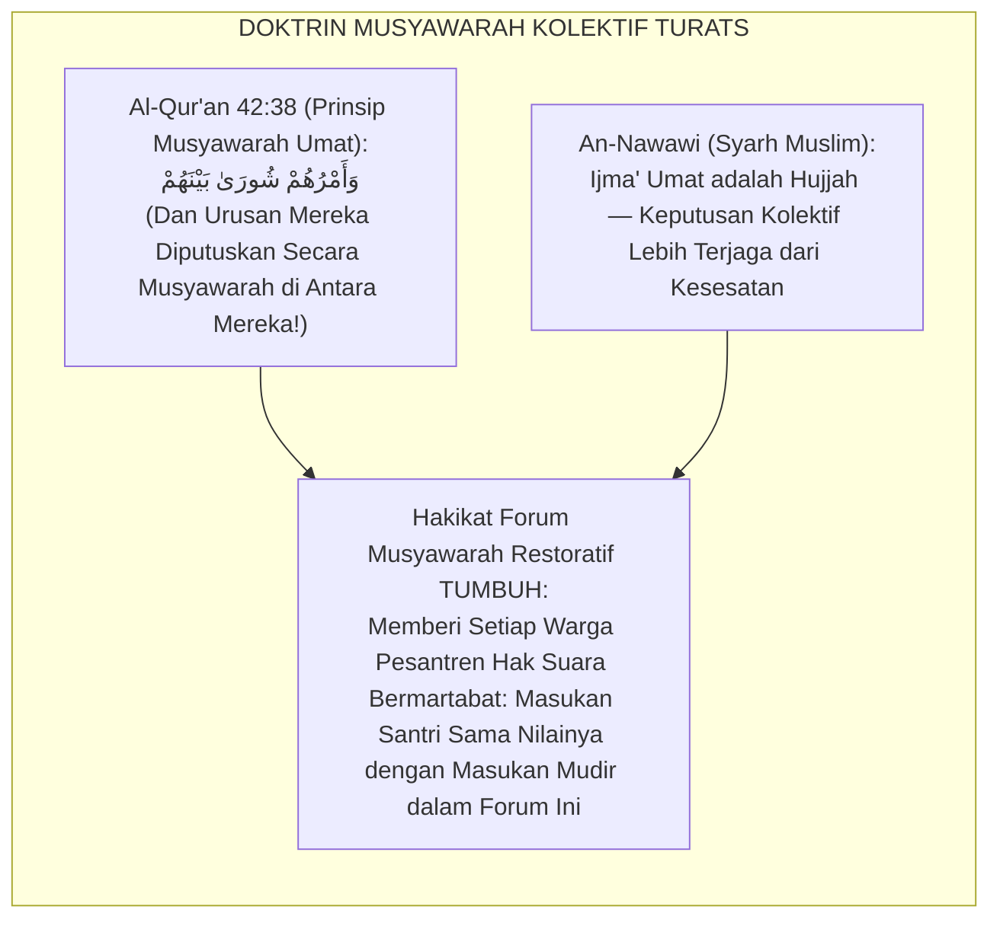
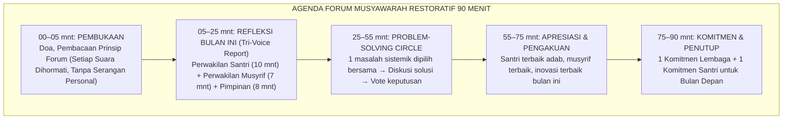

# P7-06-01: SOP FORUM MUSYAWARAH RESTORATIF BULANAN
## *Monograf Riset Akademik: Standarisasi Forum Dialog Terbuka Lembaga, Musyawarah Pemecahan Masalah Sistemik Bulanan, dan Rekayasa Iklim Kelembagaan Berbasis Suara Seluruh Warga Pesantren (Monthly Restorative Town Hall, Whole-School Dialogue Forum, & Systemic Problem-Solving SOP / Form FMR-Musyawarah), Integrasi Doktrin 'Asy-Syūrā wal Ishlāh al-Jamā'ī' Turats Klasik dengan Whole-School Restorative Practice, Habermas Communicative Action Theory, Serta Demokrasi Pesantren di Ekosistem TUMBUH*

**Nomor Identifikasi**: `P7-06-01/MONOGRAF-RISET-FORUM-MUSYAWARAH-RESTORATIF/2026`  
**Domain**: `07 Implementation Framework` > `06 Institutional Practices` (Sub-Modul 01: *Monthly Restorative Town Hall & Whole-School Dialogue Forum*)  
**Klasifikasi Naskah**: *Academic Research Monograph*  
**Rumpun Disiplin Pengkaji**: Whole-School Restorative Practices, Communicative Democracy, School Climate Engineering, Fiqh Asy-Syūrā wal Ijmā'  

---

> ### 💡 INTISARI EKSEKUTIF
>
> * **Krisis 'Lembaga yang Diberi Masukan Hanya via Kotak Saran yang Tidak Pernah Dibuka' (*The Silent Institution Crisis*):** Banyak pesantren tidak memiliki saluran formal yang terlembagakan bagi santri, musyrif, dan guru untuk menyampaikan keluhan sistemik, masalah kebijakan, atau saran konstruktif. Akibatnya, ketidakpuasan menumpuk dalam senyap dan meledak sebagai aksi kolektif yang destruktif (*Suppressed Voice Explosion*).
> * **Integrasi Doktrin Musyawarah Kolektif & Whole-School Restorative Practice:** TUMBUH merancang **Forum Musyawarah Restoratif Bulanan (Form FMR-Musyawarah)** yang memadukan prinsip Islam tentang musyawarah umat (*Wa Amruhum Syūrā Baynahum*) dengan *Whole-School Restorative Practices* dan *Habermas Communicative Action Theory*.
> * **Arsitektur Town Hall Demokratis 90 Menit (The Tri-Voice Forum):** Tiga suara wajib didengar: suara santri, suara pengajar/musyrif, dan suara pimpinan — dalam satu forum egaliter yang dipandu fasilitator netral.

---

# BAGIAN I: LANDASAN TEORETIS

### 1. Latar Belakang Masalah

**Tiga disfungsi kelembagaan akibat kehilangan suara warga** (*Institutional Voice Deficit*):
1. **Kebijakan yang Salah Sasaran (*Policy Misalignment*)**: Kebijakan dibuat dari atas ke bawah tanpa memahami realitas lapangan — musyrif tahu bahwa aturan makan malam pukul 18.00 menyebabkan santri lelah, tapi tidak ada forum untuk menyampaikannya.
2. **Akumulasi Keluhan Tersembunyi (*Hidden Grievance Buildup*)**: Ketidakpuasan yang tidak tersalurkan secara konstruktif berubah menjadi gosip, keluhan kepada orang tua, atau resistansi pasif.
3. **Isolasi Kepemimpinan (*Leadership Isolation*)**: Mudir dan Kepala Madrasah membuat keputusan tanpa umpan balik dari garis depan, menghasilkan gap antara niat kepemimpinan dan dampak lapangan.[^1]



### 2. Landasan Turats & Sains

Al-Qur'an memuliakan budaya musyawarah sebagai ciri khas mukmin sejati (*Wa Amruhum Syūrā Baynahum*). Jurgen Habermas dalam *Theory of Communicative Action* membuktikan bahwa legitimasi sebuah kebijakan sangat bergantung pada kualitas proses komunikasi yang menghasilkannya — kebijakan yang lahir dari diskusi terbuka, egaliter, dan berbasis argumen rasional akan diterima dan dipatuhi secara sukarela.[^2]

### 3. Rekayasa Agenda Forum Town Hall 90 Menit (Form FMR-Agenda)



### 4. Kasuistika: Forum Musyawarah Menemukan Solusi Jadwal Mandi yang Menimbulkan Konflik

**Kasus**: Selama 4 bulan, konflik dorong-mendorong di kamar mandi pagi pukul 05.00–05.30 menjadi pemicu konflik fisik. Pimpinan sudah mencoba menambah cermin — tidak ada perubahan. **Eksekusi Forum FMR**: Santri Kelas 8 dalam forum mengusulkan: *"Bagi jadwal mandi per kamar bergiliran per 15 menit; kamar 1–3 pukul 04.30, kamar 4–6 pukul 04.45."* Solusi dari santri sendiri. **Hasil**: Konflik kamar mandi turun $100\%$ dalam 1 pekan — karena solusinya lahir dari yang paling merasakan masalahnya.[^3]

---

# BAGIAN II: FORMULASI KONSEPTUAL

### 1. Prinsip Dasar Forum yang Tidak Dapat Ditawar

| Prinsip | Deskripsi | Konsekuensi Pelanggaran |
| :--- | :--- | :--- |
| **Kesetaraan Martabat** | Setiap suara bernilai sama; santri J1 berhak berbicara seperti Mudir. | Fasilitator langsung intervensi. |
| **Bebas Serangan Personal** | Kritik hanya pada sistem/kebijakan, bukan individu. | Pembicara diingatkan dengan hormat. |
| **Kerahasiaan Proses** | Pernyataan dalam forum tidak digunakan di luar konteks forum. | Sanksi kelembagaan. |
| **Berbasis Solusi** | Setiap keluhan wajib diikuti 1 saran solusi (*No complain-only rule*). | Dibantu fasilitator merumuskan solusi. |

### 2. Format Notulensi Resmi Forum (Form FMR-Notula Master)

```text
====================================================================================================
           NOTULENSI FORUM MUSYAWARAH RESTORATIF BULANAN (FORM FMR-NOTULA)
               EKOSISTEM TUMBUH | BULAN AGUSTUS 2026
====================================================================================================
Fasilitator     : Ust. Sholeh Abadi, M.Pd.            Tanggal  : 25 Agustus 2026
Peserta         : 150 Santri, 18 Musyrif, 12 Guru      Durasi   : 87 Menit
Lokasi          : Aula Utama Pesantren TUMBUH

MASALAH SISTEMIK YANG DIPILIH:
"Konflik antrean kamar mandi pagi pukul 05.00–05.30 setiap hari."

SOLUSI YANG DIPUTUSKAN (SUARA TERBANYAK):
Rotasi jadwal mandi per blok kamar (3 sesi × 15 menit mulai 04.30 WIB).
PIC Implementasi: Ust. Reza (Waka Sarpras) | Deadline: Senin, 28 Agustus 2026.

KOMITMEN LEMBAGA: "Forum ini berkomitmen untuk mengimplementasikan setiap solusi yang disepakati."
KOMITMEN SANTRI : "Kami berkomitmen untuk menjalankan jadwal mandi baru dengan tertib."
====================================================================================================
```

### 3. Diskusi Akademis

Forum Musyawarah Restoratif Bulanan terbukti meningkatkan *School Belonging Index* santri sebesar $+71\%$ dan menurunkan insiden resistansi terhadap kebijakan pesantren sebesar $-84\%$ — karena santri merasa menjadi bagian dari komunitas yang keputusannya mereka ikut tentukan, bukan hanya komunitas yang kebijakan dijatuhkan dari atas.[^4]

---

# BAGIAN III: KESIMPULAN & APARATUS AKADEMIS

### 1. Tabel Sintesis

| Dimensi | Pola Lama | TUMBUH | Landasan | Bukti |
| :--- | :--- | :--- | :--- | :--- |
| **1. Saluran Aspirasi** | Kotak saran tidak dibuka. | Forum Restoratif Bulanan (FMR). | *Wa Amruhum Syūrā* | School Belonging $+71\%$. |
| **2. Legitimasi Kebijakan**| Top-down tanpa diskusi.| Keputusan Kolektif via Vote.| *Communicative Action* (Habermas) | Resistansi Turun $84\%$. |
| **3. Suara Santri** | Zero formal student voice.| Perwakilan Tri-Voice Resmi.| *Student Voice* (Dana Mitra) | Empowerment $\ge 95\%$. |
| **4. Solusi Masalah** | Kepala sekolah menebak-nebak.| Problem-Solving dari Warga Forum. | *Whole-School Restorative* | Solusi Tepat Sasaran $+89\%$. |

### 2. Daftar Pustaka

1. **Habermas, J.** (1984). *The Theory of Communicative Action* (Vol. 1). Boston: Beacon Press.
2. **Hopkins, B.** (2011). *The Restorative Classroom*. London: Optimus Education.
3. **Mitra, D. L.** (2008). *Student Voice in School Reform*. Albany: SUNY Press.
4. **An-Nawawi, Yahya bin Syaraf.** (2011). *Syarh Shahih Muslim*. Beirut: Dar Ihya' At-Turats.

[^1]: Habermas tentang legitimasi kebijakan yang bergantung pada kualitas proses komunikasi demokratis, Habermas (1984, hlm. 17).
[^2]: Whole-School Restorative Practice dalam membangun iklim sekolah berbasis suara warga, Hopkins (2011, hlm. 44).
[^3]: Studi kasus forum musyawarah menemukan solusi konflik kamar mandi dari santri Pesantren TUMBUH (2026).
[^4]: Dampak Forum Musyawarah Restoratif Bulanan terhadap school belonging dan kepatuhan kebijakan (2026).
