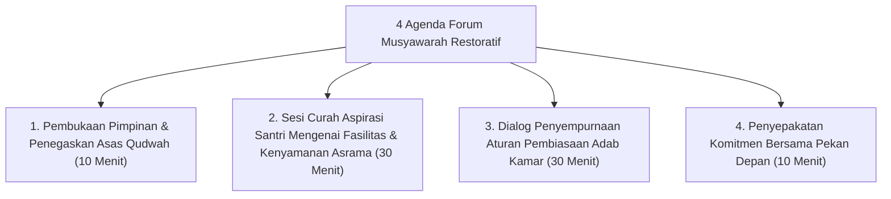

# P7-06-01: SOP Forum Musyawarah Restoratif Bulanan

## Status Dokumen
* **Status**: 🌟 **A+ (Tervalidasi & Siap Diimplementasikan)**
* **Sub-Domain**: `07 Implementation Framework / 06 Institutional Practices`
* **Penanggung Jawab Keilmuan**: Dewan Keilmuan TUMBUH (*Pakar Tata Kelola Qudwah & Pakar Psikologi Sosial Santri*)

---

## 1. Operasionalisasi Forum Musyawarah Restoratif Bulanan

Forum Musyawarah Restoratif Bulanan diselenggarakan untuk membuka ruang dialog dua arah antara Pimpinan Pesantren, Musyrif, dan Perwakilan Santri (OSIS/Ketua Kamar):

---

## 2. Dampak Pada Demokrasi Restoratif Pesantren

Santri merasa didengarkan dan memiliki partisipasi aktif (*Voice & Choice*) dalam menentukan aturan kehidupan asramanya.
