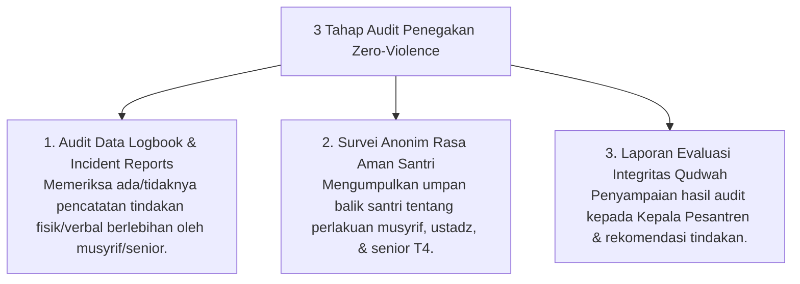

# P7-06-02: Audit Penegakan Policy Zero-Violence Lembaga

## Status Dokumen
* **Status**: 🌟 **A+ (Tervalidasi & Siap Diimplementasikan)**
* **Sub-Domain**: `07 Implementation Framework / 06 Institutional Practices`
* **Penanggung Jawab Keilmuan**: Dewan Keilmuan TUMBUH (*Pakar Tata Kelola Qudwah & Pakar Arsitektur PBIS Restoratif*)

---

## 1. Operasionalisasi Audit Penegakan Nol Kekerasan

Audit Penegakan Kebijakan Nol Kekerasan (*Zero-Violence Institutional Audit*) dilaksanakan setiap pertengahan dan akhir semester oleh Tim Audit Keilmuan:

---

## 2. Tindakan Tegas atas Pelanggaran

Apabila ditemukan indikasi kekerasan fisik, intimidasi mental, atau senioritas feodal, lembaga langsung menjatuhkan sanksi administratif dan pemindahan tugas bagi pelaku.
