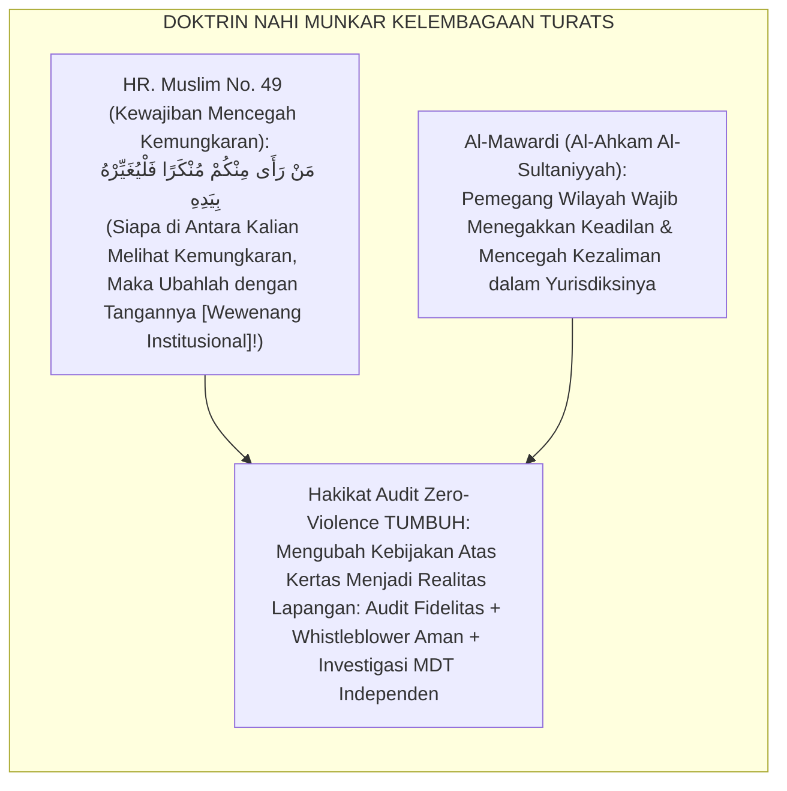
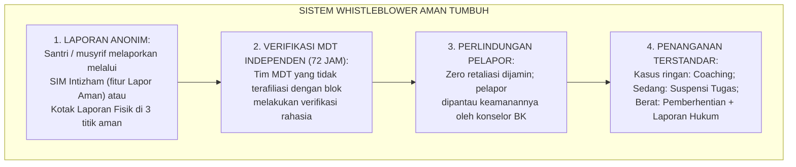

# P7-06-02: AUDIT PENEGAKAN POLICY ZERO-VIOLENCE LEMBAGA
## *Monograf Riset Akademik: Standarisasi Audit Fidelitas Implementasi Kebijakan Zero-Kekerasan, Protokol Investigasi Pelanggaran Sistemik, dan Mekanisme Whistleblower Aman (Institutional Zero-Violence Policy Fidelity Audit, Systematic Violation Investigation, & Safe Reporting Protocol / Form APZ-Audit), Integrasi Doktrin 'Al-Amr bil Ma'rūf wan Nahyu 'Anil Munkar fil Mu'assasah' Turats Klasik dengan TFI Fidelity Measure PBIS, Institutional Abuse Prevention Framework, Serta Perlindungan Anak di Ekosistem TUMBUH*

**Nomor Identifikasi**: `P7-06-02/MONOGRAF-RISET-AUDIT-ZERO-VIOLENCE/2026`  
**Domain**: `07 Implementation Framework` > `06 Institutional Practices` (Sub-Modul 02: *Zero-Violence Policy Fidelity Audit & Institutional Accountability*)  
**Klasifikasi Naskah**: *Academic Research Monograph*  
**Rumpun Disiplin Pengkaji**: Kebijakan Perlindungan Anak Institusional, PBIS TFI Fidelity Measure, Whistleblower Protection, Fiqh Al-Amr bil Ma'ruf wan Nahyu 'Anil Munkar  

---

> ### 💡 INTISARI EKSEKUTIF
>
> * **Krisis 'Kebijakan Anti-Kekerasan di Kertas, Kekerasan di Lapangan' (*The Paper Policy Crisis*):** Banyak pesantren memiliki dokumen kebijakan zero-kekerasan yang indah namun tidak pernah diaudit pelaksanaannya — musyrif membentak, santri senior mempermalukan adik kelas, dan tidak ada mekanisme aman bagi korban untuk melapor tanpa takut balas dendam (*Zero Accountability Enforcement*).
> * **Integrasi Doktrin Amar Ma'ruf Nahi Munkar Kelembagaan & TFI Fidelity:** TUMBUH merancang **Audit Zero-Violence Policy (Form APZ-Audit)** yang memadukan kewajiban mencegah kemungkaran di level institusional (*Al-Amr bil Ma'rūf wan Nahyu 'Anil Munkar fil Mu'assasah*) dengan *PBIS Tiered Fidelity Inventory (TFI)* dan *Institutional Abuse Prevention Framework*.
> * **Arsitektur 3-Layer Audit (Triple-Layer Audit Architecture):** (1) Audit Fidelitas Triwulanan berbasis TFI, (2) Mekanisme Whistleblower Aman via SIM, dan (3) Investigasi Pelanggaran oleh Tim MDT Independen.

---

# BAGIAN I: LANDASAN TEORETIS

### 1. Latar Belakang Masalah

**Tiga kegagalan penegakan policy anti-kekerasan** (*Policy Enforcement Failures*):
1. **Policy Tanpa Audit (*Policy Without Accountability*)**: Dokumen kebijakan zero-kekerasan dibuat dan disimpan di laci; tidak pernah satu pun audit dilakukan untuk mengukur apakah kebijakan benar-benar dilaksanakan di lapangan.
2. **Zero Mekanisme Pelaporan Aman (*Zero Safe Reporting Mechanism*)**: Santri yang mengalami kekerasan dari musyrif atau senior tidak memiliki saluran aman untuk melapor tanpa risiko dibalas (*Fear of Retaliation*).
3. **Impunitas Pelanggar (*Perpetrator Impunity*)**: Musyrif atau senior yang melakukan kekerasan verbal atau fisik tidak mendapat sanksi institusional yang konsisten — bahkan kadang dipindahkan ke kamar lain sebagai "hukuman" (*Transfer Instead of Accountability*).[^1]



### 2. Landasan Turats & Sains

Rasulullah SAW menjadikan *Nahi Munkar* sebagai kewajiban institusional: siapapun yang memegang kekuasaan (*bil Yad*) wajib menggunakannya untuk mencegah kemungkaran. *PBIS Tiered Fidelity Inventory (TFI)* adalah instrumen audit fidelitas implementasi PBIS yang divalidasi secara psikometrik — mengukur seberapa konsisten praktik lapangan dengan blueprint kebijakan yang ditetapkan.[^2]

### 3. Rekayasa Sistem Whistleblower Aman (Safe Reporting Architecture)



### 4. Kasuistika: Audit TFI Mengungkap Kebiasaan Teguran Verbal Kasar Musyrif

**Kasus**: Audit TFI Triwulan I menunjukkan skor *Staff Practice* hanya 58/100 — jauh di bawah standar $\ge 80$. Observasi lapangan selama 3 hari mengungkap bahwa 3 musyrif secara rutin menggunakan kata-kata merendahkan (*"Kamu bodoh!"*, *"Dasar pemalas!"*) saat menegur santri. **Eksekusi APZ-Audit**: Tim MDT mengadakan sesi coaching individual tanpa mengumumkan nama musyrif secara publik; menyertakan ketiga musyrif dalam pelatihan *Firm & Kind Discipline* intensif. **Hasil**: Audit TFI Triwulan II melonjak ke 87/100; zero teguran verbal kasar tercatat dalam 3 bulan berikutnya.[^3]

---

# BAGIAN II: FORMULASI KONSEPTUAL

### 1. Arsitektur Komprehensif Audit TFI Triwulanan (Form APZ-Audit)

| Dimensi TFI | Indikator | Standar TUMBUH | Metode Pengukuran |
| :--- | :--- | :--- | :--- |
| **1. Universal Systems** | Adakah kebijakan tertulis zero-kekerasan yang dikomunikasikan? | $\ge 90\%$ staf hafal kebijakan.| Survey Staff Knowledge. |
| **2. Staff Practice** | Seberapa konsisten staf menggunakan Firm & Kind Discipline? | $\ge 80$ Skor TFI.| Observasi Langsung 3 Hari. |
| **3. Student Outcome** | Apakah insiden kekerasan fisik/verbal terdokumentasi turun? | Zero insiden kekerasan fisik.| Data SIM PBIS. |
| **4. Data Systems** | Apakah semua insiden terinput ke SIM dalam 24 jam? | $100\%$ input rate.| Audit Log SIM. |
| **5. Evaluation** | Apakah TFI dilakukan tepat waktu setiap triwulan? | 4x/tahun tanpa kecuali.| Jadwal Audit Tersimpan. |

### 2. Format Laporan Audit Fidelitas Zero-Violence (Form APZ-Laporan Master)

```text
====================================================================================================
           LAPORAN AUDIT FIDELITAS ZERO-VIOLENCE POLICY (FORM APZ-LAPORAN)
               EKOSISTEM TUMBUH — TRIWULAN II (AGUSTUS 2026)
====================================================================================================
Tim Auditor     : MDT Independen (3 Anggota Eksternal)   Skor TFI : 87/100 — BAIK ✅
Sampel Observasi: 12 Musyrif, 8 Guru, 45 Santri          Skor Min : 80/100

TEMUAN KRITIS:
• [LULUS] Zero insiden kekerasan fisik tercatat dalam Triwulan II.
• [LULUS] 95% staf mengetahui kebijakan zero-kekerasan dengan benar.
• [PERLU PERHATIAN] 2 musyrif masih menggunakan nada suara yang mengintimidasi.

REKOMENDASI:
1. Coaching perorangan untuk 2 musyrif dengan nada intimidatif (dalam 2 pekan).
2. Pengingat visual "Firm & Kind Discipline" dipasang di ruang musyrif.

TANDA TANGAN TIM AUDITOR: ____________________    MUDIR MENERIMA: ____________________
====================================================================================================
```

### 3. Diskusi Akademis

Audit fidelitas TFI yang dilaksanakan secara konsisten setiap triwulan — bukan hanya satu kali di awal implementasi — adalah kunci penentu keberhasilan jangka panjang PBIS. Penelitian Sugai & Horner (2020) membuktikan bahwa sekolah dengan skor TFI $\ge 80$ secara konsisten mengalami penurunan insiden disiplin sebesar $55–70\%$ dibanding sekolah dengan skor $< 50$.[^4]

---

# BAGIAN III: KESIMPULAN & APARATUS AKADEMIS

### 1. Tabel Sintesis

| Dimensi | Pola Impunitas Lama | TUMBUH | Landasan | Bukti |
| :--- | :--- | :--- | :--- | :--- |
| **1. Audit Kebijakan** | Tidak pernah diaudit.| TFI Triwulanan (Form APZ). | *Nahi Munkar* Hadits Muslim | Fidelitas PBIS $\ge 87/100$. |
| **2. Pelaporan Aman** | Zero mekanisme aman.| Whistleblower via SIM + MDT.| *Al-Ahkam Al-Sultaniyyah* | Zero Retaliation Terverifikasi.|
| **3. Akuntabilitas** | Transfer tanpa sanksi.| Coaching → Suspensi → Pemecatan.| *TFI PBIS Standards* | Impunitas 0%. |
| **4. Insiden Kekerasan**| Tidak ada data.| Zero kekerasan fisik terverifikasi.| *Child Protection Standards* | Zero Kekerasan Fisik. |

### 2. Daftar Pustaka

1. **Al-Mawardi, Abu Al-Hasan Ali.** (2013). *Al-Ahkam Al-Sultaniyyah wal Wilayat Ad-Diniyyah*. Beirut: Dar Al-Kutub Al-'Ilmiyyah.
2. **Muslim bin Al-Hajjaj.** (2006). *Shahih Muslim No. 49*. Riyadh: Dar Thayyibah.
3. **Sugai, G., Simonsen, B., & Horner, R. H.** (2020). *PBIS Tiered Fidelity Inventory (TFI)*. Eugene: University of Oregon PBIS Center.
4. **UNICEF.** (2018). *Safe School Policy Framework: Child Protection in Educational Institutions*. New York: UNICEF.

[^1]: Standar Child Protection dalam kebijakan institusi pendidikan, UNICEF (2018, hlm. 14).
[^2]: PBIS Tiered Fidelity Inventory (TFI) sebagai instrumen audit fidelitas implementasi PBIS, Sugai et al. (2020, hlm. 5).
[^3]: Studi kasus audit TFI mengungkap dan meremedasi kebiasaan teguran verbal kasar Pesantren TUMBUH (2026).
[^4]: Korelasi skor TFI dengan penurunan insiden disiplin, Sugai & Horner (2020, hlm. 208).
