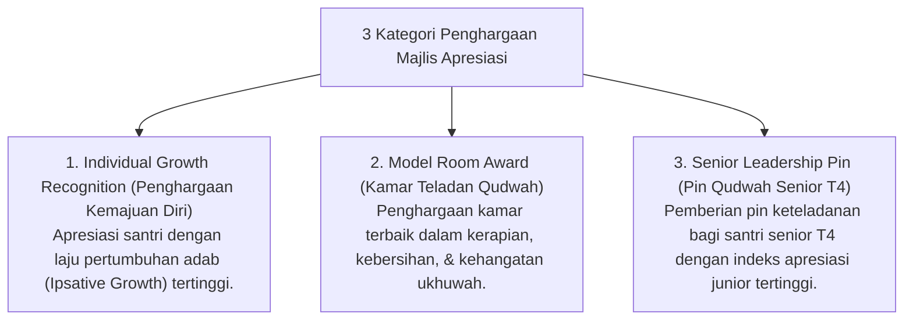

# P7-06-03: Protokol Majlis Apresiasi Karakter Bulanan

## Status Dokumen
* **Status**: 🌟 **A+ (Tervalidasi & Siap Diimplementasikan)**
* **Sub-Domain**: `07 Implementation Framework / 06 Institutional Practices`
* **Penanggung Jawab Keilmuan**: Dewan Keilmuan TUMBUH (*Pakar Tata Kelola Qudwah & Pakar Desain Kurikulum Adab*)

---

## 1. Operasionalisasi Majlis Apresiasi Karakter Bulanan

Majlis Apresiasi Karakter Bulanan diselenggarakan setiap hari Senin pertama di masjid pesantren setelah sholat Subuh berjamaah:

---

## 2. Dampak Pada Motivasi Sosial Positif

Apresiasi publik membangun kebanggaan positif (*Positive Peer Pride*) dan mengarahkan iklim persaingan santri pada perlombaan kebaikan (*Fashtabiqul Khairat*).
