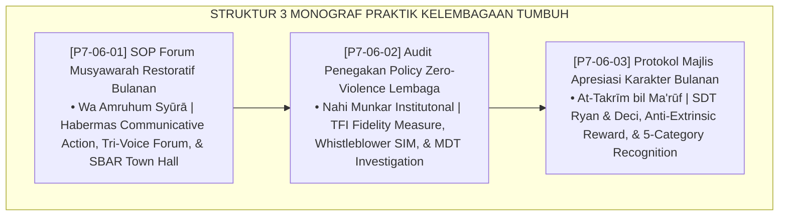

# P7-06: DOKUMEN INDUK PEMBIASAAN BUDAYA LEMBAGA DAN IKLIM POSITIF
## *Arsitektur dan Standarisasi Forum Musyawarah Restoratif Bulanan, Audit Fidelitas Zero-Violence, dan Majlis Apresiasi Karakter Bulanan sebagai Tiga Pilar Budaya Kelembagaan Positif (Restorative Town Hall Form FMR, Zero-Violence Audit Form APZ, Serta Character Recognition Assembly Form MAK) di Ekosistem TUMBUH Pesantren*

**Nomor Identifikasi**: `P7-06/DOKUMEN-INDUK-BUDAYA-LEMBAGA-IKLIM-POSITIF/2026`  
**Domain**: `07 Implementation Framework` > `06 Institutional Practices` (Gugus Sub-Domain 06: *Institutional Culture, Zero-Violence Enforcement, & Positive Climate Engineering*)  
**Klasifikasi Naskah**: *Master Architecture & Navigation Monograph*  
**Rumpun Disiplin Pengkaji**: School Climate Engineering, Restorative Institutional Culture, PBIS TFI, Positive Recognition Systems  

---

> ### 💡 INTISARI EKSEKUTIF
>
> * **Kedudukan Strategis Gugus Budaya Lembaga dan Iklim Positif:** Gugus ini adalah kulit terluar sekaligus cermin teraksata dari seluruh nilai dan sistem TUMBUH — apakah nilai-nilai itu hidup sebagai budaya yang dirasakan setiap warga pesantren, atau hanya tertulis di dinding. Tiga pilar budaya kelembagaan TUMBUH: Forum Suara Warga, Audit Kebijakan Anti-Kekerasan, dan Perayaan Karakter.
> * **Triad Budaya Positif TUMBUH:** (1) **Forum Musyawarah Restoratif** untuk menjamin setiap suara didengar, (2) **Audit Zero-Violence** untuk memastikan kebijakan ditegakkan nyata, dan (3) **Majlis Apresiasi Karakter** untuk merayakan kebaikan sebagai identitas komunal.
> * **3 Monograf Komprehensif:** Form FMR-Musyawarah, Form APZ-Audit, dan Form MAK-Apresiasi.

---

## 📑 PETA NAVIGASI TIGA MONOGRAF

---

## 📚 DESKRIPSI RINGKAS 3 BERKAS MONOGRAF

1. **[P7-06-01: SOP Forum Musyawarah Restoratif Bulanan](file:///c:/xampp/htdocs/tumbuh/07%20Implementation%20Framework/06%20Institutional%20Practices/P7-06-01-SOP-Forum-Musyawarah-Restoratif-Bulanan.md)**  
   *Forum Town Hall 90 menit dengan Tri-Voice (santri, staf, pimpinan), problem-solving circle, doktrin Wa Amruhum Syūrā, Habermas Communicative Action, dan Form FMR-Notula.*
2. **[P7-06-02: Audit Penegakan Policy Zero-Violence Lembaga](file:///c:/xampp/htdocs/tumbuh/07%20Implementation%20Framework/06%20Institutional%20Practices/P7-06-02-Audit-Penegakan-Policy-Zero-Violence-Lembaga.md)**  
   *Audit TFI Triwulanan + sistem whistleblower aman via SIM + investigasi MDT independen, doktrin Nahi Munkar Institusional Al-Mawardi, TFI PBIS Sugai, dan Form APZ-Laporan.*
3. **[P7-06-03: Protokol Majlis Apresiasi Karakter Bulanan](file:///c:/xampp/htdocs/tumbuh/07%20Implementation%20Framework/06%20Institutional%20Practices/P7-06-03-Protokol-Majlis-Apresiasi-Karakter-Bulanan.md)**  
   *Majlis 60 menit merayakan 5 kategori karakter berbasis nilai intrinsik (bukan akademik), doktrin At-Takrīm bil Ma'rūf, Self-Determination Theory Deci, dan Form MAK-Apresiasi.*

---

## 🎯 STANDAR PENJAMINAN MUTU BUDAYA LEMBAGA

Penerapan gugus **Pembiasaan Budaya Lembaga dan Iklim Positif** menjamin bahwa:
1. **Setiap Warga Pesantren Merasa Didengar dan Diperhitungkan (*Universal Voice Guarantee*)**: Forum Musyawarah memastikan tidak ada satupun masalah sistemik yang tersumbat tanpa saluran.
2. **Kebijakan Anti-Kekerasan Ditegakkan Nyata, Bukan Hanya di Kertas (*Zero Impunity Guarantee*)**: Audit TFI triwulanan dan whistleblower aman memastikan akuntabilitas berlaku merata.
3. **Kebaikan Karakter Dirayakan Sama Meriah dengan Prestasi Akademik (*Character Celebration Guarantee*)**: Majlis Apresiasi Bulanan menjadikan kebaikan sebagai identitas komunal yang dirayakan dan dibanggakan.
