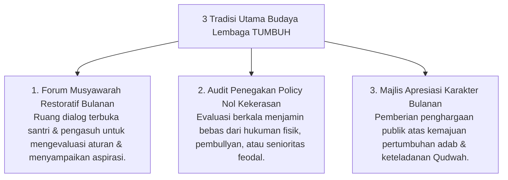

# P7-06: Pembiasaan Budaya Lembaga dan Iklim Positif

## Status Dokumen
* **Status**: 🌟 **A+ (Tervalidasi & Siap Diimplementasikan)**
* **Sub-Domain**: `07 Implementation Framework / 06 Institutional Practices`
* **Penanggung Jawab Keilmuan**: Dewan Keilmuan TUMBUH (*Pakar Tata Kelola Qudwah & Pakar Psikologi Sosial Santri*)

---

## 1. Operasionalisasi Institutional Practices Pesantren

Budaya lembaga dirancang untuk membentuk sistem yang sehat (*Bi'ah Shalihah*) di mana seluruh civitas akademika bertumbuh dalam keadilan dan kasih sayang:

---

## 2. Tradisi Majlis Apresiasi Bulanan

Setiap awal bulan setelah sholat Subuh berjamaah, lembaga mengadakan Majlis Apresiasi untuk menyerahkan *Lencana Karakter PBIS* dan piagam penghargaan kepada santri dan kamar-kamar terinspiratif.
