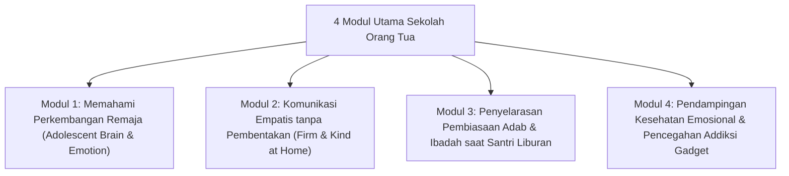

# P7-07-01: Kurikulum Sekolah Orang Tua Majlis Parenting

## Status Dokumen
* **Status**: 🌟 **A+ (Tervalidasi & Siap Diimplementasikan)**
* **Sub-Domain**: `07 Implementation Framework / 07 Family Practices`
* **Penanggung Jawab Keilmuan**: Dewan Keilmuan TUMBUH (*Pakar Bimbingan Konseling & Pakar Pengasuhan Asrama*)

---

## 1. Operasionalisasi Sekolah Orang Tua (Majlis Parenting Bulanan)

Program Sekolah Orang Tua diselenggarakan setiap bulan saat penerimaan/kunjungan santri untuk mengedukasi pola pengasuhan positif di rumah:

---

## 2. Format Pelaksanaan Interaktif

Majlis Parenting dikemas dalam bentuk **Workshops Interaktif & Dialog Terbuka** bersama Konselor BK dan Pakar Pengasuhan, bukan ceramah satu arah.
