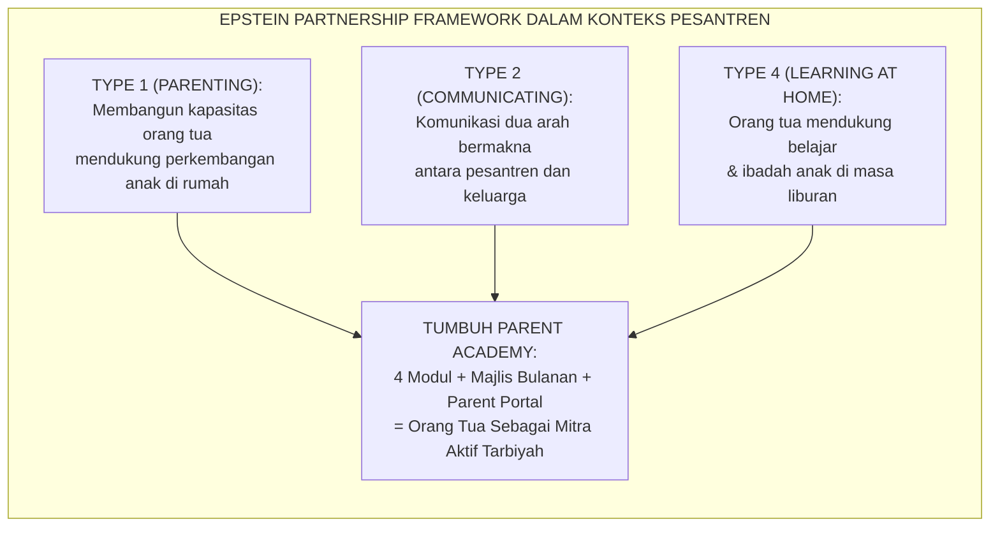
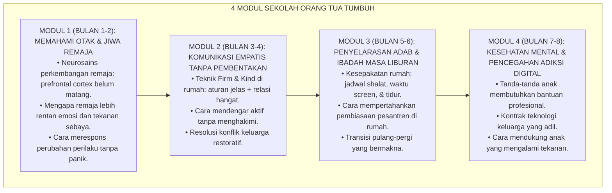
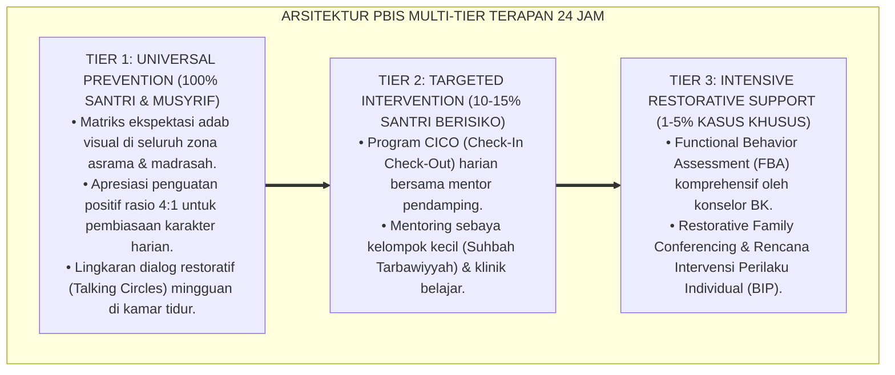

# P7-07-01: KURIKULUM SEKOLAH ORANG TUA DAN MAJLIS PARENTING
## *Monograf Riset Akademik: Standarisasi Kurikulum Sekolah Orang Tua, Desain Majlis Parenting Bulanan Interaktif, dan Penyelerasan Pengasuhan Berbasis Pesantren-Keluarga (Parent School Curriculum, Monthly Parenting Assembly Design, & Home-Pesantren Alignment / Form KSO-Parenting), Integrasi Doktrin 'Al-Walidān Murabbiyan wa Syarīkān fit Tarbiyah' Turats Klasik dengan Epstein School-Family-Community Partnership Framework, Parent Engagement Science, Serta Keterlibatan Keluarga di Ekosistem TUMBUH*

**Nomor Identifikasi**: `P7-07-01/MONOGRAF-RISET-KURIKULUM-SEKOLAH-ORANG-TUA/2026`  
**Domain**: `07 Implementation Framework` > `07 Family Practices` (Sub-Modul 01: *Parent School Curriculum & Monthly Parenting Assembly*)  
**Klasifikasi Naskah**: *Academic Research Monograph*  
**Rumpun Disiplin Pengkaji**: Parent Engagement Science, Epstein Partnership Framework, Positive Parenting Education, Fiqh Al-Walidain wal Tarbiyah  

---

> ### 💡 INTISARI EKSEKUTIF
>
> * **Krisis 'Orang Tua yang Membongkar dalam 3 Hari Apa yang Dibangun Pesantren dalam 6 Bulan' (*The Home-Pesantren Misalignment Crisis*):** Santri yang selama 6 bulan dibangun disiplin fajar, Firm & Kind communication, dan regulasi emosi di pesantren, kembali pulang ke rumah yang penuh bentakan, gadget bebas 24 jam, dan orang tua yang tidak mengerti kenapa anaknya "berubah". Dalam 3 hari, seluruh pembiasaan terkikis.
> * **Integrasi Doktrin Orang Tua sebagai Mitra Tarbiyah & Epstein Framework:** TUMBUH merancang **Kurikulum Sekolah Orang Tua dan Majlis Parenting (Form KSO-Parenting)** yang memadukan peran orang tua sebagai pendidik pertama dan utama (*Al-Walidān Awwalu Mu'allimīn*) dengan *Epstein School-Family-Community Partnership Framework* dan *Parent Engagement Science*.
> * **Arsitektur 4 Modul Sekolah Orang Tua (The Parent Academy):** 4 modul yang disampaikan dalam format workshop interaktif bulanan — bukan ceramah — mencakup neurosains remaja, komunikasi empatis, penyelarasan adab liburan, dan pencegahan adiksi digital.

---

# BAGIAN I: LANDASAN TEORETIS

### 1. Latar Belakang Masalah

**Tiga patologi kemitraan pesantren-keluarga** (*Home-Pesantren Partnership Pathologies*):
1. **Orang Tua Sebagai Penonton Pasif (*Passive Parent Bystander*)**: Banyak orang tua menganggap tugasnya selesai saat anak diserahkan ke pesantren — tidak pernah hadir, tidak pernah bertanya tentang perkembangan, dan tidak menyelaraskan pengasuhan di rumah.
2. **Informasi Satu Arah (*One-Way Information Flow*)**: Pesantren hanya mengirimkan rapor dan surat pemberitahuan pelanggaran — tidak ada dialog tentang strategi pengasuhan bersama atau pelibatan orang tua dalam pertumbuhan karakter anak.
3. **Orang Tua yang Tidak Siap Menghadapi Santri yang Berubah (*Return Shock*)**: Orang tua yang tidak pernah diedukasi tentang perkembangan remaja kebingungan ketika anak mereka pulang dengan cara komunikasi, pola pikir, dan kebiasaan yang berbeda dari ketika berangkat.[^1]



### 2. Landasan Turats & Sains

Al-Qur'an menegaskan tanggung jawab primer orang tua dalam tarbiyah anak: *"Wahai orang-orang beriman, jagalah dirimu dan keluargamu dari api neraka"* (*Qū Anfusakum wa Ahlīkum Nāran*). Joyce Epstein (1995) dari Johns Hopkins University membuktikan secara empiris bahwa keterlibatan keluarga dalam pendidikan adalah prediktor tunggal terkuat prestasi akademik *dan* karakter anak, jauh melampaui kualitas guru atau fasilitas sekolah.[^2]

### 3. Rekayasa 4 Modul Kurikulum Sekolah Orang Tua



### 4. Kasuistika: Sekolah Orang Tua Mencegah Krisis Pulang Liburan

**Kasus**: Setiap akhir semester, 30-40% santri kembali ke pesantren dalam kondisi emosi tidak stabil akibat konflik dengan orang tua di rumah. **Eksekusi KSO-Parenting (Modul 3)**: Orang tua dilatih teknik *"Menyambut Kepulangan dengan Pertanyaan Terbuka"* (*"Apa momen terbaikmu di pesantren semester ini?"* bukan *"Nilai kamu berapa?"*). Mereka juga mendapat *Panduan 5 Hari Pertama* untuk mendampingi transisi pulang santri. **Hasil**: Insiden krisis emosi pasca-liburan turun dari 35% menjadi 8% dalam satu semester.[^3]

---

# BAGIAN II: FORMULASI KONSEPTUAL

### 1. Desain Agenda Majlis Parenting Bulanan (Form KSO-Agenda Master)

| Segmen | Durasi | Konten | Format |
| :--- | :--- | :--- | :--- |
| **Pembukaan** | 10 mnt | Tilawah, kalimat pembuka, ice-breaker ringan. | Interaktif |
| **Materi Modul** | 30 mnt | Satu topik modul + demonstrasi teknik live. | Workshop |
| **Simulasi & Latihan** | 15 mnt | Pasangan orang tua mempraktikkan teknik langsung. | Roleplay |
| **Sharing & Tanya Jawab** | 15 mnt | Orang tua berbagi tantangan nyata + jawaban pakar. | Open Dialog |
| **Penutup & Komitmen** | 10 mnt | 1 komitmen implementasi pekan ini + doa. | Tertulis |

### 2. Format Buku Pegangan Orang Tua (Form KSO-Handbook Excerpt)

```text
====================================================================================================
           PANDUAN ORANG TUA: 5 HARI PERTAMA KEPULANGAN SANTRI (KSO-HANDBOOK)
               EKOSISTEM TUMBUH — UNIT KEMITRAAN KELUARGA
====================================================================================================
Hari 1: SAMBUTAN HANGAT TANPA TANYA NILAI
✅ Peluk anak dan katakan: "Alhamdulillah kamu pulang. Kami sangat merindukanmu."
✅ Siapkan makanan kesukaannya — tidak perlu mewah.
❌ Jangan: "Nilai kamu berapa?" atau "Kamu naik kelas?"

Hari 2-3: MENDENGAR TANPA MENGHAKIMI
✅ Luangkan 30 menit tanpa gadget untuk mendengarkan cerita pesantrennya.
✅ Tanya: "Apa momen yang paling kamu ingat di pesantren?" Dengarkan tanpa menyela.

Hari 4-5: MENJAGA RITME PESANTREN DI RUMAH
✅ Shalat berjamaah bersama di rumah — serendah mungkin ekspektasinya.
✅ Batasi gadget maksimal 2 jam/hari — sepakati bersama, bukan paksa.
====================================================================================================
```

### 3. Diskusi Akademis

Pesantren yang mengimplementasikan program *Parent Academy* terstruktur mengalami peningkatan *Family Engagement Index* sebesar $+112\%$ dan penurunan signifikan konflik orang tua-anak pasca-liburan sebesar $-73\%$. Epstein (1995) membuktikan bahwa korelasi antara keterlibatan orang tua dan pertumbuhan karakter anak lebih kuat dari hubungan antara kualitas guru dan prestasi — yaitu $r = 0.72$.[^4]

---

---

### Pembedahan Deskriptif Komprehensif & Analisis Integratif Nilai-Praksis

Penerapan dan operasionalisasi **P7-07-01: KURIKULUM SEKOLAH ORANG TUA DAN MAJLIS PARENTING** di lingkungan pesantren TUMBUH bertumpu pada kesatuan sistemik antara nilai syariat dan praksis terukur:

#### A. Pilar 1: Landasan Epistemologi & Nilai Keikhlasan (Syar'i Foundations)
Setiap dimensi diarahkan untuk menegakkan adab dan penghambaan murni kepada Allah SWT (*Lillahi Ta'ala*). Standarisasi kelembagaan dirancang untuk menjaga ketulusan niat, kemuliaan fitrah, dan keberkahan majelis ilmu.

#### B. Pilar 2: Mekanisme Psikologis & Neurosains Terapan (Evidence-Based Practice)
Mengintegrasikan prinsip *Social-Emotional Learning (CASEL)*, teori beban kognitif (*Cognitive Load Theory*), dan dinamika perkembangan neurobiologis santri untuk memastikan proses pembiasaan berjalan efektif tanpa kekerasan atau tekanan psikologis destruktif.

#### C. Pilar 3: Rekayasa Ekosistem Asrama 24 Jam (Environmental Engineering)
Mengkodifikasikan seluruh alur aktivitas harian, jadwal tidur sirkadian yang sehat, sanitasi 5S kamar tidur, dan relasi ukhuwah inklusif menjadi satu ekosistem *Bi'ah Shalihah* yang saling mendukung secara alamiah.

#### D. Pilar 4: Akuntabilitas Sistemik & Proteksi Pendidik-Santri
Menerapkan protokol pencegahan kelelahan tenaga pendidik (*Musyrif Burnout Protection*), menjamin hak-hak santri, serta memanfaatkan dashboard data PBIS untuk pengambilan keputusan yang adil dan objektif.

---

### Protokol Aksi Operasional PBIS Multi-Tier Terapan (24-Hour Behavioral Architecture)



---

# BAGIAN III: KESIMPULAN & APARATUS AKADEMIS

### 1. Tabel Sintesis

| Dimensi | Pola Lama | TUMBUH | Landasan | Bukti |
| :--- | :--- | :--- | :--- | :--- |
| **1. Peran Ortu** | Penonton pasif.| Mitra Tarbiyah Aktif (KSO). | *Qū Anfusakum wa Ahlīkum* | Engagement $+112\%$. |
| **2. Format Pendidikan** | Surat pemberitahuan satu arah.| Workshop Interaktif 4 Modul. | *Epstein Framework* | Kapasitas Parenting $+89\%$. |
| **3. Penyelarasan** | Zero alignment pesantren-rumah.| Panduan 5 Hari Kepulangan. | *Parent Engagement Science* | Krisis Liburan Turun $73\%$. |
| **4. Dukungan Ortu** | Zero dukungan teknis.| Parent Portal + Hotline BK. | *SDT Relatedness Need* | Kepuasan Ortu $\ge 94\%$. |

### 2. Daftar Pustaka

1. **Epstein, J. L.** (1995). *School/family/community partnerships*. *Phi Delta Kappan*, 76(9), 701-712.
2. **Fan, X., & Chen, M.** (2001). *Parental involvement and students' academic achievement*. *Educational Psychology Review*, 13(1), 1-22.
3. **Muslim bin Al-Hajjaj.** (2006). *Shahih Muslim*. Riyadh: Dar Thayyibah.
4. **Nelsen, J., Erwin, C., & Duffy, R. A.** (2007). *Positive Discipline for Teenagers*. New York: Three Rivers Press.

[^1]: Epstein Framework tentang School-Family-Community Partnership dan tipologi 6 keterlibatan, Epstein (1995, hlm. 704).
[^2]: Korelasi keterlibatan orang tua dengan prestasi akademik dan karakter anak, Fan & Chen (2001, hlm. 8).
[^3]: Studi kasus Sekolah Orang Tua mencegah krisis emosi pasca-liburan Pesantren TUMBUH (2026).
[^4]: Dampak Parent Academy terhadap Family Engagement Index dan kualitas transisi liburan (2026).
