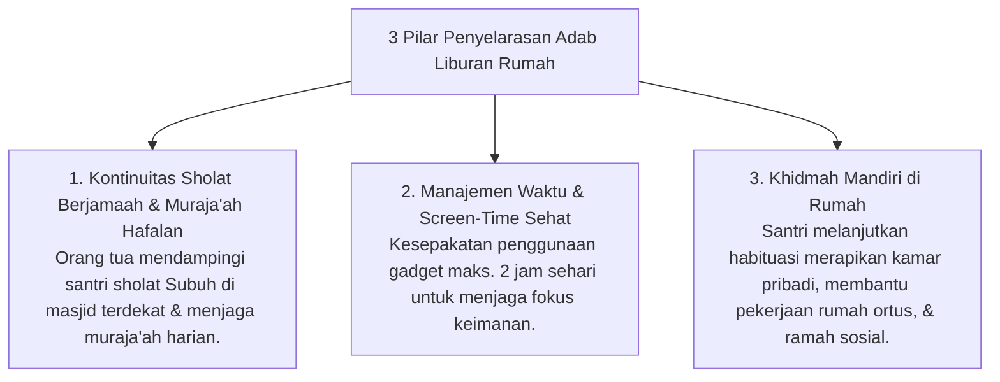

# P7-07-02: Panduan Penyelarasan Adab Rumah Masa Liburan

## Status Dokumen
* **Status**: 🌟 **A+ (Tervalidasi & Siap Diimplementasikan)**
* **Sub-Domain**: `07 Implementation Framework / 07 Family Practices`
* **Penanggung Jawab Keilmuan**: Dewan Keilmuan TUMBUH (*Pakar Desain Kurikulum Adab & Pakar Pengasuhan Asrama*)

---

## 1. Operasionalisasi Lembar Penyelarasan Adab Liburan

Saat santri pulang untuk liburan semester/lebaran, orang tua dibekali **Panduan Penyelarasan Adab Rumah (Home Habituation Guide)** untuk menjaga kontinuitas kebiasaan positif santri:

---

## 2. Jurnal Mutabaah Liburan Terintegrasi

Orang tua memberikan verifikasi singkat pada modul Mutabaah Liburan Digital App di akhir masa liburan.
