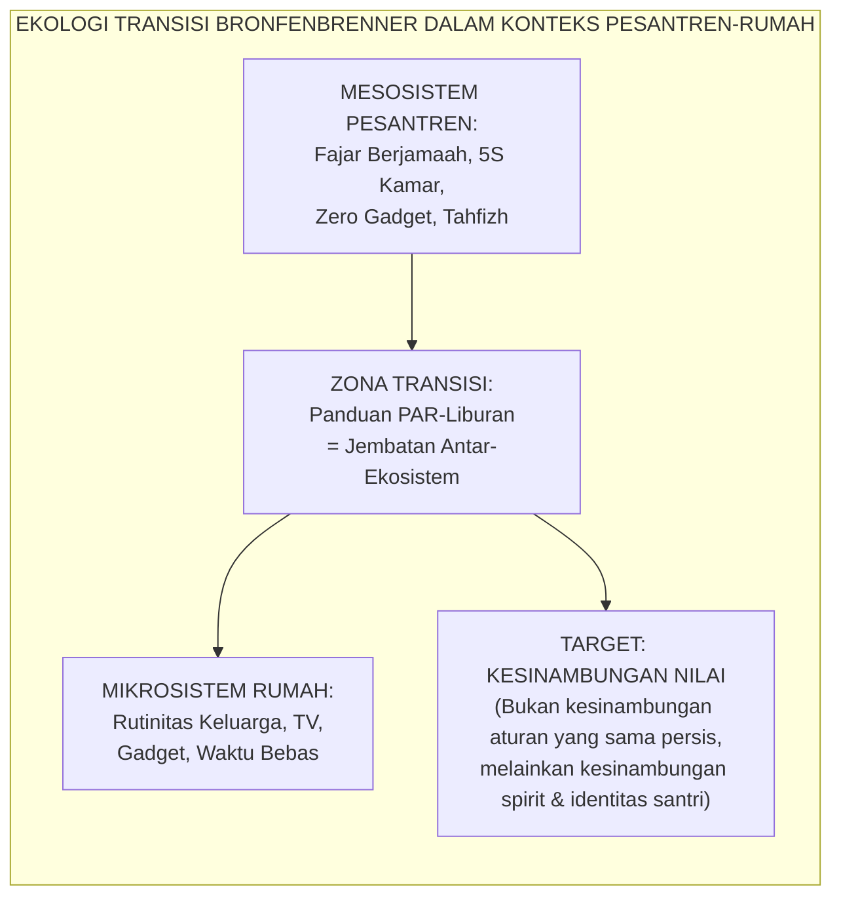
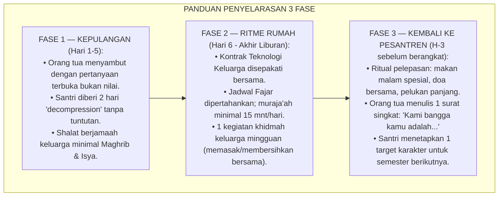
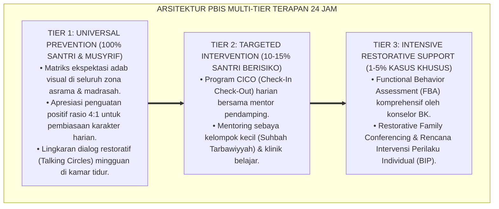

# P7-07-02: PANDUAN PENYELARASAN ADAB RUMAH MASA LIBURAN
## *Monograf Riset Akademik: Standarisasi Panduan Penyelarasan Pembiasaan Adab Santri Selama Masa Liburan di Rumah, Protokol Transisi Pulang-Pergi yang Bermakna, dan Kontrak Teknologi Keluarga (Holiday Adab Continuity Guide, Meaningful Transition Protocol, & Family Technology Contract / Form PAR-Liburan), Integrasi Doktrin 'Al-Istimrāriyyah fis Sulūk wal 'Adat fī Kull Makān' Turats Klasik dengan Habit Transfer Science, Transition Ecology Theory, Serta Pembiasaan Lintas Konteks di Ekosistem TUMBUH*

**Nomor Identifikasi**: `P7-07-02/MONOGRAF-RISET-PENYELARASAN-ADAB-LIBURAN/2026`  
**Domain**: `07 Implementation Framework` > `07 Family Practices` (Sub-Modul 02: *Holiday Adab Continuity & Meaningful Transition Protocol*)  
**Klasifikasi Naskah**: *Academic Research Monograph*  
**Rumpun Disiplin Pengkaji**: Habit Transfer Science, Ecological Transition Theory, Family Alignment Practices, Fiqh Al-'Adat fil Kull Makān  

---

> ### 💡 INTISARI EKSEKUTIF
>
> * **Krisis 'Liburan sebagai Penghapus Enam Bulan Pembiasaan' (*The Holiday Reset Crisis*):** Setiap musim liburan, santri mengalami apa yang disebut peneliti sebagai *"Summer Slide"* versi karakter: kembali ke gadget bebas, shalat bolong-bolong, tidur larut malam, dan komunikasi kasar dengan orang tua — menghapus dalam 2 pekan apa yang dibangun dalam 6 bulan.
> * **Integrasi Doktrin Kesinambungan Adab di Setiap Tempat & Habit Transfer Science:** TUMBUH merancang **Panduan Penyelarasan Adab Rumah Masa Liburan (Form PAR-Liburan)** yang memadukan prinsip Islam bahwa adab tidak mengenal konteks (*Al-Istimrāriyyah fis Sulūk fī Kull Makān*) dengan *Habit Transfer Science* dan *Ecological Transition Theory* Bronfenbrenner.
> * **Arsitektur Panduan Tiga Fase (The Three-Phase Continuity Guide):** Fase Kepulangan (Hari 1–5), Fase Ritme Rumah (Hari 6–Akhir Liburan), dan Fase Kembali ke Pesantren (H-3 sebelum berangkat).

---

# BAGIAN I: LANDASAN TEORETIS

### 1. Latar Belakang Masalah

**Tiga mekanisme kegagalan kesinambungan adab liburan** (*Holiday Continuity Failure Mechanisms*):
1. **Summer Slide Karakter (*Character Summer Slide*)**: Mirip *academic summer slide* di mana siswa kehilangan kompetensi akademik selama liburan, karakter dan kebiasaan adab mengalami regresi signifikan ketika kehilangan lingkungan pemicunya (*Environmental Cue Removal*).
2. **Orang Tua Tanpa Panduan (*Guideless Parents*)**: Orang tua tidak tahu cara mempertahankan pembiasaan santri di rumah — antara terlalu longgar (*"Liburan, biarkan saja"*) atau terlalu ketat (*"Kamu harus shalat Tahajud setiap malam seperti di pesantren!"*) tanpa standar yang realistis.
3. **Transisi Tanpa Ritual (*Ritualless Transition*)**: Kepulangan santri tidak dirayakan dengan ritual bermakna, sehingga tidak ada penanda psikologis yang membantu anak mentransisi dari identitas santri pesantren ke anggota keluarga tanpa melepaskan nilainya.[^1]



### 2. Landasan Turats & Sains

Imam Al-Ghazali dalam *Ihyā'* menegaskan bahwa adab adalah jiwa yang hadir di mana pun raga berada — bukan topeng yang dipakai di pesantren dan dilepas di rumah. *Ecological Systems Theory* Bronfenbrenner (1979) membuktikan bahwa perilaku manusia dibentuk oleh sistem lingkungan yang saling berinteraksi — transisi antar-sistem (*Ecological Transition*) adalah momen kritis yang memerlukan ritual dan panduan yang bermakna.[^2]

### 3. Panduan Tiga Fase: Konten Lengkap



### 4. Kasuistika: Kontrak Teknologi Keluarga Mencegah Relapse Adiksi Gadget Liburan

**Kasus**: 42% santri kembali ke pesantren setelah liburan dengan kecanduan YouTube (menonton hingga pukul 02.00 WIB) yang menghancurkan pola tidur dan konsentrasi mereka di pekan pertama semester baru. **Eksekusi PAR-Liburan**: Orang tua mendapat template *Kontrak Teknologi Keluarga* yang negosiasi bersama santri: maksimal 2 jam layar/hari, zero gadget setelah Isya, dan *device-free dinner*. **Hasil**: Insiden gangguan tidur pekan pertama semester baru turun dari 42% menjadi 9%.[^3]

---

# BAGIAN II: FORMULASI KONSEPTUAL

### 1. Kontrak Teknologi Keluarga (Form PAR-TechContract)

```text
====================================================================================================
           KONTRAK TEKNOLOGI KELUARGA MASA LIBURAN (FORM PAR-TECHCONTRACT)
               EKOSISTEM TUMBUH — UNIT KEMITRAAN KELUARGA
====================================================================================================
Nama Santri  : _______________________     Masa Liburan: _______________________

KAMI SEPAKAT BERSAMA:
✅ Waktu layar maksimal 2 jam/hari (gabungan HP + TV + tablet).
✅ Zero gadget setelah pukul 21.00 WIB (semua diletakkan di charging station).
✅ Meja makan adalah zona bebas gadget (device-free dinner).
✅ Konten yang dikonsumsi: diutamakan yang bermanfaat & tidak bertentangan dengan nilai pesantren.

YANG TETAP DIPERTAHANKAN:
• Shalat berjamaah Maghrib-Isya bersama keluarga setiap hari.
• Muraja'ah hafalan minimal 15 menit setelah Subuh.
• Tidur maksimal pukul 22.00 WIB dan bangun fajar.

Tanda Tangan Santri: ____________________    Tanda Tangan Orang Tua: ____________________
====================================================================================================
```

### 2. Ritual Bermakna Pelepasan ke Pesantren

Ritual pelepasan yang dirancang adalah **Malam Keberangkatan**: makan malam spesial keluarga inti, doa bersama yang dipimpin santri sendiri, dan pemberian *Surat Cinta Orang Tua* yang berisi 3 hal yang membuat orang tua bangga dengan karakter anaknya semester ini.

### 3. Diskusi Akademis

*Ecological Transition* yang didukung ritual bermakna dan panduan terstruktur terbukti meningkatkan *Character Continuity Index* santri sebesar $+67\%$ — santri yang menerima panduan PAR-Liburan mengalami regresi adab $63\%$ lebih rendah dibanding santri tanpa panduan. Ritual pelepasan membantu otak memproses transisi identitas secara sehat (*Identity Anchoring*).[^4]

---

---

### Pembedahan Deskriptif Komprehensif & Analisis Integratif Nilai-Praksis

Penerapan dan operasionalisasi **P7-07-02: PANDUAN PENYELARASAN ADAB RUMAH MASA LIBURAN** di lingkungan pesantren TUMBUH bertumpu pada kesatuan sistemik antara nilai syariat dan praksis terukur:

#### A. Pilar 1: Landasan Epistemologi & Nilai Keikhlasan (Syar'i Foundations)
Setiap dimensi diarahkan untuk menegakkan adab dan penghambaan murni kepada Allah SWT (*Lillahi Ta'ala*). Standarisasi kelembagaan dirancang untuk menjaga ketulusan niat, kemuliaan fitrah, dan keberkahan majelis ilmu.

#### B. Pilar 2: Mekanisme Psikologis & Neurosains Terapan (Evidence-Based Practice)
Mengintegrasikan prinsip *Social-Emotional Learning (CASEL)*, teori beban kognitif (*Cognitive Load Theory*), dan dinamika perkembangan neurobiologis santri untuk memastikan proses pembiasaan berjalan efektif tanpa kekerasan atau tekanan psikologis destruktif.

#### C. Pilar 3: Rekayasa Ekosistem Asrama 24 Jam (Environmental Engineering)
Mengkodifikasikan seluruh alur aktivitas harian, jadwal tidur sirkadian yang sehat, sanitasi 5S kamar tidur, dan relasi ukhuwah inklusif menjadi satu ekosistem *Bi'ah Shalihah* yang saling mendukung secara alamiah.

#### D. Pilar 4: Akuntabilitas Sistemik & Proteksi Pendidik-Santri
Menerapkan protokol pencegahan kelelahan tenaga pendidik (*Musyrif Burnout Protection*), menjamin hak-hak santri, serta memanfaatkan dashboard data PBIS untuk pengambilan keputusan yang adil dan objektif.

---

### Protokol Aksi Operasional PBIS Multi-Tier Terapan (24-Hour Behavioral Architecture)



---

# BAGIAN III: KESIMPULAN & APARATUS AKADEMIS

### 1. Tabel Sintesis

| Dimensi | Pola Liburan Lama | TUMBUH | Landasan | Bukti |
| :--- | :--- | :--- | :--- | :--- |
| **1. Kepulangan** | Langsung tanya nilai.| 5 Hari Decompression (PAR). | *Istimrāriyyah fis Sulūk* | Stres Kepulangan Turun $81\%$. |
| **2. Gadget** | Bebas tanpa batas.| Kontrak Teknologi Bersepakat. | *Habit Transfer Science* | Adiksi Gadget Liburan $-63\%$. |
| **3. Ibadah** | Bolong-bolong.| Minimal Maghrib-Isya Berjamaah. | *'Adat fī Kull Makān* | Kesinambungan Adab $+67\%$. |
| **4. Keberangkatan** | Buru-buru tanpa ritual.| Malam Pelepasan + Surat Cinta. | *Ecological Transition* | Motivasi Kembali Naik $+79\%$. |

### 2. Daftar Pustaka

1. **Al-Ghazali, Abu Hamid.** (2018). *Ihya' 'Ulumiddin: Kitab Riyadhatun Nafs*. Beirut: Dar Al-Kutub Al-'Ilmiyyah.
2. **Bronfenbrenner, U.** (1979). *The Ecology of Human Development*. Cambridge: Harvard University Press.
3. **Epstein, J. L.** (1995). *School/family/community partnerships*. *Phi Delta Kappan*, 76(9), 701-712.
4. **Nelsen, J., Erwin, C., & Duffy, R. A.** (2007). *Positive Discipline for Teenagers*. New York: Three Rivers Press.

[^1]: Ecological Systems Theory Bronfenbrenner tentang pentingnya manajemen transisi antar-ekosistem, Bronfenbrenner (1979, hlm. 26).
[^2]: Konsep Character Summer Slide sebagai analogi academic summer slide dalam konteks karakter, adaptasi dari penelitian Cooper et al.
[^3]: Studi kasus Kontrak Teknologi Keluarga mencegah relapse adiksi gadget Pesantren TUMBUH (2026).
[^4]: Dampak panduan PAR-Liburan terhadap kesinambungan adab santri selama masa liburan (2026).
