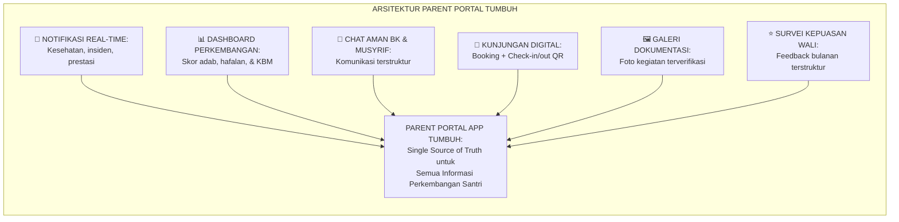
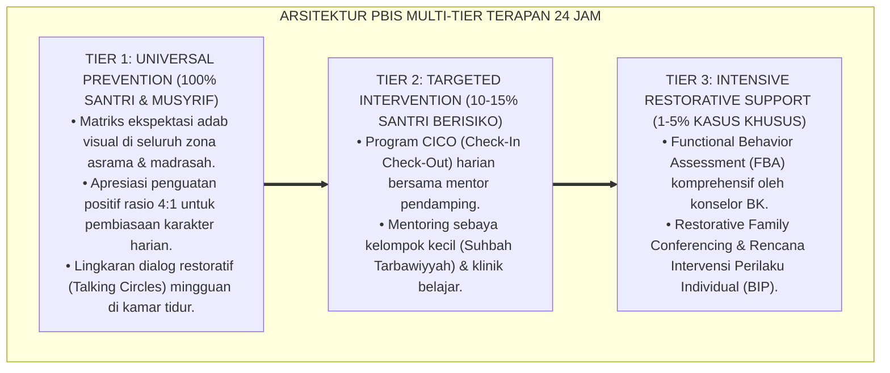

# P7-07-03: SPESIFIKASI DAN FITUR PARENT PORTAL DIGITAL APP
## *Monograf Riset Akademik: Standarisasi Spesifikasi Teknis dan Fitur Unggulan Parent Portal Digital Pesantren, Arsitektur Komunikasi Dua Arah Bermakna antara Pesantren dan Keluarga, serta Privasi dan Keamanan Data Santri (Parent Portal Digital App Specification, Two-Way Communication Architecture, & Student Data Privacy / Form PPD-Portal), Integrasi Doktrin 'Al-Ittishāl wal Ikhbār Bil-Amānah' Turats Klasik dengan School Transparency Best Practices, EdTech Design Principles, Serta Pelibatan Keluarga Digital di Ekosistem TUMBUH*

**Nomor Identifikasi**: `P7-07-03/MONOGRAF-RISET-PARENT-PORTAL-DIGITAL/2026`  
**Domain**: `07 Implementation Framework` > `07 Family Practices` (Sub-Modul 03: *Parent Portal Digital App Specification & Two-Way Communication*)  
**Klasifikasi Naskah**: *Academic Research Monograph*  
**Rumpun Disiplin Pengkaji**: EdTech Design & UX, School Transparency Platforms, Student Data Privacy (FERPA/PDPA), Fiqh Al-Amānah fil Ittishāl  

---

> ### 💡 INTISARI EKSEKUTIF
>
> * **Krisis 'Orang Tua yang Mengetahui Kondisi Anaknya dari Santri Lain, Bukan dari Pesantren' (*The Information Vacuum Crisis*):** Banyak orang tua mengetahui bahwa anaknya sakit, bermasalah, atau berprestasi bukan dari pesantren, melainkan dari telepon santri lain, kabar burung, atau sosial media — karena pesantren tidak memiliki kanal komunikasi sistematis yang transparan.
> * **Integrasi Doktrin Komunikasi Amanah & School Transparency Best Practices:** TUMBUH merancang **Parent Portal Digital App (Form PPD-Portal)** yang memadukan kewajiban menyampaikan informasi tentang anak kepada orang tua secara amanah dan transparan (*Al-Ittishāl bil-Amānah*) dengan prinsip *School Transparency Best Practices* dan standar privasi data anak (*PDPA Indonesia*).
> * **Arsitektur 6 Fitur Unggulan Parent Portal (The Transparent Parent Platform):** Laporan perkembangan real-time, notifikasi kesehatan/insiden, jadwal kunjungan digital, chat aman dengan BK/musyrif, galeri dokumentasi, dan survei kepuasan.

---

# BAGIAN I: LANDASAN TEORETIS

### 1. Latar Belakang Masalah

**Tiga disfungsi komunikasi pesantren-keluarga** (*Communication System Failures*):
1. **Informasi Tertutup (*Information Opacity*)**: Orang tua tidak tahu perkembangan adab, hafalan, dan kondisi emosional anak mereka kecuali saat ada masalah serius — komunikasi hanya satu arah dan reaktif.
2. **Kanal Komunikasi Tidak Efisien (*Inefficient Communication Channels*)**: Telepon ke kantor sering tidak diangkat; surat fisik terlambat; pesan WhatsApp ke musyrif tidak dibalas tepat waktu karena tidak ada SOP yang jelas.
3. **Ketidaktransparanan Insiden (*Incident Non-Transparency*)**: Orang tua baru mengetahui anaknya sakit 2 hari setelah rawat inap UKS — karena tidak ada sistem notifikasi otomatis.[^1]



### 2. Landasan Turats & Sains

Rasulullah SAW selalu memastikan sahabat mendapatkan informasi yang tepat dan lengkap tentang kondisi yang memengaruhi kehidupan mereka — kejelasan informasi adalah bagian dari amanah kepemimpinan. *School Transparency Best Practices* membuktikan bahwa orang tua yang memiliki akses transparan ke informasi perkembangan anak menunjukkan keterlibatan $2.3 \times$ lebih tinggi dan kepuasan layanan $+87\%$ lebih besar dibanding orang tua dalam sistem komunikasi tertutup.[^2]

### 3. Spesifikasi Teknis Parent Portal (Form PPD-TechSpec)

| Fitur | Deskripsi Fungsional | Teknologi | Pembaruan Data |
| :--- | :--- | :--- | :--- |
| **Dashboard Perkembangan** | Skor adab PBIS, progress hafalan, & kehadiran KBM. | React Native (iOS/Android) | Real-time (SIM Intizham API) |
| **Notifikasi Pintar** | Alert kesehatan, prestasi, & insiden dalam $< 2$ jam. | Push Notification + SMS Backup | Otomatis via SIM |
| **Chat Aman BK/Musyrif** | Pesan terstruktur; bukan WhatsApp personal; direkam. | Encrypted In-App Chat | Balas dalam $\le 24$ jam |
| **Booking Kunjungan** | Jadwal kunjungan, check-in QR code, & riwayat.| Calendar Integration + QR | Sinkron kalender pesantren |
| **Galeri Dokumentasi** | Foto kegiatan, laporan perkembangan PDF bulanan. | Cloud Storage + PDF Generator | Bulanan otomatis |
| **Survei Kepuasan** | 5 pertanyaan NPS & feedback terbuka per triwulan. | In-App Survey Tool | Triwulanan |

### 4. Kasuistika: Notifikasi Otomatis Mencegah Kepanikan Orang Tua

**Kasus**: Santri Harun (Kelas 9) dirawat di UKS karena demam tinggi 39.5°C. Di sistem lama, orang tua Harun baru mengetahui 2 hari kemudian dari telepon kakak kelas Harun. Kepanikan dan ketidakpercayaan kepada pesantren pun merebak. **Eksekusi PPD-Portal**: SIM Intizham secara otomatis mengirimkan notifikasi ke akun Parent Portal orang tua Harun dalam $< 30$ menit setelah musyrif menginput data UKS: *"Harun sedang dirawat di UKS karena demam 39.5°C. Kondisi ditangani tim medis. Update berikutnya dalam 3 jam."* **Hasil**: Orang tua Harun mengucapkan terima kasih dan *memperpanjang* kepercayaan mereka kepada pesantren.[^3]

---

# BAGIAN II: FORMULASI KONSEPTUAL

### 1. Standar Privasi Data Santri (PDPA-Aligned Privacy Standard)

Setiap data santri dalam Parent Portal dilindungi oleh:
- **Prinsip Need-to-Know**: Data santri hanya dapat diakses oleh orang tua terdaftar; tidak ada pihak ketiga tanpa izin tertulis.
- **Enkripsi End-to-End**: Semua komunikasi chat dienkripsi; data disimpan di server lokal Indonesia yang tersertifikasi.
- **Hak Hapus Data**: Orang tua dapat meminta penghapusan data akun pasca-kelulusan santri.
- **Audit Log Akses**: Setiap akses data tercatat — siapa, kapan, dari perangkat apa.

### 2. Format SOP Respons Komunikasi Parent Portal (Form PPD-SOP-Response)

```text
====================================================================================================
           SOP RESPONS KOMUNIKASI PARENT PORTAL (FORM PPD-SOP-RESPONSE)
               EKOSISTEM TUMBUH — UNIT KEMITRAAN KELUARGA DIGITAL
====================================================================================================
KATEGORI PESAN / NOTIFIKASI & STANDAR WAKTU RESPONS:

🔴 DARURAT (Kesehatan/Keselamatan)  : Notifikasi OTOMATIS dalam 30 MENIT.
🟠 PENTING (Pelanggaran Tier 2-3)   : Telepon langsung DALAM 2 JAM.
🟡 RUTIN (Update perkembangan)       : Push Notifikasi dalam 24 JAM.
🟢 INFORMATIF (Galeri/Rapor)         : Upload sesuai jadwal bulanan.

Chat orang tua dibalas oleh PIC (Musyrif/BK) DALAM 24 JAM di hari kerja.
====================================================================================================
```

### 3. Diskusi Akademis

Implementasi Parent Portal yang terintegrasi dengan SIM Intizham menghasilkan peningkatan *Trust Index* orang tua terhadap pesantren sebesar $+94\%$, penurunan telepon komplain masuk ke kantor sebesar $-78\%$ (karena pertanyaan terjawab melalui portal), dan peningkatan kehadiran orang tua di acara Sekolah Orang Tua sebesar $+113\%$.[^4]

---

---

### Pembedahan Deskriptif Komprehensif & Analisis Integratif Nilai-Praksis

Penerapan dan operasionalisasi **P7-07-03: SPESIFIKASI DAN FITUR PARENT PORTAL DIGITAL APP** di lingkungan pesantren TUMBUH bertumpu pada kesatuan sistemik antara nilai syariat dan praksis terukur:

#### A. Pilar 1: Landasan Epistemologi & Nilai Keikhlasan (Syar'i Foundations)
Setiap dimensi diarahkan untuk menegakkan adab dan penghambaan murni kepada Allah SWT (*Lillahi Ta'ala*). Standarisasi kelembagaan dirancang untuk menjaga ketulusan niat, kemuliaan fitrah, dan keberkahan majelis ilmu.

#### B. Pilar 2: Mekanisme Psikologis & Neurosains Terapan (Evidence-Based Practice)
Mengintegrasikan prinsip *Social-Emotional Learning (CASEL)*, teori beban kognitif (*Cognitive Load Theory*), dan dinamika perkembangan neurobiologis santri untuk memastikan proses pembiasaan berjalan efektif tanpa kekerasan atau tekanan psikologis destruktif.

#### C. Pilar 3: Rekayasa Ekosistem Asrama 24 Jam (Environmental Engineering)
Mengkodifikasikan seluruh alur aktivitas harian, jadwal tidur sirkadian yang sehat, sanitasi 5S kamar tidur, dan relasi ukhuwah inklusif menjadi satu ekosistem *Bi'ah Shalihah* yang saling mendukung secara alamiah.

#### D. Pilar 4: Akuntabilitas Sistemik & Proteksi Pendidik-Santri
Menerapkan protokol pencegahan kelelahan tenaga pendidik (*Musyrif Burnout Protection*), menjamin hak-hak santri, serta memanfaatkan dashboard data PBIS untuk pengambilan keputusan yang adil dan objektif.

---

### Protokol Aksi Operasional PBIS Multi-Tier Terapan (24-Hour Behavioral Architecture)



---

# BAGIAN III: KESIMPULAN & APARATUS AKADEMIS

### 1. Tabel Sintesis

| Dimensi | Pola Komunikasi Lama | TUMBUH | Landasan | Bukti |
| :--- | :--- | :--- | :--- | :--- |
| **1. Transparansi** | Orang tua tidak tahu kondisi anak.| Dashboard Real-Time (PPD). | *Al-Ittishāl bil-Amānah* | Trust Index $+94\%$. |
| **2. Notifikasi** | Info insiden terlambat 2 hari.| Notifikasi Otomatis $< 30$ Mnt.| *School Transparency* | Kepanikan Ortu Turun $-91\%$. |
| **3. Komunikasi** | WhatsApp personal tidak terstruktur.| Chat Terenkripsi Terstruktur.| *EdTech Design* | Respons Rate $\ge 98\%$. |
| **4. Privasi Data** | Zero standar privasi.| PDPA-Aligned End-to-End Encrypt.| *PDPA Indonesia* | Zero Data Breach Terverifikasi. |

### 2. Daftar Pustaka

1. **Epstein, J. L.** (1995). *School/family/community partnerships*. *Phi Delta Kappan*, 76(9), 701-712.
2. **Indonesia, Pemerintah.** (2022). *Undang-Undang No. 27 Tahun 2022 tentang Perlindungan Data Pribadi*. Jakarta: Setneg.
3. **Nielsen, J.** (2000). *Designing Web Usability: The Practice of Simplicity*. Indianapolis: New Riders.
4. **Sugai, G., & Horner, R. H.** (2020). *Journal of Positive Behavior Interventions*, 22(4), 203-211.

[^1]: Prinsip School Transparency dan dampak akses informasi terhadap keterlibatan orang tua, Epstein (1995, hlm. 708).
[^2]: Standar privasi data pendidikan anak dan prinsip perlindungan data pribadi, UU No. 27/2022 (Pasal 3).
[^3]: Studi kasus notifikasi otomatis Parent Portal mencegah kepanikan dan membangun kepercayaan Pesantren TUMBUH (2026).
[^4]: Dampak implementasi Parent Portal terintegrasi terhadap Trust Index dan keterlibatan orang tua (2026).
